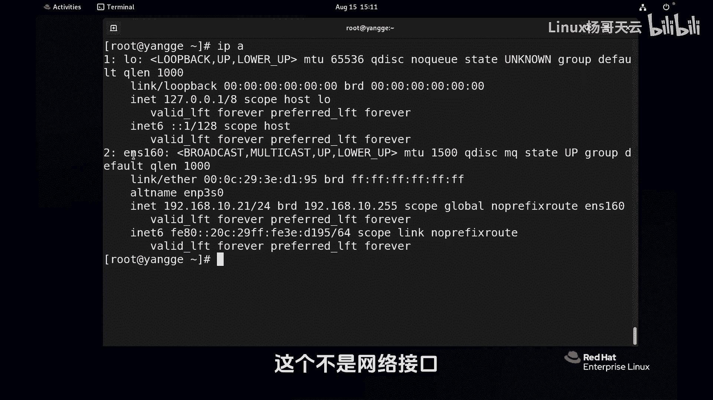
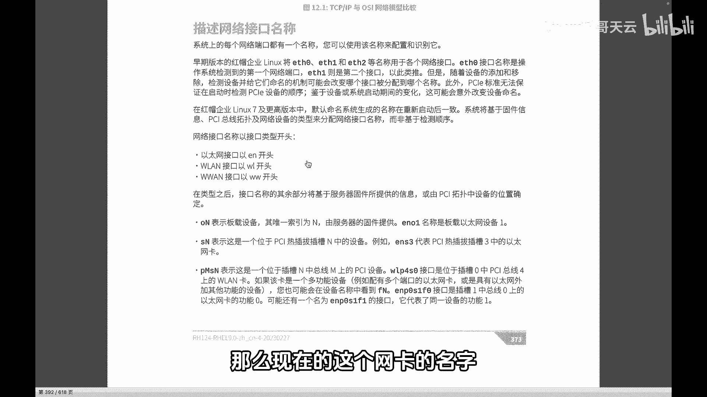
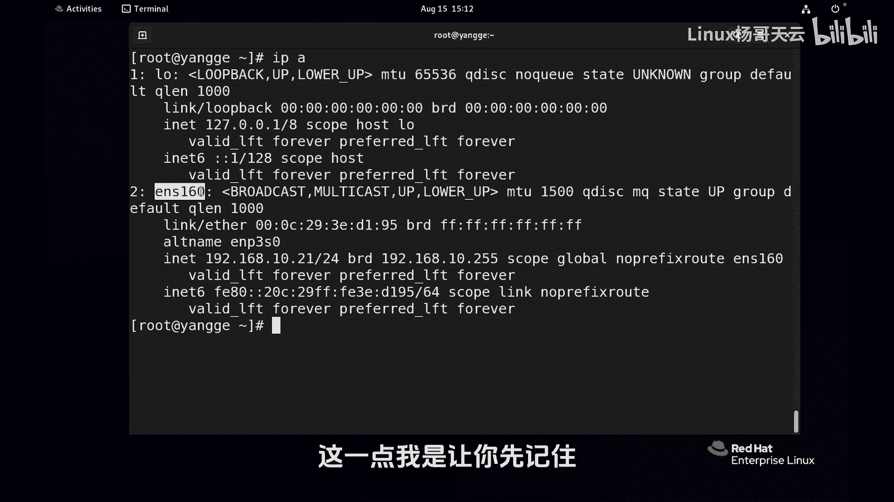
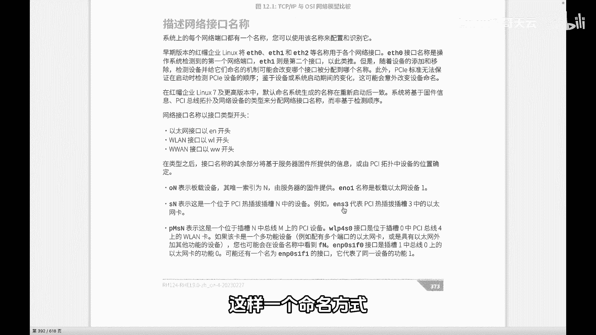
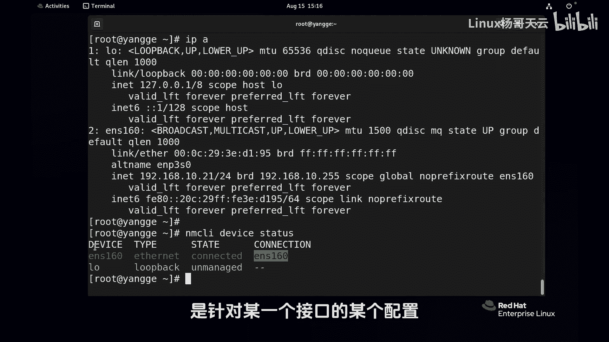

# Linux网络管理：1：新的网络接口命名规则

在本节课中，我们将要学习Red Hat Enterprise Linux 9中引入的新网络接口命名规则。理解这套规则对于后续的网络配置至关重要，它能帮助我们避免因硬件变动导致的网络配置混乱。

## 传统命名方式的问题

上一节我们提到了理解新规则的重要性，本节中我们来看看旧规则为何会被取代。在早期的红帽版本中，网络接口的名称遵循一种简单的顺序命名法。

以下是传统命名方式的具体表现：
*   网卡名称形如 **eth0**、**eth1**、**eth2**。
*   其编号顺序取决于系统检测到网卡的先后次序。



这种方式存在一个严重缺陷：当系统中的网卡设备发生增减（尤其是移除）时，接口的检测顺序可能改变。例如，若 **eth0** 对应的网卡损坏被更换，新检测到的网卡可能会被分配为 **eth2**，导致原有的网络配置文件（仍指向 **eth0**）失效，网络因此中断。这给系统运维带来了很大的麻烦。

## 新的命名规则解析

为了解决上述问题，从RHEL 7及之后的版本开始，系统采用了新的、更具描述性的网络接口命名方案。这套方案的名字更长，但包含了接口类型和位置信息，使其名称更具唯一性和稳定性。

新的接口名称通常由前缀和索引编号构成。前缀指明了接口的类型。

以下是常见的前缀及其含义：
*   **en**： 代表以太网（Ethernet），是最常见的有线网络接口。
*   **wl**： 代表无线局域网（WLAN）。
*   **ww**： 代表无线广域网（WWAN）。





在前缀之后，可能会紧跟一个字母来进一步说明设备的物理位置。

以下是位置标识符的常见类型：
*   **o**： 代表板载设备（Onboard），即主板集成的网卡。例如：**eno1**。
*   **s**： 代表热插拔槽位（Hotplug slot），如PCI-E接口的独立网卡。例如：**ens33**。
*   **p**： 代表PCI总线物理位置。例如：**enp0s3**。

最后的部分是一个数字索引，通常由固件或系统分配，保证了名称的唯一性。

## 设备名与连接名的区别



理解了命名规则后，我们需要厘清一个关键概念：**设备名** 与 **连接名** 的区别。这是新网络管理体系（NetworkManager）中的一个核心概念。

我们可以通过命令 `nmcli device status` 来查看它们。

```bash
# 在终端中执行以下命令
nmcli device status
```

命令输出会显示两列关键信息：“DEVICE”和“CONNECTION”。“DEVICE”列显示的是网络接口的**设备名**，即根据上述新规则命名的、代表物理或逻辑硬件的名称。“CONNECTION”列显示的则是**连接名**，这是针对该设备所创建的网络配置文件的名称。

一个网络设备（DEVICE）可以拥有多个网络连接配置（CONNECTION），但同一时间通常只有一个连接处于激活状态。连接名默认可能与设备名相同，但管理员完全可以将其修改为更具描述性的名称（例如“Office-LAN”或“Home-WiFi”）。我们后续配置IP地址、网关等信息，实际上都是在修改某个“连接”的配置，而非直接修改“设备”。



本节课中我们一起学习了Red Hat Enterprise Linux 9中采用的新网络接口命名规则。我们了解了传统 **ethX** 命名方式的弊端，掌握了新规则中 **en**、**wl**、**o**、**s** 等前缀和标识符的含义，并明确了 **设备名** 与 **连接名** 这两个核心概念的区别。理解这些内容是进行后续Linux网络配置的基础。