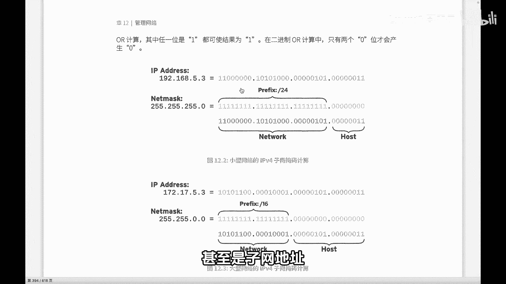
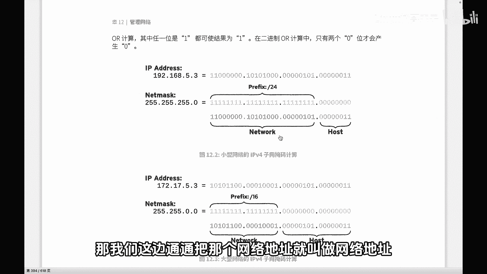
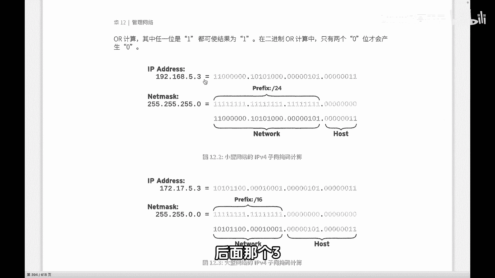
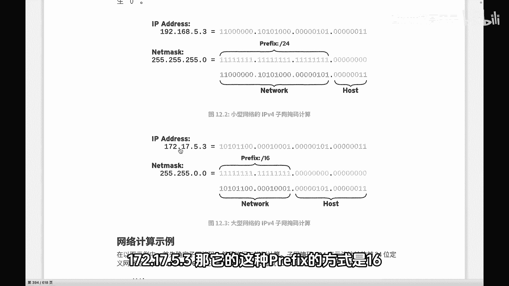
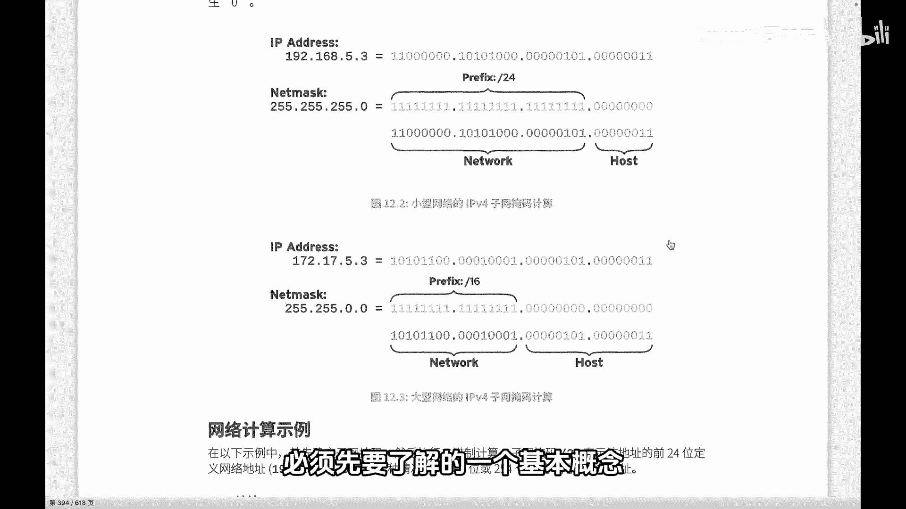

Linux网络基础：P94：IPv4子网和子网掩码

在本节课中，我们将要学习IPv4地址和子网掩码的基础知识。这是理解网络通信和后续配置的关键第一步。

如果你是初学者，那么有必要了解IP地址的一些基础知识。

首先，我们比较常用的是IPv4。大家看到的就是一个IPv4地址。准确地说，这是一个CIDR地址。

IPv4地址是一个32位的二进制地址。因为在网络传输时，最终使用的都是二进制的0和1。为了配置和使用方便，我们将这32位地址每8位（即一个字节）分成一部分，并用点号分隔，然后将每个部分转换成十进制。这个过程称为**点分十进制**。因此，一个IP地址的32位实际上对应四个十进制数。

另外，在配置IP地址时，通常需要配置子网掩码。子网掩码同样由32位二进制数组成，但它有一个特点：前面的位是连续的1，后面的位是连续的0。子网掩码中的“1”用于标识IP地址中对应的部分属于**网络地址**。

因为IP地址实际上被划分为两部分：网络地址和主机地址。按照当前看到的IP地址和掩码，子网掩码为255.255.255.0。凡是子网掩码为“1”的地方，对应的IP地址部分就是网络地址。

如果用前缀方式表示，就是“/24”，表示网络位有24位。用十进制表示就是255.255.255.0。子网掩码的作用是确定IP地址中哪一部分属于网络位，哪一部分属于主机位。

所以，对于IP地址192.168.5.3，其网络地址是192.168.5，主机地址是3。

上一节我们介绍了A类地址的示例，本节中我们来看看B类地址的例子。

这是一个B类地址，其子网掩码是16位。IP地址是172.17.5.3。它的前缀表示方式是“/16”。这表示172.17是网络地址，而5.3是主机地址。

网络地址和主机地址，特别是在通信和寻址过程中，最关键的是首先关注网络地址。这就像快递员送快递，要送到上海的某个街道和门牌号，首先必须确定目的地是“上海”这个城市，也就是网络地址。

然后再关注具体的主机地址。这个概念会直接影响后续的数据包寻址，是初学者必须了解的基本概念。

本节课中我们一起学习了IPv4地址的结构、点分十进制表示法，以及子网掩码的核心作用——划分网络地址和主机地址。理解这些概念是掌握网络配置和故障排查的基础。