# Linux网络基础：P95：IP地址与子网划分详解

在本节课中，我们将学习如何分析一个IP地址，确定其所属的网络、主机地址、网络地址、广播地址以及可用主机范围。这是理解网络通信和子网划分的基础。

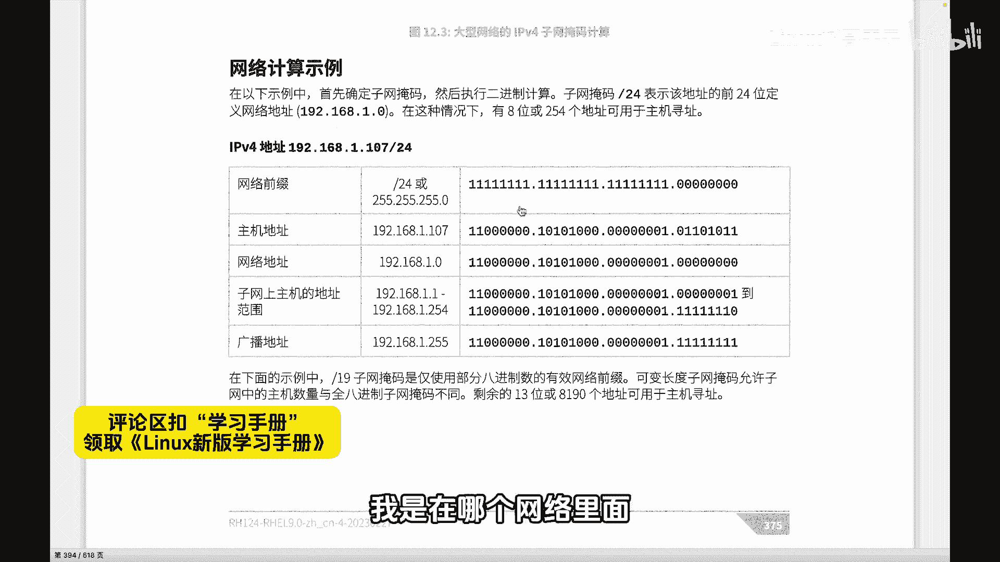

## 🏠 理解IP地址的构成

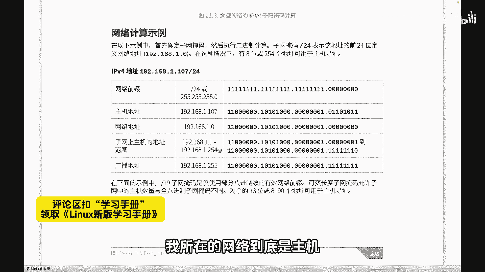

每一个IP地址都包含网络信息和主机信息。例如，我们看到一个IP地址 `192.168.1.107/24`。我们需要确定这个IP地址属于哪个网络，以及它在这个网络中的具体位置。

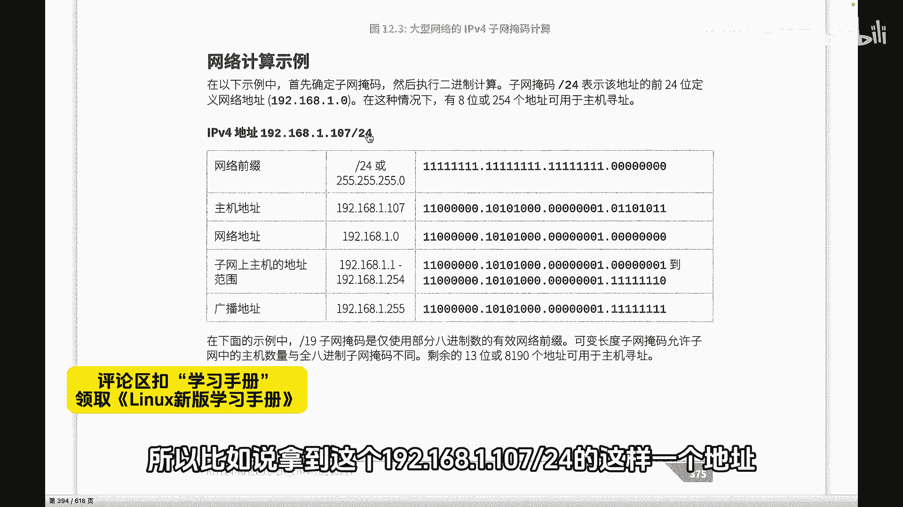

`/24` 指的是子网掩码，也称为网络前缀。它可以有多种表示方式：
*   **CIDR表示法**：`/24`
*   **点分十进制表示法**：`255.255.255.0`
*   **二进制表示法**：`11111111.11111111.11111111.00000000`（即24个1，8个0）

## 🔍 确定网络地址与主机地址

子网掩码决定了IP地址的哪一部分是网络位，哪一部分是主机位。对于 `192.168.1.107/24`：
*   子网掩码 `255.255.255.0` 的前三部分（24位）为网络位。
*   因此，网络地址是 `192.168.1.0`。
*   主机地址是 `107`。

所以，`192.168.1.107` 这个IP地址位于 `192.168.1.0` 这个网络中，其主机编号为107。

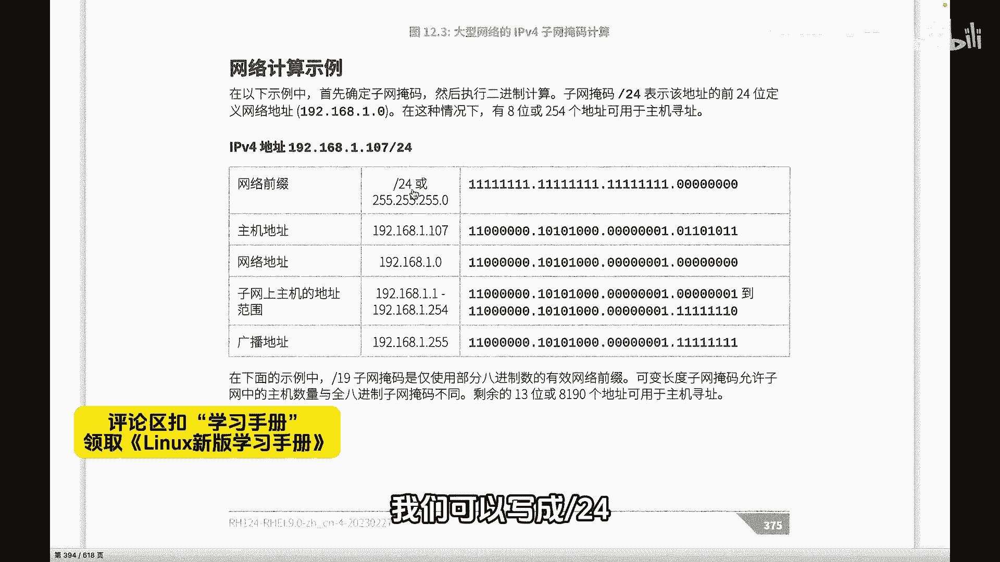

**核心公式**：
`IP地址` **AND** `子网掩码` = `网络地址`
`192.168.1.107` **AND** `255.255.255.0` = `192.168.1.0`

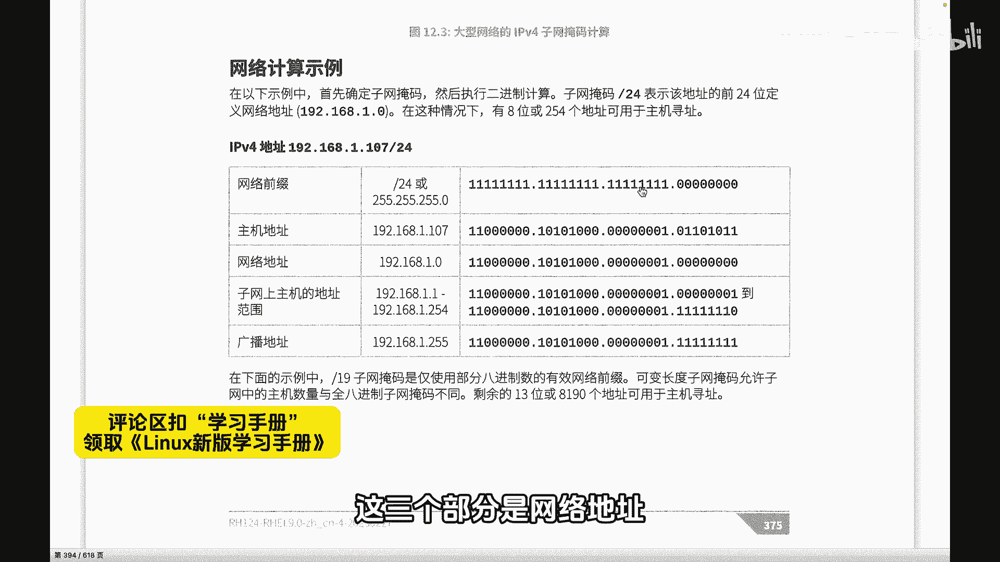

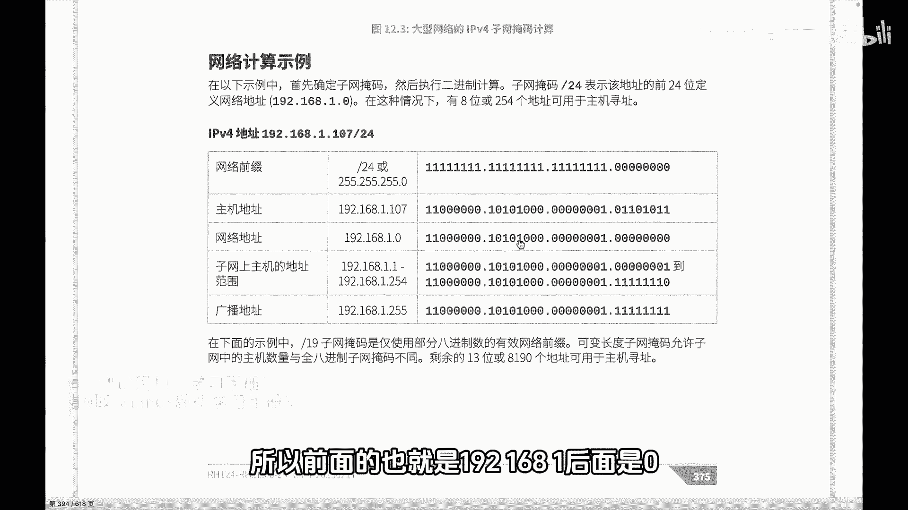

## 📢 理解特殊地址：网络地址与广播地址

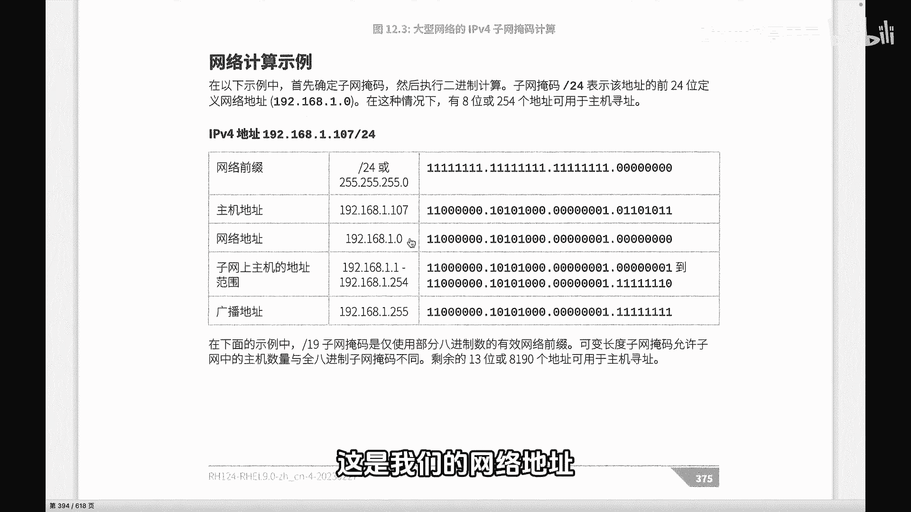

网络地址（如 `192.168.1.0`）代表整个网络本身，相当于家族的姓氏或门牌号。广播地址（如 `192.168.1.255`）用于向该网络内的所有主机发送数据。

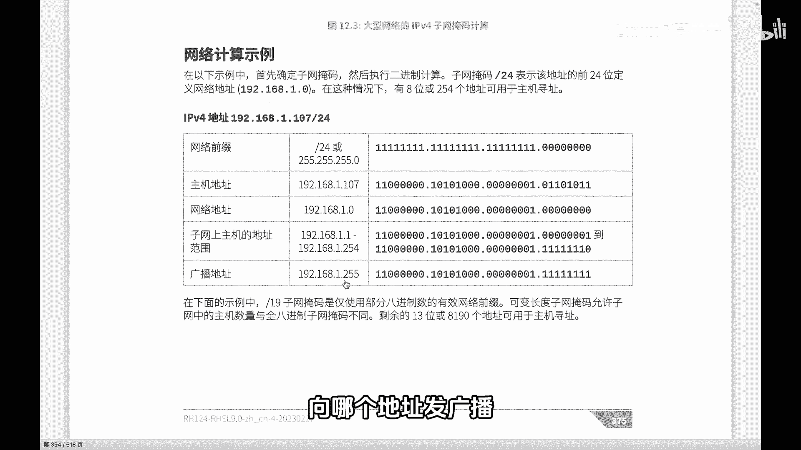

这两个地址有特殊用途：
*   **网络地址**：不能分配给任何一台具体的主机作为其IP地址。
*   **广播地址**：同样不能作为某台主机的源IP地址，但在进行网络广播时需要使用。

它们的计算规则是：
*   **网络地址**：主机位全部为 `0`。
*   **广播地址**：主机位全部为 `1`。

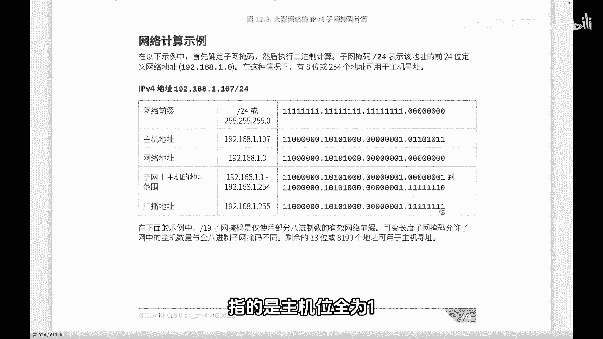

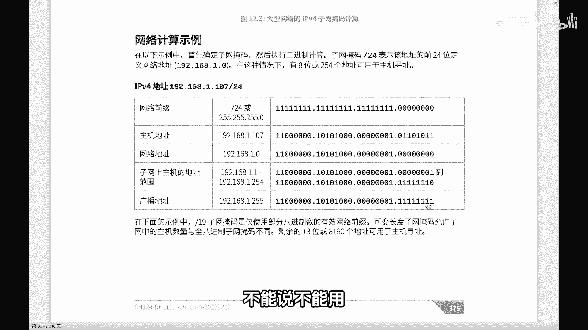

## 👨‍👩‍👧‍👦 确定网络中的可用主机

知道了网络地址和广播地址，我们就可以确定这个网络中可用的“兄弟姐妹”——即可以分配给具体设备的主机IP地址范围。

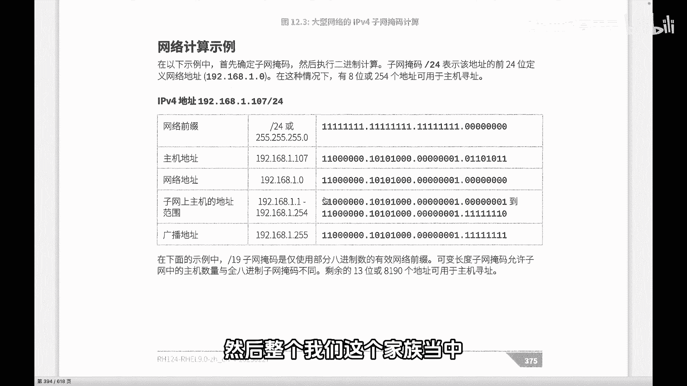

对于网络 `192.168.1.0/24`：
*   **网络地址**：`192.168.1.0`（主机位全0）
*   **广播地址**：`192.168.1.255`（主机位全1）
*   **可用主机地址范围**：从网络地址之后的下一个地址开始，到广播地址之前的一个地址结束。

以下是该网络内的详细信息：
*   **网络地址**：`192.168.1.0`
*   **第一个可用主机地址**：`192.168.1.1`
*   **最后一个可用主机地址**：`192.168.1.254`
*   **广播地址**：`192.168.1.255`

因此，在 `192.168.1.0/24` 这个家族中，共有254个可用的主机地址（从 `.1` 到 `.254`），它们彼此处于同一网络层级，可以直接通信。

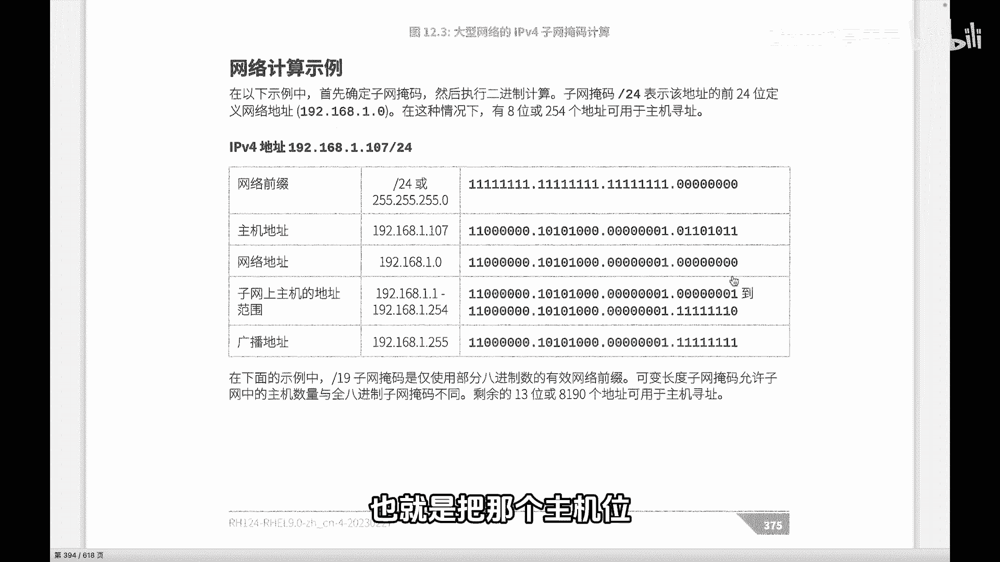

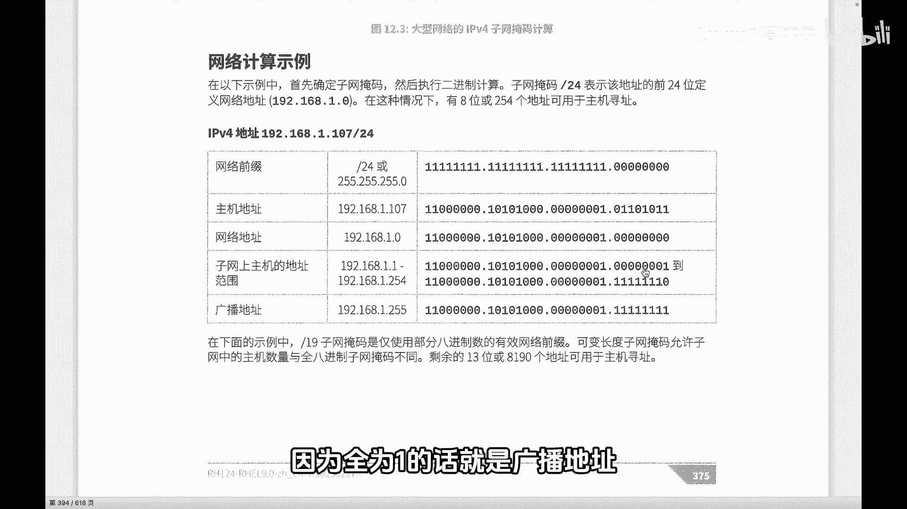

## 📝 本节总结

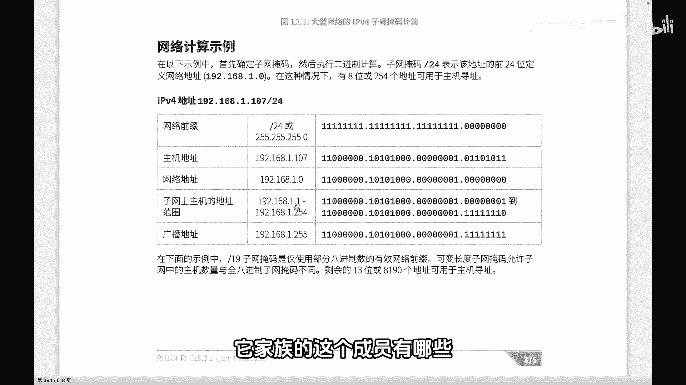

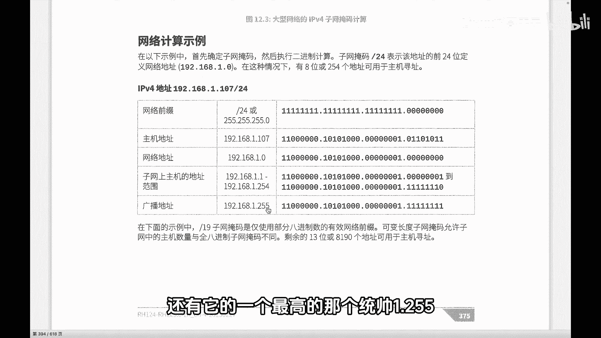

本节课我们一起学习了如何分析一个带子网掩码的IP地址。
我们掌握了通过子网掩码区分网络位和主机位，从而计算出**网络地址**、**主机地址**、**广播地址**以及**可用IP地址范围**。
理解这些概念是进行网络规划、故障排查和深入学习路由交换技术的重要基础。记住，网络地址和广播地址具有特殊含义，不能分配给普通主机使用。