Linux网络基础：P96：子网划分与地址计算

在本节课中，我们将学习如何根据给定的IP地址和子网掩码，计算出其所属的网络地址、广播地址以及可用主机范围。这是理解网络通信和子网划分的核心技能。

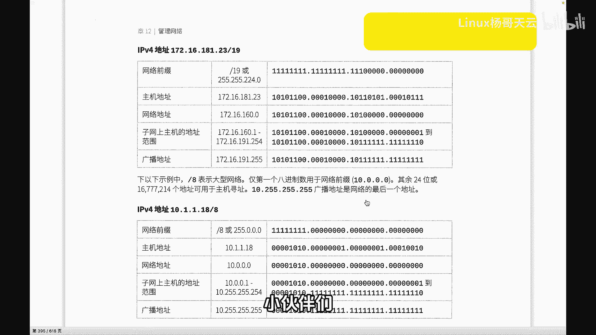

上一节我们介绍了IP地址的基本概念，本节中我们来看看一个具体的例子，学习如何通过计算来确定一个IP地址的“家族”信息。

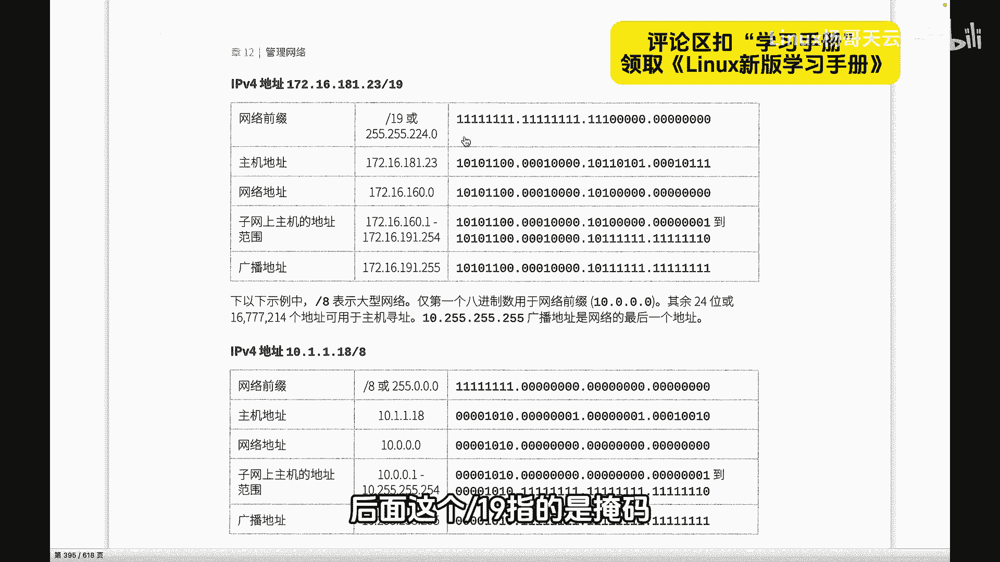

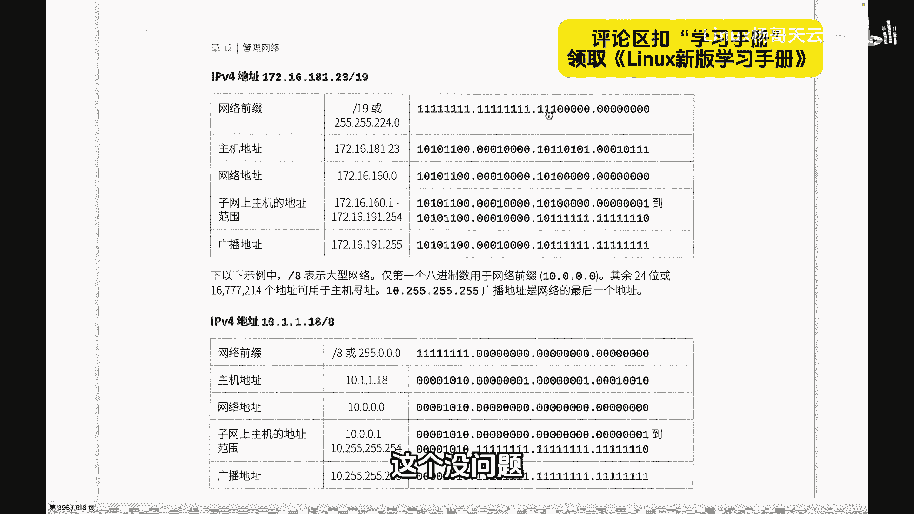


首先，我们有一个给定的IP地址：`172.16.181.23/19`。这里的“/19”表示子网掩码的位数，意味着前19位是网络位。

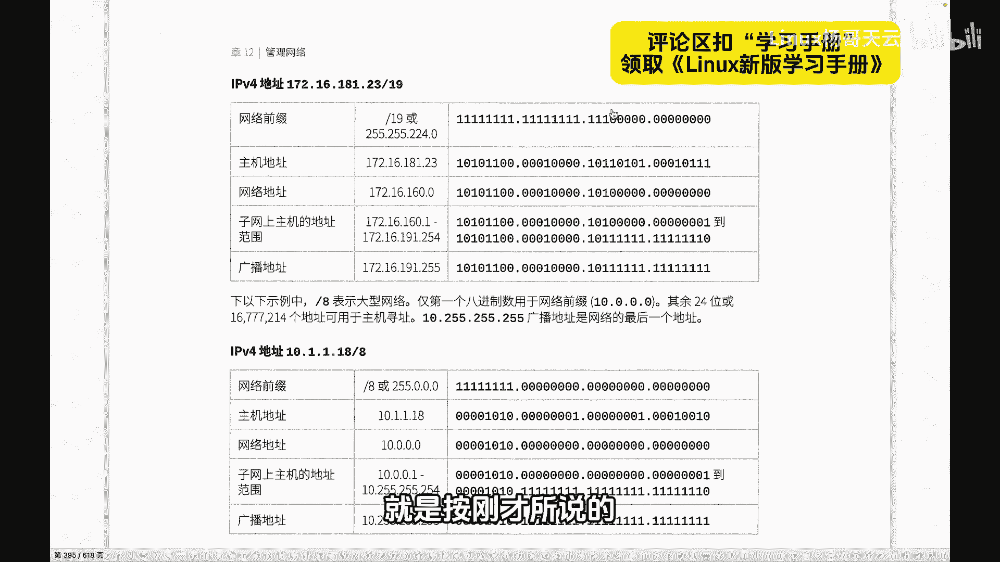

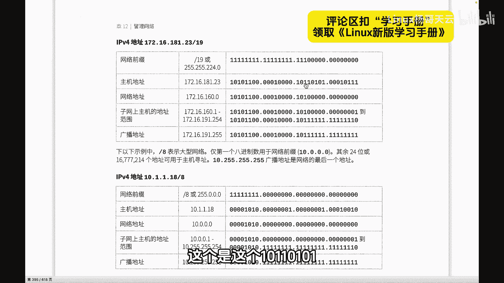


子网掩码的十进制形式为 `255.255.224.0`。其计算过程如下：
*   前两个 `255` 对应 8 + 8 = 16 位。
*   第三个字节的 `224` 由二进制 `11100000` 转换而来，即 128 + 64 + 32 = 224，这提供了额外的 3 位网络位。
*   总计网络位为 16 + 3 = 19 位。

接下来，我们需要找到这个IP地址的网络地址。网络地址的计算方法是：将IP地址与子网掩码进行“按位与”运算。

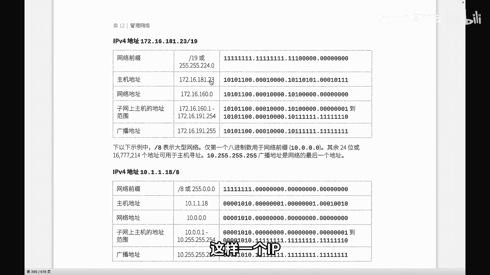

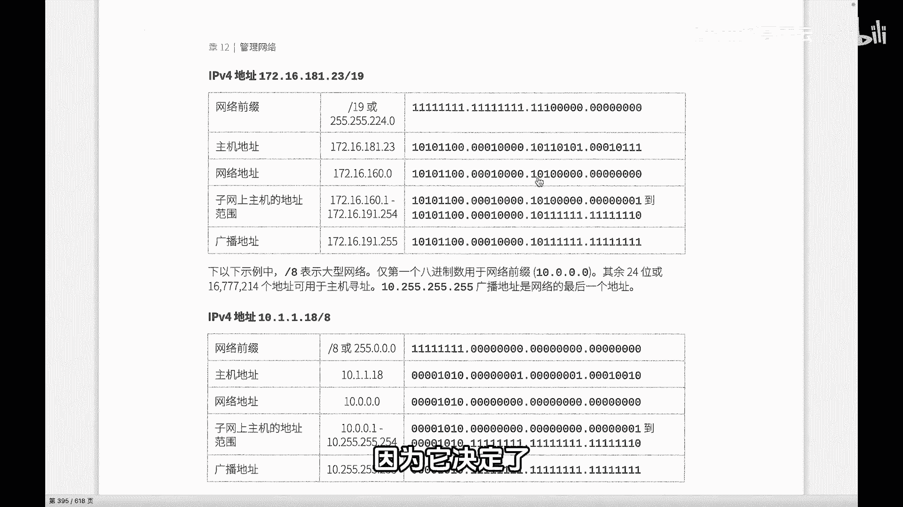

我们将IP地址 `172.16.181.23` 的第三个字节 `181` 转换为二进制：`10110101`。
子网掩码的第三个字节 `224` 的二进制是：`11100000`。

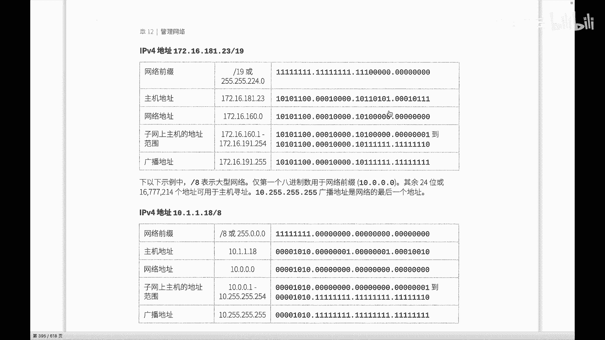

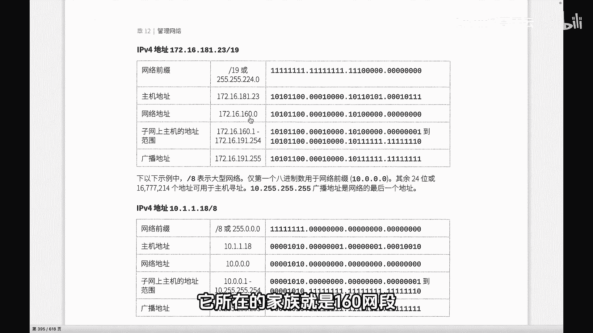

进行按位与运算：
```
IP (181):   1 0 1 1 0 1 0 1
掩码 (224): 1 1 1 0 0 0 0 0
结果：       1 0 1 0 0 0 0 0
```
运算结果 `10100000` 转换为十进制是 160（128 + 32）。因此，网络地址的第三个字节是 `160`，主机位全部置为 `0`。

所以，完整的网络地址是：`172.16.160.0`。这意味着 IP 地址 `172.16.181.23/19` 属于 `172.16.160.0` 这个网段。从十进制数值上看，`181` 和 `160` 似乎没有直接关系，但通过二进制运算，结果是确定的。

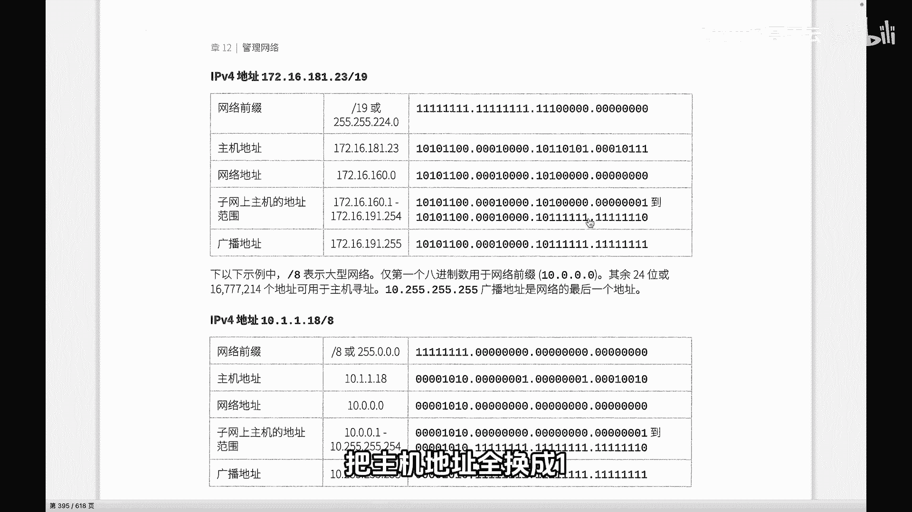

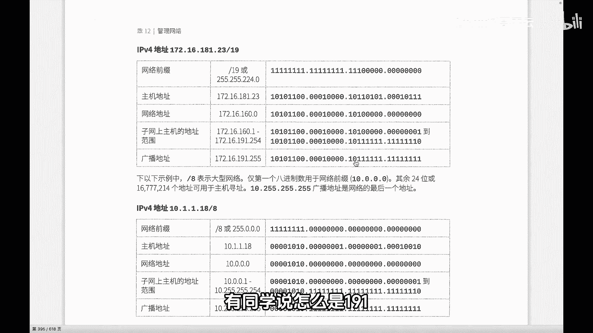

得到网络地址后，我们就可以推导出该网段的其他关键信息。

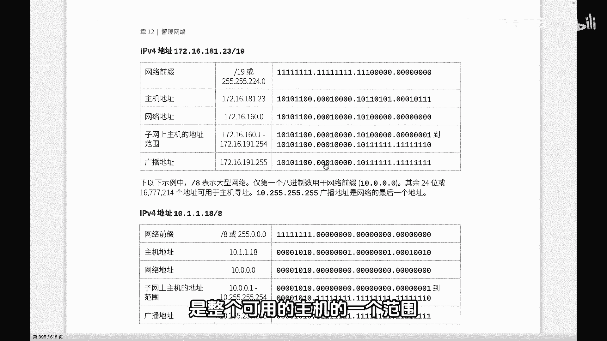

以下是该网段的关键地址信息列表：
*   **网络地址**：`172.16.160.0`
*   **第一个可用主机地址**：网络地址加1，即 `172.16.160.1`
*   **广播地址**：将网络地址的主机位全部置为1。对于 `/19` 掩码，主机位在后13位。因此广播地址为 `172.16.191.255`。
    *   计算：网络部分 `172.16.160`（二进制`10100000`）保持不变，主机位全为1（二进制`00011111`），组合起来第三个字节是 `10111111`，即十进制 `191`。
*   **最后一个可用主机地址**：广播地址减1，即 `172.16.191.254`
*   **可用主机范围**：`172.16.160.1` 到 `172.16.191.254`

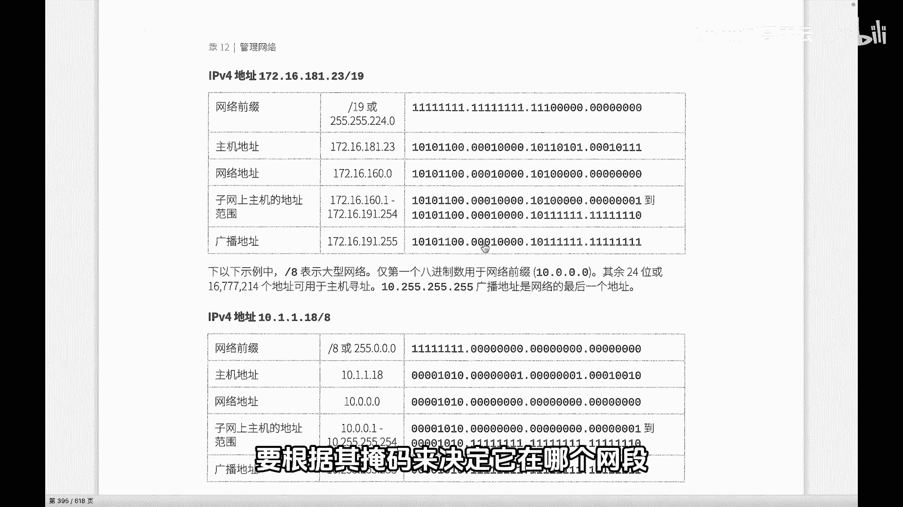

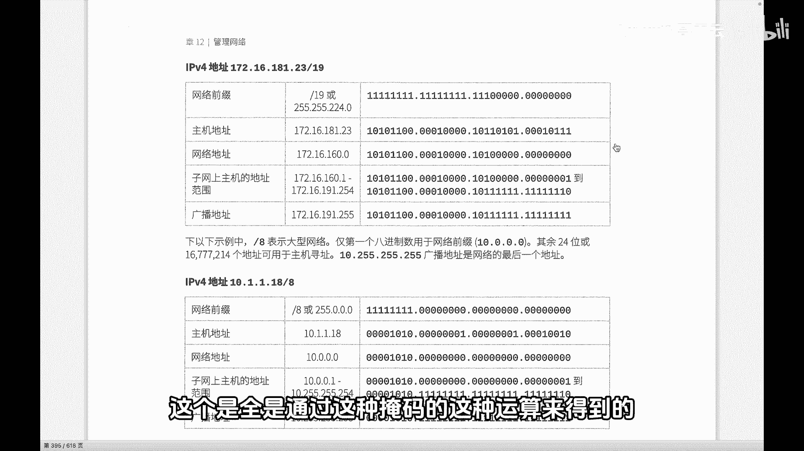

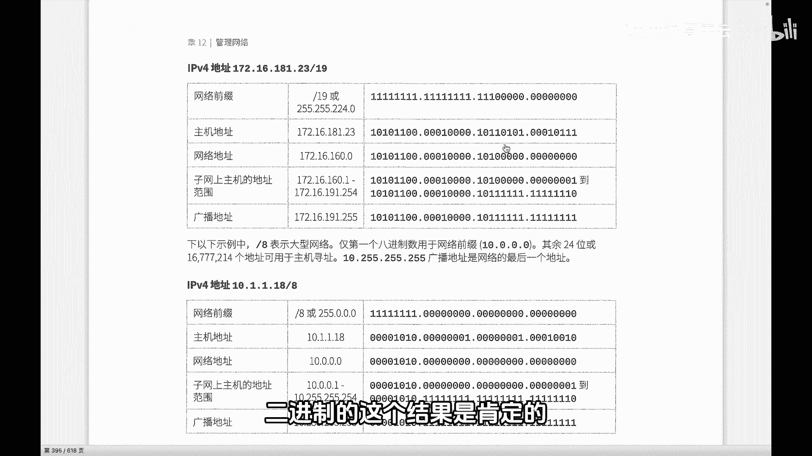

本节课中我们一起学习了如何根据 IP 地址和子网掩码计算网络地址、广播地址和可用主机范围。核心在于理解二进制下的“按位与”运算。掌握这个方法，你就能准确判断任意IP地址所在的网段及其家族成员。