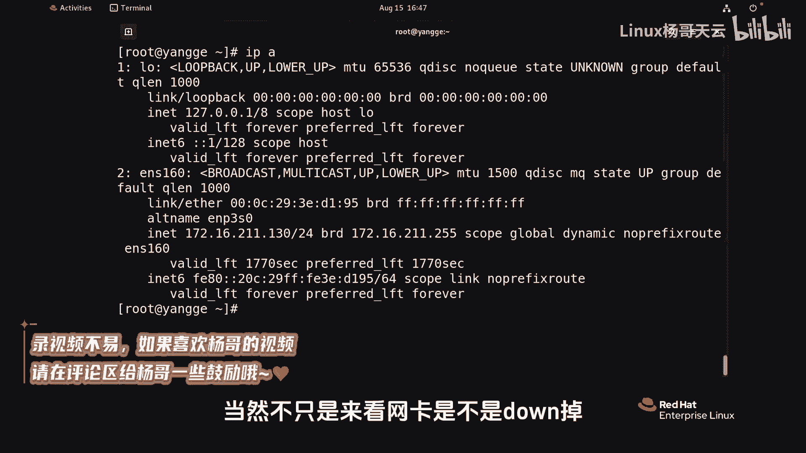
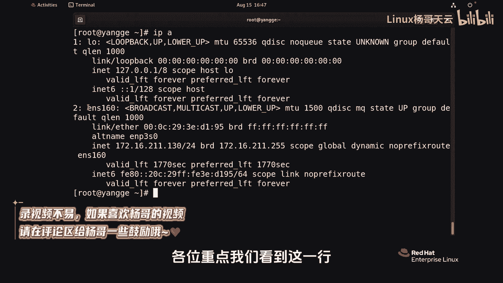
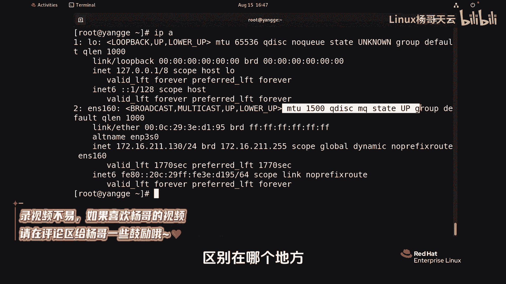
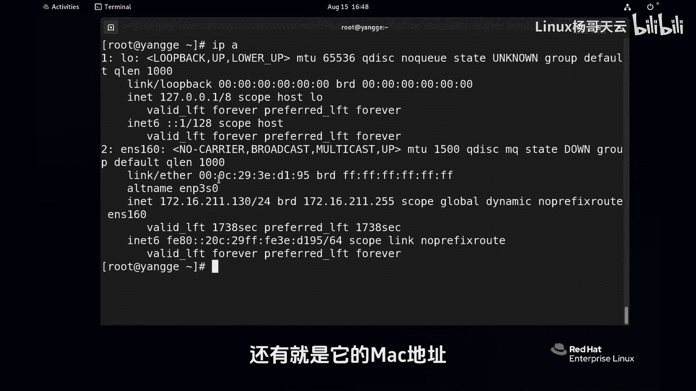

Linux入门与红帽认证RHCE通关教程：P98：如何检测网线连接状态

在本节课中，我们将学习如何使用 `ip address` 命令来检查网络接口的状态，特别是判断网线是否已正确连接或是否已断开。

上一节我们介绍了网络配置的基础知识，本节中我们来看看如何诊断物理层的连接问题。

---

### 使用 `ip address` 命令检查状态

要判断网线是否插好或是否断开，我们可以使用 `ip address` 命令（常简写为 `ip a`）来查看网络接口的详细信息。这个命令不仅能查看网卡是否宕掉，还能提供其他丰富的网络信息。

以下是查看网络接口状态的命令：
```bash
ip address show
```

执行命令后，请重点关注输出中对应网卡（例如 `eth0` 或 `ens33`）的行。该行会显示网卡的相关状态。通过对比状态信息，可以判断网卡是否正常工作。例如，一个正常连接的网卡会显示 `state UP`。

下面，我们将演示如何识别网线断开的状态。

---


### 识别网线断开的状态


现在，我们模拟将网卡断开（例如拔掉网线），然后再次使用 `ip address` 命令查看。

以下是断开连接后再次检查的命令：
```bash
ip address show
```



相信大家能清楚地看到，输出信息已经表明网卡处于宕掉状态。关键的变化通常体现在以下几点：
*   状态显示为 **`state DOWN`**。
*   **`link`** 字段可能显示为 `NO-CARRIER`，表示没有载波信号，即物理连接已断开。



这是一个非常直观的判断网线是否连接正常的方法。



---


### 查看其他网络信息

当然，除了连接状态，`ip address` 命令还能显示网卡的其他重要信息。

以下是该命令可以提供的部分关键信息：
*   **IP地址**： 例如 `inet 192.168.1.100/24`。
*   **广播地址**： 例如 `brd 192.168.1.255`。
*   **MAC地址**： 例如 `link/ether 00:0c:29:xx:xx:xx`。

掌握这些信息对于网络配置和故障排查至关重要。



---

本节课中我们一起学习了如何使用 `ip address` 命令来检查网络接口的物理连接状态。通过观察命令输出中的 `state` 和 `link` 字段，我们可以快速判断网线是否已正确连接或是否已断开，这是进行网络故障诊断的第一步。