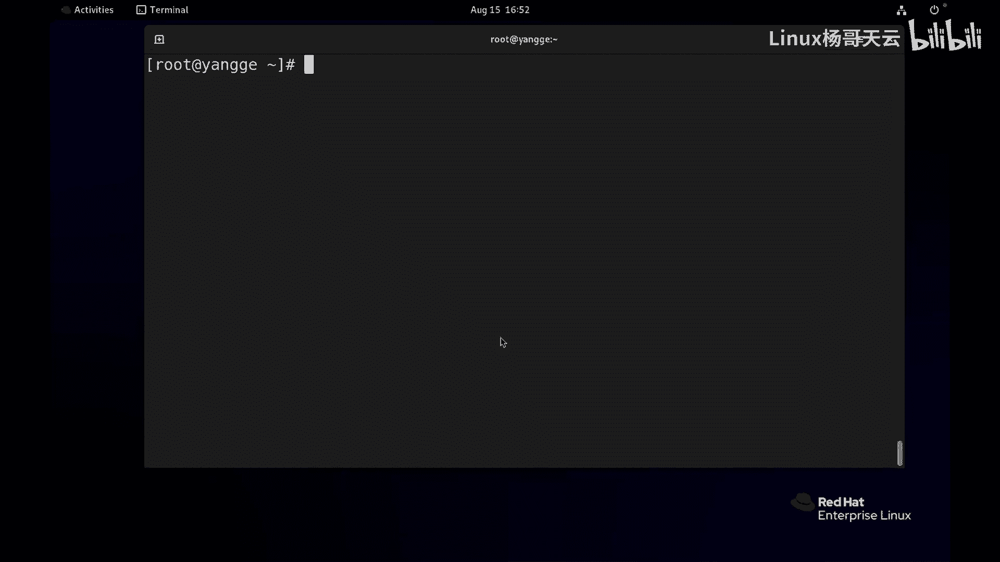
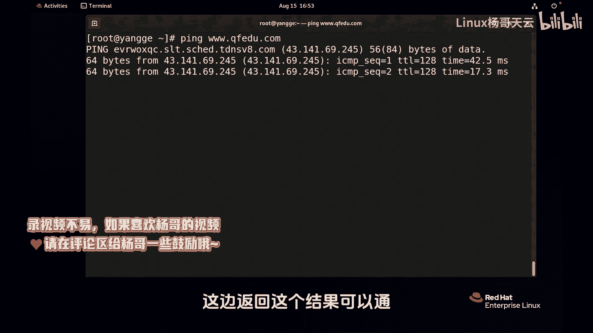
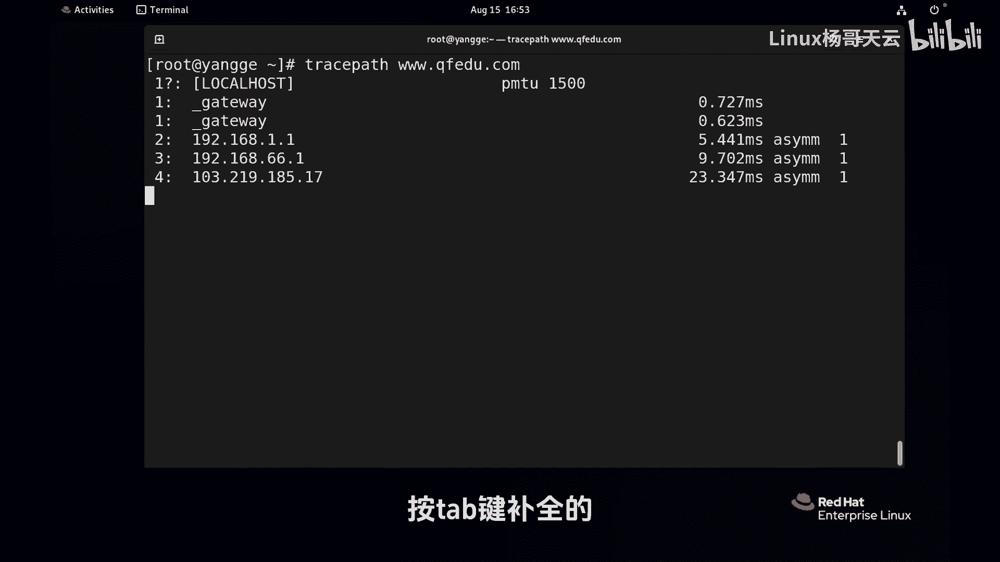
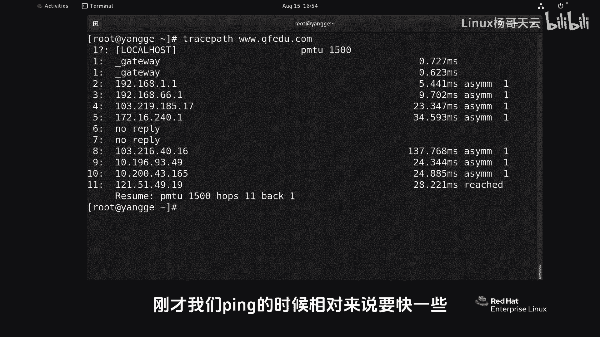
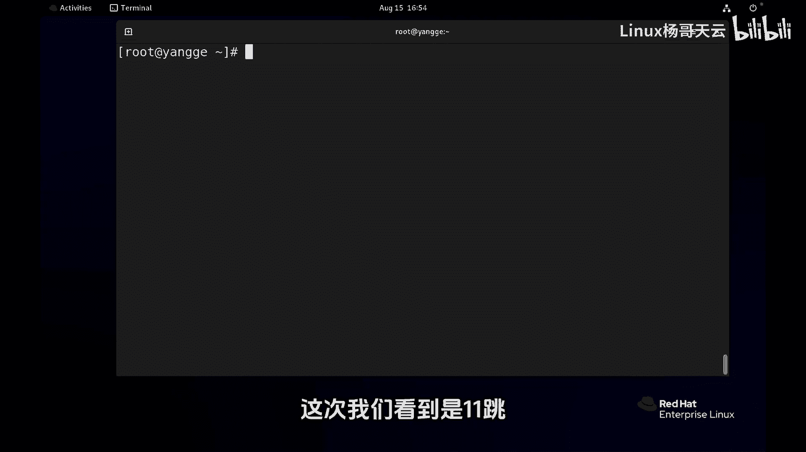
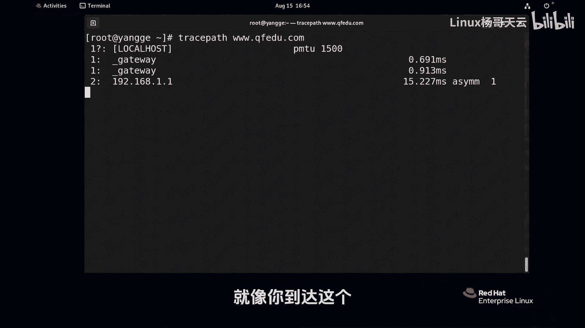
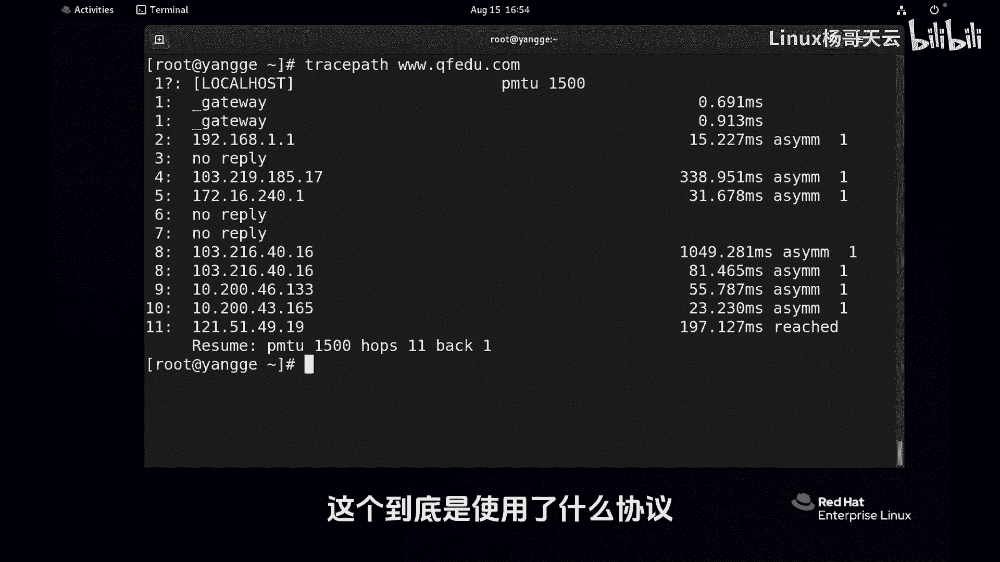
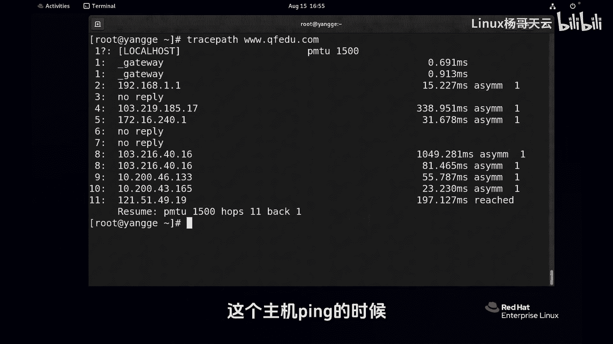
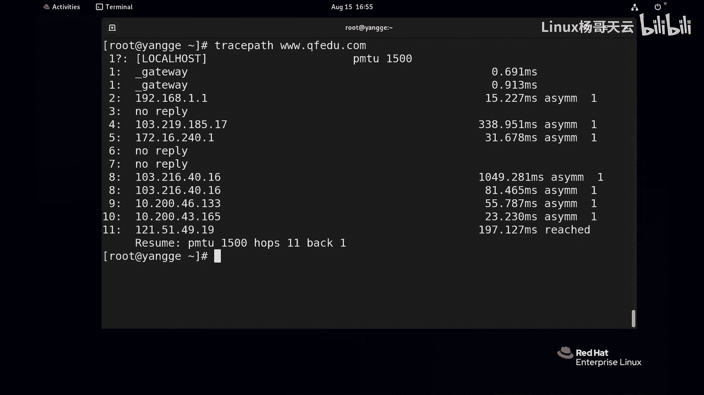

Linux网络诊断：P99：如何追踪数据包路径 🛣️

在本节课中，我们将学习如何追踪数据包从本地主机到达目标主机的完整路径，了解数据在网络中经过的各个节点。

---

上一节我们介绍了使用 `ping` 命令测试网络连通性。本节中我们来看看如何查看数据包传输的具体路径。



如果想知道与目标主机是否连通，方法比较简单。直接使用 `ping` 命令加上目标主机的IP地址或域名即可。


**命令示例：**
```bash
ping www.example.com
```
命令会返回结果，显示是否可以连通。



---

然而，仅仅知道能否连通还不够。我们可能还想知道数据包在到达目标主机的过程中，具体经过了哪些路由器或网络节点。



这时，我们需要使用另一条命令：`traceroute`。在命令行中输入 `trac` 后，可以按 `Tab` 键自动补全为 `traceroute`。



**命令示例：**
```bash
traceroute www.example.com
```
执行此命令后，大家可能会发现，得到结果的速度比执行 `ping` 命令时要慢一些。

---

为什么 `traceroute` 命令会比 `ping` 命令慢呢？或者说，它使用了什么不同的协议或原理？

最终，`traceroute` 会探测出整条路径需要经过的“跳数”。每次探测的结果跳数可能不一样。例如，这次显示是11跳，下次可能走另一条线路，变成14跳。

这就像开车去一个地方，可以选择不同的高速公路，经过的地点会有所区别。



---



同样都是访问同一台目标主机，`ping` 命令耗时较短，而 `traceroute` 命令探测路径时耗时较长，这是为什么呢？



这个问题涉及到 `traceroute` 命令的工作原理。它通过发送具有特殊TTL（生存时间）值的探测包，并监听中间路由器的ICMP超时回复，来逐跳确定路径。这个过程需要依次探测每一跳，因此总耗时更长。

---



本节课中我们一起学习了：
1.  使用 `ping` 命令测试网络基本连通性。
2.  使用 `traceroute` 命令追踪数据包到达目标主机的详细路径，并查看经过的每一跳。
3.  了解了 `traceroute` 命令执行速度相对较慢的原因与其工作原理有关。



通过掌握这两个命令，你可以更深入地诊断和分析网络连接问题。