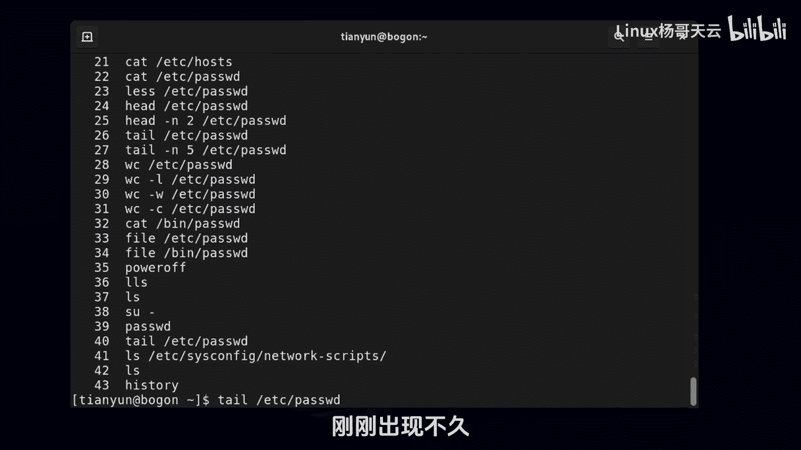
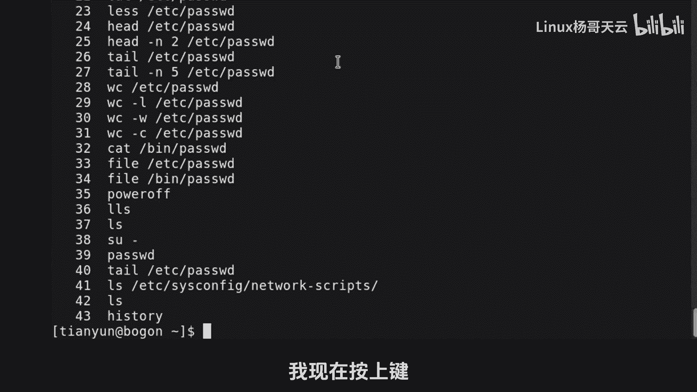
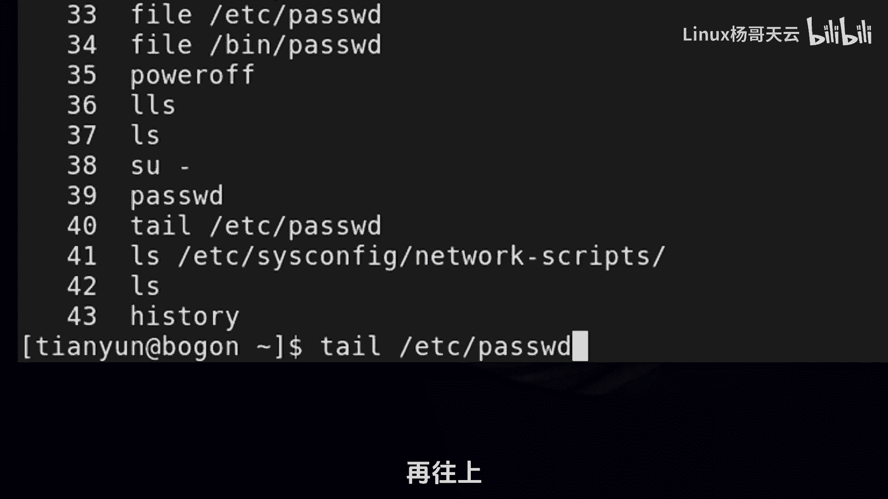
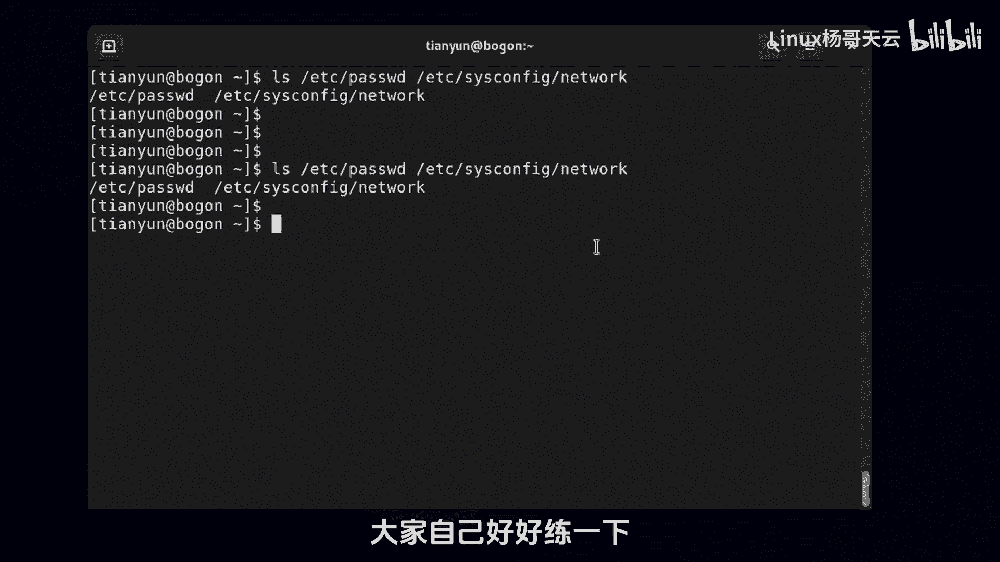

# Linux入门教程：9：Bash Shell基础特性之历史命令 🕵️♂️


在本节课中，我们将要学习Bash Shell的一个核心特性——历史命令。掌握历史命令的使用，不仅能帮助我们追溯和审查用户操作，还能极大地提升命令输入的效率。

## 概述

历史命令功能允许用户查看、搜索和重复使用之前执行过的命令。这对于重复复杂操作、纠正错误或进行系统审计都非常有用。



## 查看历史命令



首先，我们可以使用 `history` 命令来查看当前用户执行过的命令历史列表。每一条历史命令前都有一个唯一的编号。



```bash
history
```

执行上述命令后，终端会显示一个带有序号的命令列表。

## 复用历史命令的方法

有多种方法可以调用并复用历史命令，以下将逐一介绍。

### 使用方向键导航

如果目标命令是最近执行的，最快捷的方法是使用键盘的**上箭头（↑）**和**下箭头（↓）**键在历史命令中前后导航。找到目标命令后，可以直接按回车执行，也可以对其进行编辑后再执行。

### 使用叹号（!）调用

叹号 `!` 是一个强大的操作符，用于快速执行特定的历史命令。它主要有两种用法。

**1. 通过序号调用**
在叹号后跟上历史命令的序号，可以重新执行该命令。例如，执行历史记录中的第29条命令：
```bash
!29
```

**2. 通过字符串调用**
在叹号后跟上命令的开头字符串，Bash会执行**最近一条**以该字符串开头的命令。例如，执行最近一条以 `tail` 开头的命令：
```bash
!tail
```

### 快速获取上一条命令的参数

这是一个非常高效的技巧。按下 **ESC** 键后紧接着按下 **.**（点）键，Bash会自动将**上一条命令的最后一个参数**填充到当前光标位置。如果上一条命令有多个参数，则填充的是最后一个。

例如，先执行 `ls /etc/passwd /etc/sysconfig/network`，然后在新的命令行中按下 `ESC+.`，则会自动填入 `/etc/sysconfig/network`。

### 搜索历史命令

当历史命令很多时，可以使用搜索功能快速定位。按下 **Ctrl + R** 组合键，提示符会变为 `(reverse-i-search)：`，此时进入反向搜索模式。

在此模式下，输入你记得的命令片段（必须是连续的字符），Bash会实时显示匹配的历史命令。按 **Ctrl + R** 可以继续向前搜索其他匹配项，找到后按回车即可执行。

## 总结



本节课中我们一起学习了Bash Shell历史命令的核心用法。我们介绍了如何使用 `history` 命令查看历史记录，以及通过**方向键**、**叹号（!）**、**ESC+.** 和 **Ctrl+R** 等多种方式来高效地复用和搜索历史命令。熟练掌握这些技巧，将显著提升你在Linux命令行环境下的工作效率。