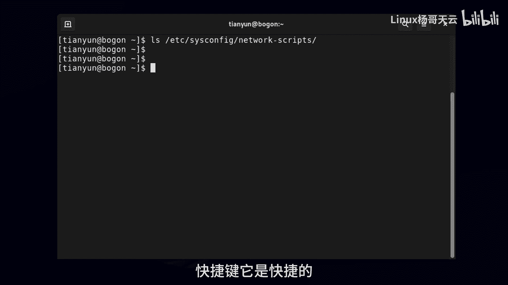

# 史上最强Linux入门教程，杨哥手把手教学，带你极速通关红帽认证RHCE（更新中） - P10：10.Bash Shell中常用快捷键 - Linux杨哥天云 - BV1FH4y137sA

我们继续来看一下在PEACSHELL下的一些快捷键，当然主要是针对命令编辑的一些快捷键。

首先呢我们先来设置一个场景啊，比方说本来是CAT啊，can文件我们打错了，打成CETTCR的，This is config network，看一下这个文件啊，好最后发现不对，这不对的话。

我们可能就涉及到改，最后一发现哦，是这个c ct，它它提示我们这个命令没有找到，那好我们向上翻出这个命令呢，那我们可以呢用快捷键直接定位在前面，不是鼠标啊，我鼠标只是给大家去展示了一下。

我们这个时候就可以输入快捷键，快捷键呢通常都是CTRL加什么什么什么好，下面我们来看CTRL加A，CTRL加A呢就是直接到这个mini的最前面，那有小同学可能会问，说这个要不要把光标移到最后去呢。

这个不需要这个，大家也也不用担心，就是不会说像你想的那样的，我现在回车一下这个命令就断了，不是没问题啊，另外呢大家记住哦，你光标无所谓，在这个命令的哪个位置，只要你按回车就表示执行命令。

不要以为它一定要在最后，所以你不要纠结说像刚才杨哥这样，CTRLA然后还要干到这个末尾去，末尾就是e ADD和CTRL啊，CTRL键CTRL不删，按CTRLE，相信大家可能看出来了，CTRLA是到前面。

CTRLE呢是到最后结束的时候，当结束的时候，你要不要去那边，取决于你还要敲不敲什么东西，那你还要敲点的话，那你就接着敲，然还有呢就是比如说我现在我有这样一个想法，就从光标这个位置到后面我都不想要了。

那这怎么弄呢，CTRL加key，各位看清楚啊，那就从光标处删到了末尾，也能够从光标处删到前面，当然这个取决于你实际的编辑的需要，我现在呢是没有说每一个都有非常好的场景啊，所以C1下U看到了吗。

插到前面了，快捷键它是快捷的。

你不快捷也行，比如说我们前面讲到历史命令，你有快捷的方式，你也可以有笨的方法。

对命令行的编辑也可以使用快捷键，也可以就笨笨的去使用左右键也是一样的，那另外呢我们在前面给大家也见过一个CTRL加R，这个扛下R的，这个其实也是算是mini的编辑，但是它是搜索历史mini啊。

这个也是经常推荐大家使用的，那还有两个快捷键呢其实也给大家展示过，比如我现在输了这一串cs config，我不想要了，不想要的方法呢，一种就是往前删，我觉得没必要，你说的再多，还不如按个CTRL加C。

当然CTRL加C呢，人家还会给你显示一下，为什么要显示一下呢，我认为它想将回车和这个区分开，你要是不显示CTRLC，还以为按了个回车呢，那如果按回车的话，应该显示结果和用和这个不对，所以会造成歧义。

同样我给大家提示一下，以后大家见到这种写法啊，比如CTRLE啊，CTRLACTRLU啊，control key什么的，注意这种写法前面那个指数符号就是control的意思。

在LINUX里面就指的是control，当然它是表示法啊，那么敲肯定不可以的，CTRLC就是把命令行终止，其实就是终止这个程序，那另外呢还有一个CTRL加D。

我给大家先演示一下效果啊，CTRL加D大家看不见了，其实这个并不是部件的。

它是退出了这个终端，有时候我们可能远程了一下以后呢，你想退出来，那我们就可以CTRLD或者是e x i t exit也可以，这个相当于按了CTRL加D是一个意思，所以正好给大家讲到的。

在但是shell下用到的一些快捷键，这个快捷键呢，大家先按照刚才能哥所设定的这个场景。

