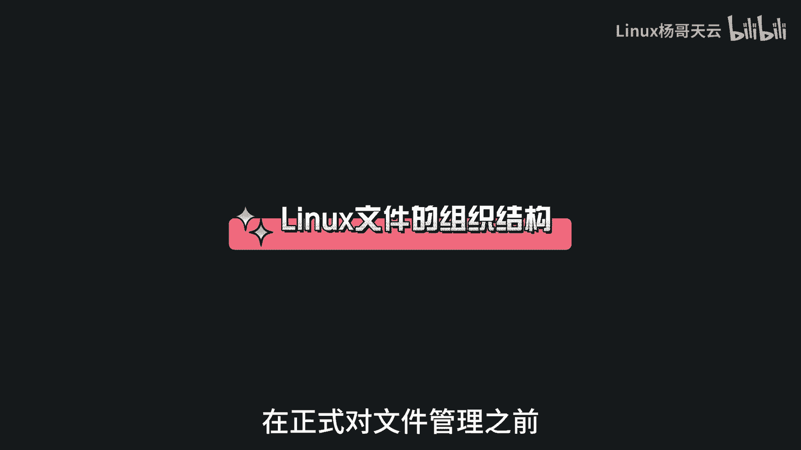
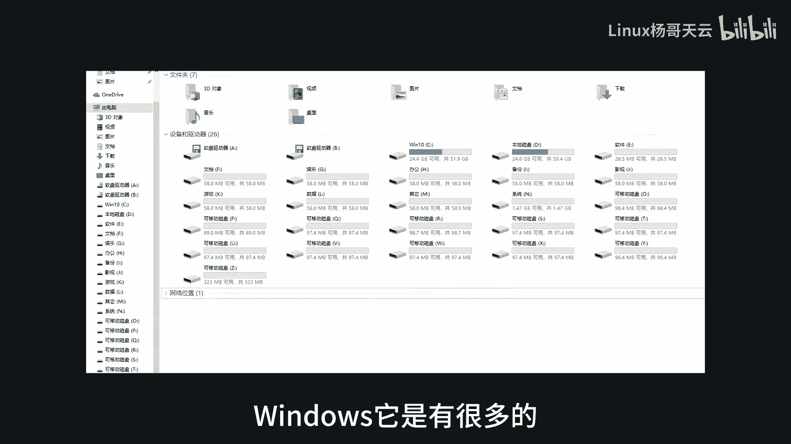
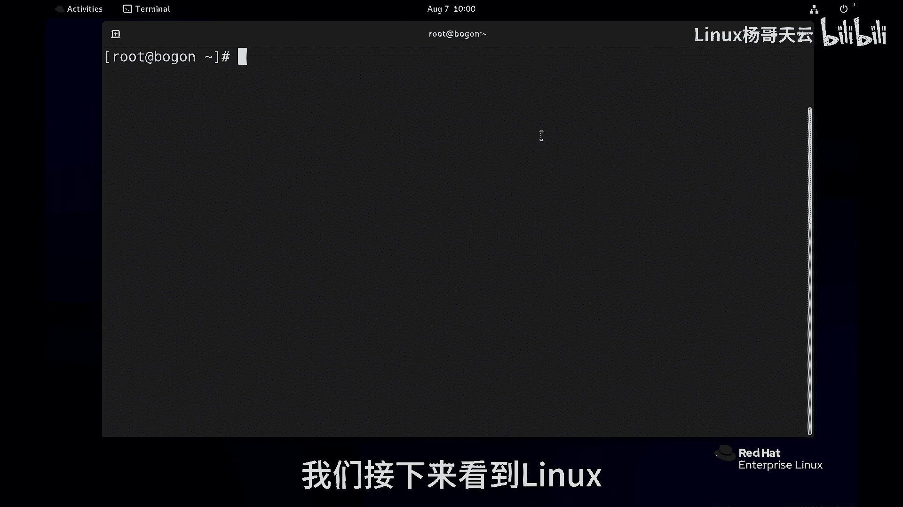
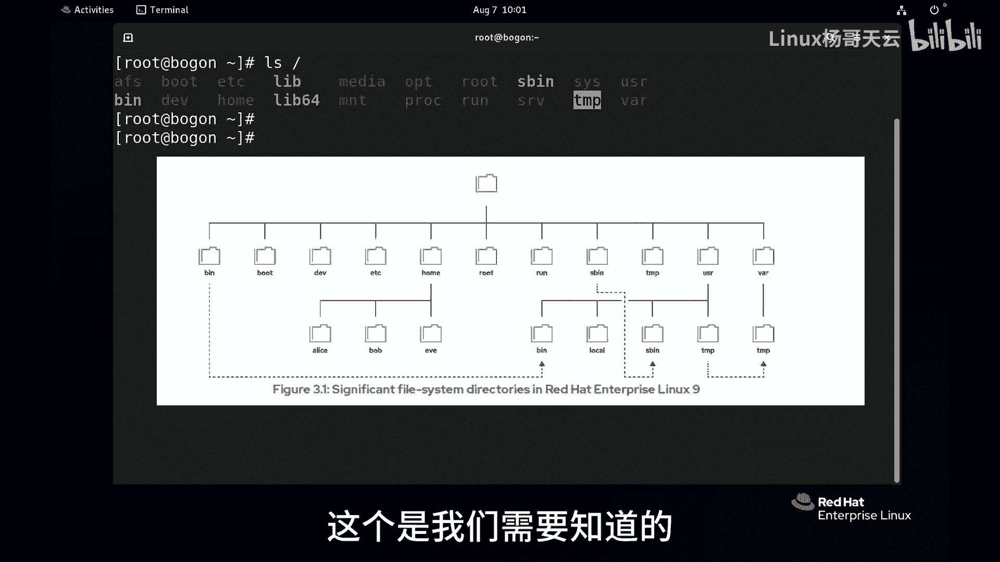
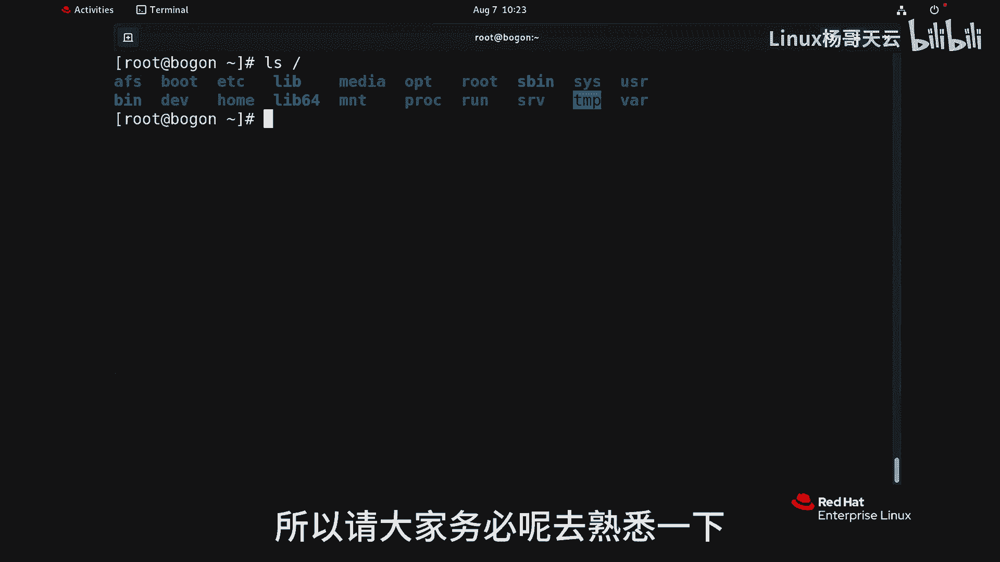

# 史上最强Linux入门教程，杨哥手把手教学，带你极速通关红帽认证RHCE（更新中） - P13：13.Linux文件层次系统结构 - Linux杨哥天云 - BV1FH4y137sA

接下来我们将会带大家学习如何管理文件，在正式对文件管理之前呢。

先来我们了解这个LINUX文件的组织结构呃，首先大家可以想象一下啊，windows它是有很多的。

像像C盘，D盘，E盘啊，F盘这样的一些分区，我们接下来看到LINUX呢可能看到不一样。

比如说首先给大家查看一下根目录下的内容，LINUX它首先是所有的这个文件，就像一棵倒挂的树一样，最上面是根，往下呢才是各个子目录，这个可能给有些同学有一种感觉，就会认为LINUX只有一个分区。

这个是不对的啊，这个我们后面再讲，在这个书上面呢有很多重要的目录，这个是我们需要知道的。

以便于我们后期的一些工作，那比如说像天下的EDC，那么EADC就属于一个子目录，比方说这个文件就在根下面，然后EDC这个目录下面的一个叫password，这样一个文件啊，那在根下也有很多的这样一些目录。

那这些目录里面的放的东西呢也是不太一样的，画质的这些文件可以分为这么几类，一个是静态的这样一个文件，静态的文件呢除非我们去重新去编辑，它的内容呢是不会发生变化的，第二是动态的可变化的一些文件。

这些文件呢可能会由我们的进程进行修改，或者附加，就比方说我们会给大家提到的日志文件，那实际上呢它是一直在变化，那可能记录了某一个，比方说安全登录的一个事件，那这个日志文件呢。

就会随着我们登录的这样一个行为不断在增加，当然还会有一些文件呢，它的内容叫做持久内容，重新启动以后依然是那个保留的，比方说像我们的配置文件，比如我们的主机名，IP地址，有网卡的配置文件等等等等。

那除此以外呢，还有一类文件，这种文件在重新启动以后，它可能会被删除，因为它可能是来自于我们的进程或系统，运行时候的这个内容，再重新启动以后呢，上一次的这个进程运行的相关的一些文件。

比像pad啊之类的会被删除，下面我们具体就来看一下，今夏的一些重要的目录是干嘛的，比如说第一个就是我们的啊boot目录，这个目录是我们的开机启动所需的配置文件，比如说在启动LINUX时候。

有一个那个读秒的那个过程，一个界面，那个界面就是由GRU b grab，它提供这个引导程序，就是没有它的话呢，我们是没办法加载内核之类的，还有呢就这个很重要的东西，那我们一直在谈LINUX。

LINUX啊，这个LINUX是什么呢，它其实不是操作系统，它是一个内核里拉斯托瓦兹写的这个内核，那现在我们所看到的这个VMLINUX，就是我们的整个系统的内核内核，对于我们整个进程的管理。

设备的管理等等非常重要，再一个呢就是我们的DEV设备这个单词，这里有很多很多很多的设备，包括我们的网卡，包括我们的各种硬件磁盘，还有我们的这个其他的一些硬件设备，在这里面呢都会有相应的文件。

有一点就是LINUX1切皆文件，这个是我们的这个后面讲到的终端，还有呢我们的这个标准输入，标准输入等等等等，还有呢我们的其他的一些设备的文件，紧接着是我们ADCEDC，这个是我们以后打交道特别多的地方。

这个是我们件配置文件的一个目录，包括我们在后面看到的这个EDC下的HOSTNAME，这主机名现在没有主机名啊，包括网络的配置全在这里面，我们安装的各种软件，他们的配置文件呢基本上都在这里面啊。

所以这个EDC是我们的配置文件，所在的一个目录，一般情况呢每一个程序都会有自己的一个目录，存放它对应的程序的配置文件，我们再来看一下根下的home目录，这个home目录是什么地方呢。

我们先来提一下root这个位置，是我们这管理员的加目录，每一个用户呢都会有一个我们叫做主目录，或者加目录编下的root的目录，这是什么，是我们管理员的加目录，也就是我们当前这个用户的加目录。

那home是个什么地方呢，home这个位置呢不是什么加目录，它是我们普通用户加目录所在的一个主目录，由于我们现在系统当中有一个普通用户叫天云，那天云这个用户的家目录在哪呢。

就在根下的home目下的天云这个位置，我们可以看一下，这是我们天云用户的家目录，它现在呢里面有一些东西，desktop啊，Document，还有music，还有墙纸啊什么的，这是为什么呢。

这是因为我们装了图形界面，而且我们以这个账号也登录过，所以呢它有一些图形这个界面的一些特性，如果说这是一个没有图形的，安装的时候压根就没有带图形的，那就没有东西。

所以home呢是普通用户加目录的一个主目录，我们再往后接着看下一个叫round的目录，RUN的目录，这里面放的是什么东西呢，通常是我们启动进程运行的数据，所以我们一般人为的不需要去干涉。

比如说这里面可能有进程的一些，我们叫做pad，怎么讲啊，每一个人都有一个身份证，一个id，每一个进程他也有一个编号，这个编号呢叫进程id，那这个PID呢就是这个进程的编号，比方说我说一个编号。

大家知道是谁吗，9527啊，大家可以评论区回应一下，这是谁的编号，下面呢我举一个例子，要用一下一个后面学到的命令system control，然后stop一下，把这个进程给停一下，这个进程叫ATD。

因为现在这个进程在运行，所以它会有PID，那他说死呢，你看像这样没有什么提示，一般就是好提示，那我清一下屏，再来看一下VLOG好，大家可能看到已经没有ATD，那个进程的PID了。

接着呢我们再看一下这个TMP这个目录，这个目录里面呢它是我们存放临时文件的地方，我们在后面会讲到权限的时候，会看到每一个进程，包括普通用户都可以去TAP下面写东西，写自己的进程所需要的一些东西。

但是有一点这个目录下面十天内未曾访问，也没有更改过它或者修改过的文件，将会默认从这个里面的自动删除，所以呢这个地方是啊是一个临时目录，当然还有一个地方也是VR下TMP，这个位置呢也是临时目录。

只不过呢这个位置是30天内没有访问过，也没有更改，呼吸的过的，将会被删除啊，所以两个地方一个是根下的TNP，一个是瓦夏天mp这个位置，接下来我们介绍一个重量级的目录，叫啊USR这个目录。

这个目录下面呢是什么呢，是我们安装的软件，还有我们的各种共享的库所在的一个位置，这是一个非常重要的目录，比如说给大家看啊，在USR下有一个BB呢是我们的二进制啊，像这里面我如果打开好多的这样。

一些绿色的东西，这里面我们的一些mini，比如我们看看有没有我们的LS这个mini，看这就是我们现在用的这个LS，就是我们现在用的这个l s mini，就在USR下面就叫LOS。

所以呢在USR下的这个pin下面放的是什么，放的就是我们的用户命令，用户命令当然是安装了某个软件，如果某一个命令没有的，那有可能是没有装某个软件，这USRB下面是我们的普通用户的命令。

我们也简称为用户命令，注意哦是普通用户啊，比方说这里面有没有一个叫USA，DD的命令呢，创建用户的命令，各位看没有没有这个命令，这个命令它在哪呢，在USRSB下面，这里面放的就是我们的系统管理命令。

简单的说，上面那个呢，B下放的是我们的普通用户使用的命令，而sb super super是我们的管理员使用的命令，按照官方呢他叫的什么，叫用户命令和系统管理命令。

还有呢就是我们USR下有一个叫vocal啊，这个是一些本地的一些软件，把我们的top cat装到这里面，把我们其他的一些程序装到这里面，大家以后在装软件的时候，特别是我们编译的一些软件。

那通常我们是装在usr logo下面的，并且呢以他自己的一个目录来命名，最后一个是我们的VR这个目录，这个目录呢正如它的名字上，可以看出来是变化的，动态变化的一些东西，就比方说我们的日志文件。

大家看到这里面有挂下的这个叫logo logo，这里面就放了很多很多的日志文件，有些是安全日志，有些是各种服务的日志，有些是登录日志，所以这个是放数据动态变化的一个地方，包括数据库。

还有我们的缓存的日志啊，都在VA下面讲，这是我们根下的一些重量级的一些目录，所以大家一定要去知道一下，随着我们后面的学习呢，我们会逐渐了解这些目录里面的一些文件，到底是做什么的。

它跟我们的系统管理相息息相关。

