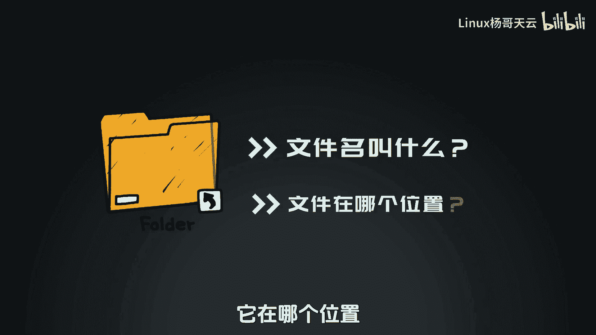
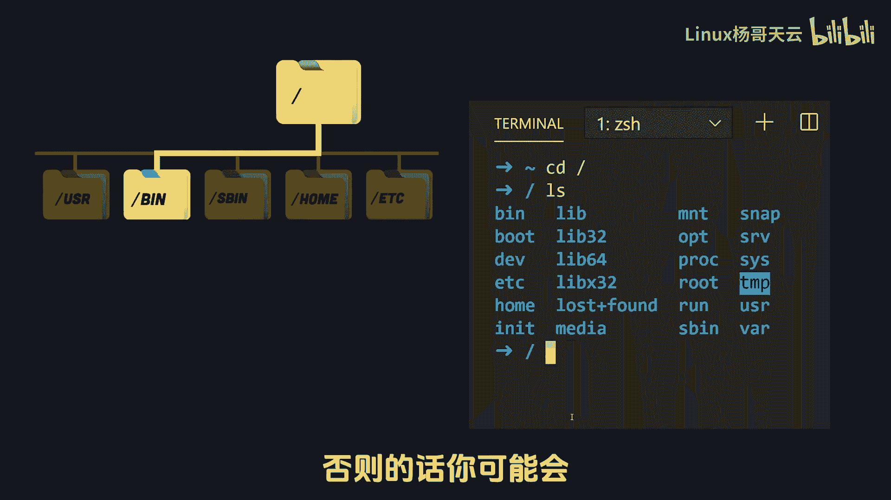
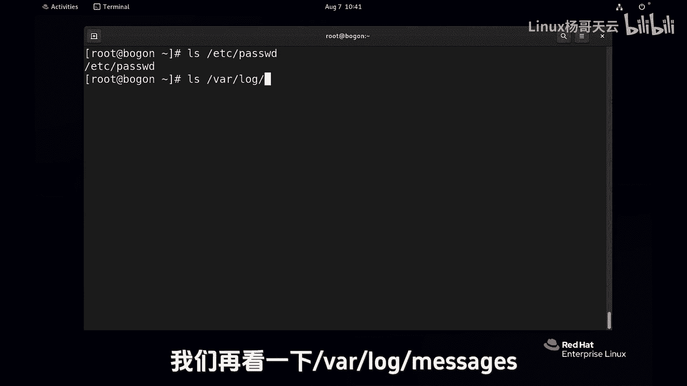
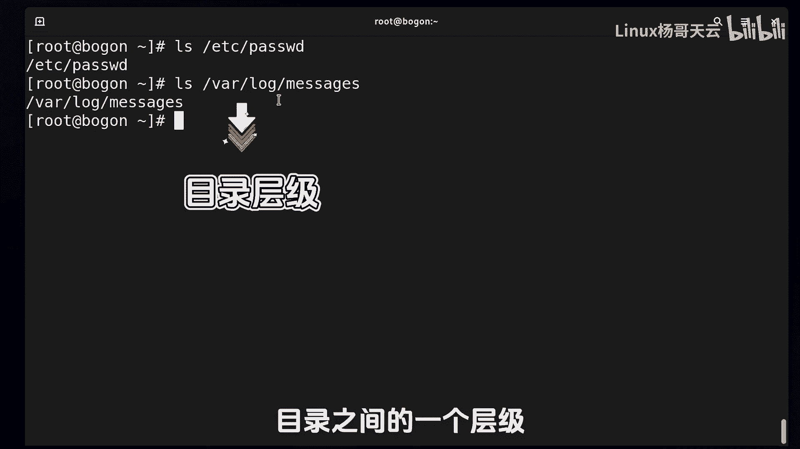
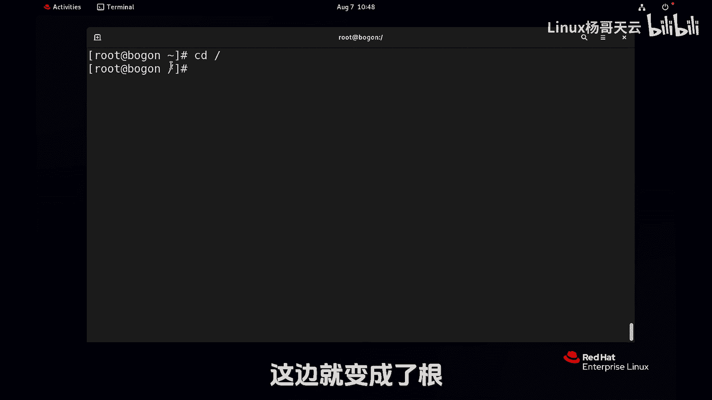
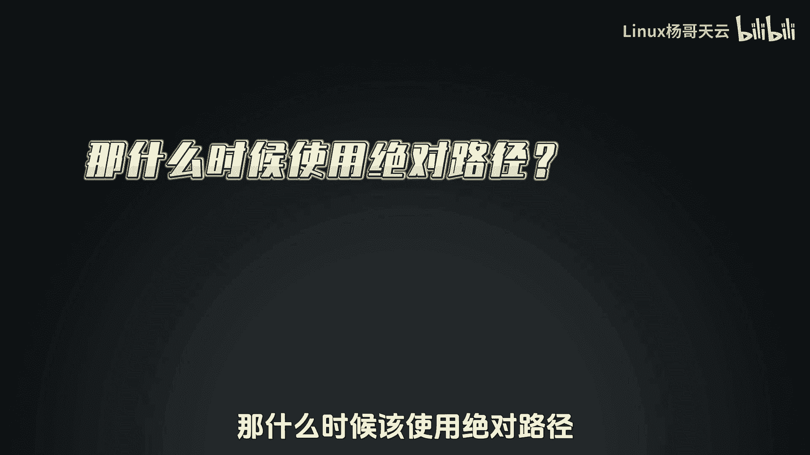
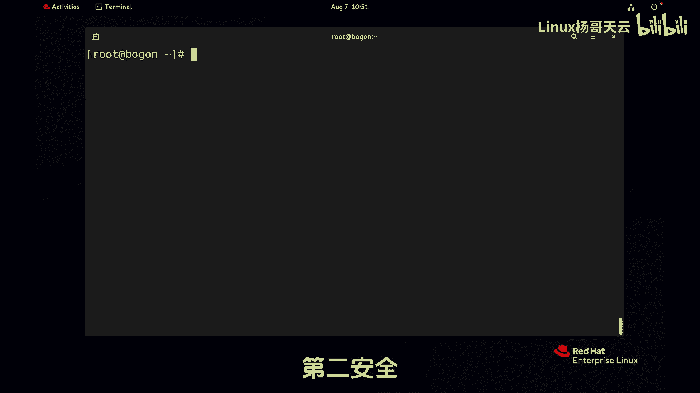

# 史上最强Linux入门教程，杨哥手把手教学，带你极速通关红帽认证RHCE（更新中） - P14：14.绝对路径和相对路径 - Linux杨哥天云 - BV1FH4y137sA

好各位小伙伴，我们继续来学习文件的管理，那么在管理文件之前呢，我们首先要问自己，我们要对哪儿的文件进行管理，比方说我们要创建一个文件，创建这个文件的名字叫什么，它在哪个位置。

我们要删除一个文件，同样的要删除每个地方的哪个文件，换句话讲就是我们要对文件进行定位，我们要通过名称来定位这个文件，否则的话你可能会操作了别的文件。

那要定位这个文件呢就会涉及到路径的问题，比如说我们来看看这个文件呢，它就涉及到一个定位的问题，这里面就用到了一个路径，那这是什么路径呢，接下来我们会讲到绝对路径，相对路径。

还有一个是这个当前工作目录的这样一个概念，三个概念，那现在杨哥这边对这个文件进行定位，用到了这样一个路径，其实就叫做绝对路径，我们再看一下哇下的logo下的message这个文件。

首先各位记住的就是，这个斜线和这个斜线不是一回事，前面这个是正斜线，是根是一切的起点，后面这个只不过是那个目录之间的一个层级。

它跟前面的这个完全不是一个概念啊，凡是以正斜线开始的命令，我们都叫做绝对路径，也就是说它能够绝对的表示这个文件，绝对这个词大家应该都明白，我说哎杨哥绝对是个好人，就是没有其他的歧义，这就是绝对的。

我不可能操作到别的文件，我就是操作了根下挂logo下的method，这个文件，另外一个呢就会涉及到相对路径，相对路径，这怎么讲啊，那下面呢我们会用到几个秘密，哎看似的不起眼。

这实则呢使用频率最高的几个命令，首先来看一下PWP这个命令啊，PWD它的全称叫做打印工作目录，就是显示你现在在哪，特别是在LINUX里面，由于一些这个相关的需要，我们可能会切换到不同的目录里面。

去做相关的操作，那这个时候呢你自己有时候就不知道你在哪了，那就可以使用，随时可以使用这个PWD来显示你当前在哪啊，不管你去到再远再生，那你PWFD呢，直接能够让你呢看到你在哪个地方下面呢。

我们还会用到第二个命令，就是CD命令，比如说我现在在跟下的root，所以我如果我IOS看到的肯定是根音下的柱子下，内容啊，ct到根音下的VR上去，发现有个地方发生了变化，就是这个地方刚才还是个波浪线。

现在呢变成了VR，注意这个位置呢它就显示的是当前目录，这个当前目录是会随着你的这个需求，不断的变化变化变化的，每个用户，可我们在前面给大家讲过，是有自己的家目录的，当一个用户打开一个终端。

或者打开一个shell程序的时候呢，默认就在自己的家里面，所以这个波浪线呢它指的是加的意思啊，然后现在呢这个目录变了，会为我们重新的PWP一下啊，他现在就在根下的VR下面。

那如果这个时候我们LS他看到的就是什么呢，就是根下的VR下的内容，我之前在其他地方的时候，我是用绝对路径，我就是这样写的，根下的VR下logo message，看到这个文件，那我现在的时间不用那么打了。

为什么，因为我现在就已经在这个位置了，已经在这下面了，所以我现在要再看这个下面的这样一个文件呢，就不必要像之前一样再打上VR，什么什么什么什么的，因为你本身就在这个VR下面，那就可以直接logo。

然后下的message，这就是一个什么，我们叫相对路径，相对是什么意思呢，是相对当前位置的一个路径，那你在别的地方打就不可以，那如果我现在回到了这个根下的root这个位置，回来以后。

如果我我这样打绝对路径呢，local下的message没问题，能补全，如果我现在打什么logo下的message，其实都不用打了，都补不全啊，我都table不了，那如果你要硬打下去的话呢。

这也是不可以的，因为相对于当前根本就没有一个logo这个位置，所以相对位置，相对路径呢是指的是相对于你当前的位置，另外呢刚才我们也跟大家说过，前面这个位置是会发生变化的，那这里呢我们再来看看。

如果我们到根这边就变成了根。

如果到根下的EDC，现在就变成了这个根下的EDC，那有同学问我说，那什么时候该使用绝对路径。

什么时候用相对路径呢，那就比如说我们已经进到了根下的VR下的logo，这个位置，我再看message，我就这样看就行了呀，因为它本身就在挂logo下的message这个位置，那我就直接使用路径。

你看这就是路径啊，那你没有必要再像这样挂logo message，这是可以的，那所以有时候看什么情况更省时间，那你就使用相对路径，那再比如说我现在就想看etc下的password文件，那它在这吗。

他在这个目录下面吗，他不在，那如果说你要看它的内容呢，或者要对它进行操作，那么一种方法是呢，你先回去一种方法，就是直接EDC下的password，我没必要再回去，我也没必要使用什么相对路径。

因为它相对于我来讲挺远的，那我还不如使用绝对路径，所以说使用相对路径和绝对路径的，第一重要的一个策略就是什么，看哪个更加到达目的地更近，那你选一条最优路径，最短路径不就可以了吗，这是一种情况。

第二种是什么，就是在后面我会讲到的，有时候相对路径这个东西呢是可怕的，为什么，特别是我们在执行删除命令的时候，这个可能大家理解不了，现在啊删除的时候，我建议大家使用绝对路径删除，有两种情况。

一种就是在命令行人工删除，举一个小例子啊，那如果我们后面再讲到删除命令，就像这个RM这个命令的时候，这个命令很厉害，是见神杀神，见见鬼杀鬼啊，用的时候要特别小心，不小心就会把整个系统的重要文件删除。

至少我曾经在生产服务器上面犯过一个错误，差点造成特别大的一个灾难，所以我们后面会给大家讲到，在命令行删除的时候，我们要用相对路径，但是在脚本里面删除的时候呢，一定要用绝对路径。

那等到讲到那个时候再给大家去讲，因为是血的教训，所以没有说什么是好，什么是不好，我刚才跟大家讲过两个原则，第一种就是以到达目的地的最优，最短路径优先为原则，第二个原则是安全。

所以有时候两者需要同时兼顾一快。

