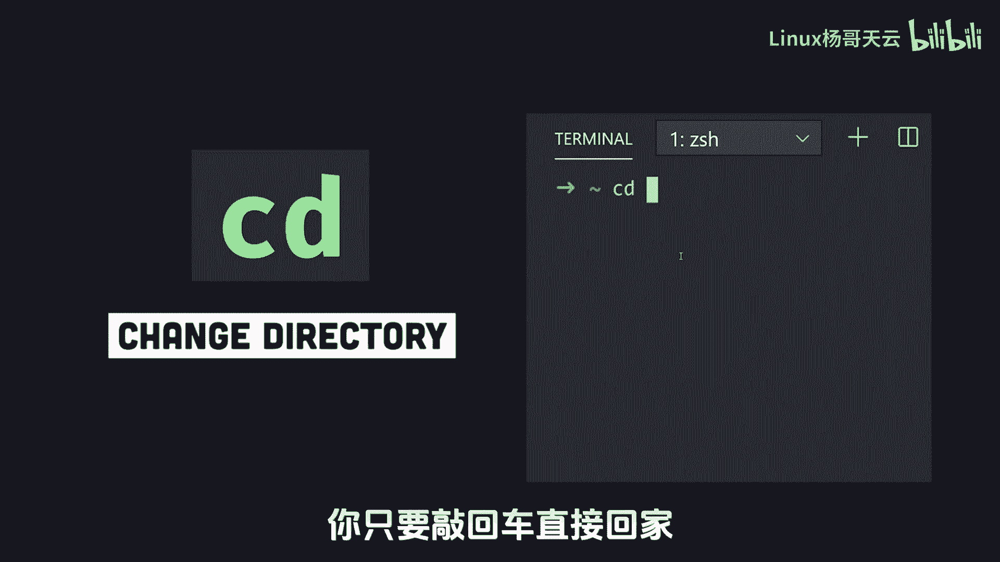
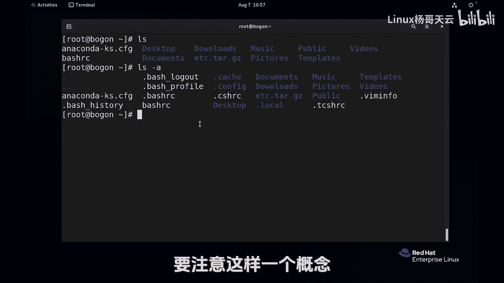

# 史上最强Linux入门教程，杨哥手把手教学，带你极速通关红帽认证RHCE（更新中） - P15：15.Linux中 “.“和”..“的含义 - Linux杨哥天云 - BV1FH4y137sA

不管你去到再远的地方，家永远是你温馨的港湾，而CD不管在哪，你只要敲回车直接回家。

比如说各位看CD到华夏的logo下去，CD命令呢是用来切换目录的，就是change值directory，改编目录啊，那如果我现在要回到这个目录的上层，就是VR这一层。

那一种方法是CD到根下的VR重新向上敲，那一种方法是CD点点，我们看到了，直接回到了上一层，你看VR下面实际上是没有点点那个目录的，因为我刚才讲过，CD呢是用来切换目录的，可见到后面跟的一定是一个目录。

也就是一个文件夹，但是我们没有看到在VR下面或哪个地方，看到这个东西，包括logo下面也也应该是没有的，也是看不到的，默认那这里我们加一个选项叫杠A的选项，好马上就能看见，一是所有的or的意思。

这是个短选项，这有两个很特殊的目录，一个是点，一个是点点点是什么呢，当前目录就是自己点点上一级，这两个目录都可以用，那比如说我现在CD点R没有变化，还在这或者IOS点看，当前目录就跟LOS一样。

没有什么不一样，那如果我CD点点呢，注意看这个时候回到了上一级目录，这个时候大家发现这个VR下面呢，它也有一个点和点点，但是这个点和点点不是刚才的那个点和点点，因为这是个相对概念。

这个点点表示的是呢他自己当前目录，而点点呢是指的是它的上一级，那它的上一级是哪一级呢，它的上一级是这个位置是根，所以如果现在再次CD点点又回到了根，因此呢大家注意就是。

点和点点是两个非常非常特殊的两个目录，为什么有这样的东西啊，这里给大家说一个概念，在我们的LINUX里面，凡是以点开始的文件都是隐藏文件，我们回到回到家里面，CDLLS杠，各位注意到了吗。

好多好多以点儿开始的，点儿开始的，不见得是目录啊，看这个颜色啊，蓝色是目录，这个白色呢那通常是文件，LINUX里面是支持文件一点开始的，甚至还支持空格，我再给大家举个例子啊，这个例子又涉及到一个新秘密。

所以不要太纠结，arch这个是用来创建一个文件，那比如说这个文件这个文件的名字，各位猜一下到底它叫点BAHRC还是叫ash rc呢，那有一点是肯定的啊，同一个位置肯定不能允许两个相同文件出现的。

那我回车，我创建了一个文件，touch命令呢是用来创建一个空文件，它也可以用来触摸一个文件，初学者我们就用来创建一个空文件，好杨哥再次给大家LLS杠一，大家发现有一个B是RC这个文件。

如果你不使用杠A是看得见的，而那个呢得使用杠A，所以这两个文件不是同一个文件，这个点它同样是文件的一部分，就像你脸上那个痣一样，他是你身体的一部分，你用那个痣，那才是你没有那个痣，那是另外一个人。

