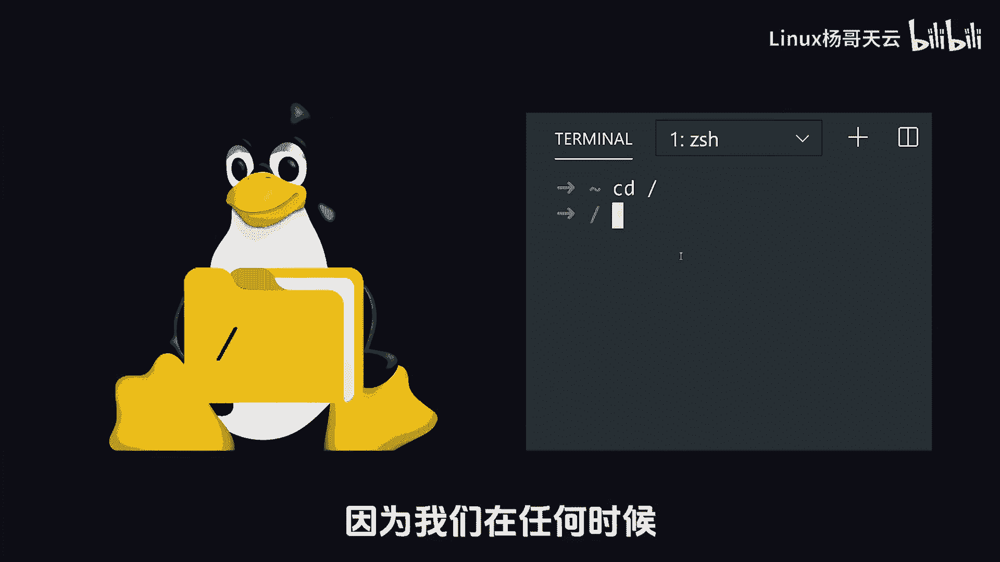
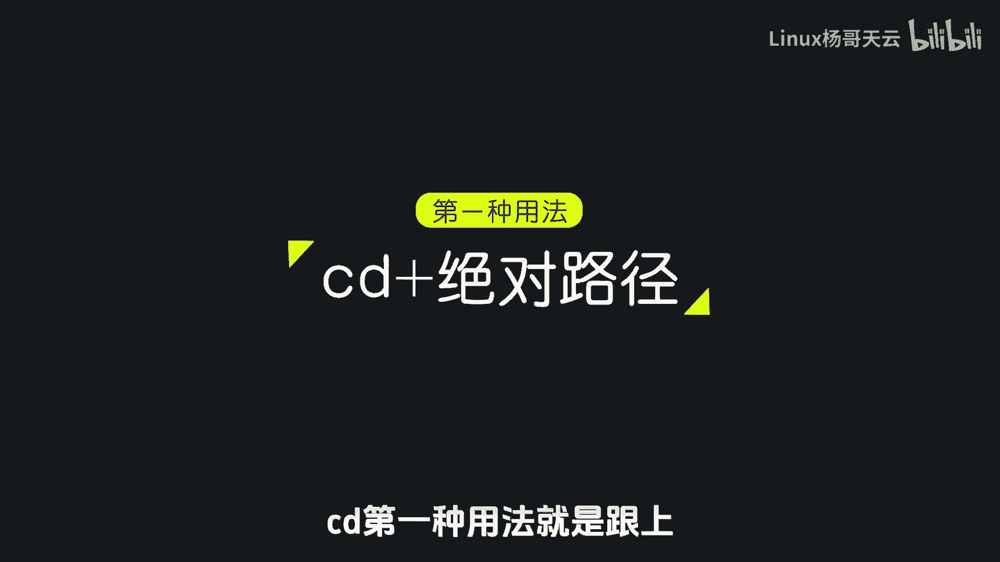
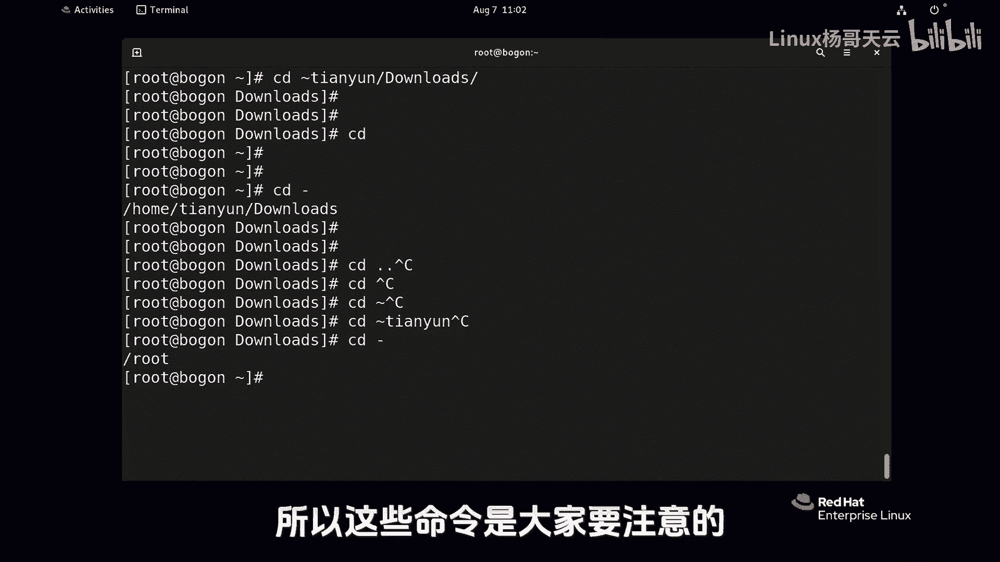

# 史上最强Linux入门教程，杨哥手把手教学，带你极速通关红帽认证RHCE（更新中） - P16：16.Linux中不可错过的cd命令 - Linux杨哥天云 - BV1FH4y137sA

我们再把这个CD命令呢给大家去强调一下，因为CD命令呢它是一个非常高频使用的命令，因为我们在任何时候。

我们可能会根据一些需要，来不断的切换到不同的目录，对不同的文件进行操作，CD第一种用法就是跟上什么绝对路径。

像这样比挖下logo，这是一种切换到这个目录里面去，就后面只能跟一个目录，不能跟文件了啊，第二种呢就是相对路径，你看这个SSSD他就在这下面，所以CDSSSD，你不要觉得杨哥在前面少了个斜线。

你要加个斜线，那就变成了根了，那不是一个意思，后面那个斜线呢它是个目录，它还可以往后走，你以后凡是补全能够自动出现一个斜线的，那说明他是个目录，不能出现的呢，就是个文件。

那如果我跟上一个CD波浪线是什么意思呢，回到了我的家，当然这个波浪线根据不同的用户是不一样的，那现在我们是root用户，那自然回到root用户的家，如果你现在是天云用户，那就直接回到天域用户的家。

各位还记得天云用户的家默认在哪吗，默认在home下面的天云这个位置，也就是说，如果说你现在当前用户登录的是天语音，你敲了这个CD波浪线，那就回到了你的家，我们还可以这样敲，你看波浪线，这这怎么讲呢。

各位波浪键root，那就表示去掉root用户的加，实际上我现在就是root，所以我就不用敲这个root了，然后如果我们敲天云可以看到了吗，这也是路径，你不要看他长得好像不好看，那它也是一个路径。

那这后面还可以往后再接，比如我现在CD回家，CD到波浪线，天云下面的还有什么呢，我们给table table看一下它有什么，比方说这个刀浪的DOWN，它表示的就其实就是根下的home下的青云啊。

然后我们再看一个就是CD小杠，如果说不求别的，就敲个CD直接回家，当你烦了，当你累了，当你漂泊了很长时间，你觉得很辛苦，你就直接回家，家是你的港湾，那如果CD杠了，请注意看刚才你是从哪来的。

你是不是从这个叫DOLOST下面那来的呀，所以这个小杠呢是返回的意思返回，所以在这里呢要注意几个概念了，CD点点是向上，因为点点是上一个目录，CD直接呢就是回家，CD后面跟个波浪线，就是回到自己的家。

然后如果CD波浪线后面跟一个用户，比如说天云这个路径指的是天宇用户的家啊，当然你能不能去得看你你的权限，然后还有呢就是刚才CD杠，这就是返回的意思，返回跟向上是两回事，返回怎么讲啊，大家有没有没用过。

遥控器上有一个返回的一个按钮，表示你刚才在三频道，然后呢你又转到了20频道，你再按一个返回，它不是到19，它是直接回到三频道，就是在两个之间返回吗，返回快速返到上一次那个目录，你刚刚来的那个目录。

