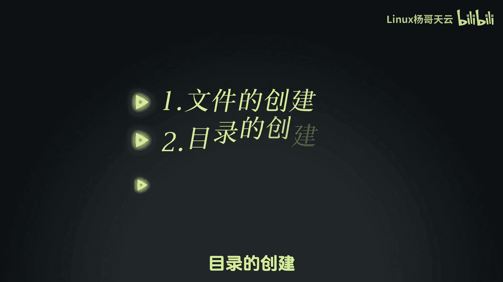
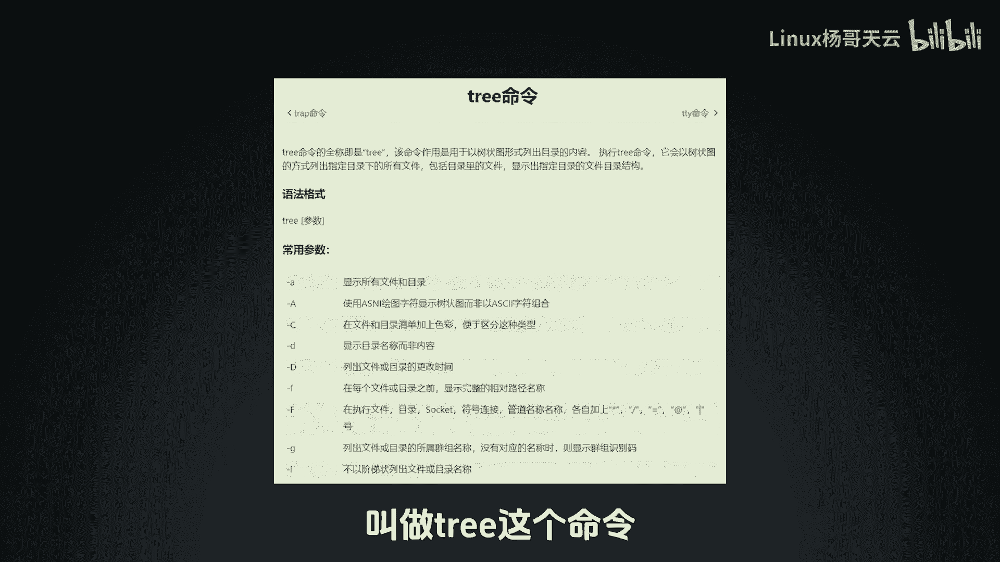
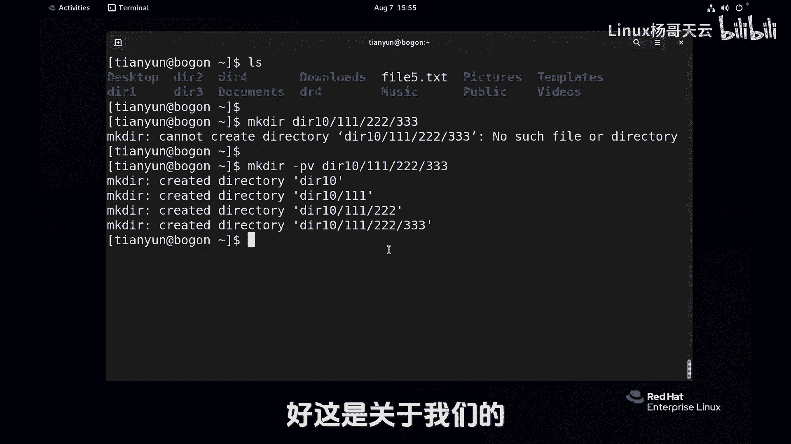

# 史上最强Linux入门教程，杨哥手把手教学，带你极速通关红帽认证RHCE（更新中） - P17：17.创建目录和文件 - Linux杨哥天云 - BV1FH4y137sA

下面我们来看一下最基础的一些文件的管理，包括文件的创建，目录的创建。

还有文件的一些复制，移动以及删除这样一些操作，好我们开始来使用这个MKDR这个命令，也就是make dr创建目录的命令，那它可以呢去创建目录，比如说后面给上目录的名字DR1啊，回车就可以了。

没有报错的话呢，通常都是正确的，结果这边我们就创建了一个叫DIR1的，这样一个目录，当然也可以，后面呢直接跟上多个参数，比如DR1啊，D r2，D r3，这样的话就创建了三个目录了。

当然我们也可以创建多级的目录，首先呢比方说这边没有一个叫DDR4的，我们可以使用MKTR，然后DR4同时呢在DDR4下面呢，再创建一个表示叫做music的一个目录，各位看这个回车呢可能会报错。

它会告诉我们不能够创建目录，D r4，也就是在当前DR4以及music，因为没有找到文件或目录，那是不是不能这么做呢，可以的，因为我们可以加一个杠P的选项，如果没有负极的目录。

可以呢连这个负极目录一块创建，回车可以看到这边就创建好了这个DR4目录，而且在DR4下面呢还有一个叫music的目录，我们继续在DR4下面的music下面，创建一个叫new di的目录吧。

大家刚P选项肯定没问题，但是这里呢要注意一下，这个P呢它是连同负极目录一块创建，也就是说，它可以帮我们快速创建一个整个目录结构，它如果发现前面某个目录没有的话呢，它就会创建，所以大家一定要注意。

这个时候加杠P就会有一个风险，一定要务必小心，那比如说我把这个DI4打成了这样一个东西，各位看，本来我应该是在DR4下面创建一个music，然后在music下面呢创建一个叫6DR的目录，这是我的初心。

我想这么做，但实际上被我打错，在你的DR原计划的这个目录里面。

并没有你想要的效果，我们有两个命令可以这样看啊，比较简单，叫做tree这个命令数码。

它可以把你看的这个目录下面的所有的目录，子目录，还有呢文件一块帮你看，我们来看那个BR4，这个是一个不是我们想要的，但是呢它创建出来了，那也就是说，这个结果并不是和我们当时的预期一样。

所以使用杠P要特别小心，请确保这个目录是正确的，这是我们关于创建目录，那创建文件呢创建文件，比如说我现在进到DRE里面去，这里面没有没有什么东西，这是个空的，我们可以使用touch命令。

在前面我们已经好像用过一回，后面加上file，一加不加，这个TST呢其实没有意思，因为我们在之前给大家讲过，在LINUX里面文件实际上是没有扩展名的，那么这个扩展名呢只不过你自己安慰自己。

或者你自己呢在强化告诉自己，这是一个文本文件，其实那个点后面那个东西不重要啊，当然他的成品里面只是用来创建一个空文件，它有别的用途，它还有这个触摸的意思，这个后面我们在讲到权限的时候。

会给大家详细讲到touch啊，好回声，这边就创建了一个文件，从颜色上大家应该可以看出来，这是一个文件，file一点TC这样一个文件，当然后面同样可以跟上多个路径，多个参数。

比方说file2点天二点TXT，这个OK就这样，那就有了，好啊，不管是touch命令，还是那个刚才那个MKTR命令，并不是你想在哪做就哪做的，就比如说我们MKDR，在根下想创建一个叫做杨哥的目录。

那这个是不可以的，permission den权限被拒绝，因为我们是一个普通用户，我们不是管理员，拿那个root用户给大家来做测试，那样的话你会发现你你想干啥就干啥。

实际上呢这个社会并不是你想干啥就干啥，是你的权限能够做到才可以跟下的，比方说TMP这个位置是可以的，因为我们在前面跟大家讲过，TMP应该属于临时目录，大家都可以在里面玩。

我们创建一个叫test点TXT吧，然后紧接着呢我们再创建一个点file，五点TXT好了，那我问大家一下，就是这两个文件是不是都在TNP下创建了呢，第一个文件呢很明确的是创建在根下的TMP。

test点TT，第二个是不是也是在那呢，答案肯定不是，因为第一个路径我们可以拆开来看，第一个参数是一个绝对路径，明确就指向了根下天辟下test txt，第二个呢那叫相对路径。

注意看我们当前是在home天云下面，所以呢我们可以检测一下，看一下TNB下面呢有一个叫test t i c文件，没问题啊，这是我们第一个参数，我们在那个当前有一个非要五点TXT。

所以呢你跟多个参数的时候呢，你要注意他的那个路径是不是你想要的，还有一个地方是要给大家来说明一下的，MKDRDR10啊下的111在222333，各位应该知道，杠P呢可以帮我们连负极目录一块创建。

那我们能不能加一个V1呢，看一下还真可以，这个V啊，在很多命令里面都有这样一个这个选项，它能够把这个命令的详细过程给你显示一下，就包括我们在后面讲到的删除啊，或者说拷贝命令都有这个选项好。

你看他是不是完成了一级两级，三级这样四级的这样一个创建过程，所以大家在用的时候一定要特别的注意好，这是关于我们的目录的创建。

还有呢就是文件的创建这样一个简单的动作。