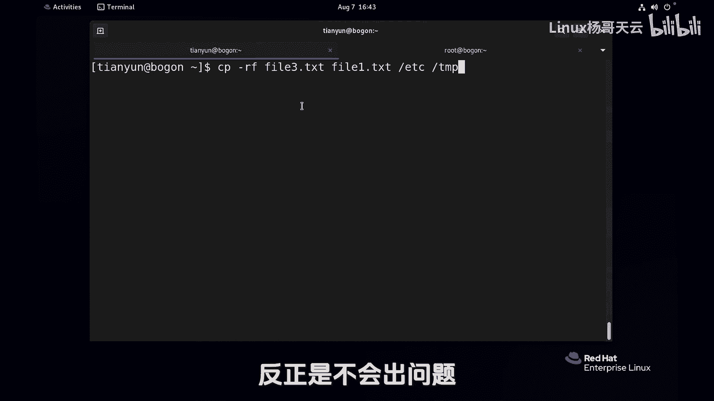

# 史上最强Linux入门教程，杨哥手把手教学，带你极速通关红帽认证RHCE（更新中） - P18：18.使用cp命令复制文件和目录 - Linux杨哥天云 - BV1FH4y137sA

各位小伙伴，我们接下来看文件的copy，那么文件copy呢也就是复制啊，首先这个命令用法呢非常简单，比如说我们当前要将fl1，这个文件拷贝到TMP下去啊，可以使用CPCP这个命令的用法是CP源文件。

目标文件好，原文件呢也就是当前位置下的file一点TXT，然后将它拷贝到TNT下去，那如果说后面没有指定新的文件名，那它就会默认就是原来的文件名，那同样呢我们也可以CP一下。

FIL一点TXT到TAP下去，如果指定的文件名，比方说幺幺点TXT，这个跟上一个命令的区别在于呢，这个圆圆没问题，目标这是一个目录，由于我们没有指定目标的文件名。

所以呢它就会还是原来的bio e点TXT，而这个TNP下的fl11等ta系列，这个文件实际上是不存在的，也就是我们考过去的时候，连烤带改名就可以，我们来验证一下，结果天下的TNT好。

这边非L1和非L11都有，当然也可以在当前位置copy，像这样file一点txt copy成file3点TXT，这个没问题，那这里呢我们再来看一个小事情啊，这是我们刚才拷贝的时候。

把fl1拷到那个TNB下去了，那大家想象一下，这个时候TNP一下，是不是已经有这个叫file一点TNT这个文件了，那再考的会怎么样，在考的时候大家看好它没有提示，再考还是没有提示哦，那就是覆盖了。

相当于再考还是没有提示，但是呢我们来换一个用户试一下，我们打开一个新的一个终端啊，这边可以使用Ctrl shift加T，先用一下后面我们要讲的内容，也就是切换用户SU杠回车输入用root用户密码。

看不见啊，它是不回显的，LINUX本身就不回显好，同样的道理，我们来试一下，比如touch一个文件叫file22点TXT吧，我们将其拷贝到TNP下去，好比说第一次拷贝没有提示，第二次拷贝会不会有提示呢。

有感却告诉我们overwrite要覆盖吗，Yes，再拷贝肯定还会有提示，与其这样的话，我先加一个选项false，强制各位看到仍然有普通用用呢，这怎么考都没有提示管理员呢，拷贝的时候覆盖的时候就有提示。

大家想想这是为什么，那我们的普通用户如果说加一个杠I的选项，I呢是interactive，也就是交互，我如果遇到有相同文件名的文件的时候，他会询问你跟你交互，你看这个时候就按Y再考了。

还是一样要按Y是否覆盖，那么可见普通用户使用的CP，好像是默认就没有杠I，而管理员呢就有这个道理，很简单，因为普通用户啊，你就是一个小喽啰，你的权限很小，再比如说我们将fl1拷到根下去，这都是不可以的。

为什么或者考到根下的home不下去，这也是不可以的，它会提示你permission denn，也就是说你的权限很小，你想把什么覆盖掉，那也不可以，而我们刚才考的是TNP。

因为TNP呢在前面我们给大家讲过，是全局可写目录，你考过去你只能够覆盖你自己的，别人的，你也覆盖不了了啊，但是作为管理员，大家知道他的权限很大，他能够对任何一个文件覆盖，如果没有限制的话呢，就太可怕了。

所以管理员使用的CP实际上呢是什么CP杠I，那我们这边知识稍微做一下扩展，因为管理员使用的CP是什么呢，这样我们可以看一下tap杠ACP，就是现在有两个CP，一个叫CP，一个还叫CP。

最下面这个呢我们应该大家应该知道，这是放在根下USR下的B下的，一个叫CP的命令，这是一个普通用户使用的命令，而上面还有一个CP，它呢是一个别名，他是CP杠I的别名，也就是说默认情况下它是放在最上面的。

你使用的这个CP呢实际上是CP杠I，也就是说，无形当中已经帮你把这个枷锁给你套上了，你管理员太疯狂了，不可以的，而普通用户是什么个情况呢，我清一下屏啊，tab cp普通用户的使用的CP呢。

他就是一个CP，他就是USR并下的CP，当然他是一个哈希哈，希就是你内存当中一直在用的啊，加载到内存里面的已经，然后管理员不是，那如果管理员使用的也是我们那个CP呢，那当然他就跟我们一样了啊。

怎么不用别名呢，就是怎么直接用下面那个呢，可以很简单，有两种方法啊，大家认真听一下，还是这个命令，一种方法是你就直接使用USRB下的CP，这个大家能想通吧，这个F5实际上没有用的。

这个在这好像就是打酱油的硅胶，可以的，你这样做就跟普通用户一样，使用的是这个传统的CP或者是什么呢，你不想使用bi，我们可以斜线，这样也可以，就相当于不用CP的笔名，不用CP域名呢，转下来就是这款了。

当然还有很多别的方式，现在先不去做扩展了，总之就跟大家说一下，管理员他在使用CP的时候，其实CP杠I刚才考的是文件下面考目录，我们先尝试copy下DI2这个目录拷到TAP下去，回车，他说不可以。

他说没有一个杠R的选项，杠R是什么呢，是便利便利的，意思是说连同这个目录和他下面的子子，孙孙孙孙孙孙孙全拷过去，把他考目录的必备神器啊，杠R嗯加上吧，没问题，然后呢我们再来看gr。

比方说将EDC这个目录拷到TNP下去，大家千万不要纠结后面那个斜线，什么都不影响，它是目录后面的那个斜线啊，回车大家看到考考是考了，但是呢有些地方肯定要注意，就是那个权限不够。

因为有一些文件呢我们是没有权限的，但是管理员不是啊，管理员在拷贝的时候，杠r etc拷到TNP下去回车，这是要覆盖吗，好好好，我受不了了，因为这个太多了，这里有几百个文件，我要一个一个干到底吗。

我中不了，这个为什么是这个情况，刚才讲过了，因为哥们使的是别名，那怎么办，我们可以放弃别名，一种就是使用那个比较长的那个，一种是使用斜线，也就是取消别名啊，当然这个是临时取消啊，下次用。

还有你看你不可能YYYYY到底呀，那么多Y你怎么办，一个文件夹下面有很多文件，你总不可能那么干吧，所以呢请大家记住我们copy的时候的终极用法，就是CP杠R，所以那个RF呢。

基本上那个false强制呢是没有什么太大的用处的，只不过我习惯了已经CP比如说这样，然后拷到哪个地方去，当然我们CP的时候可以拷贝什么，可以拷贝这个多个文件。

比方说将file3点t s t file一点TXT，甚至是将EDC都拷到EMP下去，它可以将多个前面的所有的都作为语言，后面的是作为目标，将一堆的源文件拷到目标那个位置上去好，这就是我们的copy。

所以不管是文件还是目录，你就把这个R加上，反正是不会出问题。

听杨哥的没错。