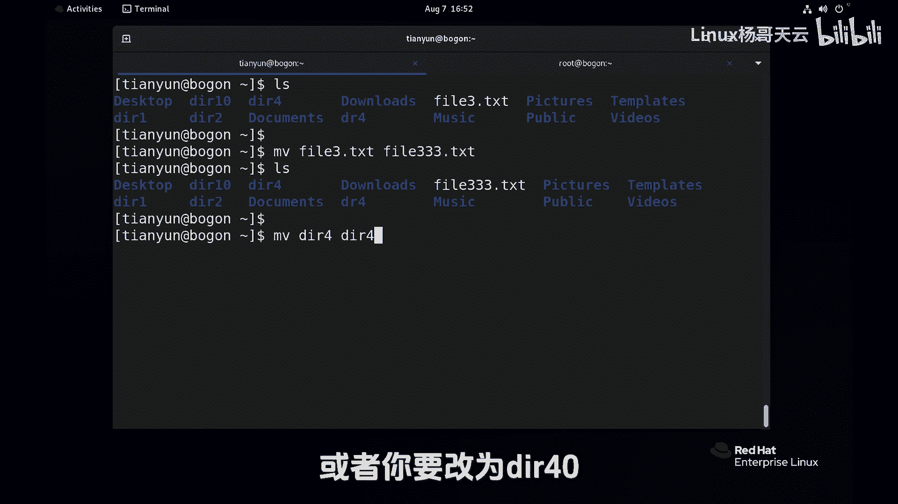
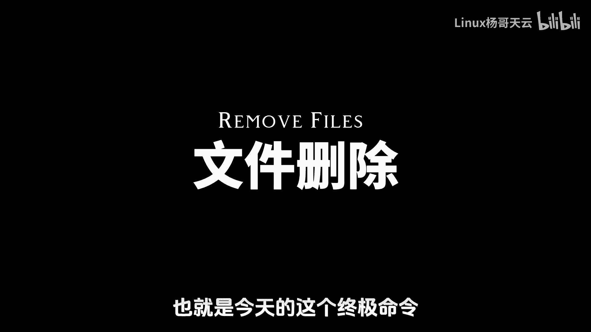
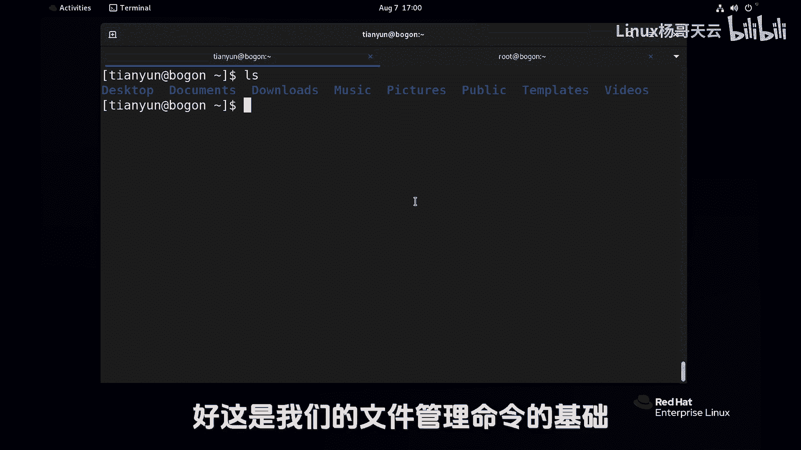

# 史上最强Linux入门教程，杨哥手把手教学，带你极速通关红帽认证RHCE（更新中） - P19：19.Linux文件的移动和删除，mv命令和rm命令的用法 - Linux杨哥天云 - BV1FH4y137sA

接下来我们来看文件的移动，那文件的移动呢也就是MB相当于windows里面的剪切，这个道理大家应该很清楚，他跟copy的区别就是原来的东西还在不在，比如说这边有一个叫file一点DC的文件。

我们通过MV啊，file一点TNC，它也是源文件，目标文件如果没有起这个文件名的话，自动就会是原来的文件名字，好诶，移过去了，移过去以后呢，我们再看当前位置，file1不见了。

同样file2点TXT移到TAP下去，表示叫做new file，二点TXT，这是连移动带改名了，这个没问题，来检测一下目标位置，d mp6file2点VCU。

如果在当前位置用表示说mv file3file，333回车好，大家看到这里相当于改名字，当然它还可以呢，对目录进移动MVDR4就是改名了，或者你只要改为DRDR四四十没问题啊。

这个MV呢特别特别的简单，那下面我们就来说一下文件的删除，也就是今天的这个终极迷你。

那网上大家比较习惯说删根的这个操作，那就是典型的RM命令RM rf根，现在呢我们就来看看l RM命令有多么的豪爽，首先这是我们当前内容，删除FIL333没问题，文件没问题，目录的话，删除的这个不用想。

肯定不让删，要加一个R选项，也就是DR2后面那个选项有没有都不重要，DR一一起删吧，四一块删好，删的很干净，还有一个DDR40没有删，删的时候也没有什么提示，也没有什么交互，里面有内容也没问我们一下哇。

删的太豪爽了，所以说普通用户删呢，你发现这个权限感觉很大，其实它并不是很大，你想删别的呢，你也删不掉，当然我们也不要轻易去试一下啊，这是管理员，之前我们给大家切换过管理员的话，先删个文件试试，Fr2。

这管理员上来就让我们这个要放个外，这太痛苦了吗，管理员看来真的是很严格呀，刚才说过，如果说你是管理员，你在执行这个命令的时候，你真的要特别小心，曾经我就犯过错，我一会给大家讲一下那个错误是怎么产生的。

让大家谨记于心，所以删除迷你，请大家务必要特别小心，要说什么呢，为什么管理员删的时候就只有提示呢，就删一个目录的话呢，也很痛苦，你删一个目录的，我们拷一个目录过来吧，将etc目录跑到这儿来。

这大家应该看得懂啊，来我们删一个试试，RM肯定要加R选项递归嘛，EDC注意这个EADC不是那个EADC啊，我真是给我胆子，我也不敢删回车，他说什么怎么1YY吗，哇这个Y简直是要这么说吧，太痛苦了。

不可以CTRLC吧，我取消太多了，这个之前大家应该领教过，为什么是这样呢，因为管理员使用的RM，他这个命令是一个别名，直接就是一个别名RM杠I好，当然我们杠A的话是看他所有的命令啊，B它也是两个。

一个是传统的地道的RM，一个是这个RM杠I，你默认使用的这个I就是要交互，那这个时候怎么不用呢，那我们可以用一个F选项，也就是false强制选项都提示了，但你也可以使用把别名去掉，用我们前面讲过的方式。

所以RM杠RF是一个比较厉害的选项啊，那这里呢还要给大家说一说一件事情，你看啊，这个地方EDC文件夹已经不见了啊，我们再拷一个过来，把那个EDC拷过来，叫EDC1，再考一个过来叫EDC，二考俩过来了。

如果说这样删的话，注意这个有没有斜线，我跟大家讲过不重要，不要大家太纠结这个斜线，这不就是我随手补全的吗，回车好，我问问大家一个问题，它是将EDC整个文件夹删呢，还是将EDC下面的内容删了呢。

将EDC整个删了，那如果这样删呢，E d c2，各位猜一下什么结果呢，这个删的是EDC2和它下面的所有文件，还是只删的是EDC2下面的文件呢，答案呢在这EDC2已经空空如也。

所以这个RF命令真的是很豪爽，就算你有I也可以干掉，所以管理员千万小心，那刚才我说的是那个错到底是什么，怎么引起的，我是曾经在一台服务器上面，我当时我使的是管理员跟大家说一下。

我本来是想删除home下的天云下的etc的，这是我想要的效果，我是想这么干的，但是我那个手啊不知道怎么就欠我输的，都还没有输到，那我就回车了，所以最后我立马CTRLC，我都发现呢都差点来不及。

就已经把好多文件删掉了，你哪有系统快啊，特别是你是管理员的时候，就算你不是管理员删的时候，你也给我使用相对路径，什么意思，去哪home下的天云，你现在你这么扇，你能扇出个什么样来，你别再从根开始打了。

你后面的路径尽量使用相对路径，也就是说你去到那个目录，眼睁睁的看着他被干死，使用相对路径，当然在脚本里面呢，杨哥也是犯过天大的错误，在脚本里面一定要使用绝对路径，但是在命令行人工来做。

请使用相对路径回车好，这就是我们的RM命令，见鬼杀鬼，请大家务必小心谨慎，平时呢还是使用我们的普通用户啊，万不得已的时候，有需要的时候再使用管理员好，这是我们的文件管理命令的基础。

