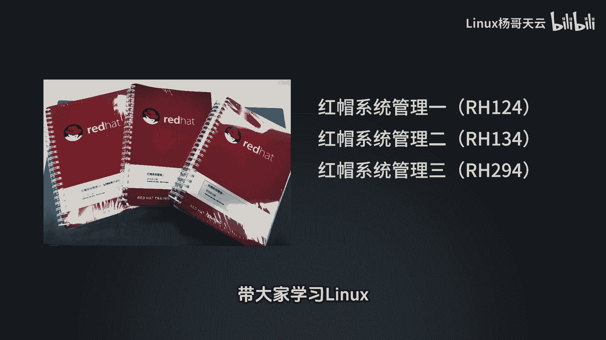
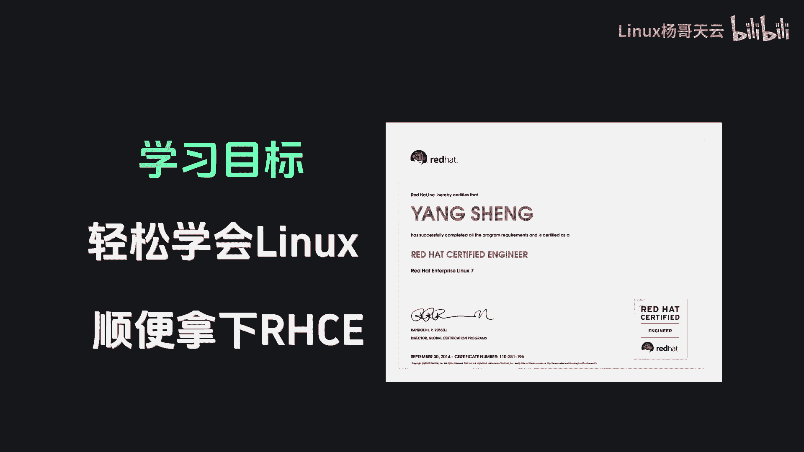
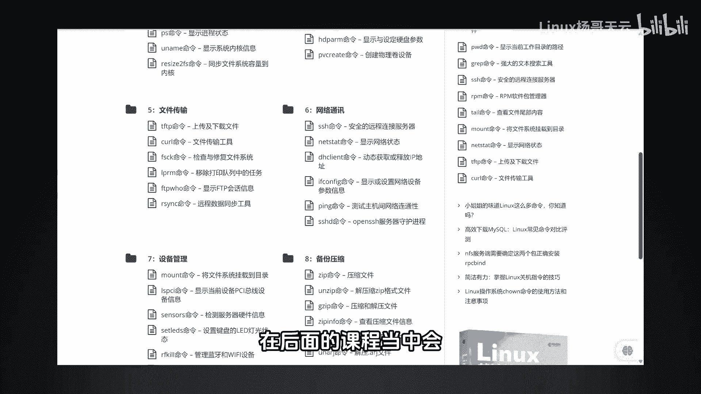

# 史上最强Linux入门教程，杨哥手把手教学，带你极速通关红帽认证RHCE（更新中） - P1：1.红帽认证-先导片，轻松学习Linux，顺便拿下RHCE - Linux杨哥天云 - BV1FH4y137sA

从今天开始呢，我将带大家按照官方红帽教材的这个顺序呢，带大家学习LINUX。

那我们的目标是轻松学会LINUX，顺便拿下RGCE。

那我们将按照官方三本教材的顺序，带大家呢去真正学习掌握LINUX这个基础技能，很多同学可能在大学当中啊，可能学过LINUX，因为现在很多我们的专业呢都有LINUX这个课程，但是无从下手。

简单的讲就是它的命令特别多，而且每个命令呢又有很多的参数，但实际上是这样的，就是我们常用的mini不是那么多，有一些呢常用的可能就十几20个，有一些是用的频率稍微偏低一点。

所以我们要掌握就是他的一些怎么去查看，帮助的一些方法，那这些内容呢，在后面的课程当中会给大家详细去讲到啊。

所以呢希望大家跟着我的这个节奏啊，我们一起呢来轻松学习LINUX。