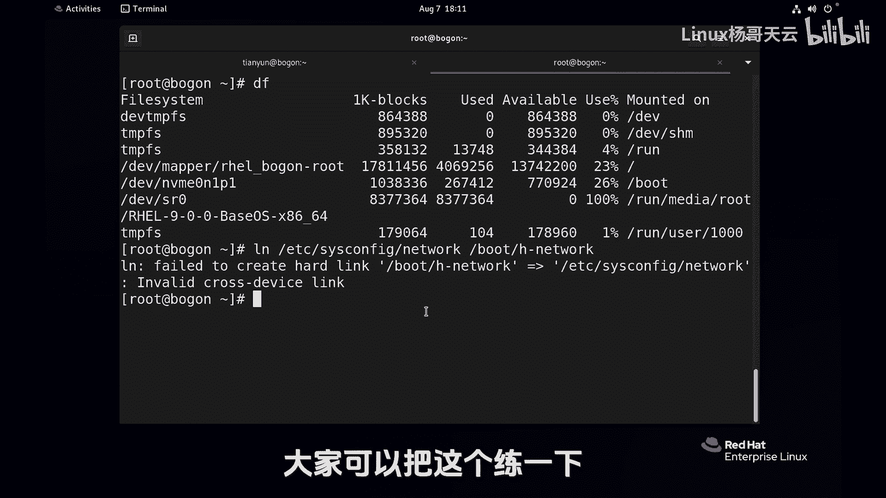

# 史上最强Linux入门教程，杨哥手把手教学，带你极速通关红帽认证RHCE（更新中） - P20：20.文件链接-硬链接 - Linux杨哥天云 - BV1FH4y137sA

下面给大家介绍的是呢LINUX的文件链接，也就是我们可以通过链接的一种方式呢，可以呢把一个路径比较深的文件啊，给他做一个比较简单的一个访问的入口，有点像windows的快捷方式。

但是LINUX远远比windows要强大的多，因为LINUX它支持两种链接，一种我们叫E连接，一种叫符号链接，也称之为软链接，那下面我们来看这个实验啊。

首先我们在这边呢来创建一个文件，好表示touch一个file一点TXT，但这个文件没有内容，没有内容怎么办呢，今天我们先前瞻性的用一下一些mini吧，比如说他一个杨哥这几个字啊，先用一下。

我们大家先不用太纠结这个文件呢，我们先看一下，首先LS啊，杠L大家都知道这个是用来看文件的长列表的，我们可以看文件的详细信息，当然其实在LINUX里面呢，你可以直接使用LLL，因为他有这样一个别名。

它相当于就是ls s杠L，大家不妨看一看是不是这样的，有一个原因就是LS杠L并且还显示颜色呢，所以我们就大胆的放心的用这个LOL就可以，它显示当前所有文件好，大家看到这里面呢，我们教大家认识一下啊。

第一个是文件的类型，D呢表示它是一个文件夹，也就是一个目录，而这个小横杠表示它是一个普通文件，也就是常规文件，除此以外呢，大家可能看到在这一列有一个数字，这个数字呢好像文件夹是二个文件是一。

这个表示文件被硬链接的次数，被链接的次数，那现在是一，因为当前就就这么一个文件，我们再来用一个叫杠I的选项，注意这个I呢不是那个交互的意思啊，是i load，我们也叫索引节点。

就每一个文件实际上它都有编号，我们可以简化一下LLLL就看FIL1，这个就内容就少一点，但忘了加那个杠I了，但你也可以使用LI，像这样LSLI没问题，只不过习惯了，那就把那个L去掉吧，就这样OK了。

他的这个编号呢是50641747，它这个不是一定的啊，这看那个存储的位置，目前呢这边是一个一啊，内容呢你现在访问这个file1没问题，是这样的，那我们怎样给文件做链接呢。

用这个link和n link这个命令，首先跟源文件，原文件呢就是我们的fl1跟目标文件，也就是你要链接的那个链接成为那个文件，比方说叫做H杠file一点TXT就是我们hard link10啊。

101连接，这个时候呢我们L了LL看一下，就两个文件，这两个文件的颜色都一样的，而且大家注意到没有链接的次数，加了个一，我们并不知道他俩是不是一起的，是不是同一个文件，但是有一点是肯定的。

我们来验证一下他俩的链接数都是二，刚才还是一呢，对不对，我们先检测一下内容，cat一下file1，这个就是我们刚才所谓的原始文件，它的里面内容是杨哥没问题，再看一下那个HFIL1好，也是杨哥没问题。

那如果说你改了一个文件好，我们可以试一下啊，就先占用一下我们刚才用的那个echo，怎么快捷把命令调出来呢，CTRL加r echo，这边以前忘了提醒大家，你想编辑的话呢，就先不要按回车，先按ESC。

先按ESC就取消那个模式，我们来加一个内容，杨哥天云好，编辑一下，现在还没有学任何的编辑工具，所以我们就先占用一下这个mini啊，看起来有点复杂，我们后面会讲到。

我们来验证一下这两个文件是不是发生了变化，我们改的是file1，也就是我们心目中那个原来的那个文件好，没问题，我们再看一下file h f l1好也没问题，那如果说你改了这个文件呢。

那这个文件会发生变化吗，肯定的，我们看看FIL1和HFL1好，所以小伙伴看到他俩的实际指向的位置，是一样的，也就指向的是同一个索引号，同一个IO的号，所以他俩实际上两方是同一个，那如果我再做一个链接呢。

给fail1再指向一个地方，比如放到我们我我找个地方啊，fail1倒贴P下去，file16点TXT好，那这个时候我们看有三个文件，首先这个file一点TXT它变成了三了，我们来看看他们三个文件啊。

LLL杠i file，一点TXT，H file，一点TXT，还TAB下的file file，一六点DSC好，我清一下屏，各位这三个其实是同一个文件，所以呢你对哪一个文件的操作都不会有影响。

因为它们指向的是同一个位置，同一个索引号，你访问哪一个文件都可以，那这三个文件我问大家一下，比如说把这个fl1删掉行不行，单除命令我们学过了啊，把那个fl1删掉，这两个文件还在吗。

或者说他们内容还可以访问吗，首先我们再来向上看一下这三个文件，当然我们清楚第一个文件已经被干掉了，我们回车看第一个文件其实已经没有了，同样的去访问什么，访问那个h fl1再访问呢。

TNT下的fl一个六没问题都一样，那这种一年级的特点，就是你给这个文件增加了链接的次数，你访问哪一个文件都是可以的，当这个最后一个文件被删除的时候，比方说对fail1这个删了也没问题。

还有一个就是TAP下的file16好，我把这个文件删掉，也就是说一链接只有当最后一个链接，最后一个文件被删除的时候呢，那么这个文件相当于从硬盘上就删除了，那你再也无法访问，因为你找不到那个位置。

这就是一年级的特点，所以一年级很很强大，那比方说我们现在换一个用户吧，我们守住的用户，免得大家觉得权限不够，比如说当前位置在这，在根下的root下面。

我们想将EDC下的csconfigure bad work，练到这个地方叫什么呢，就叫bad work，我们看看这两个文件，EDCC4config network和那个当前的network。

它俩是同一个文件，所以你现在访问他俩任何一个文件都可以，这样的话你可以加一个很深的文件点到这边来，一年级的这个特点已经大家很清楚了，这个确实是很帅气，但一年级他有他的缺陷，什么缺陷呢。

第一个是比方说我们现在普通用户吧，我创建一个目录，创建一个DR1，我尝试给DR1目录呢链接一个叫做DI2，他说不行，E连接哈的link不允许对目录创建，也就是说我们硬连接它只能对常规文件创建，这是其一。

其二呢还有一点它不能够跨这个文件系统，也就是我们常规讲的分区，那怎么解读呢，当然同样我们的普通用户呢可能没有权限，所以我还是切过来，现在我们先看一个命令，就是DF，看一下这边有两个分区。

一个根是一个分区，boot是一个分区，也就是说你现在你你要在跟这个分区以内，去这个链接文件E链接啊，没问题，就刚才我们都试了没问题，但是如果说你想将根下的文件练到boot下面去，或者相反从bot练过去。

那是不可以的，这是跨了分区了，我们试一下LNED根下的EDC下的sense，Config network，还是这个文件我们列到boot下面，就叫H名，就HNE，反正不成功啊，好了，他说了不可以看到了吗。

cross device不能够去跨越设备，不能跨越设备，也就是说这个一年级的他有两个不能做的，一个就是呢不支持目录，只支持常规文件，第二是什么呢，是不能够去跨分区的，专业讲叫不能跨文件系统的啊。

前面这个叫是分区或者叫设备，后面是文件系统，这是根文件系统，这是我们的boot，因为这两个对应的是两个设备，两个分区，你可以简单理解为这个根就是一个像C盘一样，这个boot呢可能是D盘，像这样的。

而他俩之间是不能够互相做硬连接的，一连接只能够针对在同一个文件系统，或者叫分区上面，针对普通文件做，所以大家把这个限制一定要记住，好处呢就是真的是特别好，有时候防止文件被误删除。

那你给他做个一连接或者做多个，说多个一年级，他不是说复制了三份啊，或者复制了几份，它也不会让你的空间变大，它只是创建了三个文件，它其实指向的是同一个位置，所以这个是很帅气的。

windows不具备这个特性好，这是我们LINUX里面的第一种连接，我们叫E连接。

