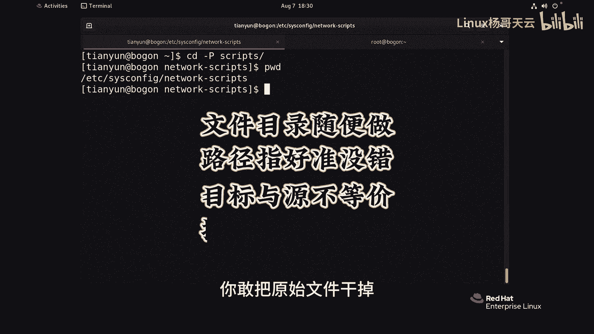

# 史上最强Linux入门教程，杨哥手把手教学，带你极速通关红帽认证RHCE（更新中） - P21：21.文件链接-软链接 - Linux杨哥天云 - BV1FH4y137sA

符号连接也就是软连接，它什么都可以干，定目录也可以，下面我们来做一个演示啊，首先在这边呢有一个DRE的目录，我们在DRE里面呢创建一些文件，比方说L1到file10好。

看看DRE里面呢有这个FIL1的file10，我们现在对文件做一个软连接看看啊，在这边还是按我们之前的这个用法，两个到一个文件里面去，到比方说猪猪侠点PS里面去，软连接的方法呢就是这样LNN加一个S。

这个S就是否连接的选项，链接文件叫S注释下吧，好各位看看这个软连接呢，它跟刚才不一样了，它首先我们加杠I吧，这两个文件，这个文件和这个文件完全不像，指向的都是两个地方，一个是902，一个903。

后面呢我们看到这边有一个有一个指向S，而且颜色也变了，是这种淡蓝色，最关键是这边呢显示的是一个L，也就是这是一个非常明显的什么链接文件，link它指向的是呢猪猪侠点TST啊。

当然访问任何一个文件都没问题，你看访问这个S杠，猪猪侠没问题，访问这个也没问题，这是关于这个文件的这个符号链接，那你改任何一个文件呢也都没问题，这是文件，那我们给目录来做一下看看啊。

现在我们有个目录叫VR1LN，然后杠SDRE，然后DIE后面的做六点，OK来了来了，看一下好，非常清晰，而且前面也是一个L显示一个这个link，最关键是大家有注意到没有，刚才忘说了。

这个文件的链接数并没有被增加，只有E连接的链接数才会增加，而符号链接这链接数是不会增加的，我们现在是入的用户啊，我们看看这两个文件EDCR的cs config network，这个文件ESC加点啊。

回到上面我们的这个另外一个文件，boot下的s network指向的是这个位置，我建议大家在做软连接的时候啊，也就辅号连接的时候尽量是跟上全路径，也就是绝对路径，否则可能会造成一些不必要的麻烦。

所以符号链接它的这个灵活性呢是很强的，或者软连接的灵活性很强，但是各位它肯定有它的缺点，现在如果你把这个文件删了，没问题，当然一个文件可以做多个符号链接啊，我们再给这个叫猪猪侠的做一个SR放猪猪侠。

你看到了吗，这两个文件都是同一个这个文件没问题，那那些系数并没有增加的啊，而且它们的大小都很都很小，都一样大，现在我们如果把这个S25件删了，不影响的各位，你现在无论访问S杠猪猪侠。

还是呢访问猪猪侠都没问题，但是有一点各位如果说你敢把这个删掉，那就出问题了，来试一下，我们直接就删除，这叫原文件，这才是原始文件，删了以后哇，大家看到这个颜色就很清新的提醒你，它所指向的链接失效的。

这个在我们的LINUX里面叫什么叫悬空文件，就是悬空了的，它没法落地了，所以你现在敢去访问这个叫S这个文件名还在，但是呢它没有内容了，他找不到里面的内容了，因为它指向的那个猪猪侠已经死掉了。

那么这个文件呢留着它也没有什么价值了，但有个陷阱，什么陷阱呢，这个文件不是已经没了吗，原来内容各位应该知道叫什么杨哥内容，那现在大家想象一下，如果现在我们在当前位置，创建一个同名的文件啊，我们怎么创建。

我们我们就踏实一项，或者说换一个内容来带内容的，这个时候我们就换个111，到这个叫做猪猪侠也TS里面去好，我不知道大家听明白我的意思没有，其实原来的那个猪猪侠已经死了，因为他死掉以后。

让这个符号链接从此就失效了，变成了悬空文件，但现在呢可能是因为某种原因呢，又投胎来了一个，但头上来的这个新的呢，已经不是那个猪猪侠内容了，这个新的猪猪侠已经变了，那试问各位上面那个S猪猪侠。

也就是那个连接，它现在的状态是什么，是悬空文件吗，答案是不是相当于你被你对象给踹了，她哭了一段时间，她没有依靠，但是又来了一个新的，找到了新的依靠，他就不再管你了，所以你看这里新的S猪猪侠内容也变了。

大家都明白了吗，所以呢这个你要注意，你被你女朋友给甩掉以后，那只要来一个备胎，和你这个名字是一样的，那他很快就会把你忘掉，吹过你吹过的晚风，那我们算不算相，这就是我们的符号链接。

它的一个特别的一个副作用吧，有这种悬空文件，理论上讲悬空文件就已经没戏了，完蛋了，因为它的原始文件都丢了，它有啥用，但是呢不小心又来了一个同名的文件，那这个时候悬空文件呢又出现又正常了。

但是我觉得这种文件不教也罢吧，要它干什么呀，都换了，你你还依靠着这肯定不合适，我们的这个符号连接还有一个点啊，大家看一下目录的一个概念，我看看我能不能做过这样一个连接啊。

杠s etc下的says is config network conscripts，这个目录是不是很长，各位我连接到当前这个位置，就叫SCRIPTS看行不行啊，我们LLLL可以看到了吗。

就是你现在访问scripts的话，这边有一个连接文件就叫scripts，不要这么访问啊，是要看的方法不对L了L了哎有人说不对，怎么怎么我刚才看文件的时候，LLL就可以就可以看到这个文件的详细信息。

看文件夹不可以呢，是这样的，我给大家讲是这样，你要注意一下，我们LS要加一个或者LL要加一个杠D，你看我两次看什么区别啊，我们就来先拿同一个目录来看，我们拿一个叫DI1来看啊，L l l d i1。

他看到的是它下面的内容，注意到了吗，如果你只想看这个文件夹本身的一个，相关的信息，那就加一个杠D就可以了，我就看目录本身d directory的信息，看到了吗，各位同样道理呢。

L了L看d scripts不要加斜线好，看到了吗，它指向的是这个EDC，This is config at work，所以你现在CD到scripts里面去，它变了吗啊没变啊，当然本身这变也没什么内容。

我们先回来一下，先回退一下，也就是说我现在CD到scripts里面去，他的这个路径就是我们当前home下天语下的SPS，它并没有到实际的那个路径里面去，这个路径是链接文件的路径，那怎么做呢。

CD杠p scripts，这个P呢就是我们的physic物理，各位看变化啊，回车我们如果加杠P的话，它会直接杀到真实目录的路径里面去，而不是链接文件的目录，所以大家注意到没有。

这是我们的这个符号链接的一个特点，包括它的制作的方式，还有他的优点，优点是显而见的，你随便做对文件，做对目录做都可以，只要路径指好了就没问题，但是呢也有他的一些副作用。

就比如说它的链接文件和原始文件是不等价的，你敢把原始文件干掉。

你就做多少个链接文件都没有用。