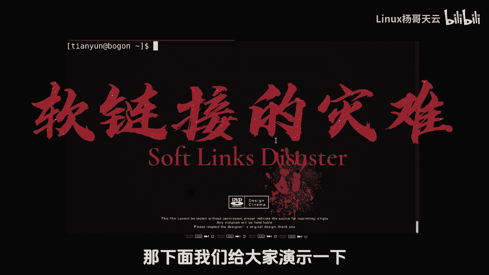
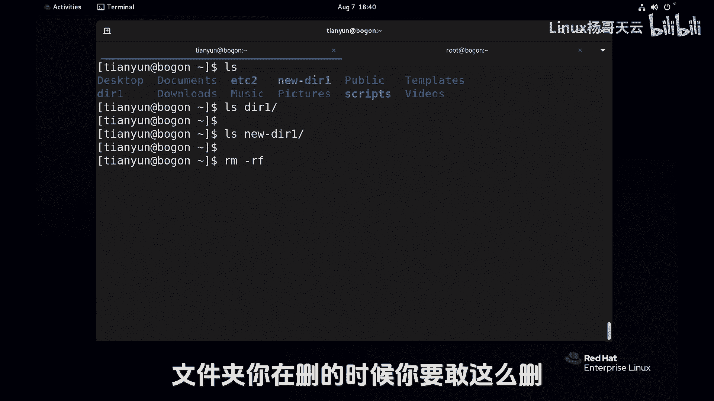
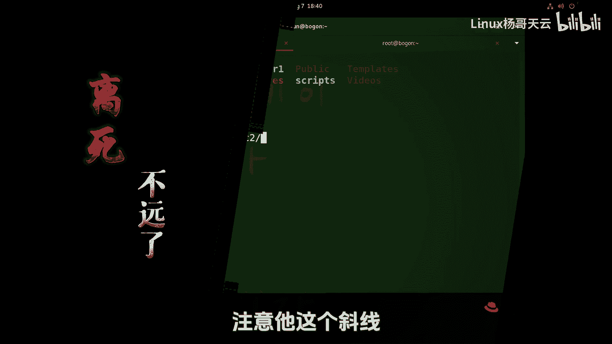
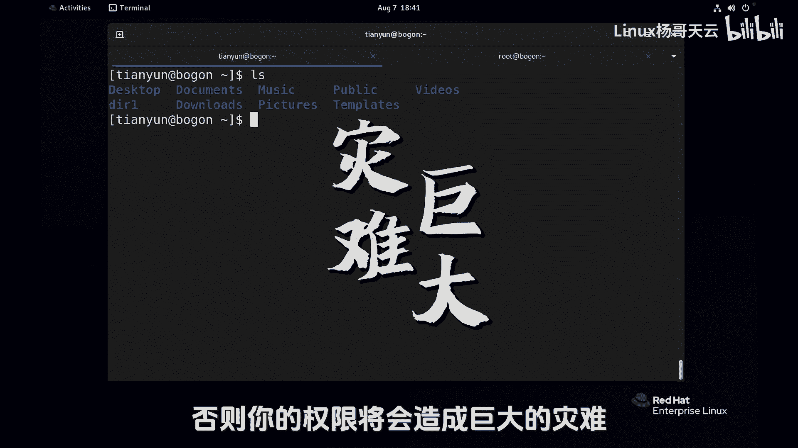
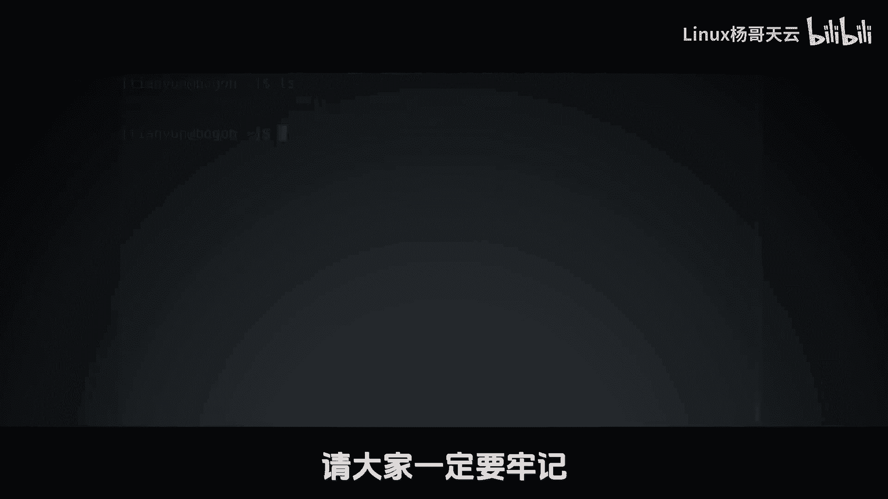

# 史上最强Linux入门教程，杨哥手把手教学，带你极速通关红帽认证RHCE（更新中） - P22：22.软链接的灾难 - Linux杨哥天云 - BV1FH4y137sA

下面的关于连接文件内容很短，但是如果你不知道的话呢，可能会是灾难，那下面我们给大家演示一下啊。

首先我们follow链接，大家知道是可以对文件夹做的，也是可以跨文件系统的，那我们就跟把etc这个文件夹连到这个，当前我这个位置，这是普通用户可以看到点到当前就叫EDC吧，叫EDC2，好。

各位看一下这边EDC2指向的是真真EDC，当然如果大家知道的话，可以LLLL杠DEDC2，各位看到了吗，一个斜线，一个不带斜线，显示还不一样，带斜线那个直接是D这个直接是L，先不管那些来现在干什么事呢。

这个符号链接删除怎么删呀，是不是直接删呢，我们看试一下RMRFEC2哇，他怎么就报错呀，各位这不就是链接吗，现在好像在删真实文件呀，我想告诉各位的是，如果说你是root用户，假如说你也做了这样一个动作。

EDC连软连接啊，符号连接连到当前，比如说叫EDC66，你看看会有个EC6，你要是刚才做了这样一个动作，EC6回车，那你可能会被开除的，我是不敢这么干的，为什么呢，看看效果，我们拿一个不相干的目录。

或拿一个内容不是很重要的目录，给大家做个演示，因为真入的用户太可怕了，幸好没有听大家的，直接敲命令回车好，那我们制造一个场景吧，我现在看看这里面有一个DIE的一个文件夹，里面有内容好。

我们该做一个符号链接，做过了是吧，做了一个6DIE，那就直接用它就行，6ti一样的内容，现在我们要干嘛呢，我们要删除这个符号链接，6ti1好，请注意看啊，RM杠F这个没毛病啊，回车是这样删除，对不对。

回车好痛快，没问题了，但是他发现这个6TIE怎么还在呀，不删了吗，但是呢请注意，看我们的DIE下的内容已经没了，6DIE里面内容呢也没了，所以说删除符号链接，就像我刚才一样，千万注意。

一定要特别注意这ADC2怎么删的，不是那么删的，我说的是目录啊，文件好说，特别是目录文件没有没有什么毛病，你随便删呀，我念加你在删的时候。

你要敢这么删回车，如果你还是入到用户，那你就离死不远了，注意它这个斜线和我们之前讲的还有点小区别。

这个链接文件，你不要把它看成是真正是一个目录啊，因为你一斜线table键，你过去哇塞，他就干到那个目录下面去删下面的文件了，所以删链接文件的时候，你这个软链接的时候，你要删目录的时候。

后面E1定不能有限限，因为我现在没有权限，所以我删也删不掉这EDC，但如果说你是一个管理员的话，你像刚才一样，你要删点ADC6，像这样回车，各位想看下效果吗，想看效果的话呢，我们也可以恢复一下。

你自己可以试一下，但我不想看效果了，我这么删就行了，老老实实规规矩矩的删就可以了，好特别注意你要删目录的这种软连接的时候，请大家注意不要加斜杠，否则你的权限将会造成巨大的灾难。

所以我专门拿了一小节给大家来，特别的重申一下这个事情。

