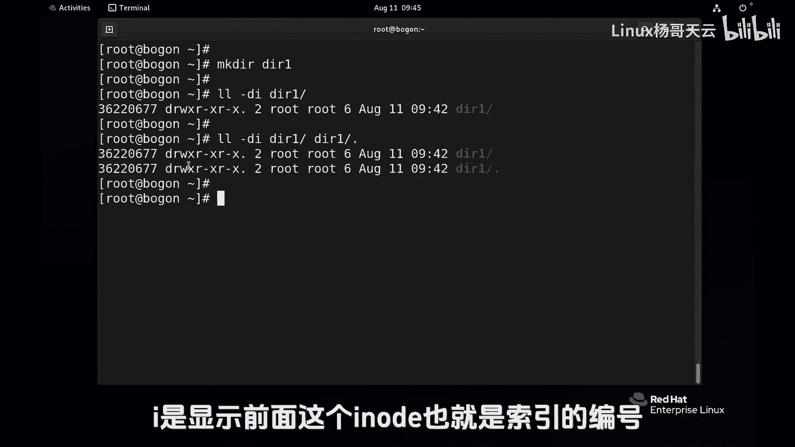

# 史上最强Linux入门教程，杨哥手把手教学，带你极速通关红帽认证RHCE（更新中） - P23：23.为什么根目录的链接次数是18？ - Linux杨哥天云 - BV1FH4y137sA

下面问大家一个问题啊，一起可以思考一下，我这套mini l l杠D跟查看了根的详细信息，注意这个位置，18这个位置这个数字它到底是什么，当然可以这样写，两个选项可以分开来写，也可以呢写到一起。

然后我们再看一下，大家知道根下面呢这是第一个目录啊，当中我是空格分开了，当然默认就有空格啊，跟下的比方说点点，大家还记得这个点点目录吗，它是隐藏目录，每一个目录里面都有一个点点的目录，还有一个点的目录。

而且呢还有一个跟下的点，这三个位置各位看一个是根本身，一个是呢根下的点点，根下的点好，大家注意观察啊，三个目录是一样的，他们的IO的编号都是128，我们看一下根下的，还有一些其他什么目录啊。

S根太多了啊，首先LL杠D，比方说根下的AFS它下面的点点呢是谁呢，其实也是根它下面的点点，就是它的上一级，这个点点呢也指的是根啊，我们把前面一敲上，我们要对对照来看根下的AFS下的点点好。

大家不要不要觉得有点乱，这是参数，这是跟这个目录，这是根下的点点目录，空格跟下的点目录，这是根下AFS的下面的点点点目录，所以大家不要觉得很混乱啊，慢慢的习惯就好。

大家发现跟下的AFSI的点点它也是128，它其实也指的是根，同样呢我们再往下走，表示根下的啊，put下的点点，EDC下的点点，media下的点点好，opt下的点点，root下的点点。

该下的size下的点点跟下的USR下的点点，跟下的DEV点点，pom下的点点是MND下的点点是PLC下的点点，还有run下的点点，SRV下的点点，tn b下的点点，还有一个是VR下的点点呃。

回车以后可能显示内容比较多，我这边如果没有答错的话，应该把所有都列出来了，你看这些目录下的点点都是都是什么128，也就都指的是根，这个是根，这下面点点是根目录，下面的点也是根目录。

所以呢我们这练习次数细数下来呢，好像有点不太一样，应该是19个，我们用一下后面我们要学到的知识管道，给WC统计一下L啊，这是19个，但实际上呢我们知道这个位置呢，是这个是18根，实际上是特殊的。

因为根目录的跟别的目录还是有点小区别，虽然说我们感觉这三个应该是三个，这下面的应该是16个，16个加上面三个应该是19个，但实际上呢这个根呢比较特殊，它的这个根目录本身应该是不能算的。

所以它其实只有两个，但是其他目录呢我们再来看一下啊，现在大家记录是18个对吧，我们在根目录下面注意我这边是管理员啊，在根目录下创建一个die目录LL杠D杠D，然后根大家应该能猜到这变成了19。

为什么是19呢，也就是说在这下面的DR一下面，它也有一个点点，这个点点是谁呢，就是根目录，所以变成了19，看到了吗，那如果删除一个目录，也就是把这个目录删除RFDR1，别删错了啊。

因为这是管理员一定要小心好，删除一个目录，这个时候呢就变成了18，那现在呢我们再给大家举一个例子啊，你看如果我现在新建一个目录，就在这创建吧，叫做DRE，我们想要看这个目录的信息。

大家可以猜一下这个目录呢，它的那个链接位置是几呢，可以把打在屏幕上啊，杠D注意看目录一定要杠D，如果你不加D呢，那就直接看它下面的，至于后面这个斜线有没有，那都无所谓，加一个I的选项吧。

反正一会也想也想用好，这个数字很很大，因为这是个新的，人家为什么排的比较早啊，128，那是因为人家先来的系统创建的嘛，我们这个都比较新的好，你别管这个速度是多少，总之呢这边是二，那为什么是二呢。

因为这个目录本身和这个目录下面的啊，大家一定不要注意这个斜线，这个斜线呢是我不全的时候造成的，有没有都可以，一个是DR1，一个是DI1，下面的这个点儿点儿，这个目录点目录我们说一直是自己对吧，好回车。

大家看到他显示的就是两个，每创建一个目录呢，它的这个连接次数呢默认就是两个，因为它下面如果还有新目录，这个次数也会发生变化，但有同学说我们之前讲到的这个链接，好像不能针对目录是吧，只能针对文件。

当然一年级还有一些别的限制，比方说不能跨分区，跨文件，系统不能针对目录什么的，但是我想说的是呢，有些东西呢应该是系统保留的，这个默认我们是不可以做，但是系统是可以可以使用的，所以呢在这个位置。

大家注意到联系次数，就是跟这个目录的一些点和点点相关，所以再次我们也看到了，那个点和点点到底是什么点儿，是自己点点是什么，是这个目录的上一层，也就上一个目录好，这个大家可以测试一下，去查看一下。

别忘了加这个DD选项，因为只有D选项呢才是查看目录本身，I呢是显示前面这个i load。

