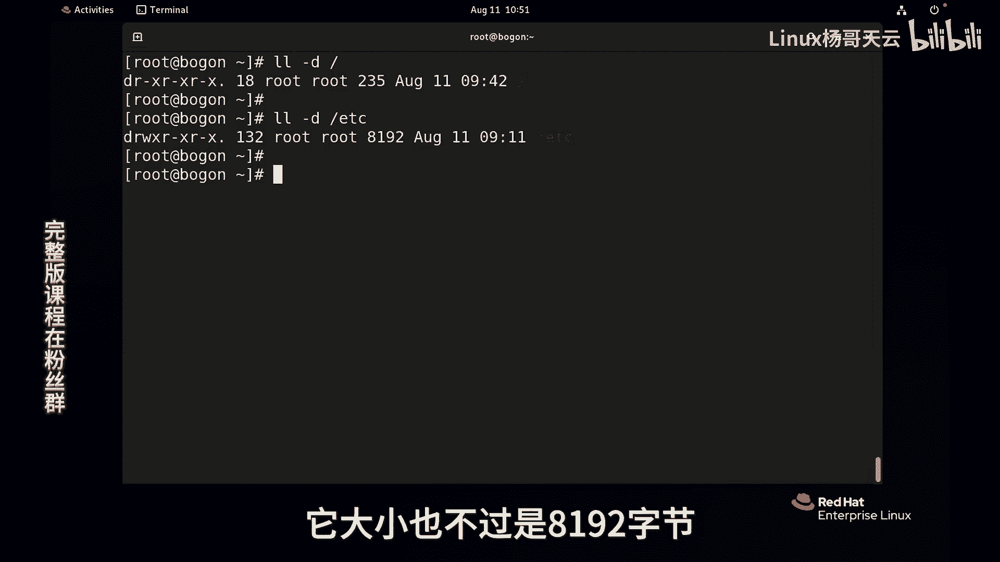

# 史上最强Linux入门教程，杨哥手把手教学，带你极速通关红帽认证RHCE（更新中） - P24：24.文件管理-为什么目录反而没有文件大？ - Linux杨哥天云 - BV1FH4y137sA

下面我们再考大家一个点，就是为什么在LINUX里面，我们看到的目录的大小要比文件要小。

比如说我们来看一下根目录，它应该是很大，它包含了下面好像所有所有东西，我们来看，实际上呢现在显示它才235个字节，当地呢是我们一直强调的看目录的信息的时候，一定要加当地。

不然呢看到的是它下面的一些文件信息，我们再来看一下EDC这个目录，它大小呢也不过是I192字节啊。

这里呢给大家多说一个选项叫做H啊，这个选项呢是以人类可读的方式，人性化的方式，比如说你要是不加这个H的，它就是显示字节可能是几万几10万，那如果加H以后呢，它到达K到拉点更高的一个单位兆。

或者说G那它就会显示换算成相应的单位，这个就是人性化的方式。

好这个不多纠结，回到我们的主题，为什么目录这么小，那我们就要来说一下目录到底是什么东西。

大家可能在windows里面呢，我们去点开一个目录，点右键属性，我们会看到一个目录很大文件夹。

它包含了下面所有文件的，这个整个内容的一个大小的集合，但是在LINUX里面呢，我们如果单纯的这么看呢，其实不对的啊，或者是大小显得很小，在前面给大家讲过，LINUX1切皆文件。

有好多同学认为这个目录是个什么东西呢，也就是文件夹，这个文件夹呢好多人认为是个小抽屉，里面还可以装装很多文件，好像这个抽屉要很大很大才可以，其实不是这样的，LINUX的这个目录呢它也是个文件。

它里面到底装什么东西，比如说给大家看一下啊，那现在拿我们跟这个目录，刚才我们讲它的很小，235个字节，那这个跟这个目录，它远远比下面的文件要小得多，我们拿EDC来讲吧。

EDC这个目录EDC杠D这个是8192，也就是8K，但在下面的文件呢，比方说我们看一下password，或者看一下EDCR的service，这个文件好，这是我随便去找两个文件，注意看文件的大小的时候。

可以不用加杠杠D啊，H加上吧，好各位看到这个password文件啊，是没有EDC大，这个677K呢，比我们的EDC大多了，按常规来讲的话，那个EDC应该这是既然是个文件夹，是个小抽屉。

那应该包含了下面所有文件大小啊，但实际上不是，那文件里面装的是什么呢啊，就目录里面装的什么东西呢，我们给大家讲一下，首先有点像我们这本书的目录，我们打开书以后看到这个目录，目录里面呢有这个。

比方说这章这个章呢就是目录的名字，下面的每一章还有很多小的子的那些小结，相当于文件，但是不同的是呢多多少少是有区别的啊，后面的编号页数跟咱们这个有点小区别，比如说ABC我们看看我们加一个杠。

I加一个选项，那它会显示ED所有文件，一个这个索引号，一个hello的号啊，当然这个内容可能很多，怎么办，我们先用一下管道吧，用一下lets这个mini就是分页显示啊，回车一下，这里面你看有很多文件名。

这是文件名，这是那个对应的一个i load号文件名，i load号文件名的i load号，那我按空格第一页啊，看第这是第二页，第三页，第四页，第五页，第六页，第七页，第八页，第九页，十页，十一十二好。

12页，这12页也就是我们所看到的这个内容，那么也就是说，根下的这个EDC下装的是什么东西呢，我们就看前面的十行吧，啊，这这个命令我们在后面会讲到管道，给另外一个命令啊，其实这个命令单独来讲的话。

我们都认识的就是我们的EDC，在我们的眼中看它是一个目录，我们讲目录也是文件，在LINUX里面一切皆文件啊，不管是硬件还是文件目录啊，都是文件用我我开玩笑的讲，把你放在LINUX里面，你也是个文件。

这个文件里装的什么东西呢，它装的是这个，我在这里写一下啊，当然是它文件名对应的IO的号，也就是EDC，它本身是一个文件，只不过呢在我们的这个看来呢，它是个目录啊，它里面就存的是文件名IO的号。

文件名IO的号文i load号，大家看是不是有点像我们输的这个目录啊，输入的这个目录里面的一个一章，紧接着呢里面的小结还有了对应的一个啊，文件的一个IO的号，但是我刚刚讲的有一点不同，书后面那个数字呢。

这那个目录里面那个这个数字呢，它指的指的这个位置和我们这个不太一样，我们这个是文件的一个IO的号，而书那个是后面的实际内容，这个大家呃区别一下啊，不要太纠结，我说的是相似啊。

那也就是说etc这个文件里面其实就是放了，刚才也没有多少个文件的信息，文件名i load，文件名HELLOAD，文件名i load，所以文件夹实际上呢是不大的，声音很小，如果我们LLL杠D看到的呢。

就是这个文件本身的大小，它不是我们心目中整个文件夹包含内容的大小，它只是这个文件，各位想一下，我们这个输入前面的这个目录，前面这个目录一个小结，它能占多少地方呢，它本身就不大，对不对。

那如果想要看文件夹整个大小怎么看呢，我们可以用另外一个命令，这个命令呢我们也提前给大家用一下DU，这个命令DU然后后面加上etc，当然如果这样回车，它会显示这个目录下所有文件，每个每个每个的大小。

这个有点有点多啊，我们可以试一下啊，它会显示这里面的每一个文件的大小，如果显示整个你可以汇总一下summary size，也就是把他那个整个汇总一下，这是26888，同样这个字节数我们不好辨认。

我们可以加一个H，这样的话我们看到的才是这个文件夹，连同下面文件的整个大小，不是这个文件夹大小啊，这个文件夹它就一共是多少多少呢，杠D这个文件夹本身大小才有8K，但是它里面装的内容呢一共有27兆。

有人说这怎么装进去的，刚才不是说了吗，书前面的这个目录它能占几页纸，它的内容远远不如后面的实际内容大小大得多，所以不要错误地认为文件夹一定就比文件大，或者说它是个什么小抽屉。

不是它里面只是存的它下面的它下面这一层，而且它下面下面下面的那一层都不存，它只存的是它下面这个的文件名儿，和IO的一个列表。

