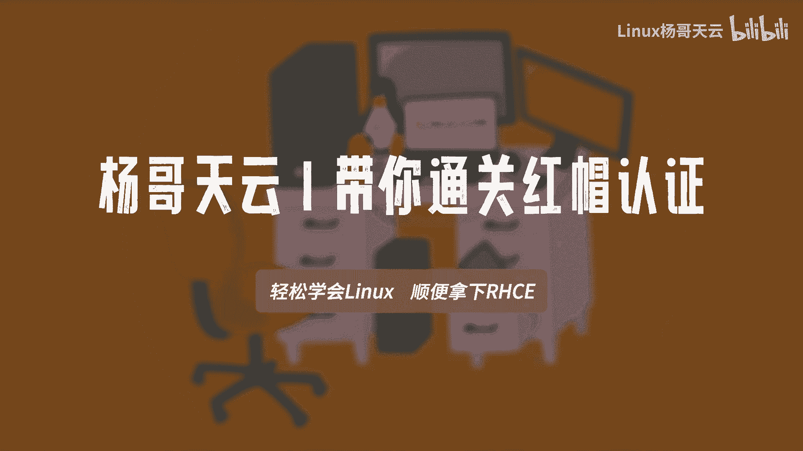
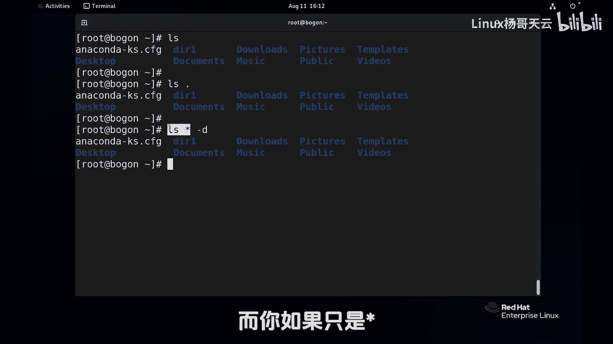
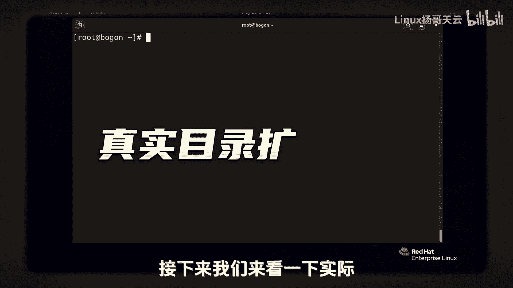
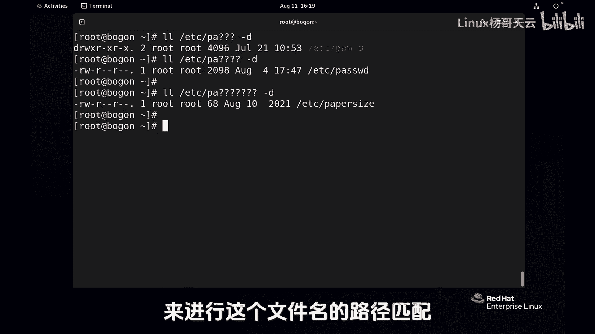
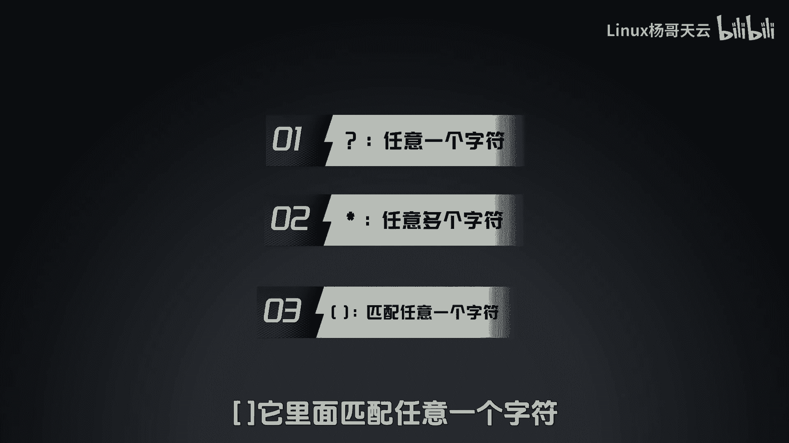
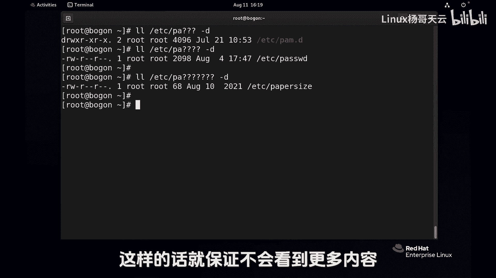

# 史上最强Linux入门教程，杨哥手把手教学，带你极速通关红帽认证RHCE（更新中） - P25：25.使用Shell扩展匹配文件名-路径名扩展 - Linux杨哥天云 - BV1FH4y137sA

要想提高linux shell的一些管理效能，必须要了解shell扩展。

那包括呢大括号波浪线以及的变量扩展，还有就是命令替换以及路径名扩展，那这些呢可以帮我们去完成一。

些比较复杂的任务，同时提高工作效率，首先我们先来看一下这个路径名扩展，这里面会用到像星号编号，还有呢方括号这几个特殊的一些字符，大家在学习的时候呢，一定要注意，尽量要保持和我当前的环境是一致的好。

目前我们现在是一个干净的状态，并且呢指的是管理员，首先呢建一个这个测试性的目录啊，比方说叫DR1进到这个目录里面去，为了这个去学习呢，我们先建一些测试用的一些文件，比方说file1或者是file2。

file3或者file一点t s t file2点TXT，file3点TXT，而file a点TXTFB点TST好，这效率太低了啊，没关系啊，我们就先这么这么做好，然后再建一个呃杨杨哥点TXT。

杨哥点log啊，就是随便建立一些文件，我们先准备一下我们的一个场景，下面呢我们就来看看如何使用，那比如说我们现在要查看查看file1file2file三啊，这三个文件，然后我们可以呢像传统的方式。

file1file2好，file3去去显示一下没问题，但实际上呢可以不用这种方式，可以呢使用file我们可以查看l l l file，后面呢我们可以用到一个首先一个问号。

这个问号呢它是一个很特殊的一个字符，它表示的是什么呢，表示的是就一个任意字符，就在我们的路径路径与这个扩展里面，表示的是它是一个任意字符，那大家想象一下，我会列出哪个文件，或者我会对哪个文件进行操作。

也就是一共加fail，后面呢还有一个字符，很显然上面应该是满足的呢，也就一共三个，如果我使用呢它一个问号就一个字符，像这样写问号，问号肯定加LLL，我们就LLS吧，少小显示一下。

那同样呢它会列出一共是五个字符，file f i l问号问号一个问号，大家注意是一个任意字符，它表示的是一个任意字符啊，还是一样没有错，那除了问号以外呢，我用的比较多的可能是星号，比如IOS。

然后file新，大家看一下这个新号，刚才问号就不太一样了哈，这个星号它指的是什么，是任意多个字符，不是一个问号，它就指的是一个，而我们的信号指的是任意多个字符，那么多个字符呢，这哪些文件会出来呢。

应该是file开头的都会出来，好大家看看这个呢指的是以FILE开头，后面是任意字符，当然也可以呢，可以信号在前面，比方说新点TST啊，这样的话呢所有TT都出来，那表示新点log，那所有log的都出来。

这个新号看你放在哪边，也可以使用两个多个也行啊，比如说前面是新当中有A的吧，后面呢也是芯儿好，这当中有只要有A的，前面的无所谓，这信号用的比较多啊，第一种最常见的用法就是这样的file。

新或者什么什么点TXT，那如果我们要对文件进行批量的删除的时候，那我们就可以使用这样的方式，比如说RM杠RF轻点TST，这个现在我们先不删，我们等会再删，我们还没有讲到别的一些这个扩展扩展的方式。

另外还有一个就是那个方括号，有这个符号好，我们先看看当前的这些文件吧，LLOL啊，比方说file反括号，这个也是可以放到前面或者后面的哈，大家猜一下啊，比如一二，这是什么意思，最后会显示什么。

会显示file12吗，当然我们现在也没有file12对吧，也没有这样一个一个文件，那到时候反显示file1还是file2呢，看看结果file1和file2，那方括号呢他就跟那个星号不一样。

它不是任意字符，它必须是我们这里面指定的字符，注意是一个不管你写几个，你就写上三四或者A这样的，那回车以后，这里面呢只有一个字符，方括号指的是匹配的是什么，方括号里面任意的一个字符，可能是一，可能是二。

可能是三，可能是四，可能是A那如果说是这样一个符号呢，各位看这个指数符号，注意它是在方括号的里面，那这个指的就是不是一二，正好跟上面这个是反着的，上面这个是呢匹配这个方括号里面其中一个。

而下面这个指数符号它指的是反向为一个选择，不是一二的，那就file3，注意这个尖呢它不是针对一啊，它针对的是这里面的所有字符，不是一，也不是二，那就是三，对不对，它只匹配一个字符，另外一种用法呢。

这个也可以叹号号的用法了，大家看到他跟这个是一样的，或者我们把这个改一下，当然很少用这个这种方式啊，我推荐大家使用的是那个尖号，就是指数符号，叹号和这个指数符号都表示的是，不在这个方括号里面的字符。

正好和那这个是反向的一个选择，这是三个符号，大家注意，一个是问号，一个是新号，还有一个是呢方括号，其中呢以这个星号用的是最多的，方括号呢当然也也是比较常见的啊，啊问号呢我个人用的还是少一点。

刚才我们L了S啊，大家觉得没有什么意义，那就采用这个方式吧，RM rf好，这样我们今天在操作的时候，我加个V吧，V实际上是不需要的啊，在前面也给大家讲过，V是干嘛的呢，V是能够显示整个操作的过程。

实际上我们是不需要看到的，比方说这个file12弹出两个文件对吧，好开大S看一下删除新点TST，OK这个应该差不多删的太多了，那我问一个问题啊，各位IOS如果是仙儿会怎么样，当有人说这个没有区别吧。

这个哦好像是没有区别，但实际上啊各位这个是一定是有区别的，这个新它指的就是呢任意字符，那这些文件那都属于这个新呀，但是我们现在如果回退到别的目录，我们再看看呢，这个可能就发生变化了啊。

比如说我们退都退到这个家里面来，请大家想一下，LOS星和上面的这个mini，显示的结果会不是一样的，有时候大家会发现啊，一看就会一自己一学就废，往往很多都是这样的。

因为有时候老师给你举的场景是特定的场景，但是我们实际上人呢是不可能在特定的这种，真空当中生存生活的，所以大家一定要用到真实情况里面去，下面呢我就给大家看一下，这种路径扩展的一些。

可能让大家比较纠结的地方，好会说了，各位啊，结果不太一样，这这显示的这个格式好像还不一样，这是为什么呢，它不仅如此，大家注意看，他还把这个DR一下的files，三扬格点log都显示出来了。

这其实是没有错的，各位为什么呢，因为LS这个命令和下面这个命令呢，其结果不一样，如果是IOS相当于它只是看的是当前目录，他跟的是个目录名，相当于LLS等价于LNS点二，就是当前这个目录。

它只会显示这个目录下的内容，它不会显示这里面内容怎么讲呢，比如说如果我现在IOSDR1，那它会显示DR1，还有DRE下面的内容，特别是还会显示DR一下面内容，所以呢这个结果呢可能就不是我们想要的。

你这个新号呢，它包括这个文件，刚才因为我们给大家做实验的时候，是没有目录的，是没有文件夹的，这个信号同样会匹配到DR1，所以结果呢就相当于这个命令，也相当于呢这个命令，那自然就会显示这个目录下面的内容。

所以大家要注意，那怎么做才不会有这样一个特点呢，我不想看到它下面的内容怎么办呢，大家还记得刚D吗，刚D写在前面也可以啊，没错新号它是会匹配这里所有的文件，包括目录，而我不希望我要看到目录下面的内容。

所以我这边就使用了杠D，杠帝的意思是说我就看目录本身好，这个结果是一样的，虽然说大家看到这三个命令的，结果呢好像是一样的，但是大家都清楚，IOS实际上呢它就相当于L点当前目录。

那么只显示这个目录下面的文件，就不再去显示那个DRE或者说music下一个内容，而你如果只是新。

那就会这样好，有同学觉得很懵，那下面呢我们具体给大家看一下一些例子啊，接下来我们来看一下。

实际呢一个真实的目录的一些扩展的一个操作，好我们就拿EDC目录来说，各位看一下EDC目录下呢有很多的文件，也有很多的这个目录啊，这个比较符合真实的情况，我们要来干嘛呢，要来这个列一下EDC下的pa星。

什么意思呢，我要去找到EDC下的以pa开头的，后面是任意的，大家看到发现怎么不是呢，怎么好多不是我们想要的，完全就蒙圈了，看这个好多都感觉不是我敲的，这个是这个是这个是它也是，但是呢这下面的不是。

这就是我刚刚所说的那个问题，因为它是一个目录，你这个星呢它匹配到它以后，相当于l l e t c palm点D，那自然就把下面的文件显示出来了，这大家能听明白吗，所以不要觉得哇怎么好像不送我们想要的。

因为你看这种显示的风格，它都是这样的啊，他这边呢有一个冒号什么什么，下面呢其实是带过来的，那怎么办呢，刚才我讲过，我们可以使用杠T写到前面也可以啊，如果是文件，那不用说，那肯定就是pa开头的。

后面跟任意的，如果是目录呢，也是pa什么什么的，那我就不显示里面内容，我就显示目录本身就行了，注意到了吗，这全是pa什么什么什么什么星好，一定要加杠D，因为那里面有目录LLL目录的话呢。

它就会显示里面内容，同样道理呢我们可以比方说使用这个pa啊，问问问啊，那你要是不加杠D的话呢，同样也会犯这个错误，没事你把这个杠D加上，反正也不会出毛病，你要不加的话啊，看看他又是这样的。

因为你匹配到了，匹配到了这个pm点D这个目录，它最后就相当于把这个目录看了，把里面内容也看了，所以加杠D呢没有毛病，我们也可以呢，这个多几个问号呢，点pa4个问号或者五个问号，当然现在可能没有那么多啊。

如果匹配不上的话，像这样没问题，所以我们在实际看的时候呢，大家注意，因为实际呢我们对文件这个扩展的时候，如果你不想看下面下面的内容，目录下面内容，那你就加上这个，当然你有也有可能很明确的。

就是我就要看这个目录下的内容，那你就不要加杠D啊，看你需求，这就是我们在shell的文件名扩展的这一块了，来做这个路径的一个匹配，我们用到了几个符号，一个十问号，它指的是任意一个字符。

多个问号的话可以连用啊，但前前后后那都可以根据你的情况来进行，这个文件名的一个路径的一个匹配啊。

还有呢星号任意多个字符以及呢方括号，方括号呢它里面匹配任意一个字符。

或者是反向的偏好，以及呢叹号，同样你在实际的使用当中，如果说不想匹配到那下一层，那你就加一个D啊，这样的话就保证不会看到更多内容啊。

