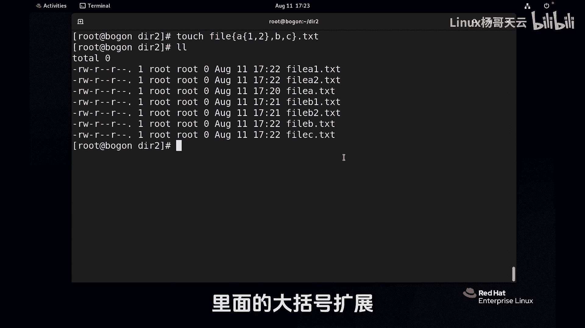

# 史上最强Linux入门教程，杨哥手把手教学，带你极速通关红帽认证RHCE（更新中） - P26：26.使用Shell扩展匹配文件名-大括号扩展 - Linux杨哥天云 - BV1FH4y137sA

我们继续来看一下，是要扩展，下面呢终于轮到我们最喜欢的大括号生产。

首先准备一下场景，我们找一个空目录，随便一个啊，这个倒是没有关系好，这个目录现在发现什么都没有，比如说我们要创建file1到file10这一堆文件，以前呢就是这样打的，file1file2等等等等。

打了很多，其实呢我们可以使用大括号，它这里面只是两种两种写法啊，一种是呢这个点点它指的是一个范围啊，那这个结果我们看看非常简单，FIL1到FIL10很高效对吧，同样的如果我们我们使用这个字符哈，A到Z。

注意不是A杠Z啊，这个我们看看FA fb fc fail等等等等，反正反正很多还可以支持什么呢，比方说AAN个BB第2TS好，注意前面那个是一个点点，它指的是个范围，这个不是范围，这个逗号隔开可以多个。

甚至可以多个CCDD，那结果我们看看有扬哥AA，扬歌BB，扬哥C啊，杨哥dd，所以这里面一共是两个符号，那么这么用的话，可能大家觉得也挺爽啊，也比较简单，实际上呢可以再扩展一些，我们做一个这样一个拷贝。

我们找一个路径很远很远的文件，在哪儿无所谓，我们准备拷贝这个是之前的mini哈，etc csconfig glider work这个文件，哎，看起来这个确实很远，我们这样想想。

拷贝成为cs configure like work，点back啊，这就是换了个名，那现在我们就要考这个，不过你看说的好长好长这一串啊，那能不能简化一点呢，还真能，因为这两个参数有一部分是相同的。

这前面这部分是相同的，那相同的就留一个就行了，看一下来，我们把这个相同的不给留一个，如果说你觉得那个别扭了，我们可以加个VV，那它就是想显示一下详细过程好，那相当于逗号隔开了一根木头，锯。

一刀变成两段逗号呢隔开以后是两个参数，前面这个呢参数是空的，你可以认为逗号前面呢这个是就这一段，后面的是什么呢，是它加上点back，那这样的话你就做了一个非常简化的，这样一个动作，当然拷贝也行。

改名儿也行，总之就是对文件这种操作路径的操作，这种都可以，所以大括号呢非常的实用哈，这种用法大家必须看得懂啊，那下面呢呃我们再来看看大括号的一些用法啊，稍微扩展一下，比方说touch。

像这样AB然后是一二啊，当然还可以搞个范围啊，后面甚至可以呢像这样点点点点搞一个简单点，简单就下逗号呢点TSC，各位设想一下这个结果是什么，结果应该是file a然后A1点TXT。

file a2点TXT，然后file b一点TXT和file b2点TXT，是这样一个一个效果，那我们再来给大家做个演示啊，清一下屏touch，比方说A这里面再嵌一个一二，再加一个逗号BC点TST好。

大家想象一下这个是什么样一个结果，一共两个逗号隔开了三段对吧，按理来讲应该是file巴拉巴拉这一串for file b file c，这个大家都能明白，但是呢这边不是file a是file a1好。

file a2点DST好，看看这个结果，看是不是file a1，file a一点TXT，fail a2点TXT，然后是file b点TXT和fail c点TST，这就是大括号啊，你随便组合。

主要是这个你需要的，总之我们这个大括号呢，它在整个路径的这个匹配上非常实用，而且大家记住一个是点点是个范围，一个是逗号，一个逗号隔开两个参数，再一个逗号呢第三个参数。

而且呢确实能够帮我们简化很多的一些动作，这是关于我们的shell扩展里面的大括号扩展。

