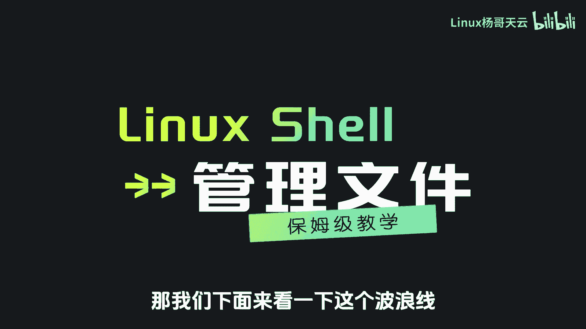
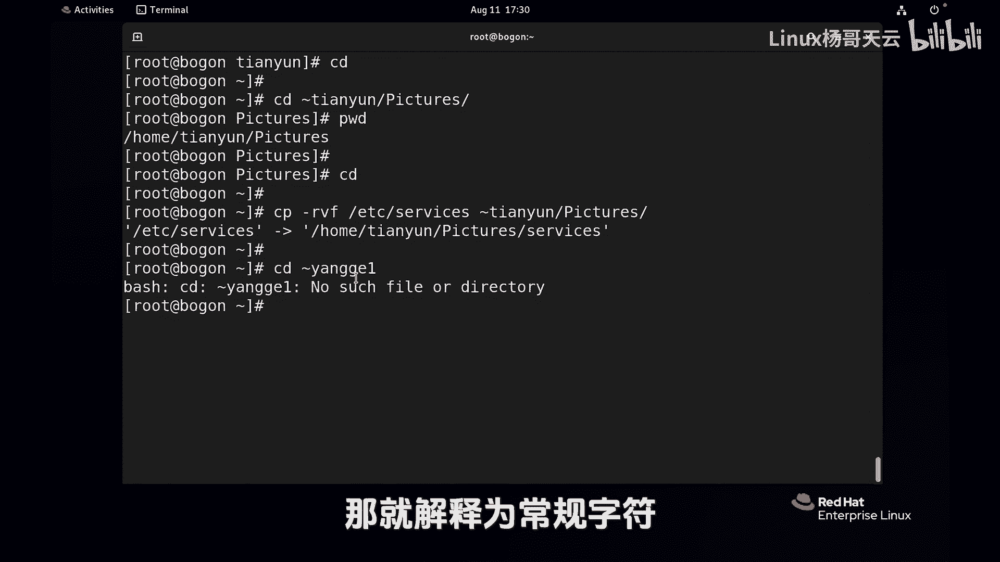
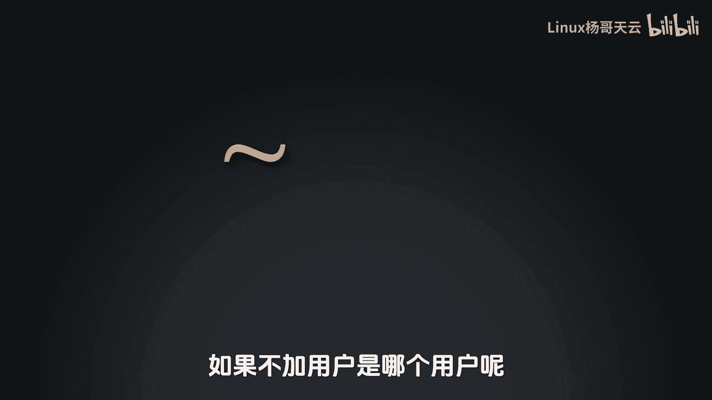
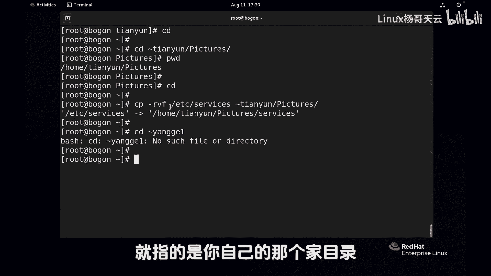
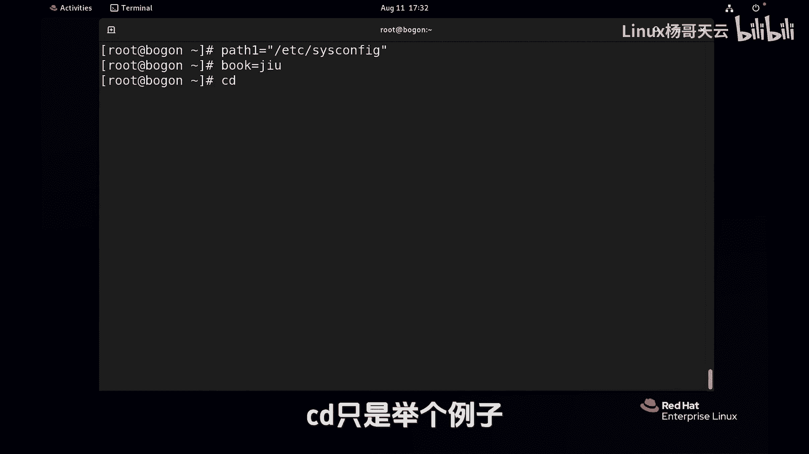
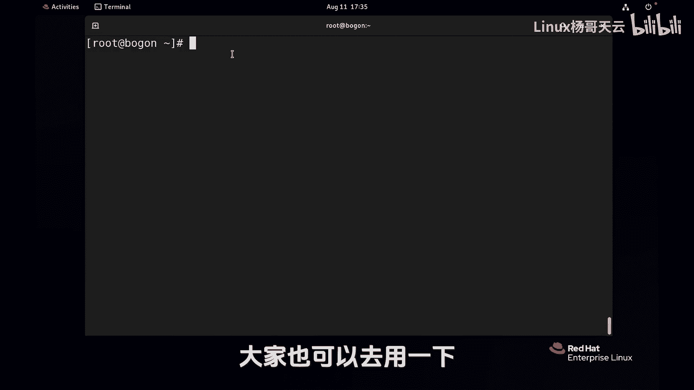

# 史上最强Linux入门教程，杨哥手把手教学，带你极速通关红帽认证RHCE（更新中） - P27：27.使用Shell扩展匹配文件名-波浪线扩展 - Linux杨哥天云 - BV1FH4y137sA

我们接下来再看shell的扩展，那我们下面来看一下这个波浪线。

这个实际上大家之前已经是用过的啊，比如说CD波浪线，这个波浪线呢它实际上指的是用户的家目录哈，那比方说我们要CD到某一个用户，比如说波浪线root，他会解读为呢这个是这个用户的加。

那就会进到这个用户的家里面去，当然本身就在这没什么可进的，但我记得我们这个系统上还有个用户叫天云，那我们cad波浪线天云，由于我们是管理员入的用户，我们想去哪儿就去哪儿，没问题。

这个时候呢我们来到了home下的天宇，这个目录天语下面实际上还有别的目录啊，比方说这是我们之前有创建过的哈，有一个叫DR1，或者有个别的目录，如果没有的话呢，你就换个别的目录。

比如说这个picture这样一个目录，我们进入下这个目录看看啊，这里我们先回家贴地，然后波浪线天云用户，前面呢就已经指的是天云用户的加目录了，加目录下面的这个pk角目录，那我们不仅是CD啊。

我们在进行文件的拷贝啊，什么的时候都可以，比如我们将etc下的这个service文件拷到这个位置，波浪线填云用户加下面下面的我们就乱考一通，跑到这来加一个小V看看效果啊，没问题。

所以我们在进行文件操作的时候，也就是这个涉及到路径的时候呢，波浪线可以匹配，当然如果这个用户不存在，那就麻烦了，那比如说CD到严格一没有这个目录，他找不到，他就解解释不了，他就以为没有这个目录。

那就解释为常规字符。

这样结果呢就正确了，所以波浪线它后面是一个用户名，如果不加用户是哪个用户呢。

不是root用户，是当前用户，就是你当前是谁，那那个波浪线呢就指的是你自己的那个假目录。

所以我们很多时候是可以这样去用波浪线的，扩展好，这是关于波浪线，接下来我们再接着看一下变量扩展这个变量吗。

但凡是学过开发的同学都应该很清楚啊，他有两部分变量的这个名字和变量的值，比方说pass1路径一，我们定义一个变量是etc cs config，最好是给这个变量呢加一个双引号，因为我们这里有特殊字符串。

特殊的一些斜线什么的，当然变量不见得一定要用目录这种方式啊，你可以像这样book定义一个鬼音，真经不会拼，就就这样，这样的话定义了一些变量，当然我们现在呢，比如说我们想要去到这个目录里面。

那我们可以去CD一下，并不是说必须CD啊，你干什么事，你对文件操作都可以，CD只是举个例子。

那想用到这个变量，那就要用到一个dollar符号，后面加上这个变量的名字。

可以使用大括号，也可以呢不使用大括号啊，就可以像这样直接使用pass1，这个变量也可以呢使用一个大括号，把它给括起来，像这样欧式呢去引用这个变量啊，现在我们先不用打括号了，看结果。

那我们进到dollar pass1，它就会显示为哈，就是后面这个变量的值，这是我们定义好的吗，那这个路径就可能很长，那我们就直接CD到里面去，我们在进行文件操作的时候。

包括我们再回来拷贝EDC下的service吧，拷到pass1这个里面去好了，各位看是不是这样的，当然我们这个变量啊，刚才是我们自己定义的，也可以去显示一下变量的这个值吗，pass1它就是这个内容。

艾克一下这个book啥玩意儿，不是啊，我本来想学九阴真经，结果弄不出来，这就是关于变量的一个扩展，当然这里呢有一些变量是系统自带的哈，我们叫做环境变量，就比方说有一些变量是什么呢。

user name它指当前用户，还有呢像那个host name这个主机名现在没有改，这个主机名，好痛苦啊，我把它改一下吧，不然的话我们虽然还没有学过这些命令，但是改一下也没关系。

Set hostname，改一个名叫做web一点杨哥点com吧，这是永久的啊，这个命令大家不要过度去纠结，从字面意义上也可以看出来，这个命令呢作用是将主机名改成这个，但是现在有同学说没有变啊。

你得关掉这个终端再进来才行，下一次我们在讲课的时候，我在开终端的时候呢，应该就是个名了哦，这就是变量扩展。

