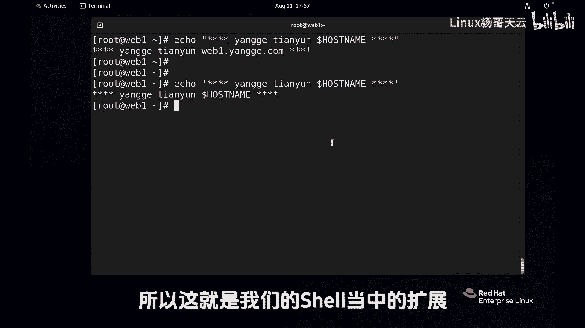
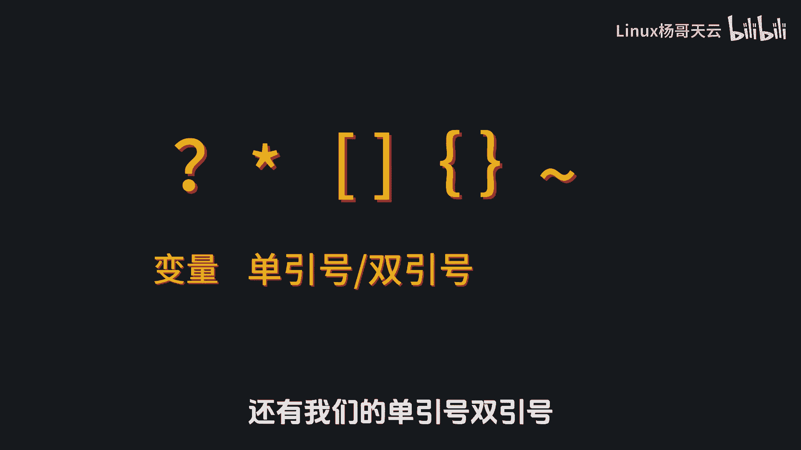
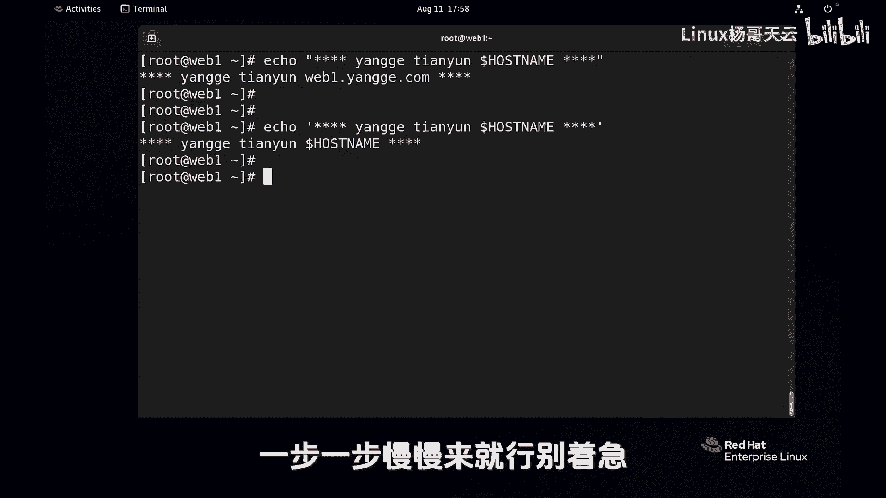

# 史上最强Linux入门教程，杨哥手把手教学，带你极速通关红帽认证RHCE（更新中） - P28：28.使用Shell扩展匹配文件名-变量替换 - Linux杨哥天云 - BV1FH4y137sA

各位小伙伴，我们继续来学一下这个shell的扩展。

在前面呢我们把主机名改了一下，所以当前主机名变成这个了，下面呢我们来学习下命令替换，比如说我们要创建一个文件，以当天的日期命名，特别是我们在做数据库备份的时候，我们希望这个备份的程序脚本。

能够给我们按照当天的日期，生成一个什么什么什么的文件，这个时候就要用到命令替换，因为你不可能在脚本里面，把那个当天的时间写死啊，你你写死的话呢，人家每天都要备份，怎么写，我也我也不知道。

所以我们可能就要写成一个，获取当前日期的这样一个方式，记得还有同学在之前的评论当中说，这个通过data命令获取日期啥的没有用，那其实有用的，比方说data我们用加号百分号R几点几分。

百方F呢是当前的时间日期啊，2023年8月11号，OK那我们现在想创建一个文件呢，就叫做什么，这个日期我说了，你不可能这么写，特别是脚本里面，你不可能写死，你肯定要用到这个秘密。

加百房F点EAK我们想要这个效果，但是肯定不能这么写，回声是不对的，它会解释为好几个参数，但也不能引起来，这个时候我们是希望以这条命令执行结果，来得到这个当前的时间，那可以用到命令替换，在早期啊。

用的是这个反引号，这个不是引号啊，是反斜点，现在呢由于这个怕引起误会，特别是和单引号产生混淆，所以官方是不建议这样用的啊，那我们就要用到这个dollar，后面呢使用一个小括号，大家看一下。

首先正常的命令我们很清楚，执行完以后，他得到的是二零238月11，那明天再执行的就8月12了啊，对不对，这后面的名字呢，是我们自己按照我们的需求来定的，回车大家看下结果啊。

这个时候创建了一个20238杠，幺幺杠，这都是我们自己命名的一部分，只不过这一段取了我们的时间，就是这个括号里面可以放任何的命令，当然刚才我讲过，在早期的时候呢。

用的是这个反引号来代替dollar小括号，那这个结果也是一样的，我们看一下一样的，那这里呢不建议大家使用这个反引号，因为可能会带来一些麻烦，所以这个dollar小括号里面呢一定是一条命令。

而这条命令呢那结果就是你想要的啊，比如说data加百分号F，或者说你要用到月份呐，用到星期啊啊，那就可以使用data，加什么什么什么这样一个方式好，这就是命令替换，可以换成你想要的那个命令。

另外呢我们会讲一下这个反啊，反斜线啊，转义字符，这个转义字符呢怎么讲啊，我记得我们有一个变量叫host name，首先这个dollar符号出现呢，它这个表示的这就是一个变量。

当然变量的引用可以写成这种形式，这种形式其实最最规范一些啊，如果加一个斜线，这个dollar的符号的意思呢就会发生变化，也就是说这个反斜线它的作用是什么，防止扩展，你想成成腰是吧。

那你变不了我这个斜线好在你跟前以后，你想变变不了，你不能够去变化，当然你要离远了就不行啊，你不能说这样是肯定不可以的，所以反斜线要跟在特殊字符跟前，它只转移跟前的那个字符，再举个什么例子呢。

如果我们现在要创建一个文件，叫杨哥点TT，它这个名字很别扭，这个大家可能觉得是两个文件，其实我想要创建一个文件，这里面带空格了，那如果现在这么回撤下去呢，肯定想都不用想啊，两个文件一个是这个。

一个是这个，那我要的就是这个文件名带空格，但有多种方法可以解决这个问题，一种方法就是使用引号引起来，把它作为一个整体单引号，双引号都可以，那现在呢我们使用一个斜线，这个斜线作用于谁呢，刚才我在前面提过。

它只作用于跟前的那个字符，那本来空格的意思呢是要将参数给隔开嘛，本来这个地方是个空格，它就隔开了阳和割点TST，但现在这个斜线加上以后呢，空格的意思变了，就是你不具备那个你那个空格的意思。

你就是一个普通的一个字符，好结果我看一下叫杨哥点TXT，那由于呢早期的LINUX版本啊，比较那个恶心啊，就没有这个这个引号，你还真有可能看成是这是两个文件，所以早期我跟同学们说。

我说你们这样看你们L了L了，如果说它能够在一行上出现，那说明它就是就是一个文件，那同样我们要把它删除，你可以使用这个单引号，双引号都没问题，其实这里的单引号，双引号它不是文件名的一部分，你不用害怕，他。

只是把这个括号这个空格给给那个转移了一下，相当于让它是一个整体，你记住那个引单引号不是文件名名的一部分，也可以怎么使呢，你这样删肯定不行的呀，你这样删的话，他认为是两个文件，这两个文件一个都找不着。

我们可以试试，没有什么反应，那你可以呢，完全可以像刚才这样转移一下不见了，所以他又转移了后面那个字符，那说到这儿呢，我给大家再举一个例子啊，比方说LSEDCHOSTNAME，我本来后面还想跟一点别的。

比如跟一下这个叫home什么的，但是我打到这儿以后呢，我就按了个回车啊，当然空格到这这个地方也行，我就按了个回车，正常的话回车是什么意思，回车就是执行的意思，那如果我现在呢加了个斜线。

注意这后面不能空格啊，在这个地方按回车不好使，因为那个斜线那个符号，那个转义符号它只是转移跟前的那个字符，现在跟前我想干嘛，我想按回车，那回车也是相当于一个特殊的一个符号啊。

那就是告诉告诉shell执行嘛，现在回车以后，大家注意到没有执行，我再提醒一下，你不能把这个东西弄远了，现在出现了一个另外一个提示符，没关系，连着的它跟上面是续着的，比方说home下。

真正的呢你现在当然按回车的话，那就执行了，因为你现在回车，如果你再加个斜线，像这样，注意哟，我这个回车是在他跟前啊，没有远哦，然后再找一个什么地方，找一个root斜线，你要不想弄的话，那就就就就到这呗。

我们再找一个便宜的，找一个少的地方，比方说home下的天云吧，这些少一点，到这儿如果不想要了，那就回车了，这个时候你没有加转移，那就执行了，所以这其实是一条命令，大家不要纠结于什么呢。

这个斜线我一直强调很多次，它是因为补全提供的啊，你没有它也是可以的，这个斜线它转移的是我这儿这个回车，挨着的回车，所以没有让回车执行，而这个斜线转移的是跟前的一个回车，这个形线也是现在的，我不准备按了。

我就回车了，看到的是这三个内内容，如果说你不相信，你可以向上把这个命令调一下，你发现呢它就是一条命令，所以一定要注意这个斜线，它转移的是跟前那个那个符号，让跟前那个符号呢失去它的作妖的能力。

还有可能是别的符号，所以这个斜线非常有用，最后呢就是这个引号单引号和双引号的问题，这个单引号呢表示我要输出一个字符串，其实默认情况下没有没有问题，比方说输出一个叫杨哥天云，这个没问题。

但如果我现在什么输出一个新说的，里面带有星号的，比如说这样子新号杨哥天云，大家想象一下这个是什么一个效果信号的话，大家应该还记得他是一个匹配的，是什么任意多个字符，那它结果就不是我们想要的。

我们先拿一个新来试一下吧，各位一个新回车怎么显示这些东西啊，因为它匹配了当前所有的文件，因为心是任意字符，如果说你把这个心装在笼子里面，像这样，那他就是个星号，我们如果需要这个新号，像刚才一样。

星星星杨哥天云在新行星，这个就是我们要的这个一个一个内容，双引号引起来了啊，引起来以后，那这个这个信号呢，它解释的就不是任意多个字符，当然如果说在双引号里面，双引号我们叫弱引用，怎么讲呢。

比如这个host name，大家注意啊，在双引号里面有个变量，这个变量是我们的系统变量，那结果引用了这个变量，杨哥天云，那么一点杨哥点天杨，杨哥点点com，在双引号里面呢，这些变量呢它是不会受影响的。

也就是这个双引号叫啊弱引用，那另外一个叫什么呢，叫强引用，强引用呢就是单引号，各位可以猜想一下这个结果，单引号叫强引用，用杨哥的话讲，任何东西放在单引号里面都会化成一滩血水，看结果在单引号里面。

你是变量也不可以，单引号里面的是啥就是啥，你是什么字符，你都做不了妖，所以如果我们希望的是，给用户输出这样一个信息，告诉用户，你要用这个变量怎怎么着等等等等，那我们就要用到这个单引号。

把这个整个字符串或者把相关内容引起来，那如果我们希望里面的变量能够得到解释啊，那我们就可能使用的是这种双引号，所以这就是我们的shell当中的扩展。

这个大家多加练习，特别是我们讲到的一系列的这个shell扩展啊，包括问号啊，新号啊，方括号啊，大括号啊，还有这个波浪线以及变量，还有我们的单引号，双引号以及那个反斜线啊。

大家现在先跟着杨哥的这个，我们所设定的这个场景去练习一下，后面呢我们在用到的时候呢，我们会拿过来灵活使用，一步一步慢慢来就行。

