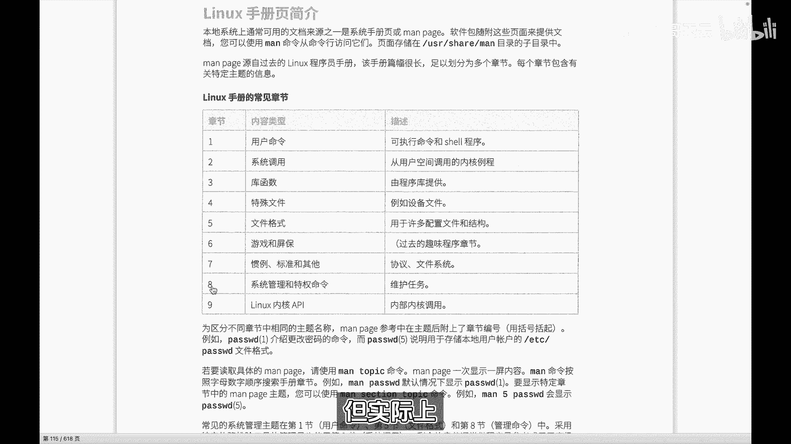
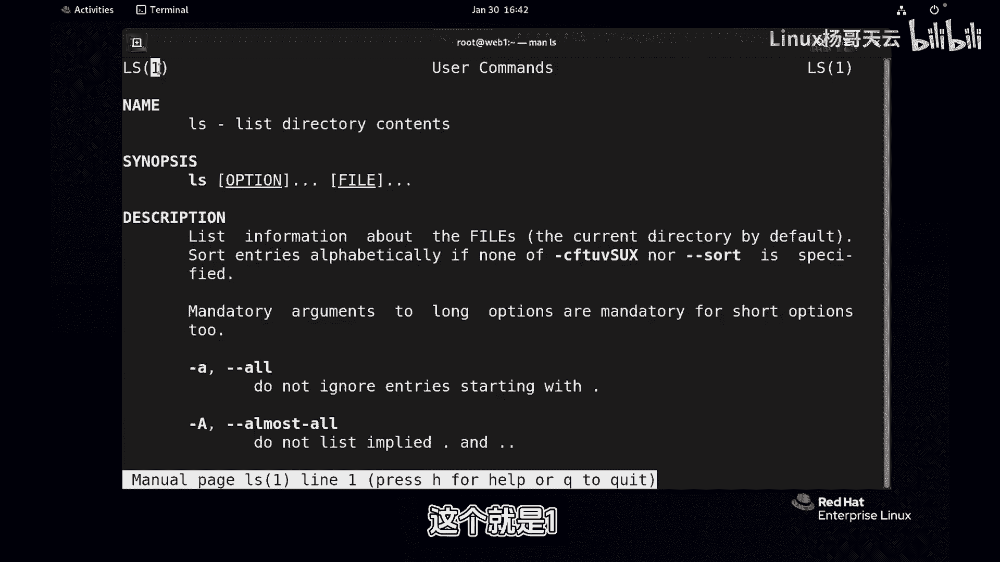
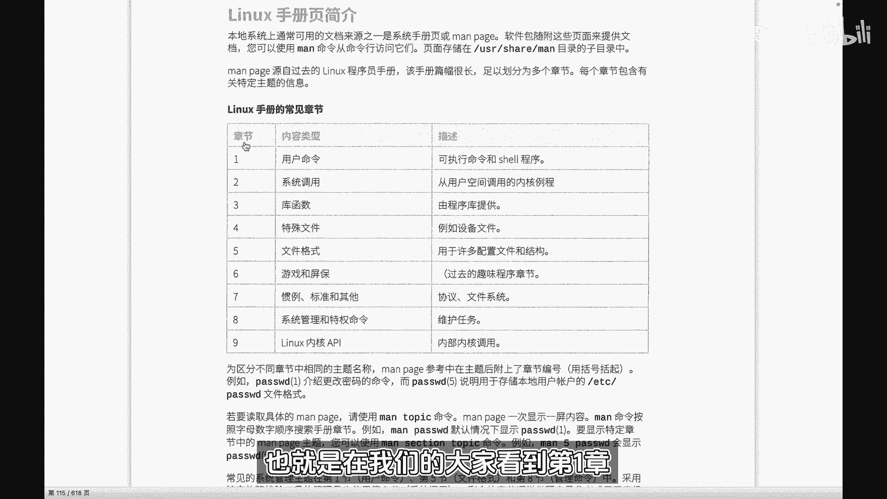
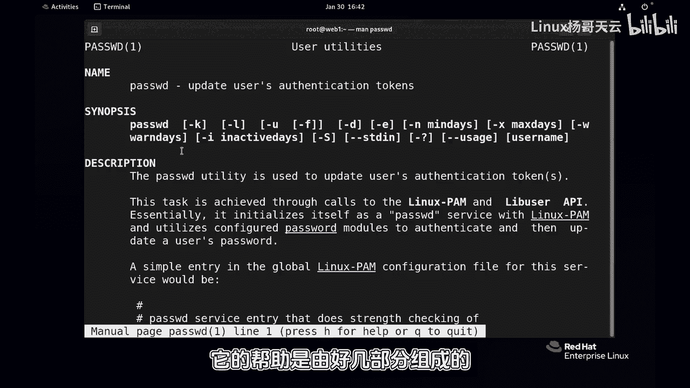
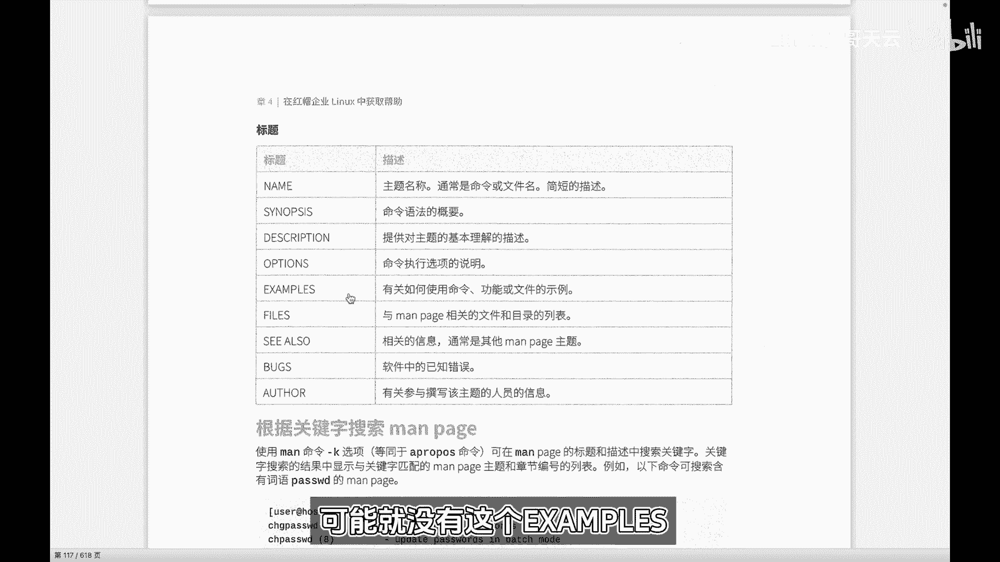
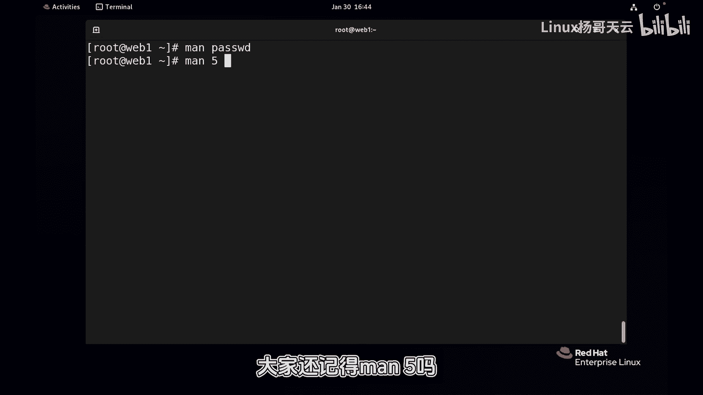
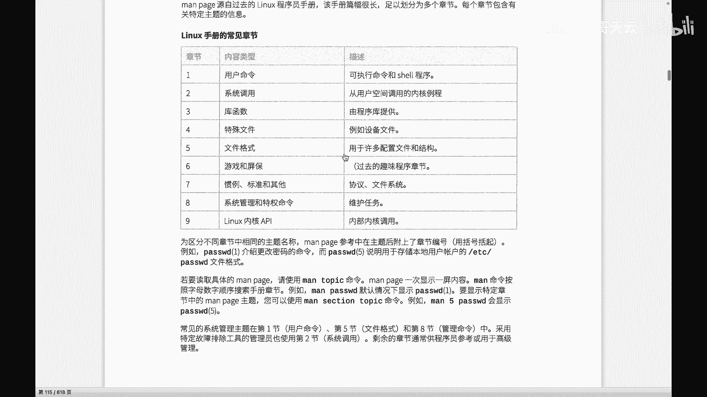
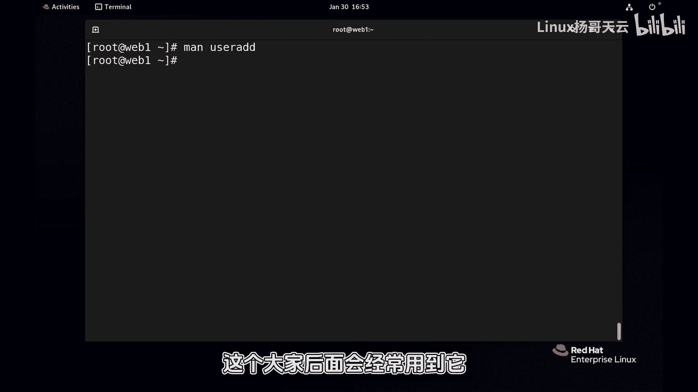

# 史上最强Linux入门教程，杨哥手把手教学，带你极速通关红帽认证RHCE（更新中） - P29：29. Linux帮助man - Linux杨哥天云 - BV1FH4y137sA

呃各位小伙伴，我是杨哥，下篇我们继续来学习LINUX，嗯在之前杨哥给大家也讲过，我们其实LINUX当中常用的mini呢也就十几个，并不是很多，那这些mini可能大家会用的非常熟。

但是也会根据一些工作的需要呢，我们会用到一些比如说陌生的命令，或者说有一些命令呢，有一些这个特殊的或高级用法，这个我们不清楚，所以呢这个时候就要借助于一些帮助。

在LINUX里面给我们提供了很多种帮助的手段，其中最常见最常见的就是这个man patch，也就是简称为man，呃这个man呢主要针对呢这个像一些mini mini的用法，还有呢就是像一些文件的配置啊。

它提供了一些帮助，当然实际上呢我们这个慢慢配置呢，它是LINUX最基础的一个帮助一种形式，还有很多，像我们在嗯CE当中的第三门课讲到的ANSIBLE，像这些软件，他们自身呢会提供很多的一些参考实例。

一些帮助文档，所以这个更多的我们用到的是一些像mini啊，一些配置文件的一些帮助会多一点，整个这个慢配置怎么用啊，先给大家看一下这个章节，它有一个章节的概念，呃，大家可以想象成就相当于九个抽屉里面的。

装的是不同的帮助，对不同的帮助呢做了一个分类，那比如说在第一个章节，或者说在第一个第一层里面哈，他放的是用户命令，这里面所谓的用户命令呢和第八个是有点区别，这个用户命令大家可以理解为。

就是普通用户使用的命令，像什么，像后面我们讲的磁盘分区啊，或者说像那个用户的一些管理，这些都肯定不用户，普通用户不能使用，需要借助于管理员啊，一些普通用户使用的命令，而第八一个章节啊。

它是我们管理员使用的命令，就是只有管理员才使用的一些特权命令啊，主要用来做系统维护，那都是命令，然后第二个，第三个像我们的这个LINUX的开发人员啊，他要去开发相应的一些软件。

或者是对系统做底层的一个开发啊，做UNIX的一种高级编程，那会用到一些系统的调用或者库函数，这个我们在做运维的时候，实际上呢基本上是用不到的，所以这两个就忽略忽略掉了，第四个特殊特殊文件呢。

也是我们基本上也不会用到第五一个文件格式，这里面呢会来告诉我们一些文件的一些格式啊，比方说它这个文件是怎么组成的，比如说在后面的章节，我们讲到用户管理的时候。

我们要看password或者看那个shadow文件，它每一个字段，每一个这个冒号之间是干嘛的啊，甚至是什么加密的方式，这个它都会有说明啊，在这里面有相应的说明，所以常见的呢就是158，当然我说的常见。

主要对对于我们的LINUX运维人员来讲，主要是这几个章节，这里有一点跟大家提前说一下啊，后面呢我们会看到，如果说你不指定章节的话，在这个不同的章节里面可能有相同的帮助的，那个man的一个名称。

man配置的名称啊，就之前我我我那个呃开玩笑讲，我说可能这个都是海尔的一些设备，这个里面装的可能是海尔的刮胡刀的说明书，它也叫海尔，在这里面可能装的是海尔的这个，洗衣机的说明书，他也叫海尔。

你怎么知道那个你要看哪个说明书呢，因为他名字是一样，所以这个时候呢需要指定前面的章节，但实际上我们很多时候是。

不知道它在哪个章节里面的好，这个当然也没关系，下面我们就来给大家实际的看一下。

一个基本的用法，比如说IOS这个我们经常用，我们也可以呢通过慢的方式来看一下IOS的帮助，慢一下IOS，首先这个帮助呢，它会有一些整个有一些这个格式哈，比方说他的一个一个名字，它的一个语法。

还有他的描述，还有还有下面呢可能还有一些事例之类的啊，那这肯定都是英文的，如果实在觉得英文有困难的话呢，可以使用这个去翻译一下，百度翻译一下啊，这个它告诉我们IOS呢是列出目录的内容。

然后呢它的用法是ls s选项，这个注意这里的方方括号在我们的帮助里面，或者在这个命令的使用上呢，它表示可选项，平时我们使用IOS，实际上大家知道是可以什么都不加的，就IOS回车就可以了，所以它的选项。

它后面的参数fail这些都是可选，所以方括号在这里指的是什么，指的是可选的，那他说可以有多个点点点，有多个选项，然后有多个就列出多个文件，那这个文件呢不一定是文件，可以是目录在这里面啊，我们可以上下。

你甚至可以搜索按斜线来进行搜索，想要的内容都可以，这有点像vi的这种感觉啊，搜索，因为有时候我们可以，可能需要快速定位到一个地方去，然后按Q键呢是退出啊，那我们现在就正常的使用，使用光标上下键来看看。

他说了，这里呢有一些这个参数参数选项，比方说像那杠A它其实呢和刚刚all是一个意思，这个A呢是呃不会忽略那些以点开始的，我们知道点开始的文件属于隐藏文件，那杠A呢就是or所有的它有长选项。

有些呢没有长选项，有些只有短选项，有些呢正好相反，你看每一个都是，我们可以直接去通过那个斜线搜索啊，杠D这个大家也见过，杠D呢刚刚directory是一样的，列出我们的目录不包含你的内容啊。

那按Q键就退出，这个没问题，其实这里呢当然不论说慢啊，IOS刚刚help也也可以，这没问题，它也是简单可以看到的啊，当然现在有的内容有点多，我们在下一小节当中会讲到那个管道，那就索性先用一下吧。

啊因为这个往上翻太困难了，我们就把它给到管道，大家先用一下啊，Let's，你看也是一样，肯定很相似，但是呢你可以认为这个man呢，它比那个要复杂一些，刚才慢LSS上面呢，它显示这个就是一啊。

看到了吗，其实你跟MAELS是一个意思，它表示在第一章，也就是在我们的大家看到第一章。

它属于用户命令，但如果我们慢的是什么呢，表示password这个password到底是什么呢，我们也不知道它到底是一个mini呢，还是一个配置文件呢，大家看到它现在显示的是命令，也默认情况下来看呢。

其实是第一个，他说这个password是用来升级用户的这个认证的，一个token，这是用户的一个密钥的一个，而这样一个工具它可以加很多的参数等等等等，它的一些语法，还有它的描述，它的名字。

因为这个是实际上是有这个他的帮助，是由好几部分组成的。

大家看到这里面呢也有也有说明，包括名字主题，还有呢它的一些语法，还有它的一个描述，还有他可能的就是一些options选项，甚至还有一个叫examples，examples呢，就是这个具体的一个用用法。

当然有些简单的命令呢，可能就没有这个examples。

这个examples呢我们用的时候就斜线，刚才大家讲过，按EXA这里提醒各位一下，不要去按那个大写键，按住shift键输入，当然说到一定程度，EXEXAMPLE啊，就简单的它没有它没有这个东西。

太简单了啊，那我想说的其实呢不是这个意思，我想说的是呢，其实现在有一个是我们的叫password命令的帮助，也就是在USRB下的一个叫password程序，是用来呢改用户密码的。

但实际上呢还有一个文件在EDC下叫password，这是一个我们用户的一个文件，内容比较多啊，没关系，刚才我看了这，所以我想说的是，那刚才我们看的我们直接通过慢的方式，Password。

我们没有指定章节，那到底看到的是那个命令的帮助呢，还是那个配置文件的帮助呢，所以有时候我们是需要知道的，那回车以后大家看到的是他是mini的，帮助用户的一个一个工具，那如果想看呢这个配置文件的帮助呢。

很可能我们就要使用到慢五，大家还记得慢舞吗。

慢舞呢它是配置文件的一个格式，前面我们给大家讲过，那就是指的是那个文件啊。

你看回车以后，它刚才显示不一样，这个就是我们的password文件，天下的ec password文件的一个描述，一个帮助，这里面呢就会有很详细的，我们在后面会讲到的，看他的每一个字段的一个信息是干嘛的。

因此我们在后面讲到password的时候，会再拿帮助回来给大家看好，我按Q退出，那有同学说了，老师，我怎么知道他到底在五里面还是在一里面啊，所以这个时候，如果说你不知道到底在哪个地方有password。

当然你你应该大概知道是用户命令，它应该就是一，然后是管理员命令呢就是八，然后如果说是配置文件呢，他应该是五，当然一般情况下我们不用纠结那个章节号，因为名字呢大概率是不同的。

但实际上我们刚才看到的这个情况它有相同的，那我们就通过一个慢杠K的方式啊，杠key password，注意这个key呢是分大写和小写的，我们现在用它小写，他说这个key我们找到的是什么。

他说没有这个叫什么什么什么什么一个啊，瑞这是因为他现在还没有这个叫叫做去升级，它是依赖于一个一个索引库啊，依赖一个索引库，然后这个索引库如果说没有升级的话呢，那么这个mini还还还用不了，我们再试一下。

看好没有，man in杠KEPSSWT大写呢我们大写有，那这个用不了的话，我们该怎么办啊，它是依赖于相应的一个库啊，我们可以尝试去升级一下库，大家看一下，你一般情况不存在这个问题，它会自动。

因为我这台机器可能好好长时间没用了，我们去做一个相应的，这个本来是自自动的，不应该是人工的啊，这还很少遇到这种情况，好没关系，那我们来走一走，还是小写慢杠K好，就当帮大家解决了一个问题，OK好。

刚才我用到一个闷命令啊，做这个叫madb database，就是去升级一下慢的数据库，因为它是实际上是从数据库里面，它的一个索引库里面查找的，而这个数据库呢应该是默认更新的。

但由于我这个系统呢可能嗯好长时间，很抱歉，前面有段时间没给大家录视频了啊，然后没用，所以这个刚开起来的话，他没有没有这个数据信息，那现在呢我们看到了这个第一例呢，就是我们的man patch的名称。

也就是刚才我们看到的那个名称，后面呢是相关的一个描述，还有呢是一个章节，当然这些不是因为它杠key的话，他找的是什么呢，它会从这个名字里面找到，凡是带有pass w d。

或者是这你看这这个也是pass w b d，或者这个地方呢，你看带有P的PSWD他都会找到，就是只要它的名字或者他的这个叫做描述中，如果说有这个关键字的，那都会显示出来，那这个不是我们要的啊。

我们要的是这两个，大家看到是这个和这个其实还有个这个哈，我们要的是这个，他告诉我们在第一章里面有一个man帮助的标题，或者名字叫做pasta w d，它是用来去改变用户token，那么在第五章里面呢。

也有一个有这样一个叫慢配置，叫pass pass w d，它是一个password文件，这个时候你就应该知道了，你要看什么，但是如果说直接像这样，man pass大不列。

注意这里呢他肯定看的是第一个排在前面的嘛，啊所以一般情况我给大家讲过，不需要指定章节号，那如果说你就是看PASSOL这个秘密，那你直接回车就可以了，但如果说你要看第五一个。

那就要使用man5PASTEBD，这样的话呢就明确的是要看到的是第五个，所以我们先要通过慢杠key来搜索一下，man的这个dB数据库，来查询一下哪些标题，哪些描述里面带有pass ABD。

OK这个时候你看我要是这样说的话呢，回车他就告诉我，我们看的是第五章节，看的是我们的这个password这样一个文件啊，至于文件内容呢，本小节我们先不做介绍啊，我们班Q退出。

那如果直接像这样pass dd来看看，第一个和你输入一呢没有什么区别啊，一般情况我们不需要输入，这是碰到帮助文件，他的这个名称相同，我刚前面给大家讲过，有很多是不相同的啊，相当于你你这个整个抽屉里面。

在第一章里面呢，有一个叫就叫海尔的一个说明书，但是它是刮胡刀，那么在第五章里面呢，也有一个孩尔的一个说明书，但是它是洗衣机，所以你要看刮胡刀的这个说明书，还是看洗机的说明书，因为他两个名字都相同。

那如果能叫别的名字呢，自然就不用区分，这个大家应该听清楚了啊，那慢杠key这个用法呢我们不需要太多复杂的，慢慢的一些用法，还有很多慢的用法，甚至还有什么呢，还有man杠大K的一个用法，这个就有点我。

我个人就觉得我不太想使用，当然它也是需要依赖于我们的这个数据库，曼DP这个数据库去查询这个它有啥不同呢，各位看一下，那他看到的是，他不是找的那个叫什么标题和摘要。

也不是找的这个名字和前面的这个description，不是找这个，他找的是所有内容里面，只要还有PASABD的，你看按Q下一个就是说按CTRL加D啊，我不应该按Q框，按CTRL加D，CTRLC是中指。

CTRL加D呢是这跳跳跳下一个，哎我这怎么按不了啊啊可以可以这样拿，按Q回车啊，按Q回车跳时呢指的是跳过的意思，按Q回车，这个找的我就觉得很痛苦啊，相当于把所有的password全部给你找出来。

而且呢它是找内容，不单是标题，我CTRLC作为这个哦，刚才没按CTRL，刚才按的是那个苹果上那个键，所以呢这个杠大K呢，我个人觉得它的用途呢还是有限啊，所以大家用不用都无所谓，你记住小K就可以。

甚至一般情况我们都不用不用小K好，这就是慢慢的一个用法，除此以外就是刚才也给大家讲过，就是一些基本的命令，我们当然不用慢，没有必要，杠个help就可以了，杠杠help p，这没问题，是不是分屏的形式呢。

我们已经提前用上了管道，Lets，至于管道什么意思呢，后面给大家讲到这个就比较简洁，但是慢呢是一个比较复杂，而且呢是比较叫什么，我觉得它里面可能还有帮助，给你卖一下用户命令，User add。

这是我们建用户的命令，他说第第八章对了嘛，就是第八章，因为这个是一个管理员命令，它的作用是创建一个新用户，或者说去更新一个默认的一个一个用户的信息，它的用法呢是什么，User and option。

option呢，这个地方方括号指的是选项，可选的后面一个名字登录名字还可以加杠D，到底杠T这些什么意思，那下面呢就会有选项，有这个具体的option，这个option对应的就是这这个位置。

option对应的就是这个options啊，下面呢就会有相应的一些不同的选项，它代表的这个意思，它描述会更加的清晰，当我们后面学到了一些其他高级用法的时候呢，我们可以直接去通过GRAP来进行搜索。

可能都连这个都不用进来，可能就搜索就可以获得我们想要的内容，OK这就是我们的一个慢男人啊，非常强大。

