# 史上最强Linux入门教程，杨哥手把手教学，带你极速通关红帽认证RHCE（更新中） - P2：2.Linux系统安装包：Red HatEnterprise Linux+CentOS Stream 9 - Linux杨哥天云 - BV1FH4y137sA

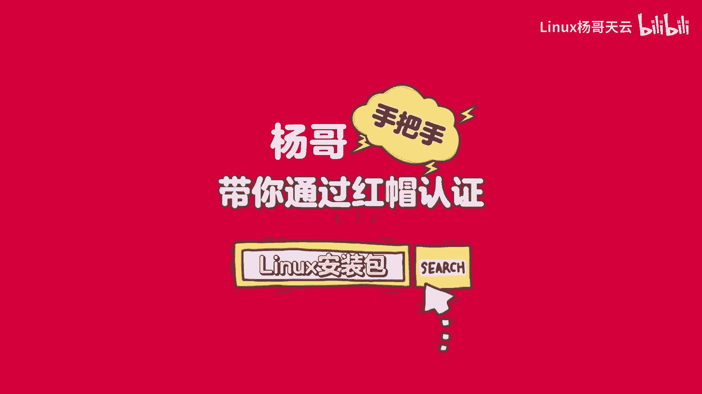

我们在学习LINUX之前，第一步就是我们得先有一个LINUX系统，那这里呢有两款LINUX系统。

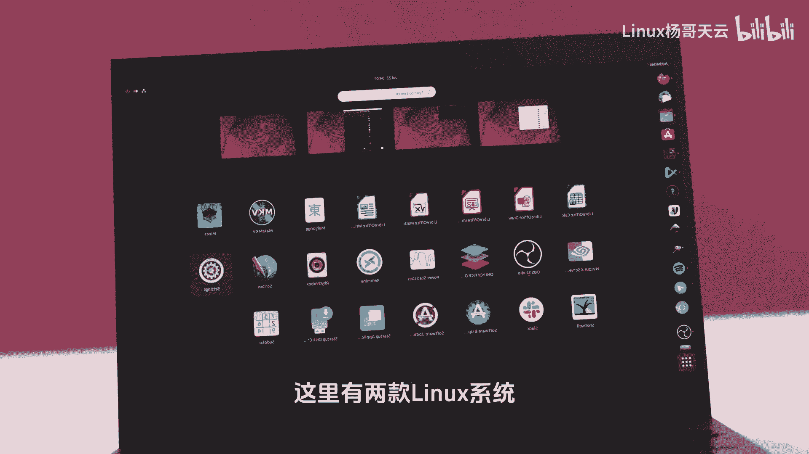

一个呢是咱们的呃红帽LINUX啊，red head我们叫做红帽的企业版啊，简称为RHEL红帽的企业版LINUX啊，另外一个是森TOS，它有两个版本，一个是CENTOSLINUX。

这个其实已经现在没有了啊，现在主要是他的一个另外一个版本，叫做CentOS stream，这个版本我建议大家这两个你都可以试一下，或者说拿任意一个都没问题，当然最终的考那个CE的话呢。

要必须要使用这个企业版啊，但这两者在我们的使用角度，基本上没有什么太大的区别。

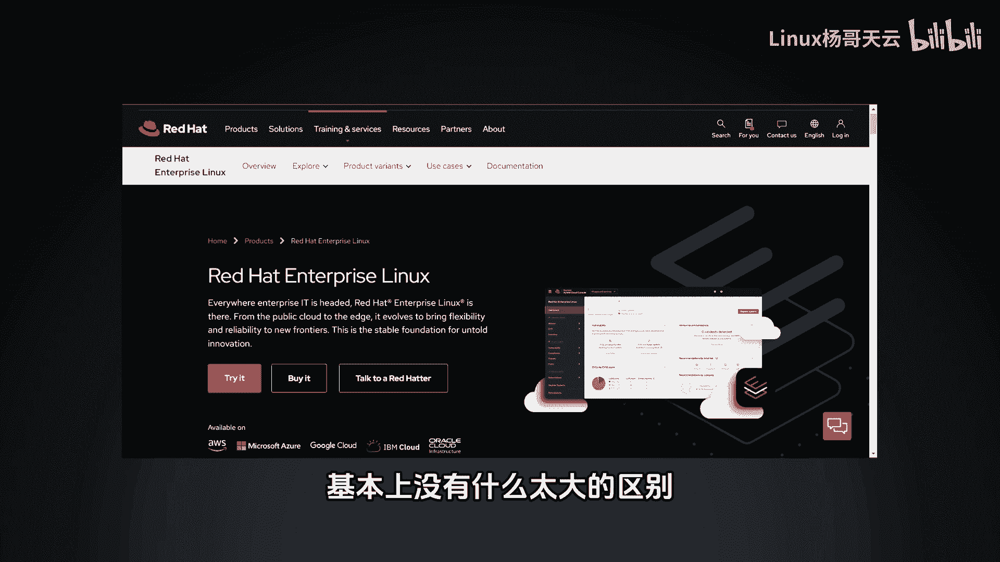

所以大家不用纠结这一点啊，如果说你使用的是这个企业版的话呢，呃那你首先可能需要去它的官方网站，REDHART点com这个网站，然后去下载，那下载呢这边有一个产品就叫做red hart。

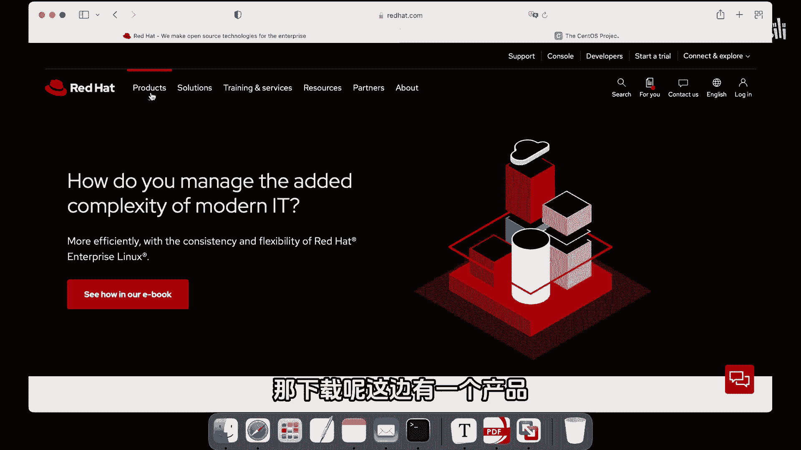

Entpress and press linux，我们简称为RHEL。

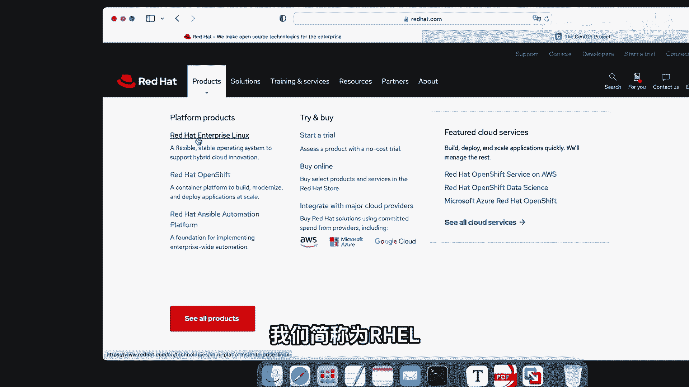

红帽企业版的那个四点进去以后呢，你可以通过这个去购买啊，或者是呢去试用的方式，它会有一个60天的一个试用期，这个试用期当中你可以去订阅一些东西，或者说你可以去更新一些内容啊，之后呢你还是可以使用哈。

它不像说你过期了就不能用。

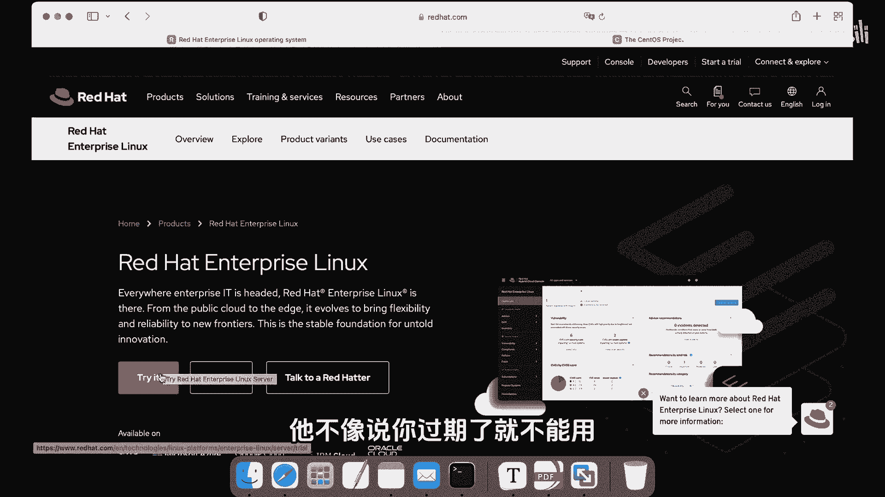

只是没有这个相关的升级这样一些服务了哈，那这边呢也可以呢去使用这个我们的snos dream。

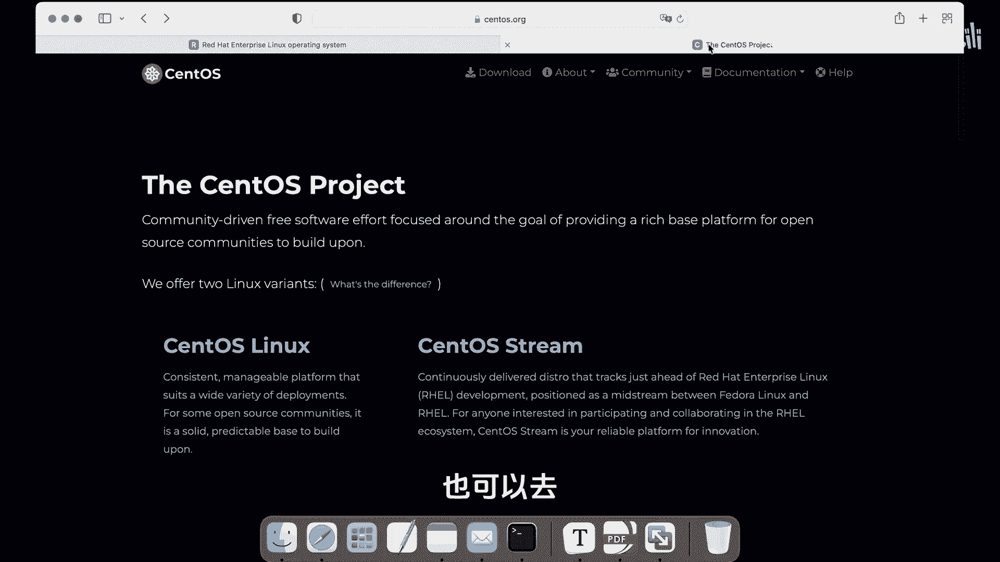

点到这个SNOS点ORG这个站点啊，然后去下载。

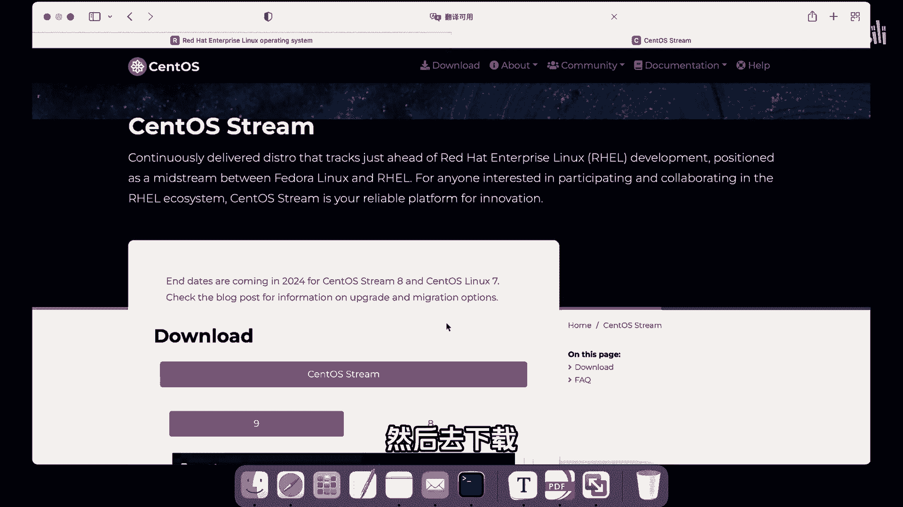

那这边他提供九的版本啊，还有八的版本，那我们一般选择九，如果说你这边不知道。

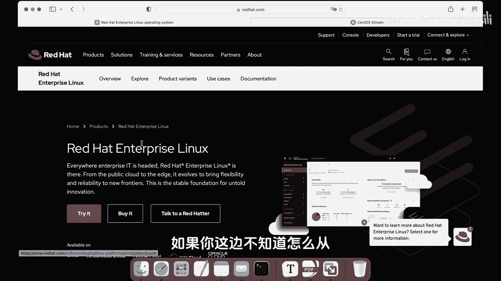

怎么从红帽官网下载的话呢，也没关系，我这边已经呢给大家准备好了这个版本啊，这是我们的9。0的一个版本。

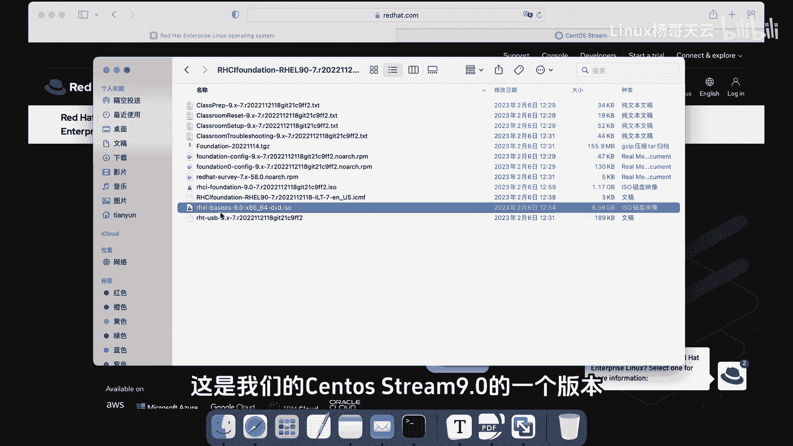

大小呢是好几个G。

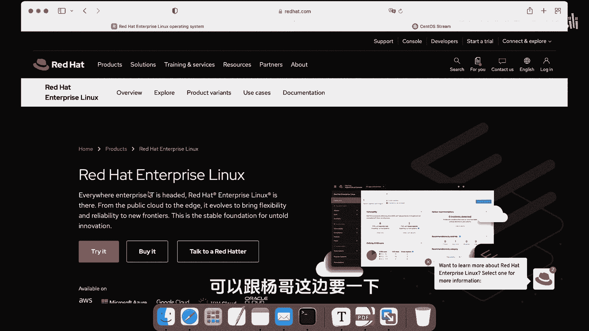