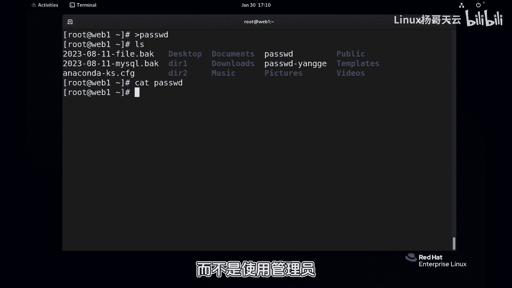
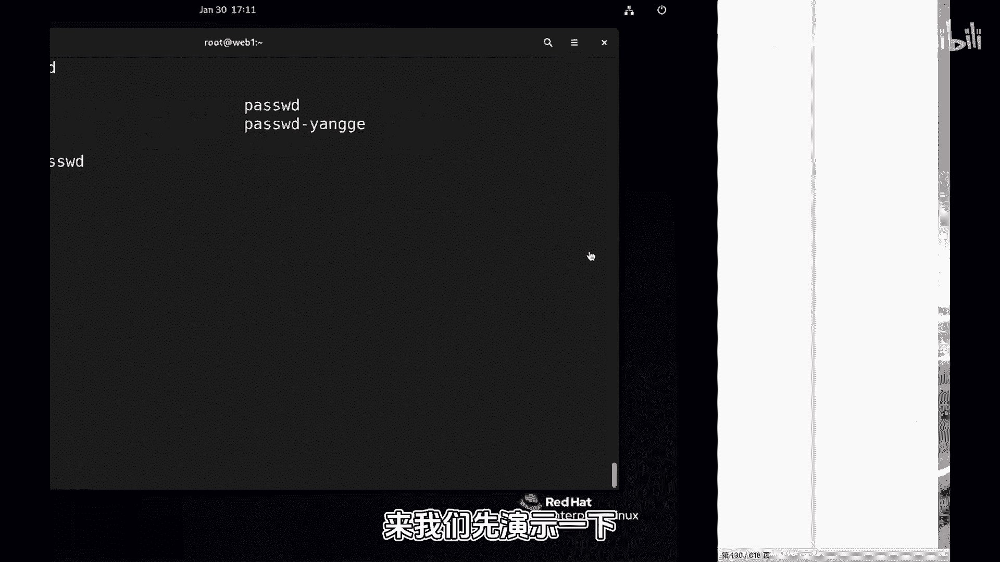
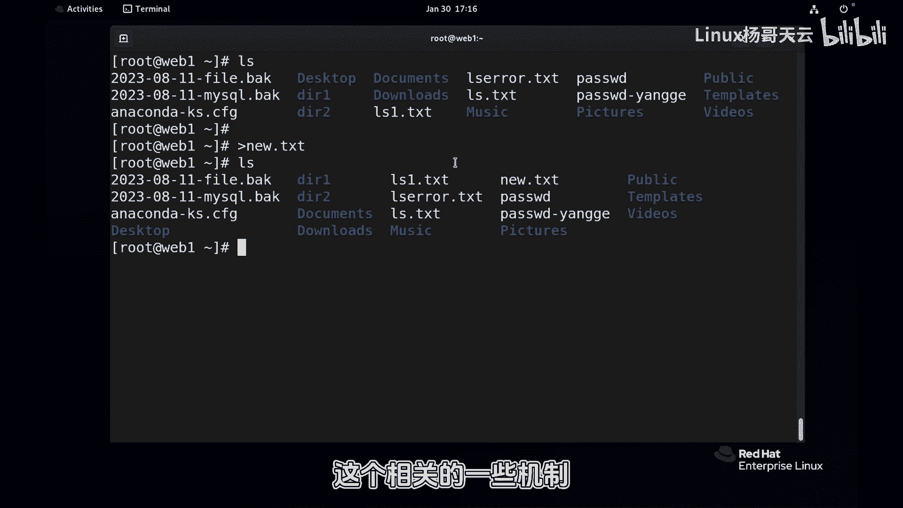

# 史上最强Linux入门教程，杨哥手把手教学，带你极速通关红帽认证RHCE（更新中） - P30：30.你真的了解文件重定向吗？ - Linux杨哥天云 - BV1FH4y137sA

同学们好，我是杨哥，下面我们继续来学习LINUX课程，先给大家看一个演示啊，那比如说我现在我执行这样一个命令，这个是EDC下的password文件啊，很显然是一个很重要的文件。

如果我现在回车会发生什么事情，大家可以在评论区或者在这个聊天区，弹幕区去回应一下啊，很显然我不敢这么干啊，我现在比如说先拷一个文件过来，拷到这来，大家看有这样一个文件，我大于号，后面有空格。

没空格都没关系，这个我稍后会讲到啊，直接跟上这个文件，注意这个文件就不是那个系统文件了啊，这个文件里面有内容吗，大家不要怀疑啊，先给大家看一下，有对不对，把这个地方换换成一个这个符号。

其结果是这个文件还在，但是内容呢已然被清空了，那如果说你不小心用到了这个大于号，后面指的是一个系统文件，而你又是管理员，那这个结果不堪不堪设想，那这是怎么造成的呢，在正式的一些文件的一些创建管理之前。

我们必须要了解文件的这样一个重定向啊，LINUX重定向这样一个机制，因为很好用，但是呢如果说你使用不当，可能会带来这样一个灾难，一个跟我们的使用习惯有关系，我们现在是管理员。

我们平时呢应该使用速度的方式，而不是使用管理员啊。

当然了，就算那个是速度，你加上了速度，后面你一样会产生这样一个破坏，OK那现在呢我们就来看一下，正是看LINUX文件的一些创建，查看和编辑，也就是对文件文件进行操作，怎么创建文件，肯定是vi啊。

还要怎么查看文件内容很多啊，可以用什么cat啊啊，more or less ts啊，还有怎么编辑文件啊，创建编辑编辑文件啊，这个是我们的这个核心的这个点，也就是我们的第五章，本套教材的第五章。

然后在正式做这件事情之前，我们先要了解，就是刚才讲到的一些重零项的一些概念，类似于什么输出啊，标准输出啊，错误输出啊，还有呢怎么去重定向来，我们先演示一下啊。

再演示一下啊，比如说我们以前看LS回车有没对吧没有，但如果像这样，我们把它它没有显示呢，原本应该显示在屏幕上的内容，结果呢到哪去了呢，也就是原本应该是显示这个内容的呀，那结果就到了这个文件里面。

就是我们做了重定向啊，当然显示格式不是那样的啊，最后这就是一个重定向的一个案例，我们把那个LOS的输出结果，显示到这个文件里面去了，那比如说我们看的e DC password文件，对这个是存在的。

我们也也可以呢，像这样把它重定向到一个一个文件里面去，表LS一点TT吧，换个名啊，没问题，大家看回车没问题，那这个mini呢我们不做什么改变，后面我再加一个加一个，比如etc i的什么叉叉叉叉叉叉叉。

这个我自己很清楚啊，这个文件是不存在的，上一个mini，我们看到他直接把这个结果，重定向到IOS一点ts里面去，现在呢回收好像报了个错，其实也不是报错，因为这个文件不存在。

所以呢他说没有找到这个相应的文件库内容，换句话讲就是我们这条命令产生了两种信息，一种是正确的输出，一种是呢错误的输出，而我们刚才这个行为其实只是定向了什么，这个命令正确的输出消息。

没有对错误的消息进行重影响，那如果我们现在后面这个名字是我们随便起的，而这个文件也不存在，它可以创建，那你看啊，我们现在我们这样来用前面这个命令，刚跟大家讲过了啊，他是重立项。

很显然的好像他不能接收错误的这个结果，那后面这个命令呢可以了，那任何显示都没有显示，l o s e DC password应该是正确的一个结果，然后这个是错误的输出，那都进行了重定向。

你看第一个IOS的这个结果应该是正确的，结果呢应该是在IOS一点TS里面去，第二个呢是注意不是看内容啊，是看文件啊，第二个呢我们看error iOS error这个文件也存在了。

它里面就是刚才那句错误的输出，也就是这这句话报错了这样一个结果，很显然这里好像有多种输出，在我们的感官当中好像看到了一个命令，在执行的时候呢，可能会产生正确的信息，有输出的信息。

当然有些命令执行的时候没有信息，这个我们不用管啊，那有些命令在执行的时候呢，会产生错误的结果，有同学说，那怎么可能会有错误的结果呢，我们既然在用运行命令，怎么会有错误的结果呢。

这有可能就是当前面的某个条件不成立的时候，表示我们在做一些备份的时候，极有可能因为有些原因备份不成功，哪这种不成功呢，我们可能也希望把它保存下来，看看到底是什么情况，所以我们就会用到重定向这样一些机制。

结合我们前面讲到的那个那个案例，我们也看到了重定向，其实呢挺好用，也挺可怕，好用在哪呢，比如说这边我们看到没有，我们当前的这个目录下这些文件啊，我们直接后面跟上一个六点TXT，它直接就新建了。

所以T挺好用的，看到了吗啊，当然坏处呢就是你如果说你的权限，OK你后面跟上一个系统文件很可能就干掉了，所以我们有必要去在文件管理之前，先把重立项的各种概念机制特别的了解清楚，否则的话这个东西用的话。

就会造成很麻烦的一些事情，所以大家可以先跟着我前面的命令先敲一敲，然后我们在下一小节当中呢，我们会详细讲到这个相关的一些机制啊。

