# 史上最强Linux入门教程，杨哥手把手教学，带你极速通关红帽认证RHCE（更新中） - P31：31.一条视频带你搞懂Linux重定向 - Linux杨哥天云 - BV1FH4y137sA

哈喽各位小伙伴，我们继续来学习文件的重音项，那在前面给大家做了一个演示啊，让大家看到重音项呢是非常好用，当然也会如果用的不好的话，会是一个双机键，因此我们必须要先了解同类项的一些机制。

也就是如何来进行处理项，那在开始之前呢，我们先了解三个概念，一个叫标准输入，一个叫标准输出，还有一个是标准错误，那大家看到这张图啊。

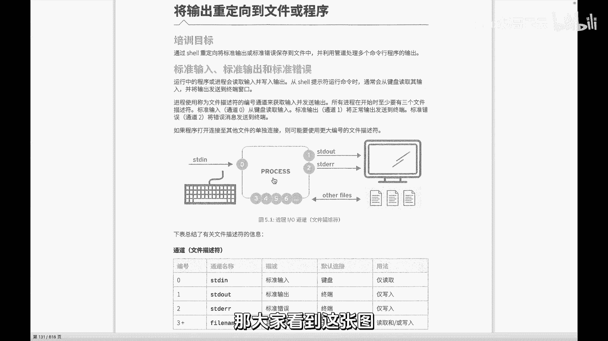

这是一个进程的IO的一个图啊，这个图描述的是一个进程，比如说刚才我们IOS像我们这样，我们IOS运行的时候，或者说我们cat一个一个一个文件啊，像这样，这都产会产生一个进程回车，这个进程会运行啊。

这个进程到底干什么呢，这个取决于我们是要具体要做什么。

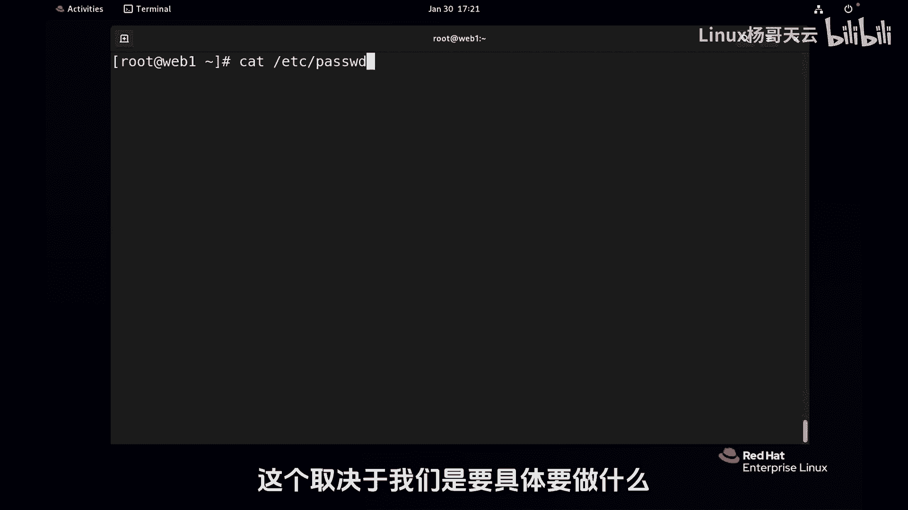

那么每一个进程啊，在运行的这个时候都会呢需要去比如说写入啊，读入进程就是我们运行的程序或者叫进程，它会读入读入内容，它不是哪个地方读入，一般是键盘，我们这个叫stand in，也叫标准输入。

通常默认是键盘，也就是进程，它读取内容通常是键盘啊，从键盘读入，当然我们要改变的话呢，就是改变它的这个就是重力，向它原来的那个位置，然后另外呢还有标准输出，我们也看到当这个进程在运行的时候。

如果会产生消息，一般情况是会输出到屏幕上的，不管是正确的输出正确的这样一个结果，还是呢错误的结果都一般情况都是在屏幕上，所以这里呢实际上呢它对应的是三个三个文件，那么在LINUX里面呢。

我们把这个称之为文件描述符，用编号，这个叫文件描述符，所以每一个进程它至少有三个文件描述符，文件描述符零，它对应的是我们的输入，也就是从文件描述符零来获得输入啊，你也可以认为通道都可以，然后呢。

一呢这个文件描述符，这个通道我们叫做标准标准输出，它标准输出对应的那个位置呢就是终端，然后第三个呢就是我们的二二呢就是错误输出，把文件描述符012，还有很多3456789啊等等等等。

还有一些其他的文件other files，所以并不止并不止三个，我们常见的讨论比较多的就是这三个012，这个怎么解读呢，南阳哥这边多说一下啊，进程它会从零文件描述符零，由0号通道来读入这个0号通道。

它的原始位置是从哪儿来呢，键盘那如果说我们改变了0号通道，这个零呢，这个描述符是肯定不变的，我们改变了它的读入的位置，那么也就是对它原来的从键盘的读入呢，比如换成换成的文件。

这就是改变了他的一个输入中理想，这输入的地方变了，不再是键盘，那同样刚才大家也看到，他本来嗯文件描述符一进程，会把那个正确信息抛到文件描述符一里面去，而这个一的输出的位置是屏幕。

也就是我们的终端说屏幕这个其实是很假的啊，我们可以认为是屏幕。

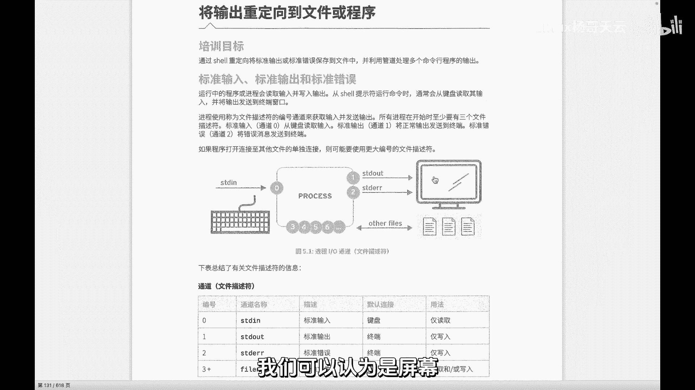

屏幕就是一个终端文件，它也是一个文件啊，这个怎么解读啊，我们可以看一下啊，你看当前这个终端，当前终端是这也是个设备，在LINUX里面一切建文件，如果我们再开一个啊。

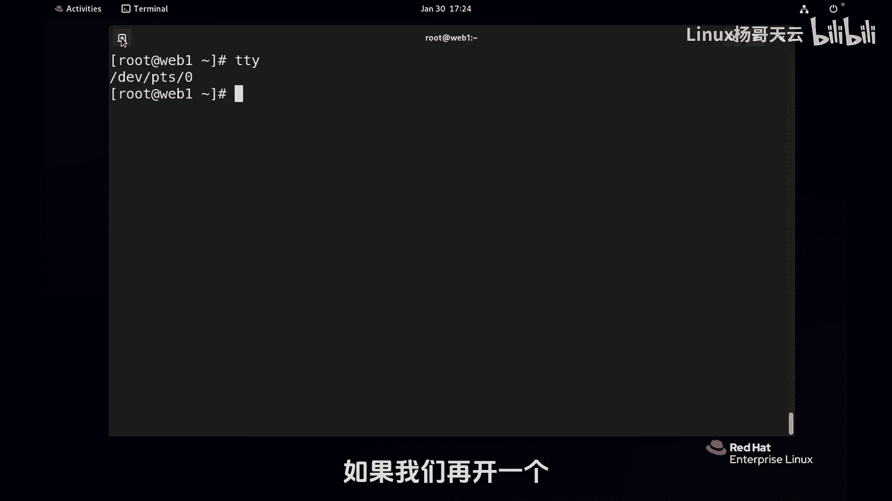

那就不是零，那就可能就1234，比如说我现在再加一个啊，再加个中断，这个就放大一点。

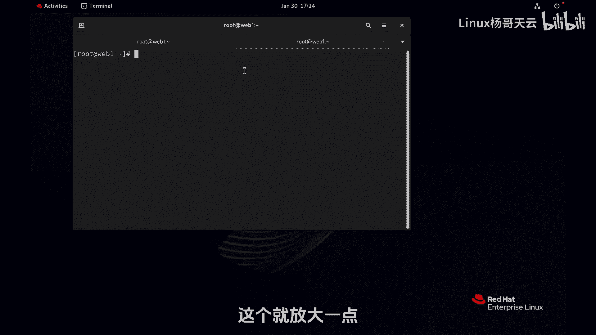

把这个logo显示出来好看，你看这个终端就是TY显示当前终端，它就不是零了，这个是零，这边是一，各位看啊，如果我现在IOS像这样回车啊，当然ALOS内容有点多啊，多就多吧。

回车它其实就是写到这个文件里面去了，这个文件就是在你看来就是我们说的终端嘛啊，但是他不会写到这里面去，他不会写到这边去，你想他写到那边去呢，也可以，各位看啊，我如果像这样重定向到这里面去。

有没有空格都可以啊，我习惯是不加空格，D 1v p d s p t s0，这个设备你看啊，这个结果还是屏幕，因为它就是从当前终端，那如果说你现在把它换成一呢，大家可以猜到他肯定不在这了。

他就去到这个文件里面去了，是不是各位看到了吗。

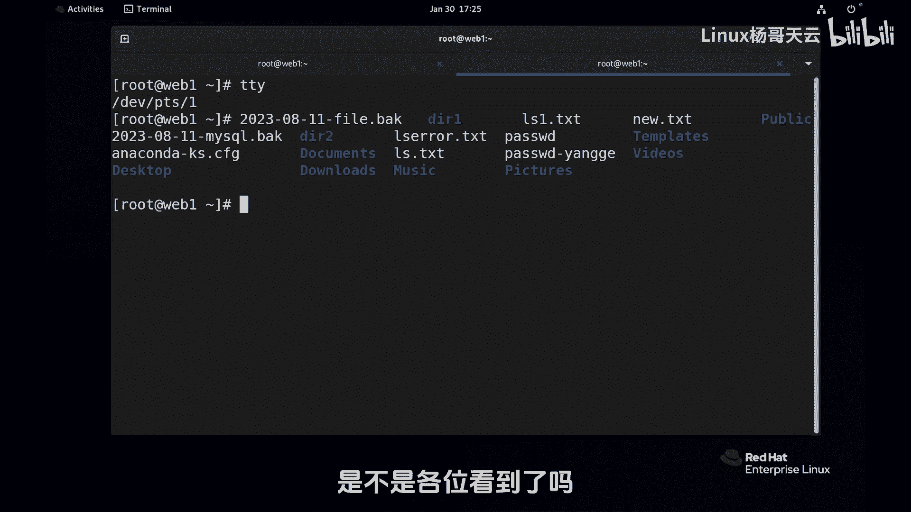

在他看来就是个文件，所以不是什么真的显示器，它是一个文件，这个文件是一个终端文件设备文件，总之在晋城看来读呢，我就从描述父临读这个通道读入，就像抽抽水机一样，你把这个抽水机的这个管子。

你你放在那个这个池子里面，那它从这个池子里面抽水，那你要把他这个管子给它挪一下，放到第二个池子里面，那它就从第二个池子里面抽水，相当于改变了抽水的那个抽水的那个方向，这个大家明白了吗。

就是你可以想象成在这边有好多池子，这个池子里面有漏水，这是个抽水机，它在运行，它要去抽上来，然后再送到别在别的地方那个地里面去，那默认情况下呢，它是从那个前面这个池子里面抽的，那你把这个方向给他改一下。

那就改变了抽水的方向，那就是圆的方向，那同样呢它的出口，出口这个这个一二是不会动的，因为就安在抽水机上面的，它怎么动，只是说前面那个管子，你给他哎挪一下，比方说刚才在教你们家的一块地啊。

现在教我家这块地，我把管子抱过来就可以了，这大家听懂了吗，所以我们只要改变他们的来的方向和去的方向，就是叫输入重定向或者叫输出重定项，总之叫重定向，那我们要先清楚的就是知道是什么呢，零它是输入的。

就是你改变了零，那就改变了输入，它本来原来是键盘，我说的是本来啊这个东西可以改变的，是不是，然后一呢是正确输出啊，官方叫标准输出，我一般叫正确输出，这样好听一点啊，和那个stand error是干嘛呢。

是区别一下，那二呢标错误输出，错误消息就往这里面扔，正确的就往这里面扔，默认情况下都是在终端，在我们的这个终端文件里面去，三其他文件这个就看看情况了，我们会有很多就是一个进程呢。

它最基本的会打开0123个描述符，就三个文件啊，然后呢它会对三个文件进行读或者写，也会呢根据需要呢来打开，或者说更多的文件描述符，每一个文件描述符的背后就是一个文件，它可能是我们的一个常规文件。

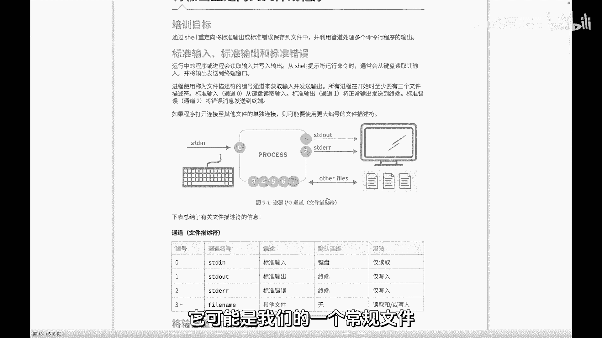

也可能是一个什么设备文件，刚才这就是一个设备文件。

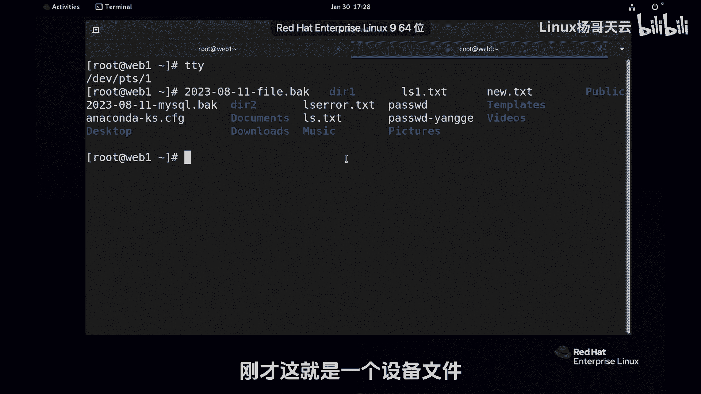

大家明白了吗，各位，那下面呢我们刚才也也给大家试了一些例子，接下来呢我们就来详细讲一下，我放大一点啊，详细讲一下不同的输出重定向的这个区别，以及呢我们会用到一些相关的一些事例，来给大家去解读。

那第一个有同学说这没有写数字啊。

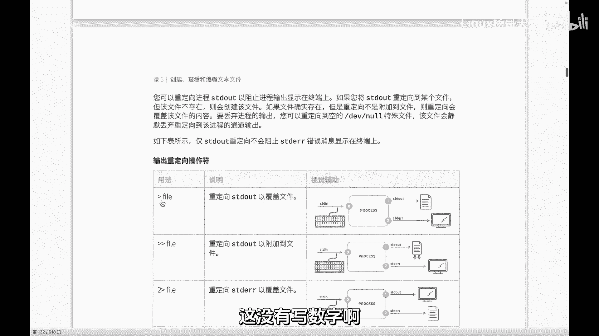

看到了吗，这实际上是这样啊，我们看看啊，IOS或者data吧，data点TXT里面去，本来应该显示在屏幕上的，2024年几月几号，几点几分，那我现在回车以后，大家看到嗯，不再显示正常吗，有人说这是几呢。

这肯定不是零，零是什么，这个箭头才是零，才是改变来的方向，这个界现在是改变什么区域的方向，朝哪边大家都很清楚吧，箭头那个所指的方向就是我们的那个方向啊，啊我们先看看内容吧，那大家看到这里啊。

我输个一没啥区别，结果呢哎对也没问题，37秒的时候，那么这里的也就是说一呢实际上是默认的。

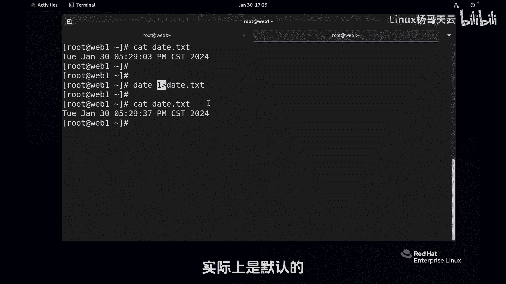

没有写，你可以认为这就是一，这就是对什么呢，对我们的一正确的输出标准输出进行重影响，所以那个一呢一和零都不用写。

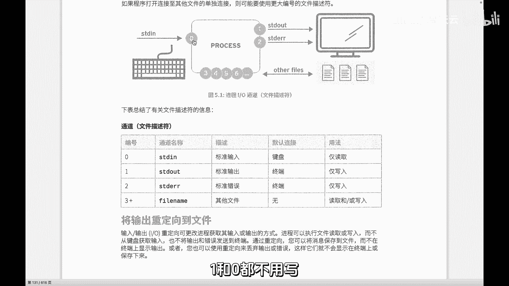

零呢就是我们指的刚刚讲过零还没用啊，现在别着急，来自于这边改变输入的方向，这还没用嗯，然后这个呢是输出的方向，那这是改变正确输出，这是改变什么错误输出，而一呢不用写，因为是默认的，大家听懂了吗。

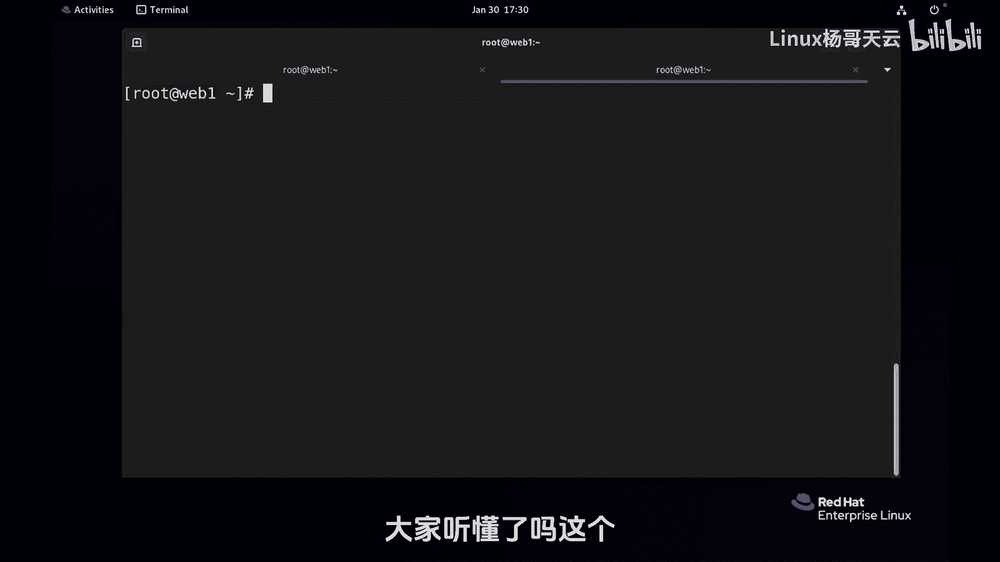

这个听懂的话，我们就来看看这个图示，然后呢这个大家一一的去操作一下，首先我觉得这个图示视觉辅助，还真的是挺棒的啊，第一重零项file，那很显然就是对一我们认为是正确输出，标准输入进行重零项啊。

您看这个这个进程这个具体也没有说要做什么，只是说重定向这个位置没有改变原来的位置，还是键盘，只是改变了什么呢，在这个程序当中，它只是改变了输出的方向，到一个文件里面去看到了吗，本来应该是终端。

结果到了文件这个地方，并没有改变错误输出的方向，所以呢二还是终端，所以这个用法仅仅改变了标准输出的方向，也就是E的方向，前面的一不用写，第二诶。

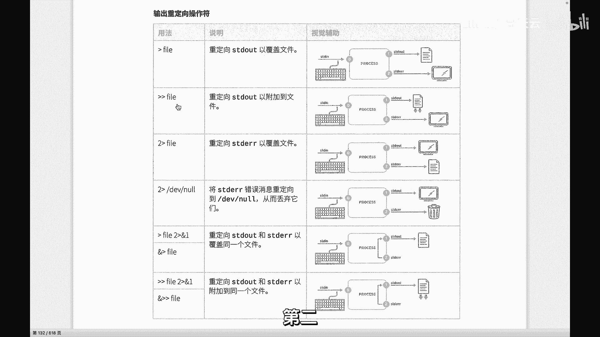

多了个箭头，这怎么解读，看看啊，刚才我们呢用了这个data，然后往这个里面重新下载一下，前面有空格没空格都没关系啊，就这里面有没有空格都没关系，在这个地方啊，最好是加空格啊，我习惯不加了，我刚刚说过啊。

好回车，一次两次三次四次，按理讲的话，这边应该有四行，但结果变成了一行，因为这个重立项的性质就一个尖尖，它是覆盖的，如果换成两个尖尖呢，好给大家留下，留下一秒钟想一下啊，三秒钟想一下。

我这个是对什么进行重定向的，我没有写数字，我没有写数字是对错误的还是正确的，肯定是正确的，所以不用写就没有写的情况下就是正确输出，就是标准输出，现在一回两回三回，我做了三次，看一下这个文件四次。

因为原来本身里面还有一次，因此呢你想要这个去覆盖一个文件的内容，那就用一个尖尖吧，如果说你想要追加的话呢，就两个尖尖，所以大家应该明白了，刚才为什么我这样写，我这样写能够把这个文件覆盖掉，应该明白了吗。

因为相当于把一个空的内容给他搞进去了，就没有了，就整个就覆盖掉了，所以大家听明白了吗，所以这个命令呢就是刚才在上一小节当中，我给大家演示的这个命令，这样下去这个命令没有没有毛病，但是结果就是为空了。

全覆盖，我们一般用看它干嘛呢。

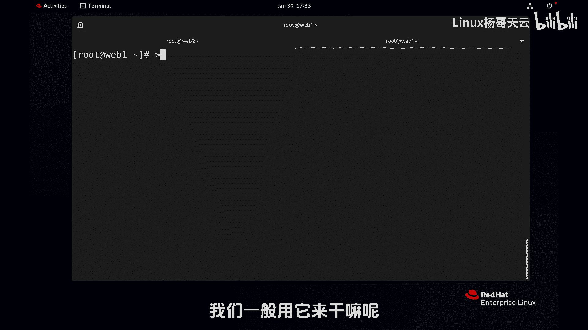

创建一个新文件，新文件嘛，那就自然就啥也没有，就没有呗，对不对，所以这里要用到两个尖尖，两个尖尖，你看这个视觉辅助里面写的是追加追加的，意思就是呢你看原内容还在，就是在尾巴上追加。

这是输出重定向里面的正确输出的两种形式，要么覆盖，要么追加，后面可以是文件，你指定一个文件，而这个文件如果存在，那它就针对这个文件操作，不存在呢，就搞出一个新文件，所以再要小心，因为一旦你的权限够了。

那你对一个存在的文件，但凡是用了覆盖这种性质，而你的权限又是够的，那这种后果了就不堪设想，除非你真的想干掉他，有这种可能性，我们表了头一天的日日志信息，我们不想要了，我们就想保留一天的。

那我就把他干掉啊，所以看情况没有写数字的，就是标准输出，写数字的呢就是错误输出，然后二对错误输出进行重定向，那这里呢同样呢一个尖尖指的是覆盖，两个尖尖呢指的是什么，追加，我个人觉得两个尖尖得看情况了啊。

错误消息你要要留那么多干什么，这得看情况，你是不是需要留留啊，这是比较常见的，就你记住一个尖尖就是覆盖两个尖尖，就是追加没有数字的呢，就相当于一嘛，正确输出有数字的就是什么，就是二错误输出。

这是我们最常见的用法。

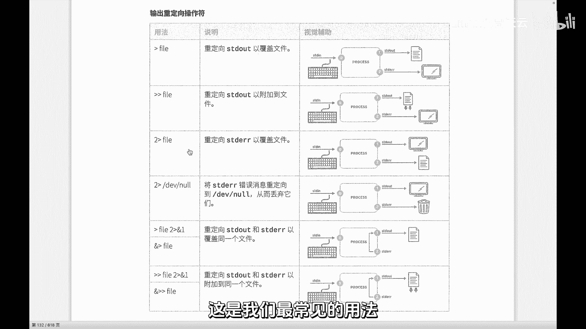

就跟刚才我们这里回顾刚才的这个命令啊，Ios，然后比etc下的password，这个文件存在应该是这么显示的，对不对啊，或者说我们再加一个etc i的shadow，应该是这样显示的。

那我再加一个etc下的叉叉叉叉叉叉叉不存在，我如果说要重定向，那就可以这样写，比方说叫阿拉斯啊，阿拉斯点TXT里面去呃，我就追加，我就覆盖了啊，提醒一下，这里是一默认就是一不用写，没有必要写。

当然这样回车的话呢，错误消息呢不会重新下，除非你就是想在显示的屏幕上，你假如说我我错误消息我也要，但是我要要到另外一个文件里面去，那我就对二重印象到error t s t，这个你这个名字我刚刚讲过。

后面如果是一个是一个新文件，那就会创建一个文件，你不用担心你的权限也是够的，当然也可以跟路径啊，不是说非要放到这，你可以跟踪器，如果说是一个老文件呢，那他就覆盖掉了，很显然都没有显示。

我们可以看到IOS点TXT里面，这是这两个内容，然后在temple下的error点TXT是这个错误内容，我们就完成了对这个叫标准输出和错误输出，重定重定向，那我只不过没有没用追加的形式。

取决于大家的需求。

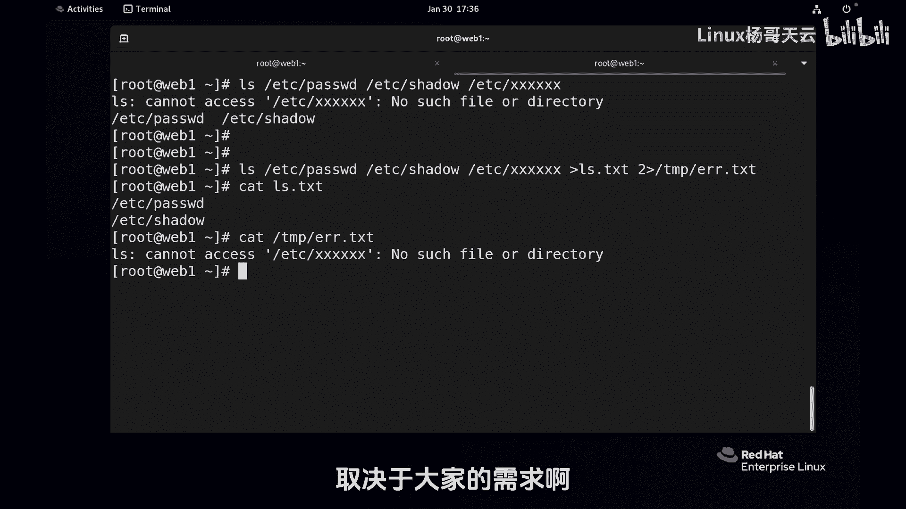