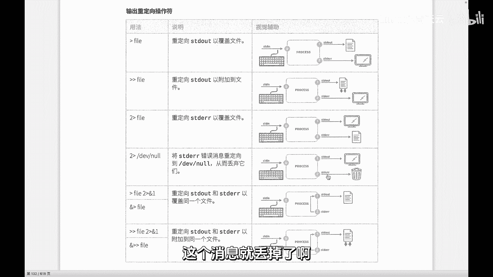
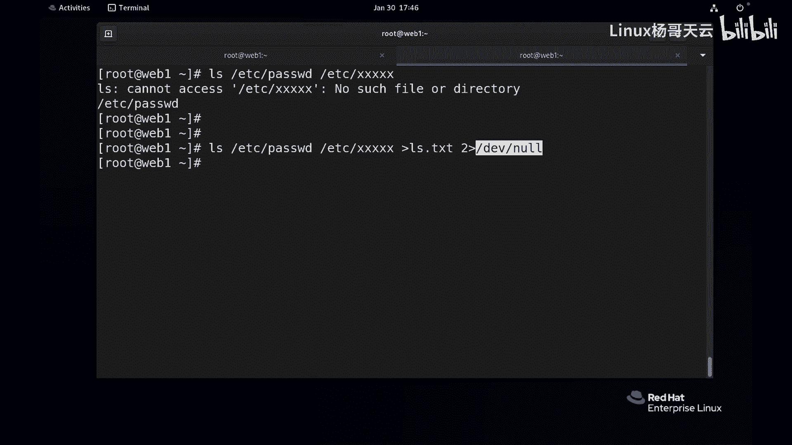
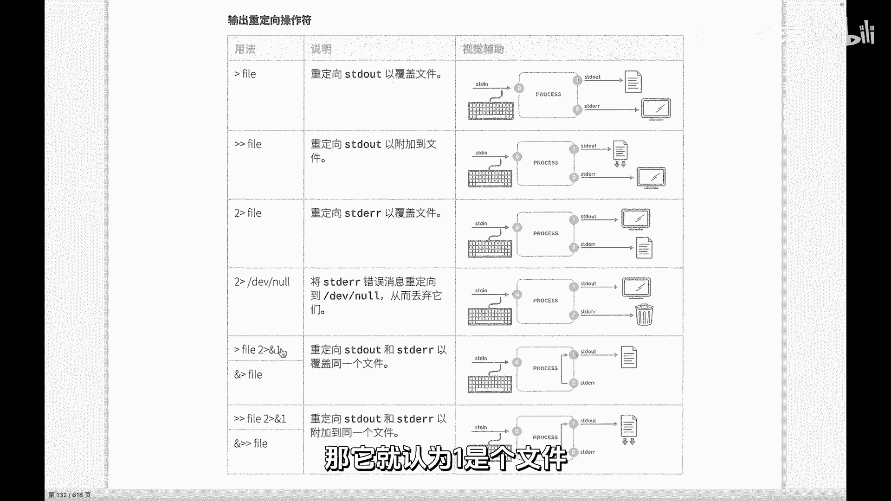
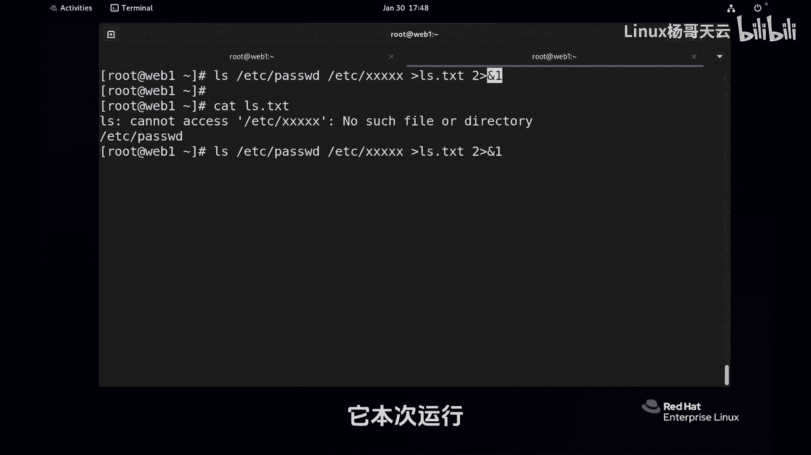
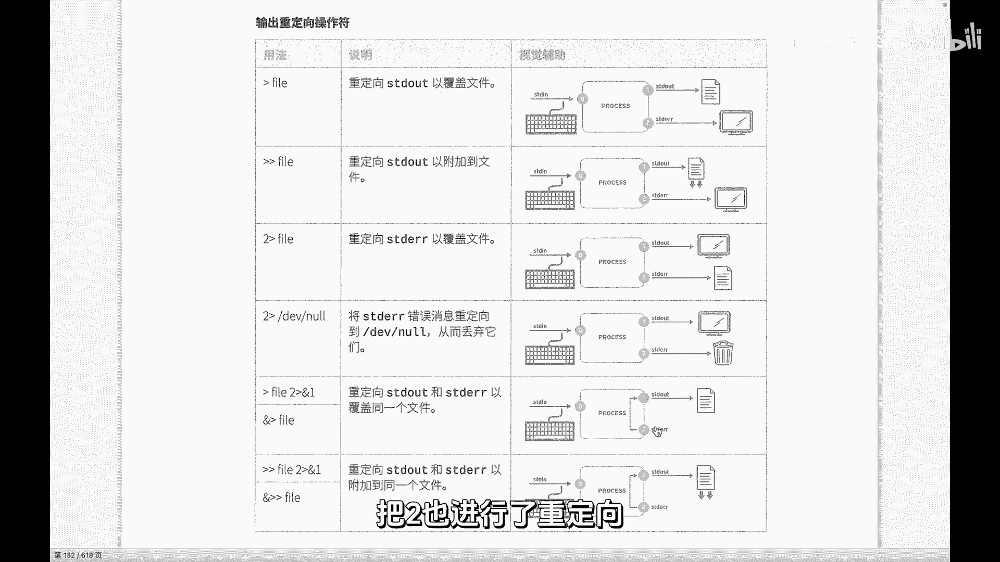
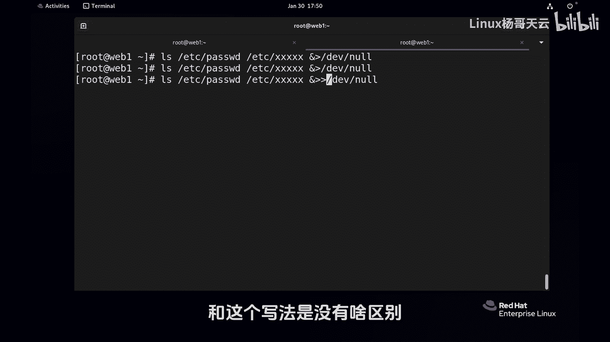
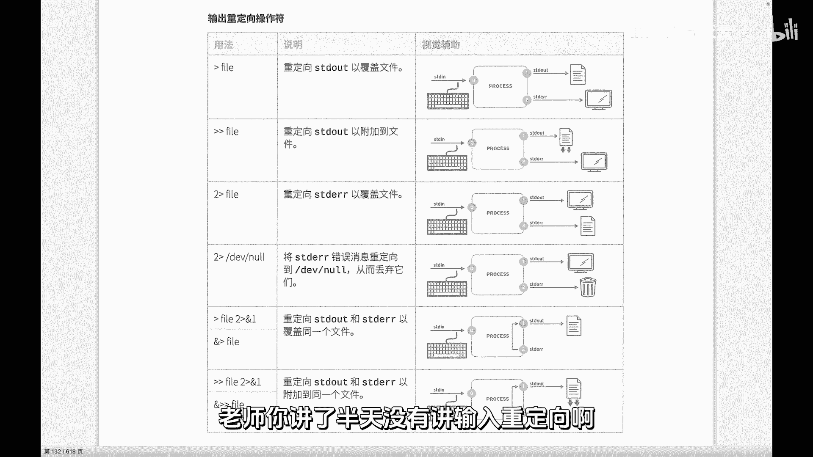
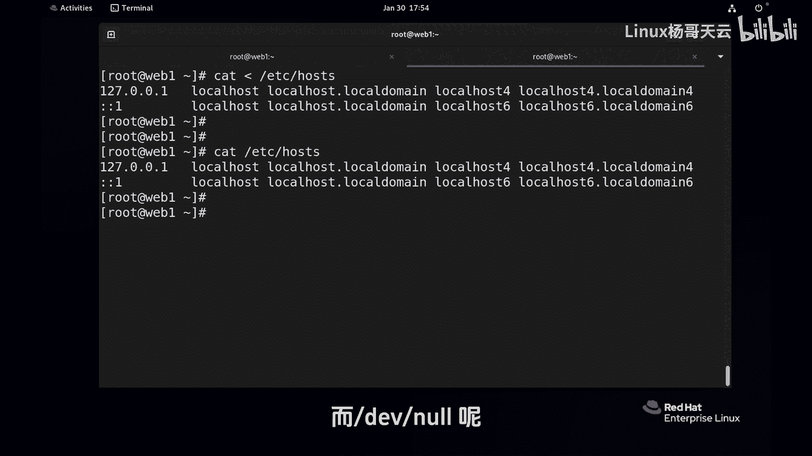

# 史上最强Linux入门教程，杨哥手把手教学，带你极速通关红帽认证RHCE（更新中） - P32：32.／dev／null是垃圾桶吗？ - Linux杨哥天云 - BV1FH4y137sA

好各位，我们继续来看，刚才给大家讲到了这个重立项的一些基础用法，也就是针对标准输出和标准错误进行重定向，通常指的是到文件里面去，但有些时候呢我们可能不想要错误信息，这个时候就会有一个特殊的文件。

这个透视文件呢叫根下的DEV下的N，你可以想象成这是一个垃圾桶，我们如果把消息重定向到NL里面去，这个消息就丢掉了啊。

如果你们想要的话，就丢掉丢掉了啊，我们可以试一下，比如说还是刚才的这个mini，类似这样的mini e DC l的这个叉叉叉，这个大家知道这个结果是不存在的，所以有报错，我们如果对标准输出呢进行重新向。

可以没问题，错误输出呢，之前我们是用的是这种方式到一个文件里面去，现在不想要了，那我们就可以到DEV下的now里面去，各位看这也是个文件，这也是个文件，在LINUX里面一件件文件，这是一个普通文件。

而这是一个设备文件，而到这里面去呢就进入到虚空了，什么都没有了，你别查了，也没有，本来就没有，它是直接相当于丢掉了，所以呢这个dv now呢是一个比较特殊的文件。

相当于垃圾桶，注意这个给我们windows里面这个文件删除的垃圾桶，不是一个概念啊，这不是把一个文件删除了，大家别误会，所以你也不要尝试把一个文件往里面扔，不是这个意思。

它指的是这个进程运行的时候产生的错误消息，注意不是文件，这个这个主体是错误消息，进行重连一下，这个大家要清楚，根据需要进行重连一下，那么也有可能我们连正确消息呢，也不要也丢到垃圾桶里面去，这都没问题的。

接下来呢这个用法各位看到有点特别啊，这个他还搞了两种，那么很显然正确输出到一个叫file里面去，到file到文件里面去，而错误输出呢，诶好像你看这个写法很别致啊，大家看那个箭头就知道了，绕到这来了。

它不是到文件，不是直接干到这个文件里面去，而是直接什么哎过来了，过到一里面去了，而这个and的一这种写法，它指的就是文件描述符一，同样and2，那就稳定描述符2and3，稳定描述符三。

所以注意对文件描述符呢，在我们这里的这个重名项里面的写法，就是and的挤，那大家可以这样理解，正确输出一到文件里面去了，前面那一不用写吗，而二二这个输出到哪儿去呢，到文件描述符一里面去。

而不是到一这个文件，如果你把这个and去掉，后面写个一，那他就认为一是个文件。

这怎么讲啊，我们来试一下，你看这里要这样写的话啊，我们先把前面的清一下，这个进程运行的时候有正确消息到这里面去，没问题，而也会有错误消息，错误消息呢我们也进来重定向到哪去呢。

and1就指的是文件描述为一，所以结果呢也没有显示，我们可以查看一下IOS点TIC好，两行都有，因为一个进程这一次运行它不存在什么追加，你下一次运行如果还运行一回，你再运行一回的话呢。

这就覆盖了嘛啊它本次运行不存在啊。

不要想着这个会覆盖到它，这个不是这个意思，他只是把他的这个重音向到这去了，当然有的同学说这太太麻烦了，这个写法实际上我也不这么写，我一般用什么呢，用这种符号。

这混合输出就是你的and后面没有跟什么描述符，那它就指的是，同时就指的是和上面那个黑的效果是一样的，指的是把我们的文件流收复一进行了重新下，把二也进的重类项。

这就是我们的混合输出，双打啊，看一下，所以这种写法实际上什么没有什么改的，这么写太太太痛苦了，因为我们一般情况不会，不会写成那种上面那种形式，先把一给重零一下了，二再重零下到一里面去，而是这样写。

就是啥都不要了，就是什么消息都不会显示，我们在很多时候去运行一个程序的时候，我们不想要的消息，你产生的是不管是正确消息，你也别给我刷屏，错误消息你也别给我刷屏，那我就直接全部到文件里面去。

或者全到什么呢，全到垃圾桶里面去，这可以吗，看到吗，你到底是想全要放到一个地方去，还是呢全不要在于你啊，这个是覆盖，那比拿文件来讲的话，只是覆盖垃圾桶呢，不存在覆盖，那覆盖不覆盖都一样。

那如果换成两个符号呢，那就追加再追一次，那这里面内容就多了嘛，对不对，就很多好，所以我我觉得呢一般用这个花儿符号，暗的符号大概率都是干到垃圾桶里面去，这种多一点也没有什么所谓的追加和覆盖。

和这个写法是没有啥区别。

因为本身垃圾桶里面东西你也捡不回来，这大家听懂了吗，下面这个用法呢基本上不能说没意义啊，如果后面跟的是垃圾桶，那你怎么弄都是一样的，如果后面跟的是个文件，你想要覆盖，那就用尖想不覆盖的就是尖尖。

这个大家听懂了吗，其实际上是比较的这个简单啊，有同学说老师你讲了半天没有讲输入重定向啊。

对我好像没有讲，所以呢输入重定向呢，它的用使用场景呢可能偏少，更多的是输出重定项，比如说看一个场景啊，我现在是应举出来的啊，可能你你现在还用不上，大家知道cat它后面默认是跟的是文件。

看这个文件里面内容，我们看一个内容少的内容，那我后面如果啥也不跟呢，你看我如果什么都不跟呢，他会什么效果，他没有效果，他说我没有输入的东西，我从零读的时候呢，零本来是个文件，但是你没有跟文件。

那我不知道从哪儿读，那就像这样看回车诶，你输一个它显示一个，你输一个它显示一个，最后直到你CTRLC给他终止，有人说这样写行吗，这样写也可以，这样写的好像很长得很怪异的样子啊。

这边有个有没有一个空格都可以，书上的话都是有空格的啊，我就是不习惯假空格的，有人说这命令和这个命令这有啥区别啊，老实讲，从命令运行的结果上确实没有区别，但是它的原理机制不一样，这个呢是标准输入。

就是您原来是文件，原来是文件读入的，这个呢其实是改变了方向哦，好痛苦啊，所以我们说的输入同类项呢，可能用的不是那么多啊，当然有一些特殊场景，我们接下来会给大家讲一个案例去用，这是一些特殊的情况。

包括那个垃圾桶啊，NN我再次提醒一下，第一滴香浪不是一个理想的垃圾桶，你不能这样想，你不能说哎，老师，我能把一个文件，像这样EDCR的host文件定义V到long里面去吗，你就大错特错了啊。

我刚讲过它里面放的不是文件，是进程产生的错误消息或正确消息，你这么命令执行没有错，这个命令之后就把垃圾桶搞坏了，本来人家是个垃圾桶，是个正常垃圾桶，你结果你把这个文件拷过去，相当于垃圾桶就毁了。

你把垃圾桶给毁掉了，这个文件呢就变成了前面这个文件，不是你想要的效果，而你想要的是把这个文件干掉，你干掉你为什么要使用它了，你干掉使用它不就可以了吗，RM就可以了，而EV none呢。

它是进程输出的结果。

我们可以往里扔，而不是文件听清楚了。