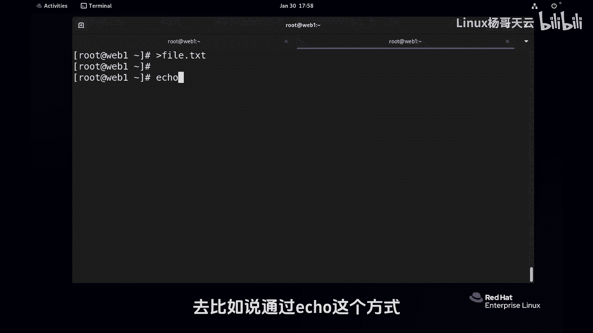
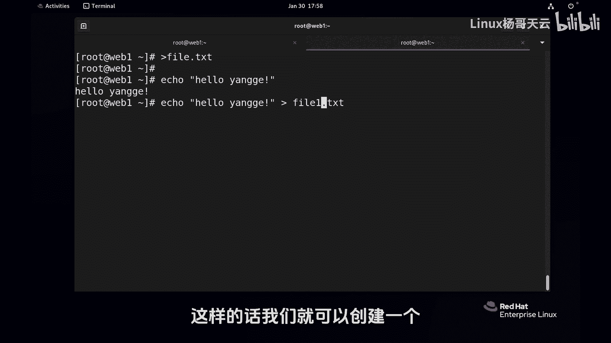

# 史上最强Linux入门教程，杨哥手把手教学，带你极速通关红帽认证RHCE（更新中） - P33：33.带大家看几个文件重定向的简单案例 - Linux杨哥天云 - BV1FH4y137sA

好。

下面我们来看一下那个重定向的一些简单案例，而且我们也会随着课程的讲解呢，在后面不断的用到，前面我们是练习一些简单的一些例子，比如说之前给大家讲到的，像这样去新建一个文件啊。

没问题，当然它也会覆盖一个文件，大家注意啊，然后呢呃我们也可以呢去，比如说通过echo这个方式。

对后面表示跟一个hello元格，这个本来是显示在屏幕上，各位看到了吗，我们可以直接重定向到一个文件里面去。

比如叫file一点TS里去，这样的话我们就可以创建一个。

快速创建一个文件，内容呢就是hello，杨哥，我们看一下啊，内容当然不会有那个引号。

引号在这里呢有没有其实都可以，最好是加上，因为我们呢有空格之类的，这样的话可以快速创建一个文件，这个只是创建一个单行的文件，如果我们想要快速创建一个多行的文件，用同类项吗。

可以这样之前给大家不是提过cat吗，cat它本身是什么呢，这叫什叫什么来着，后面跟上一个文件，那现在我们和文件不跟了，我们跟什么呢，我们就跟一个这样写一个，比方说file2等TXT。

大家知道cat这个东西啊，它本身是给他个内容。

然后他输到一个地方去，那大家想到书带的地方去到没问题，比如说我们前面给一个内容。

给一个etc password，后面呢到一个地方去，这没问题。

也只是改变了输出的方向，没有改变输入，那我现在什么都不跟，这样的话呢，这样回车我们看没有显示对吧，111222333回车。

那么什么时候是结束呢，CTRL加D我们看一下fire2有三行内容，所以这样的话，我们可以利用重力向来串一个多行内容，就这么简单，有同学说CTRLD你输几行呢，它本身是读入内容，它应该是从文件啊。

我们没有给文件的话，那我们就从键盘读入，然后呢输到这里面去，同学说不是覆盖吗，注意一个进程，本进程不存在什么覆盖，只有下一次运行的时候才会进行覆盖啊，所以112233不会覆盖，这个没有问题。

我们按CTRL加D来作为这个中指没问题，但如果说你要写一个脚本，创建一个多行的文件。

那肯定不能人工的去按CTRL加D啊，这个时候怎么办呢，这个时候后面就加个哎，重新降。

没写出来是吧，file3是新的啊，后面我们加一个特殊的一个写法，一般你可能在很多地方见到的是EOF啊。

可能多一点，其实并不是说一定是UF，这地方是一个标记，跟刚才的区别就在于这个标记1122啊。

杨哥他都没有结束对吧。

但是你看我打了羊一行当中出现的，和上面这个结束符相同的，结束符的名字的时候会结束了。

所以我们可以用这种方法来在脚本里面，去创建一个多行的文件。

最后的结果是呢file3点TXT被创建，肯定没有，最后这个杨哥，因为杨哥是一个结束符号，那到这就结束了，所以就相当于输入的时候，遇到了这样一个阳的话呢。

就结束了，这个在很多书上，或者在很多地方写的是这个叫EOF结束标记。

那很多同学就会误会说一定是EF吗，不是是一个很特殊的一个标记，好这样的话我们创建了一个多好文件。

另外呢还有一点是我们可以这样，比如说我们现在创建一个羊一点TSD。

再搞一个扬二点TSD，再创建一个两三点TS好，三个文件的内容不用试肯定是没问题的。

但如果我们现在想把这三个文件合并到一起，怎么办，这内容合并到一起其实非常简单。

cut一下扬一点TXT，扬二点TXT，扬三点TXT应该是三行。

对不对，然后直接给他一个重新向到扬六点TS里面去。

这样的话呢就合并了这个文件，所以同样你可以按照这种方法来。

把N个文件里面内容读出来啊，当然你读的顺序，就是根据你那个给的参数的顺序。

然后你再搞到一个新的里面去，这都没问题，或者说呢我们还有很多，像比如说edit had去看文件内文件的头部。

看这个几行e DC password，他看十行。

我们直接把它重定向到一个test w b d杠六，不是说非要加TST啊，LINUX里面是没有扩展名这个说法的，来产生了一个新文件，TL也是一样，杠N5etc hd password。

后面呢我们到一个新的，比如说password杠六一里面去。

这都是可以的，所以前面的进程没有说并不关注前面的进程，我们关注的是呢我们后面的重定向的这个行为，所以重立项呢，回头会随着我们的整个课程的学习，我们会用的非常多非常多，也很有很多一些小技巧呢。

会在后边进行这个解锁，所以大家在文件管理之前，我们为什么先来了解这个文件重定项。

记住贴三个标准的文件描述符，012输入的输出的和错误输出的。

我们改变它的方向，还有一些符号，比方说像这样的表示稳定，描述个一啊，还有呢DD下的long，这是一个空设备文件，任何的消息呢从营销到里面去将会灰飞烟灭。

