# 史上最强Linux入门教程，杨哥手把手教学，带你极速通关红帽认证RHCE（更新中） - P34：34.轻松学习Linux管道 - Linux杨哥天云 - BV1FH4y137sA

哈喽各位小伙伴，我是杨哥，下面我们继续带大家学习LINUX的一些知识，在前面我们给大家讲到了重定向，那重定向跟今天我们看到的管道呢很相似，但是有不同的点。

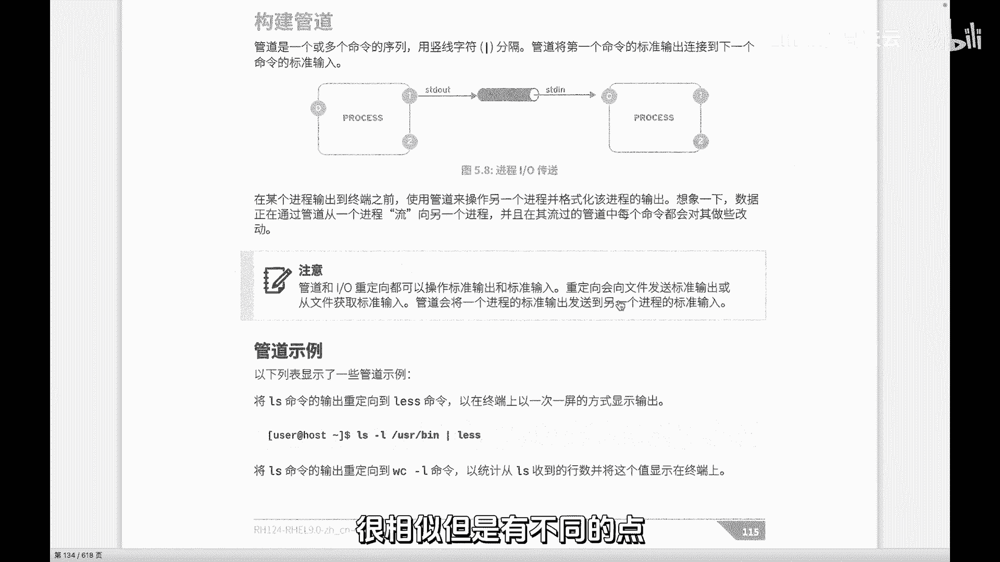

大家可以去对比一下啊，那在前面讲到重定向的时候呢，我们是将一个进程的输出，特别是输出啊，那也可以输入我们改变它，比如说输出的方向，就比如说我们将这个进程它产生的消息，产生的这样一个输出。

可能我们知道有正确的，也有错误的对吧，我们将它重新放到一个文件里面去，这个文件呢可以是一个常规文件，也可以是我们的这个DEVNN这样的特殊文件，在以后我们讲到，比如说去做MYSQL备份的时候。

我们希望呢他备份的过程当中的一些成功的，也可能失败的一些信息，我们能够记录下来，那通常我们的这个备份呢是通过计划任务，比如说在晚上执行的这个时候，我们没有实时看到电脑屏幕。

所以我们可以通过最后的这样一个重定向，产生的一个信息来了解，比如说备份的一些情况，这里总之大家看到是将进程的输出的结果，输到一个文件里面去，当然对于这个D一V3long这个特殊设备文件啊。

我们也知道有一些进程，比方说我根本就不关注你产生的什么结果啊。

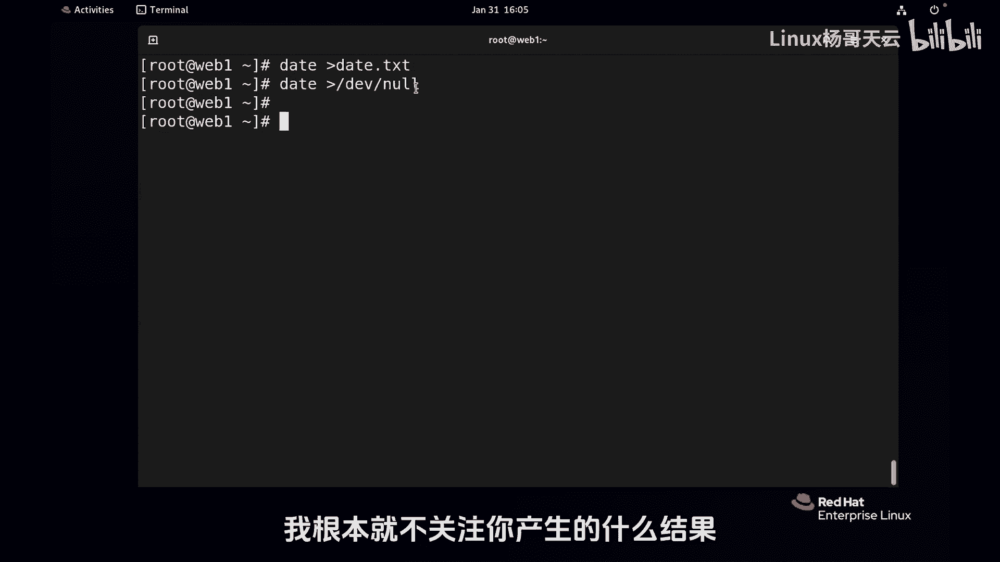

我不想要，我不想看，那就给他重新要到一个，我们所谓的垃圾桶里面去，那今天我们看到的管道和它有什么区别呢，其实前面大家看到都是一样的，都是我们的这个进程运行的过程。

它会创建会根据打开的文件呢产生相关的文件，文件描述符012，那这两个更多的就是我们的输出嘛，然后它是将这个进程的输出，准确的说是一标准输出是传给另一个进程，而不是传给一个文件啊，前面我们的这个重立项啊。

是将我们的标准输出，比如说标准输出改变它的方向，可能是到到这个所谓的屏幕，屏幕给大家演，也演示过，它其实就是一个终端文件，然后呢也可以是呢我们指定的设备，这样一个普通文件或者一个特殊文件。

它甚至可以是硬盘，甚至可以把硬盘前面给他写写进去啊，破含了硬盘，那这个管道它不是，它是呢大家看到这边有个管子，它是将前一个进程的输出来，直接作为后一个进程的输入，你看这个进程本身它是应该是从键盘读入的。

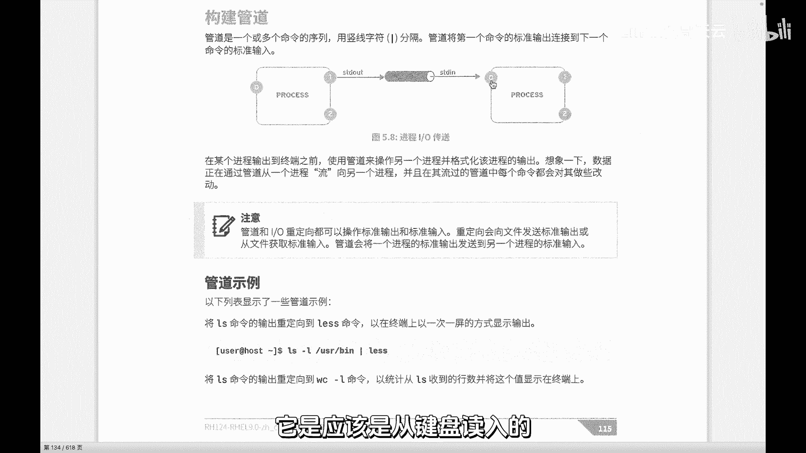

但是呢我们相当于借助于管道，来改变了它的方向，那为什么要这样用呢，我们给大家举一个一个小例子啊，因为说到这儿的话，大家可以想到流水线，就是我们生产生产车间里面流水线工作，比如要生产生产一辆汽车。

那肯定不是一个人干完的，一个人也干不了，而每个人他只擅长他自己的那一点，那同样LINUX里面的命令呢，也没有哪一个命令强大到能够干所有事情，特别是我们在后面做日志分析的时候，在做一些文本的处理的时候。

他不可能强大到能干所有事情，但是LINUX里面我们可以去组装mini，就是通过多个命令，像流水线一样的这种组装，然后来达到呢我们想要的效果，换句话讲这个管道可以好多层都可以。

比如说啊我们先用一个后面会讲到的mini，p mini是用来查看进程的，我们加一个参数啊，先加一个参数PSAUX啊，这个后面会讲到，我们先先不去解释每一个参数的意义啊，先回车看一下好。

大家看到这个时候呢，由于屏幕比较多，我可能要想向上翻，这就麻烦了，这个输出消息呢，当然有同学说我把它放放到一个文件里面去，慢慢看，可不可以，可以啊，这个没问题，这个就不是管道了哈，这就是你自己要要去看。

那我们可以在这个时候加一个管道，一个竖线，竖线就是管道，当然严格讲两边其实没有空格都可以啊，这个管道书上的话呢，人家都是管道两边都是有空格的啊，这个没问题，前一个进程PSNUX它本身会输出到屏幕上。

大家知道它应该是显示所有信息。

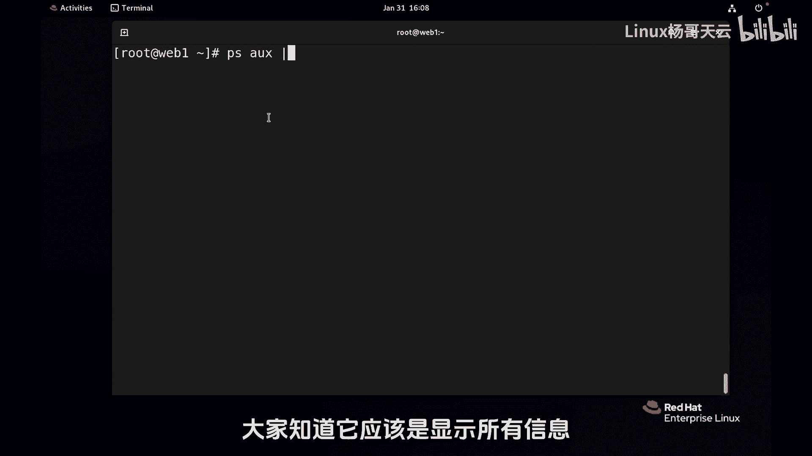

那这个时候他不会了，他把他的这个输出输给我们后一个命令，然后来作为后一个命令的什么一个输入。

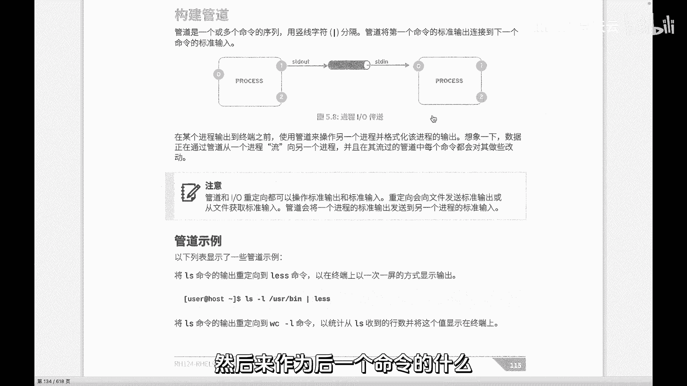

后一个命令什么命令呢，比如说我们用到的lets，大家知道这个lets本身啊，再强调一下竖线两边可以没有没有空格啊，然后这个nets呢它本身是一个这个命令，用来查看指定的内容的，但是它是没有输入的。

它本身单纯的看这个进程，或者这个命令是没有输入的，但是我们把它放到一起呢就有了。

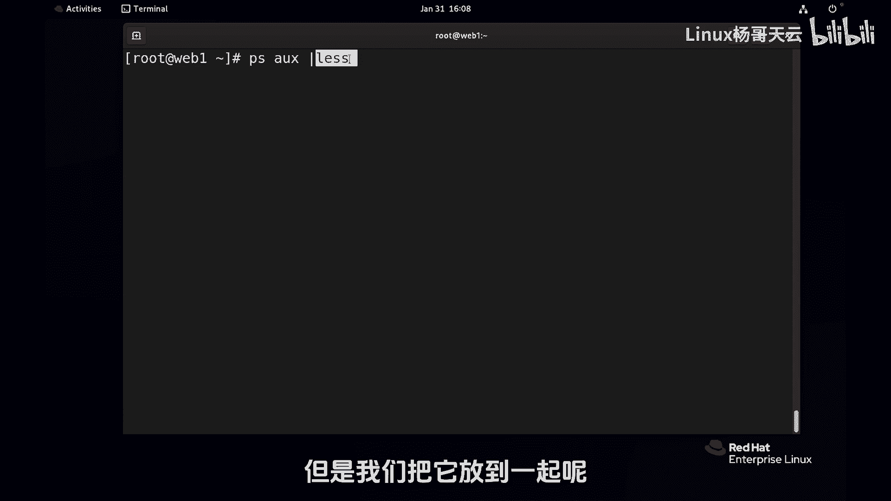

就相当于PSAUS的结果，这个输出标准输出那一屏就会传给net，而作为net的输入，他有输入，但是他的输出我们管不管呢，这个是你的事，就要不要我们把他的输出再重新向。

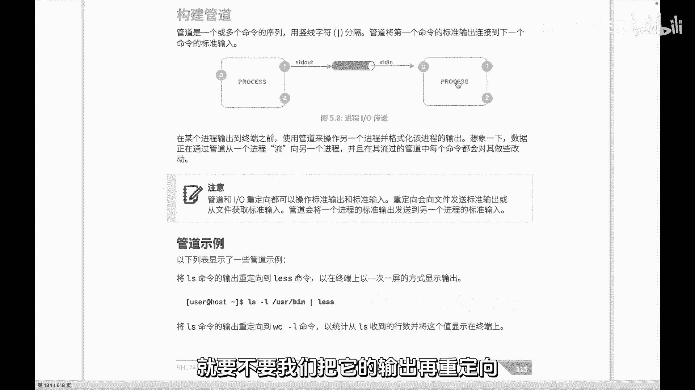

这是你的事好，那现在我现在就回车了哈，那大家看到他是这种分分页显示，然后可以上下键去显示都可以啊，按Q退出，这是一个最基本的一个一个管道，那当然我们也可以呢，比方说像这个PIUX啊，去查看所有的。

然后呢大家看到这刚才我们查看的时候，其实假如说有两列，不是假如说啊就是就是有其中有两列，我们还是刚才来看一下had，就看十行，大家看到了吗，就看十行穿个head head本身也是一样。

它是没有输入这个地方没有输入的，但是现在有了，那比如说我们现在要按照CPU排序，这个时候呢我给大家强调一下，现在还没有讲到后面的命令，我们只用一下这个salt用来排序的，后面的就加上，比如百分号CPU。

刚才那个是百分号CPU和百分号memory，好摆放CPU回车他就排序了，好当回车以后呢，我们看到它是好像是降序排列啊，降序排列这里有一个符号啊，我们先用一下加号和减号的问题。

而不是sorry升序排列排列啊，这是后面大的，在后面减号的话呢，用的用的多一点啊，我们是放在前面的，那这个时候我们这条命令是查看，按照CPU进行排序没问题啊，那我们同样可能不想看所有的。

我只关心哪些进程占CPU多，比如看前十个，甚至是看前前五个，这可以看到了吗，好有同学可能显示乱一点，没关系，因为折行了，这个是一个两个三个四个显，显示前前五个啊，前五行不是前五个，Sorry。

因为这个也算一行，在他看来是算一行的，因为他是前面的内容，大家不要先纠结前面内容，前面内容其实也比较也比较比较简单啊，然后就是按照CPU排序啊，这里呢说到这的话呢，还不妨也说一下啊。

前面有同学可能在别的地方见过，这个P的效果是一样的，P呢就是person啊，百分号百分比啊，但这些显卡我觉得很别扭啊，那同样如果换成内存的话呢，换成内存也就是那个叫memory的话呢。

它就是按照内存的使用情况进行排序啊，到底是加还是减呢，先不管啊，总之我先表达的意思就是说我们一件事情，比如他做不到，去筛选出我们指定的要的那种内容，那我们就要对文本进行处理，交给下一道工序。

再甚至交给下一道工序，再交给下一道工序，就是我们甚至可以呢再交给下一道工序，去干嘛了，去打印出进程的名字，只列出进程的名字，比方说使用AWK或者说side这样的一些机制，去做这个什么相应的一些动作。

我们可以欠很多很多的管道，因此呢LINUX的命令可以说是比较精湛的，比较简单简单，但是它的功能非常强大，强大之处就在于呢，可以用像管道或者重立项的机制，就比如说刚才我们也可以结合起来好。

我们把它放到我们PS的JS里面去，看到了吗，前面它是用来干一件什么事情，没问题，它的输出将作为它的输入，当然它的输出呢你愿意改变也可以，你不愿意改变呢也可以。

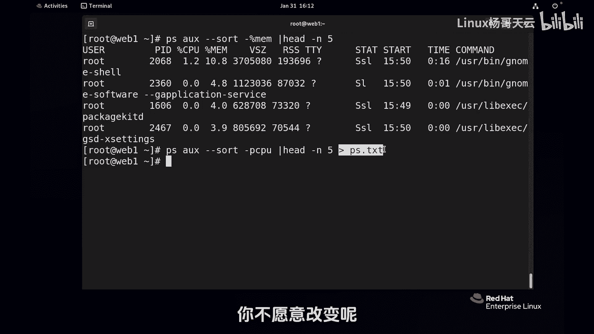

就看你根据你的需求来定就可以了，所以这就是刚才大家想象一下，可以在评论区，也可以在呢咱们的弹幕上，各位回复一下这个管道和重定向，它到底区别在哪儿了啊，那我给大家可以往前翻一翻啊，翻一翻这两张图片。

你可以对比一下啊，我没办法没法放一起，你看一个进程在重定向的时候讨论，讨论的是一个进程，就是对一个进程的输入和输出，我们该怎么处理，是放到表屏幕上呢，还是放到文件里面去呢，而如果说我们像生产一架飞机。

一辆汽车一样要去做复杂的事情，这个时候呢就可能由多个进程来完成，我们就需要用到管道，也就是加工的这个结果，然后再送给下一道程序去加工，再送给下一道程序加工，再送给下一道程序加工好。

那我们教材上举的这个例子，都会看到LS杠L什么USI下的B啊，net一下方式是一样的，看到了吗。

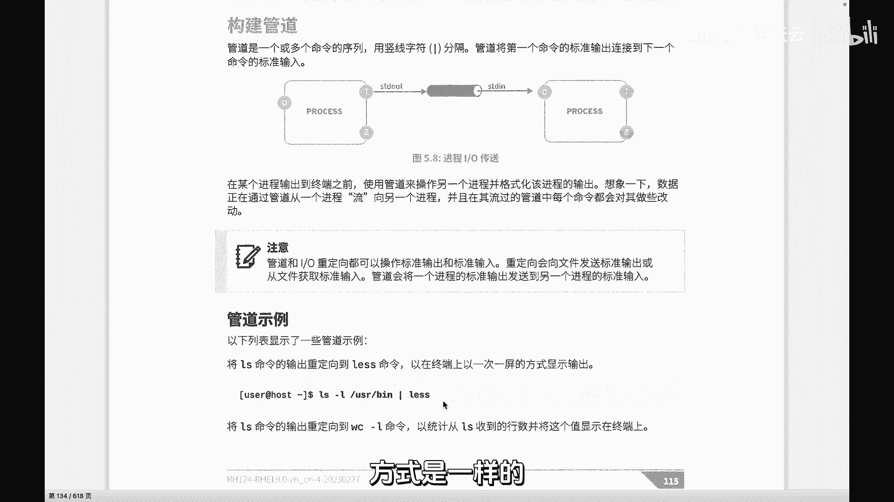

没有什么区别，比如说现在我们看到教材上面举的这个例子啊，什么LOS啊，啊其实LS杠L号就是LL它是个别名。

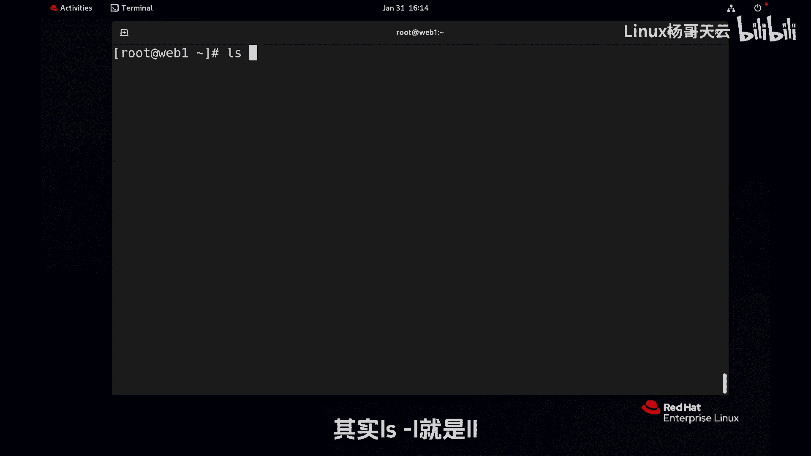

后面我们会讲到LL人家是啊，看的是哪呢，看的是这个嗯。

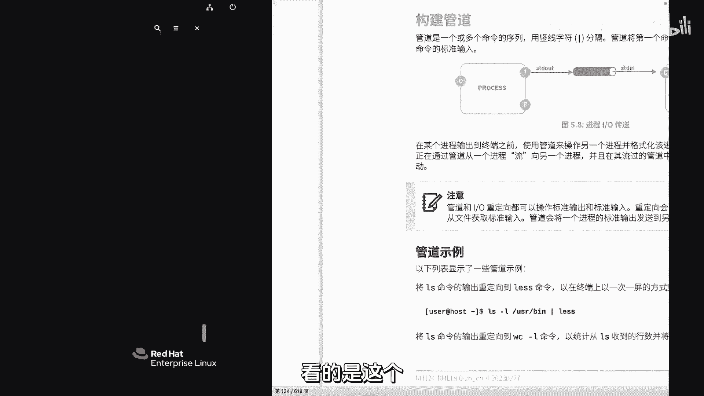

USR下bean的，好的，我们看一下USR下bean有很多的这个命令很多，那他干嘛了呢，他做了这个分页显示没问题。

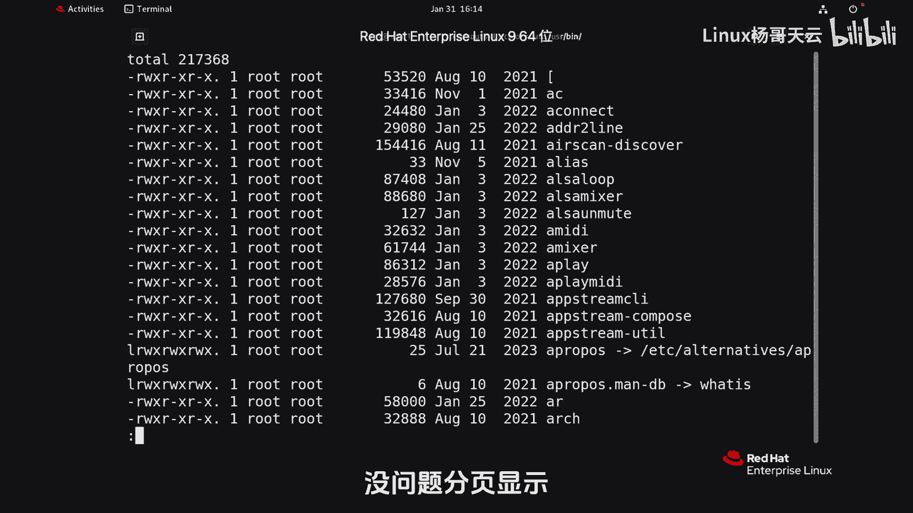

分页显示，然后上下键都可以好，这就是我们啊教材上举的这个命令，那大家看这些命令呢其实也比较简单，你看这个命令LSWC杠L统计一下行数，哼WC是用来统计这个呃，文本呢就像word里面有统计字数，统计行数。

统计单次数的这样一个概念啊，WC我好像前面用过，对不对，咱们讲过L是行啊，我们统计行，然后还有呢就是像这个LLS杠T和T呢，是啊，我们可以去卖一下啊，或者说help一下啊，他应该是按照时间戳的。

这种时间的排序进行显示，然后呢这个had前面十个，最后把这十个呢好，force turn前十个啊，看前十个改变了文件啊。

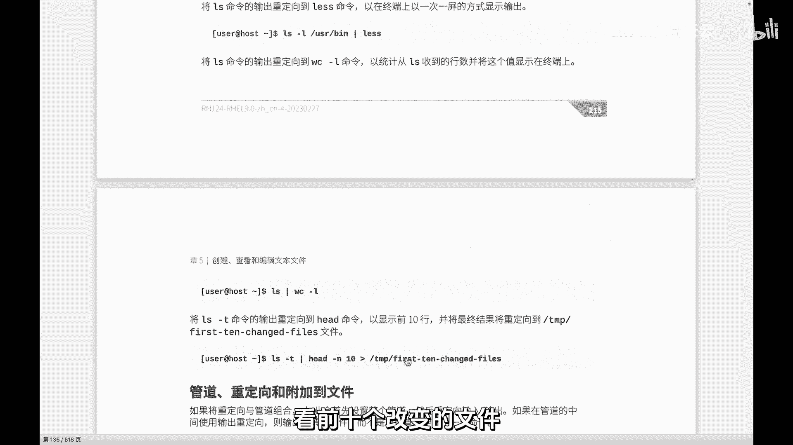

前十个改编的文件呃，ls s杠T呢这个我们可以看一下帮助啊，有时候ls ls可以通过两种方式help，这有点多多，怎么办呢，找到了管道，看到了吗，管道nice一下，看一下。

这其中可能就有杠T当然也可以搜索啊，就这边选项里面搜索吧，钢T啊，这刚T大家看到他是排序by，通过这个时间新的应该是FORST就改编过的。

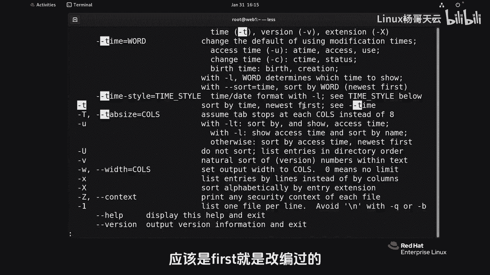

它同这个刚刚time一样啊，所以这里呢就是按照按照那个哪些文件，最就当前查看当前所有的文件，这个IOS杠T它只能查看当前所有文件，而且呢做了一个修改，时间靠前的，做了一个排序没问题。

那我们就关心最近十个改变的，最新的十个改变的，然后把这些文件给他提出来，放到一个地方去，到底下一步要干什么呢，这个就不知道了，可能我们的脚本会用到这个文件里面，内容去做一些事情。

总之就是管道这个东西呢非常强大，它能够帮助我们做很复杂的这种嵌套，能够帮助我们去做这种叫什么啊，你可以想象成刚才杨哥说到的生产一架飞机啊，或者一辆汽车，一道工序，下到工下道工序。

特别我们后面用到的文本处理，脚本呢用的特别多好。

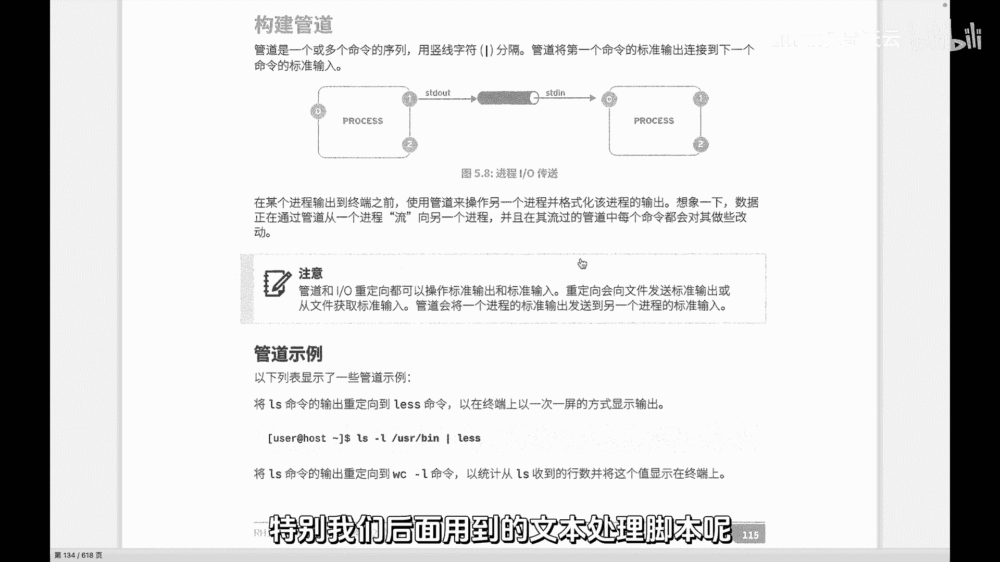

这就是管道。