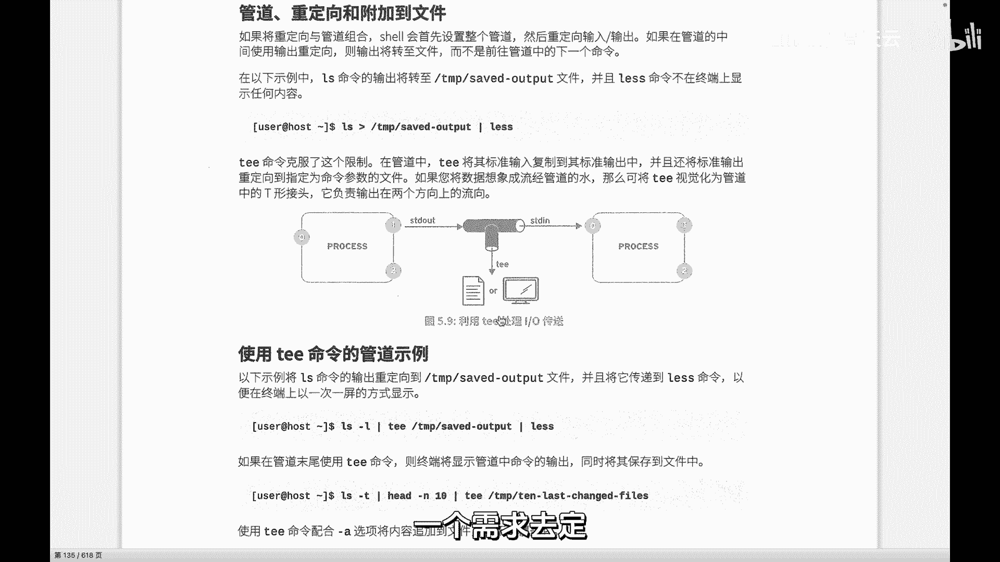
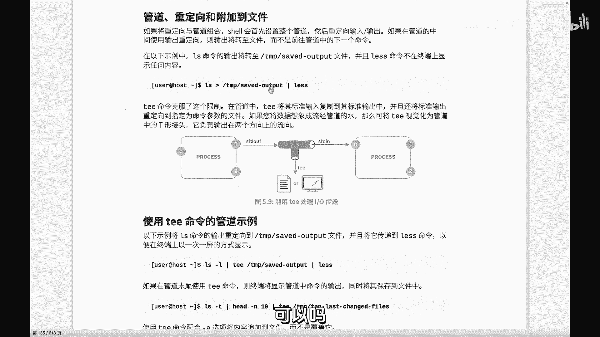
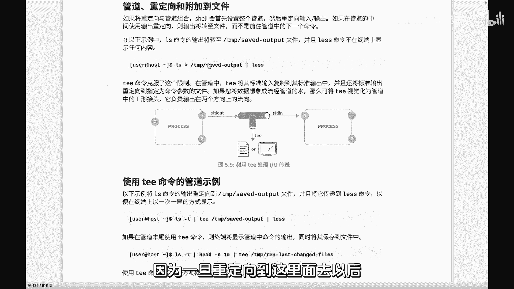

# 史上最强Linux入门教程，杨哥手把手教学，带你极速通关红帽认证RHCE（更新中） - P35：35.Linux特殊管道tee - Linux杨哥天云 - BV1FH4y137sA

各位小伙伴们，我是杨哥，下面我们继续来学习啊，前面我们讲到了这个管道，管道的话呢，它是两个进程，A进程的输出，作为下一个进程的输入，这个大家都应该没问题，而且我们知道管道还可以嵌套很多层，往后不断走。

也就流水线呢可以啊，十道工序，100道工序都可以，根据我们这个所要处理的内容的一个需求去。

那现在有这样一种情况，我们来看一下，我们看前面的这个命令，我们把它改成百分号码，显得好一点，先看看结果，这个结果呢是按照CPU的这个排序降序排列，然后显示呢五行，注意不是五个进程，因为这玩意也算一行。

这也是一行，一共显示五行，你别觉得多，是因为杨哥现在把这个屏幕放放大了，字放大了，所以折行了好多地方，但是我们假如说前面这个地方也想要呢，就是他的结果又想要呢，又想保存到一个地方去，怎么办呢。

很显然是不可能的，那相当于是直接把这个结果就传给了head命令，但是我们就想保存一下，保存到一个文件里面去，如果按照常规的方式是做不到的。

因为管道本身在前面给大家已经看过啊，它是把一个进程的这样一个输出，作为下一个进程的输入，没了到这就交给后一个进程去处理了，就前面处理的这个东西呢就没有了，这个管道很特别。

T管道就是我们家里的那个叫三通水管子，你看按这个进程A进程，也就是IOS的这样一个一个一个结果，本身LOS这个结果是想输到这个文件里面去，但是呢又想传给lets，这个可以吗，大家想一下可以吗。

前面用的是个重定向，IOS到一个文件里面去，后面lets点LOS，点TS点TS里面去，这个没问题，大家都看得懂，那他其实已经把那种重立项了没了，然后你再给这个lets没有东西。

less s根本看不了什么东西，因为它没有内容过来，相当于nice说你在这儿放我鸽子吧，你让我等了个寂寞，你不是管道传给我吗，你给整到这个文件里面去呢，那还有啥呀，我根本就收不到。

这个相当于就一条管子水从前面流到后面去了，说不行，我们得整一个三通，相当于呢把这个结果复制一下，但是我们要的呢还是这个效果，要的是呢把内容还是要保存到这个文件里面去，那和前面的命令有点小区别啊，没关系。

前面那个命令我们一会还是可以用啊，这些都可以用，就根据你的需要来走就行，开始可能不太熟悉，但我们这个时候就可以呢，哦IOS把这个地方换一下，肯定不能用重定向了啊，你你要是重定向的话。

大家知道他就直接就走了，我们用一个很特殊的还是管道，就相当于在刚才这个位置呢，把这个重定向换掉了，还是管道给他这个TT呢，就相当于三通，这个大家可以看成是IOS的，这个结果也是重定向的。

到一个文件里面去了，它也是重定向，只不过借助于这种相当于三通的形式，T到一个文件里面去了，看到这里了吗，IOS然后T到这个文件里面去，但是它不影响刚才的这个消息，这个我们的输出会影响往后再走。

相当于你可言给他复制了一份，做了一个分叉的形式，你到底想在哪个地方，比方说在你家的哪个地方，哪个房间安这个管三三通，那你取决于你的需要，你想要把哪一段内容保存一下，比如说那我们这里呢。

就很显然是我们把LOS的这个结果，保存在一份到这个文件里面去，但同时呢不影响它往后流。

这大家听懂了吗，现在我们回车看屏幕上有说明next没问题，可以看，同样呢我们的IOS点TC里面呢也有内容，看到了吗啊呃如果大家不放心的话呢，我们可以使用一个data a来看。

我们将结果到到比方说到N个一点PS吧，后面nice本来是这个效果，我们把这边换掉，不能使用，我们使用这种特殊的管道T管道，三通管道，那它会到这个文件里面去，同时呢lets也可以看到，OK没问题。

看这个文件里面杨哥一点TC也有内容，那这个T管道啊，嗯我们先来说一下，不是说一定要加到前面，是看你要用到什么地方，那再比如说我们在之前的这个命令，我们还是来拿出来，我就想把它的结果保存一份。

那我们就在哪个地方加了，就是你想保存哪份哪一段的结果，那就看你在哪加T，并不是说我一定要加到前面，好比如说我们现在就想想要把这一段，他的这个结果呢，然后保存到文件里面去，然后呢再在屏幕上HD一下。

显示一下，这段的话呢，它是所有的进所有进程吗，还不是说嗯前前五个不是它所有的，那我们在这个地方，相当于你先不要着急加这个T，因为先加T呢就不好看，就像那个他们教我打，那个湖边麻将的时候说那个混儿混的话。

可以代表任何牌，但是呢你最好不要先把它放到你的这个表，123456里面去，你先拿到外面去，你看你最后缺几个，所以呢我我也给大家讲，就是你现在先不要用T，你先把你的命运输好，然后突然想说哦。

我想把这一段的结果相当于安个三通，在它们之间安个三通好了，那就先离远点，怕溅一身血啊，加个三通比PS一点TSC，你看你就当这地方不存在不就行了吗，各位看到了吗，相当于这个前面的这个结果，从直线上看啊。

那么就是传给了他，同时呢它是分叉给了后面，它不影响往后走，这大家不知道听明白没有解释半天，你看到这个文件里面去，同样也多，不会影响往后走，那如果说前面你敢加个重定向，到一个文件里面去可以。

但最后呢pad就没有东西了，大家不用怀疑那个PS，PS一点TC里面应该是什么呀，各位想到吗，就是他的输出嘛，对不对，他的输出既到文件里面去了，同时呢也夸到后面去了，有同学说老师我不想在这安三通。

行不行行，我们换一个地方再回到原始的命令这个位置，这是原始命令，大家都能理解，这个命令的结果呢是把我们所有进程的输出来，并且排了个序，按CPU这个后面这个进程呢。

他是接着前面的内容做了一个五行的一个显示，前五行的显示没问题，那我们想要重零项呢，如果说还是那句话，想要重新下，把这一段保存下来，给P2点TST大家想会怎么样，这个没问题，但是屏幕上就不会显示了。

家听明白了吗，屏幕上就不会显示，它就会重新跳到这里面去，我也不想按回车了啊，那如果想保存下来，但同时呢又不影响他往后走后走，其实就应该显示在屏幕上，那我们就在这儿加一个TTP2点TST好。

回车的结果大家应该能猜得到，首先我刚才讲过，你这个T3通管你装在哪儿没装到，这是我们不想要它的东西，我们装到这儿了，那很显然就是前五行的内容，第一会到一个文件里面去，同时呢也不影响往后走。

屏幕上也会看得见，而如果后面这个我画白色的这个地方呢，是一个重定向的话呢，后面就看不见了，不会再往后走了，它就没有一个分叉的形式，所以大家听明白了吗，你想在哪装三通。

你就把原来的那个什么你原来的管子你该弄好，弄好，到底是五层还是六层弄好，然后你在那去加三通就可以，你先不要去影响其他的啊，原来的你先在哪在哪加就可以，你想保存哪段就哪加，那T呢你可以认为它也是重定向。

但是呢它不影响我们的前一个进程的，信息输出的这个结果不影响往往后再走，这是我们有时候很有必要的啊，我们需要做这样一个动作啊。

那按照按照这个咱们的教材上面呢，可能大家也看得懂看啊，LS杠L我们不去再敲了，LHS杠或者LLL也行，最后本来了没有，这当中这段也就是这个竖线T这一段，那就是分页显示。

但是我们又想把IOS的结果整个呢到文件里面去，同时也想分页显示，那就加个T在这加个三通，那下面这个内容呢你看到了吗，这个内容LSS杠T啊，T之前跟大家解释过，最后看前面的十行，看前面十行呢。

这个跟刚才我敲的那个是一样的，那本身没问题，但如果说你想看前面十行，这改成了这个竖线T改成了重定向，大于号也没问题，那他是会往这个文件里面灌的，但是那个屏幕上不显示，这个是不影响屏幕显示。

最后一个小A呢，这个大家看一下啊，我就不去演示了，很有意思，就追加，就是往这个文件里面追加附加的意思啊，你要是没有洗这个A的话呢，他就是覆盖T也是重新项嘛，刚才讲过A是什么，追加在底部追加。

然后呢这个不加的话是直接覆盖，所以再次提醒各位一下，这个T加在哪个地方，取决于你的需要，你可以先把原来的这个管道体系构建好，然后单独再加T，而且呢你想象成T是透明的。

加了以后不影响原来的水该怎么流怎么流，你只是在那做做了一个截取，仅此而已，所以T呢也是非常强大的一种方式，那再回过头来看这个呢，大家就应该很清楚了，本来想要的意思是把IOS分页显示lets。

但是呢同时呢他也想到的是，他说我把IOS，然后把这个结果重定向到一个文件里面去，同时也在分页上显示是做不到的，因为一旦重定向到这里面去以后。

我们采用的是重定向这种方式，那后面less就没有戏了，给大家听清楚了吗，各位在这里呢还有一点说明的是，这个管道不是所有的秘密都接收，能够接收管道，我们在后面会发现有一些命令是不支持管道的。

也就是它就没有管子那个口，它接不住前面的内容，他没法接它，不是管道命令，所以他就没办法去接收，这是那个我们后面会看到的啊，所以并不是LINUX里面所有命令都支持管道，基本上啊大多数都是支持的。

所以可以帮助我们来构建很复杂的一些命令，截止到现在我们学到重庆向他学习的管道，包括管道的特殊形式T这种管道啊，所以大家这个根据后面的需求呢，先模仿练习，然后在后面根据我们的想法来进行命令的组装。

