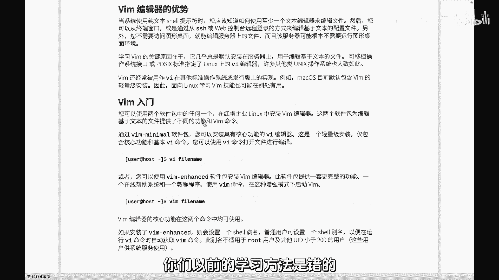
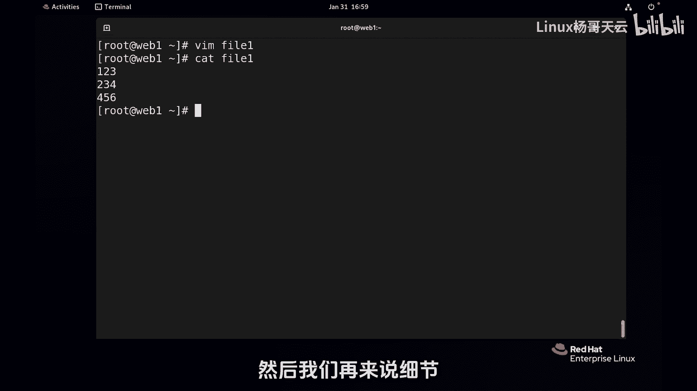
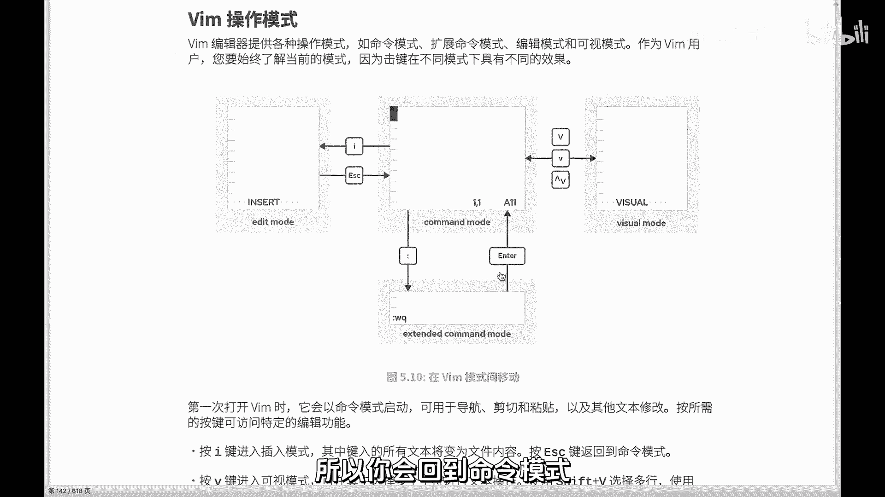
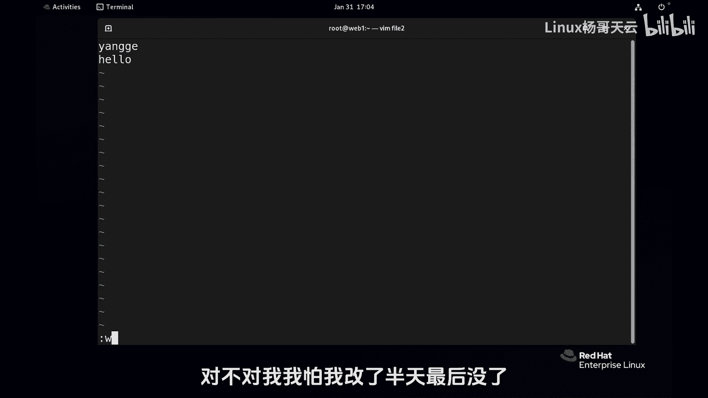
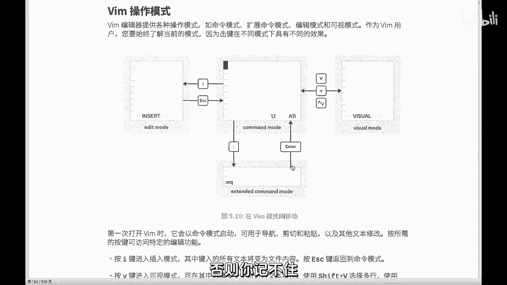

# 史上最强Linux入门教程，杨哥手把手教学，带你极速通关红帽认证RHCE（更新中） - P36：36.最强 Vim快速入门教程 - Linux杨哥天云 - BV1FH4y137sA

Hello，小伙伴们，是我是我还是我源哥，那下面我们将带大家来认识一个LINUX的神器，vi编辑器，之所以说神器，就是，因为我们每天都在用小道去编辑一个配置文件，大到了可能去改复杂的几几百行。

上千行的这样一些配置文件，我们都扣PH编辑，所以vi的这个使用简单的讲可以十秒钟学会，可以小白入门，然后也可以呢，很复杂很复杂是什么状态呢，就是我这么多年用，还有好多技巧，好多特性呢我也不知道啊。

或者我再也在摸索它和记事本一样，它是一个编辑器，不是编译器啊，大家搞清楚啊，它不是编程序的，它是用来他可以写程序啊，那么vi的话呢，我们每天都在用，所以要做到最终的一个境界，就是手中无剑，心中有剑。

人剑合，一见人这样一个状态，那这里的学习呢我没有卖关子啊，我想跟大家说一下，这个学习有一个误区，很多书上或很多人在讲AI的时候，包括很多大学的讲vi的时候，你一下就懵逼了，为什么它好复杂好复杂。

他上来给你怼了几十种用法，几十种mini，这个是不对的，开车你不是说上来就要了解车的各个部件，甚至是发动机的原理，你先开起来遇到什么情况，遇到哪个灯报警，你再去查，知道就行了。

你一开始你需要了解各种报警灯吗，不需要，所以这是个误区，这让很多人觉得vi很难不难，不说那么多啊，前面的所有的话就是告诉大家，你们以前的学习方法是错的啊。

那之所以错的呢，就是因为没有遇到杨哥，我们下面就是vi来做一个基本的入门吧，然后你知道这东西很简单，vi后面可以跟一个新文件，也可以跟一个老文件，比如说我现在把这个地方内容清空掉了啊，为了干净。

我是一个很爱干净的人，L1打开一个新文件，也可以给你老文件啊，大家注意观察一下底部，底部现在呢是没有这个没有这个其他内容的，你现在不要做任何的输入，不要说什么123456，因为现在还不是编辑模式。

还不能编辑，你按一个键，键盘上的I这个键，大家仔细观察底部发生的变化，I它这个时候就进入到了那个编辑模式，我们现在说123456，然后编辑完了以后怎么办呢，按键盘上的左上角的ESC按一下就行啊。

然后完了以后按shift加冒号，shift键加冒号，你观察屏幕底端出现了一个冒号，然后输入WW是写入Q退出回车好了，这个文件我们估计呢也就也就十秒钟，除了你编辑的内容哈，我们就说本身vi入门。

你已经会了车，你已经开起来了，然后我们再来说细节。

大家听懂了吗，你先开起来再说，这vi已经入门了，那下面呢我们看看这个vi呢，刚才在杨哥的讲解下，大家都会用vi了，而用的很帅很棒啊，咱先做不到见人合义啊，只有这样一个状态，做不到，没关系，不用着急。

那个是后来的事，但是呢还是有必要了解一下vi的一个，他的一个什么模式，就是刚才大家还记得我一开始打开vi的时候，我打开一个文件的时候，其实是不可以编辑的，当然也不能说不可以编辑啊，这个这话是不对的。

就不可以像我们刚才一样输123456，因为刚刚打开VI的时候是什么呢，放大一点，你刚刚打开的时候，它是这个模式，叫做命令模式，他只接收命令，你说的别的不好使，你输的123啊，当然123可能会是命令啊。

但如果你输的不是命令呢，那他就不接受你，只有说命令，那他才接受，那杨哥刚才安了个什么命令呢，安了个I，各位还记得吗，按了个I进入到了另外一个模式，屏幕的底端显示了一个叫insert，插入。

也叫做编辑模式，也叫插入模式也罢，编辑模式也好，总之就是可以写东西，可以改东西的一个地方，对吧好，然后我按了个I以后呢，屏幕底端就相当于从mini模式，本来他在这一天只接收mini啊。

只接受mini mini可多了太多太多了，多的我都受不了啊，然后按那个I以后，进入到这个插入模式或者编辑模式，然后我在这边写内容，那你想怎么写怎么写呗，爱怎么写怎么写呗，你光标键也可以移动啊，没问题啊。

然后完了以后我想保存，不好意思，这个模式它不接受保存，因为保存的话呢，它是要要切换模式的，它保存不了，那怎么办呢，它是需要在这个模式里面来保存，这个叫做扩展命令模式，看到了吗，它也是命令模式。

你要先按ESC回到这个主模式，我们可以把mini模式看成是进入一切模式的，最基本的那个模式，我们从这儿来的，最后也从这走，大家听懂了吗，你从这儿来啊，然后最后也从这儿走归为尘土啊。

所以mini模式是一切的基石基点基础啊，我们按了ESC回到了mini模式，有人说mini模式有什么显示呢，它啥也不显示，它最多就是显示一下当当前光标的位置，第几行，第几列它没有显示，换句话讲。

如果底下没有显示的情况下，那就是命令模式，大家听清楚了吗，然后我们在命令模式里面输了个冒号，有同学说不对啊，不是shift加冒号，你眼睛往那个冒号那个地方看一下，那个冒号是不是在它所在的键有两个符号。

一个是冒号，一个是分号，所以要要输上面的话呢，小袁老师都教过，我们要用上档键shift键，所以我们出了个冒号，你不要纠结，那个shift肯定要要的，然后输了个冒号以后就进入到了扩展命令模式。

换句话讲它是命令模式的一个扩展，可以接受一些更高级的命令，比如说保存退出W就是保存Q就退出，听明白了吗，然后你回车以后注意，回车以后你看我输了WQ以后回车，但也有可能呢，哎有时候回车怎么会回去呢。

这个扩展命令模式不是说你一定要跑的，不是说你上来以后就一定要跑，包括我们后面讲到的查找替换都可以，你查找替换完了以后你就跑了吗，不是你还是在编辑，所以你会回到mini模式。

所以很多模式就会自动回到命令模式，再比如说我现在重新进到刚才那个文件啊，刚才那件或者再来个新文件by2，然后按I键，你看底下没有显示，没有显示模式的时候，那一定是命令模式，按I我们输个杨科hello。

然后按ESC，这是什么什么模式，按EC是不是进到命令模式，我要保存，那这个时候要输shift加冒号，我只是要保存，就相当于我们在word里里面的CTRL加S1样，我没想走啊，我就是想保存一下。

我有这个好习惯啊，对不对，我我怕我改了半天之后没了。

所以回车你看一保存我们的扩展命令模式呢，一执行一个命令，要不就滚蛋，要不就离开了，要不呢就回去了，对不对，你要想再进到扩展mini模式呢，按个冒号吧，大家听懂了吗，好这是三个最基本的。

就我们玩vi的话呢，基本上三个模式最常见的三个模式，mini模式，编辑模式和扩展mini模式，这个扩展mini模式啊，有种叫法，江湖当中有一种叫法叫做末行模式，就是你的命令是在末行。

你看得见你在这书看得见，在命令模式里面输的命令啊，可能看不见，比如我们一会会讲到什么删除dd什么的，看不见啊，但是在冒号命令模式呢，你输个冒号以后，你输的任何命令都看得见啊，那那当然好了。

因为你有些命令很复杂，比如我们要替换什么什么什么扩展命令模式，做就没问题，这是三个最基本的，你没有到这个模式，你连走都走都走不了啊，有同学说可能告诉我你别的方法，那那不是常规手段，除此以外呢。

还有这样一种模式叫可视，这可视模式呢又有三种小的那个区分，可视大V大V就shift加V，小V还有了CTRL加V，注意这种符号在LINUX里面，在命令前面加个这个玩意儿，那表示的是CTRL。

这个指数符号CTRL的意思，这三种是可视，可视的话，就是呢哎你可以很清楚的看到你选择的内容，比如说一行一个块什么的好，这个不着急，这个模式呢也是相对来说不常见的，我们在一些特定的编辑会用得到好。

这就是我们三个模式的这样一个，模式的一个切换，先来到命令模式，按I键进插入模式，退出ESC，你想到这个模式呢，按这三个回车以后，它就会回来，你想要到扩展mini模式或者叫做末行模式。

那就按冒号在命令模式才可以按冒号，这儿不好使，这儿按的冒号，它就是个冒号，就执行完以后呢，它就会回到命令模式，或者是离开好，这个大家先了解一下，我们接下来就给大家做一些小的，一些一些这个事例啊。

当然还是那句话嗯，没有你想象中的，我们先把vi学的很强大，你学不了啊，你必须要实实在在的操作才可以啊。

