# 史上最强Linux入门教程，杨哥手把手教学，带你极速通关红帽认证RHCE（更新中） - P37：37.Vim的正确打开方式（上） - Linux杨哥天云 - BV1FH4y137sA

好下面我们带大家简单的把那个vi做一些进阶。

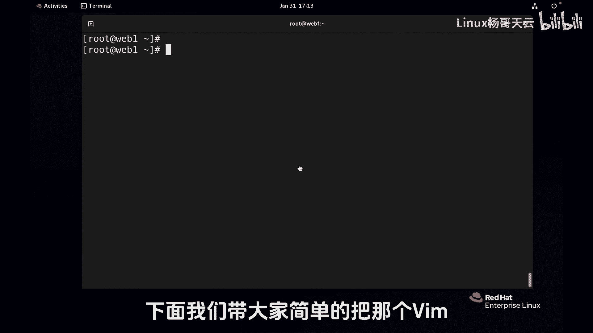

还是那句话，我们先了解一些基础的。

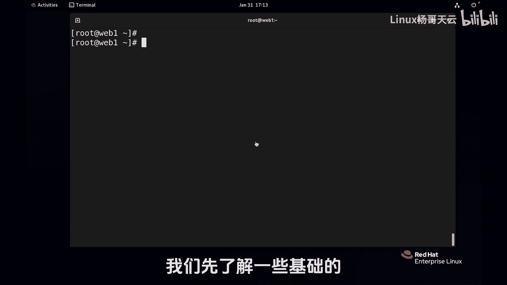

为了看到效果的话呢，我们现在先把这个环境还是清一下。

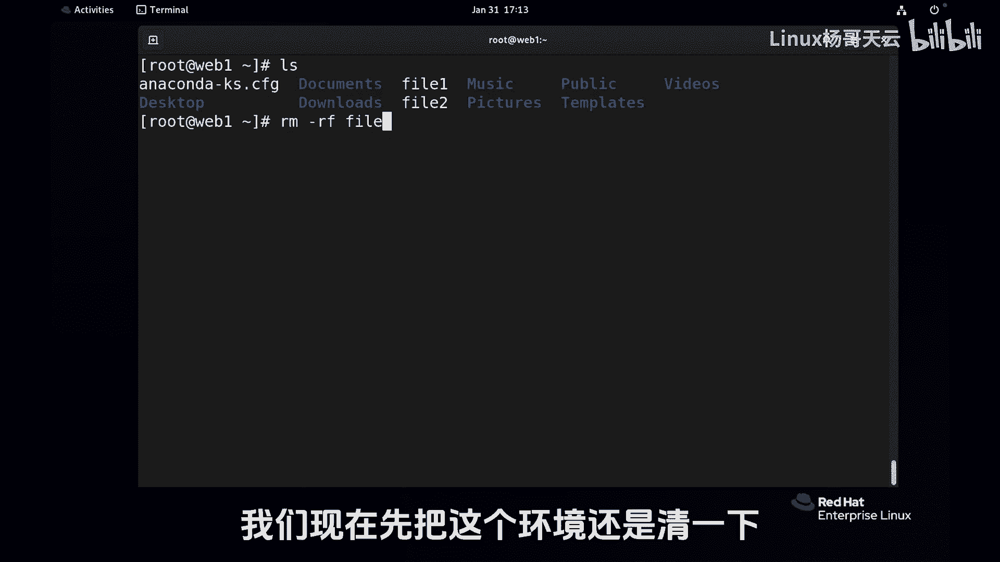

清除一些原有的环境，然后比如说我们先自己生成一个文件，一个文件进行修改。

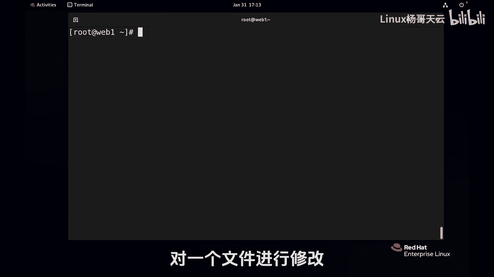

系统文件先不要动了啊，LL杠A这个大家看到所有文件，我们就将这个文件的前十行吧。

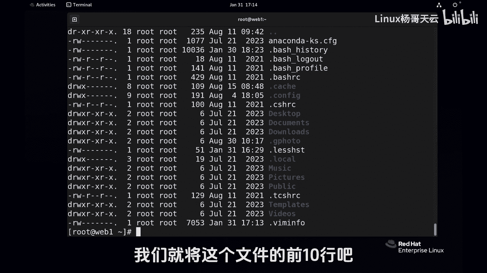

放到一个文件里面去，然后管道给pad，这个是前十行。

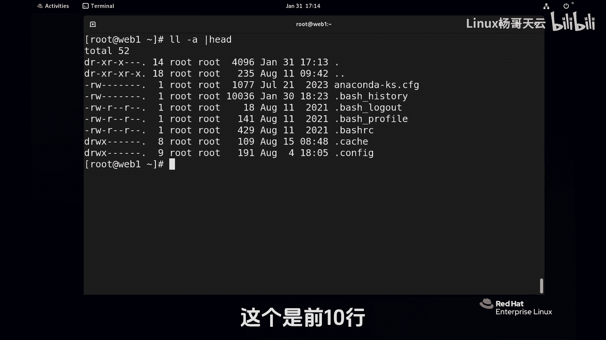

看商行少不少，再加两行杠N12行好，我们将前12行呢放到一个文件里去，这个时候可以借助一重印象啊。

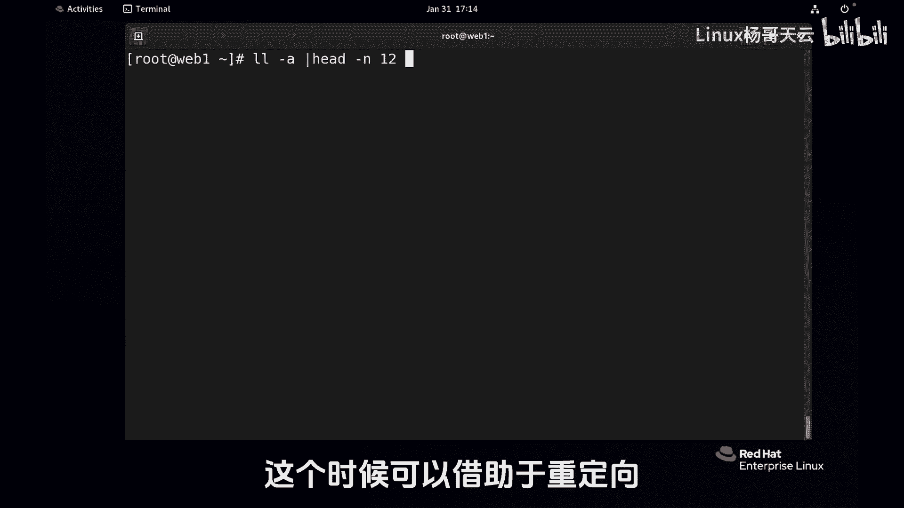

到我们的这个叫file点TS里面去，就拿这个文件做vi的这个操作编辑了啊。

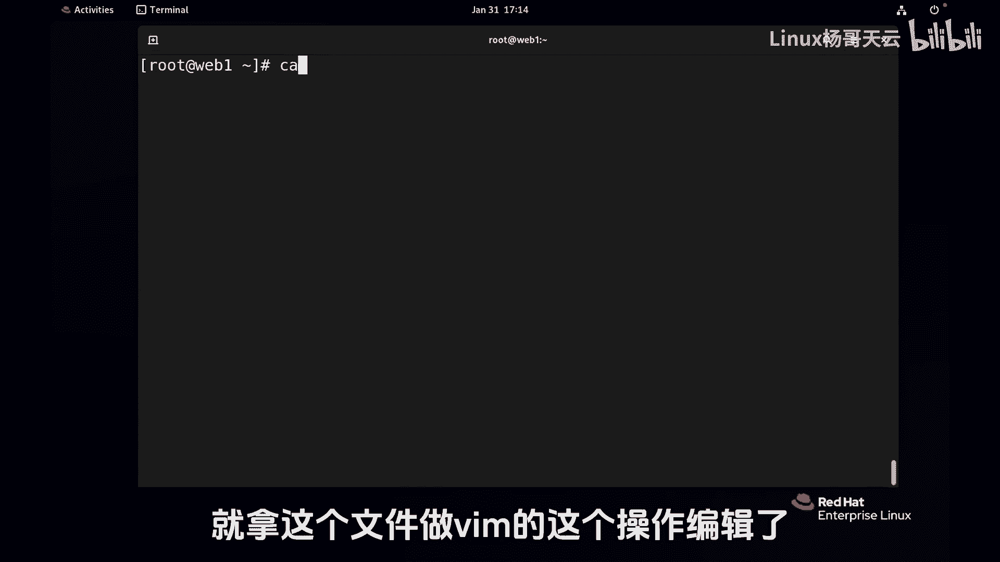

这个文件内容还比较显得立整一些啊，那这个叫VIVIF，有同学说这不是vi吗，增强vi啊，好我们打开一个现有的文件，大家这个时候可以拿出小板凳，拿出笔记本呢，稍微记一下杨哥的一些基本的用法啊。

我不会讲太多，我们后面会随着边用去便给大家去说啊。

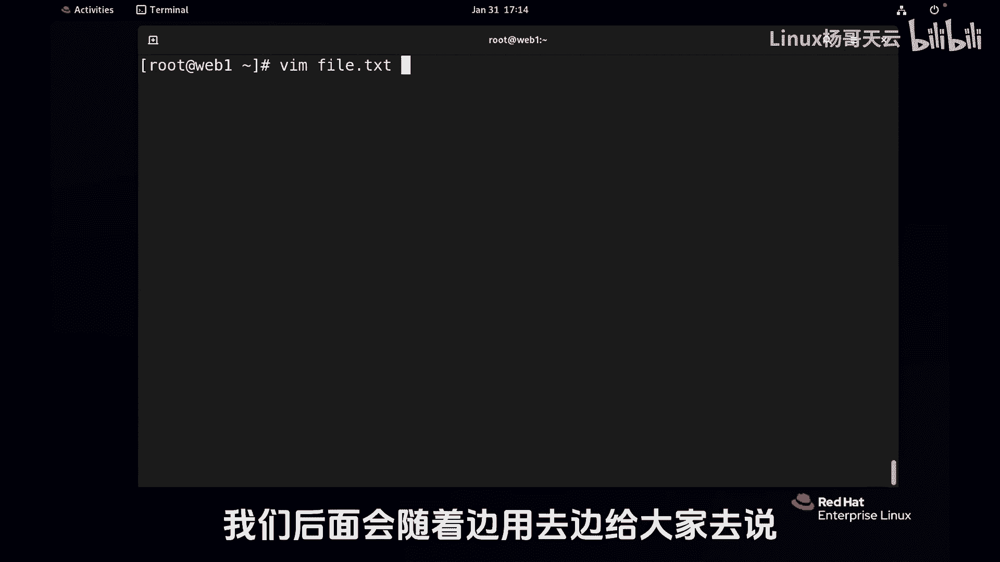

打开以后呢，这个进入到了哪个模式，各位应该知道，我没有在做任何模式切换的时候了，就是命令模式，命令模式不代表不能用的啊，这个大家要注意命令模式是接受命令的，我们在对文件进行编辑的时候。

命令模式同样用的非常多，比如说大家看到第一行我不想要，那你要删的话呢，你也可以可以进到刚才说的插入模式，按那个I然后一点点删除，很显然mini模式有些时候呢，他对这个文本的编辑是可以高效的啊。

更加有效效率的一个一个操作，在这里呢我们用的比较多的就是复制和粘贴，还有呢就是删除，先说一下DDJ的mini我们可以需要来吗，就没挨着什么教材不教材，我按一个dd先看一看，我输一下dd。

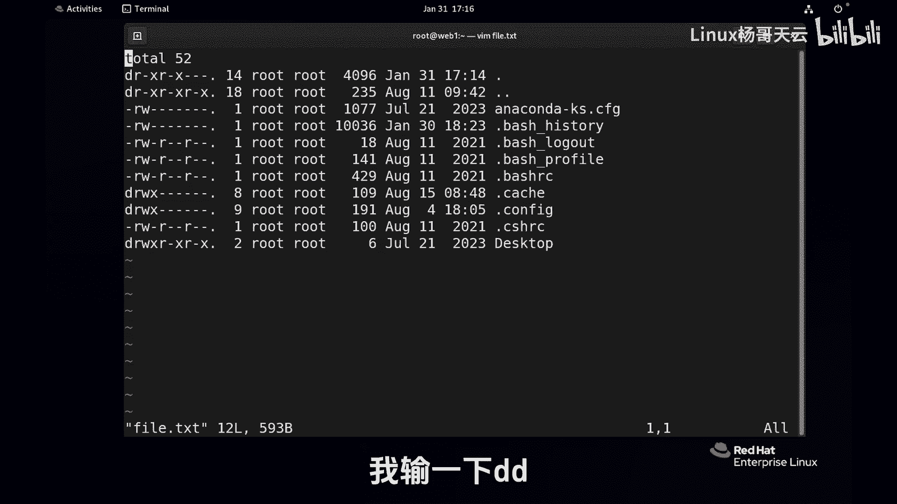

屏幕上不会显示啊，D呢是删除，凡是以D开始的就是删除，那到底你要删多少，这就跟跟这个D的周围的这个参数有关系，大家记住啊，DD是一行，那同样的3DD呢就是三行，那我们试一下啊，现在由于没有显示行号。

好别扭啊，是不是各位没关系，一会我们加一个在那个扩展命令模式里面，其实就是设置一下lumber就可以，你先别管它，记下了吗，现在我讲的是跟D相关的一些秘密，D是删除，这话是不对的，D是剪切哈。

你刚才呢你滴滴的一下呢是可以再粘回来的啊，可以粘到别的地方去的，此时此刻鼠标不要去碰啊，没有什么意义，在vi里面鼠标是没有什没有什么用的啊，好我刚刚删了，删了一个D，我现在鼠标最多就是大家比划一下。

让大家知道我要干什么，到哪个地方，假如说我要删三行，我要删哪三行了，这这这三行它会从光标这开始算一行两行，三行以行为单位DD就是一行，3DD就是三行，听清楚了吗，各位好了。

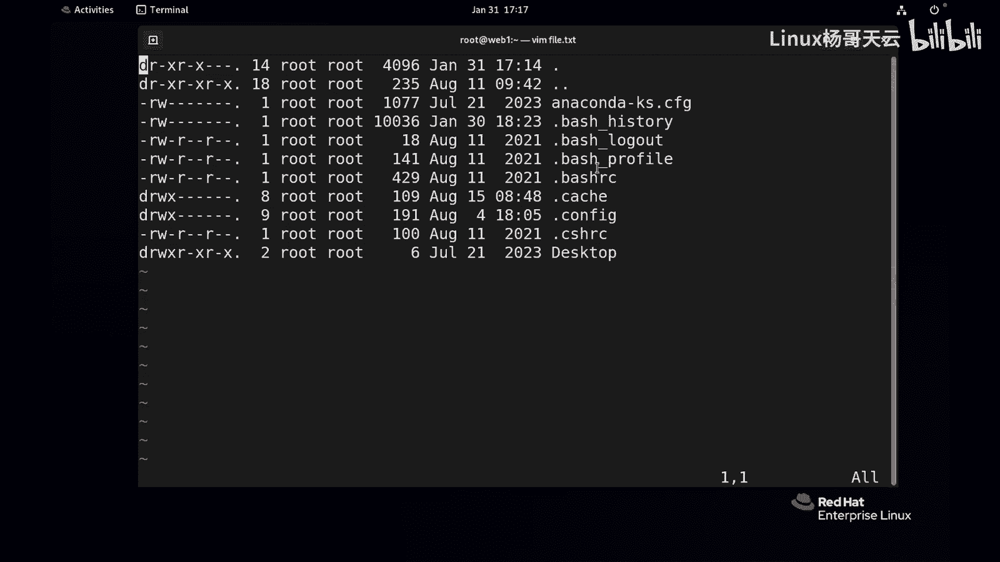

我现在说3DD啊，那就是三行嗯，这个内容大家应该看到变化了啊，是不是你不一定删行，你也可能删一个字，一个单词，这个我个人觉得没啥意思啊，就d word什么的，没有没有什么意思，DW啊，还有删别的呢。

后面再讲，你先记住DD是我们的删除，其实叫剪切啊，3DD呢就是三行，他是从哪数的呢，光标内行开始数的，所以说你有时候需要移动光标，它移动光标，你可以按照传统的上下左右键。

但是这里呢不得不说以前玩那个什么cs的时候，W前进什么后退什么S啊D啊，这样左移右移什么的，在vi里面，如果说你把你的手从键盘上那个基本键，也就是JKL分号，还有ISTF这几个地方拿走了。

本来手上来就应该放在那个地方，你拿走的话呢，你再回去有点麻烦，所以呢linux vi给我们设计了几个来代替光标，下拉左右键的，我觉得这个还是要学会的，这个东西显得高效，可以装装装装那个啥，对不对。

哪几个键呢，你要问我的话，其实杨哥现在已经不知道了，不知道哪个是左，哪个是右，哪个是上，哪个是下，不知道了，但是我心里面这个记得，比如说你看啊，我现在连连哪儿都没看，我我手都没看，盲打你说上上下下。

然后呢右右左左没问题，我一个字母一个字母的啊，但是你要突然问我一下，说哎你按的是哪几个键啊，我知道我按的是JKL还有这个H这几个键，但你要突然问我是哪个是哪个呢，我不知道没没关系，你先你先记一下。

可以H呢是左边的那个嘛，就右手的最左边那个是向左，然后呢L呢是向右，G呢是向下，K呢是向上，这四个键呢你不要去死记硬背，它到底是向上向下，不要急，你就试一下就知道了，不对你就反方向走一走就可以了。

听明白了吗，这四个键啊用好的话呢效率极高。

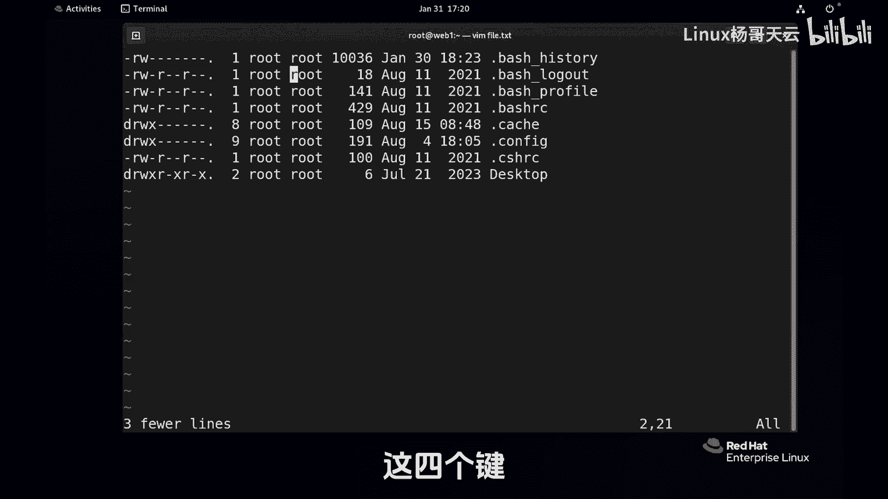

因为我们说他的操作是从光标所在行开始操作。

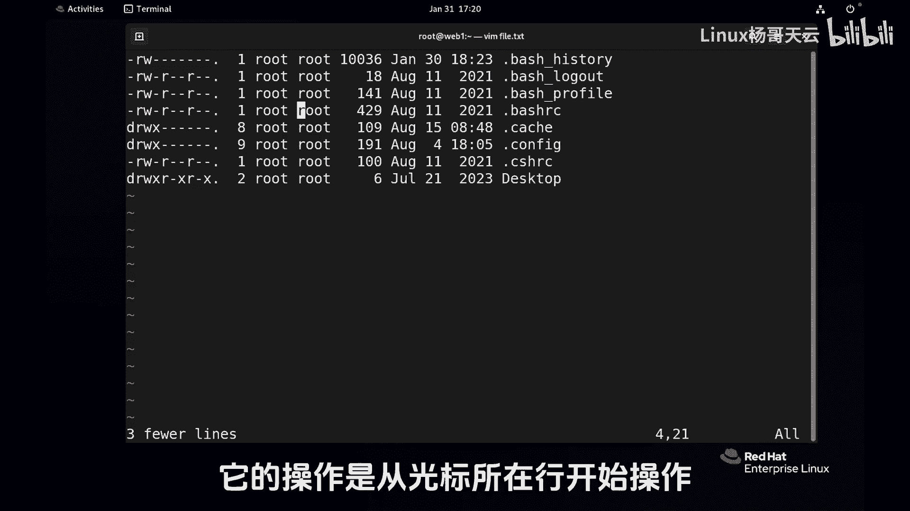

五光标移动在这一行，现在如果按2DD，那就是光标，这一行和这行鼠标只是给大家去一致的啊。

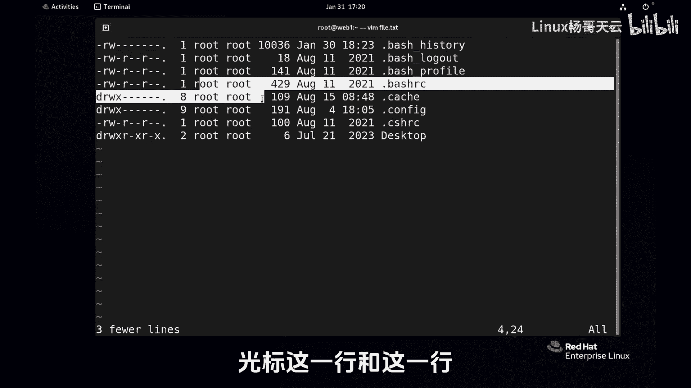

没有别的用，处，在vi里面，当然可以用鼠标，我们还需要设置环境，大家记清清楚了吗，哎呦我我刚才操作不对呀，我不想操作了，我操作的不对，我想那个滑回去怎么办。

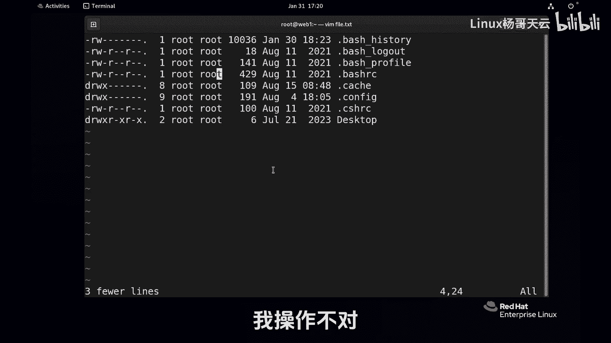

有返回的U按U按一次返回一次，按两次返回两次，然后你按住不撒手，当当当当当当，他告诉告诉你说已经是最旧的了，你还要按什么呀，你就相当于我已经撤销了好多部了，U呢是撤销，当然还有说重做。

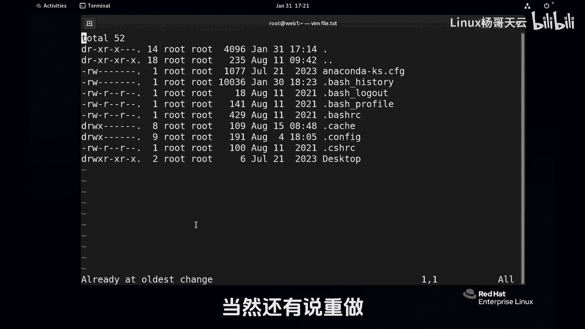

有没有了，当然有肯定有，别着急，那个不常用啊，那我还是想把D行删了。

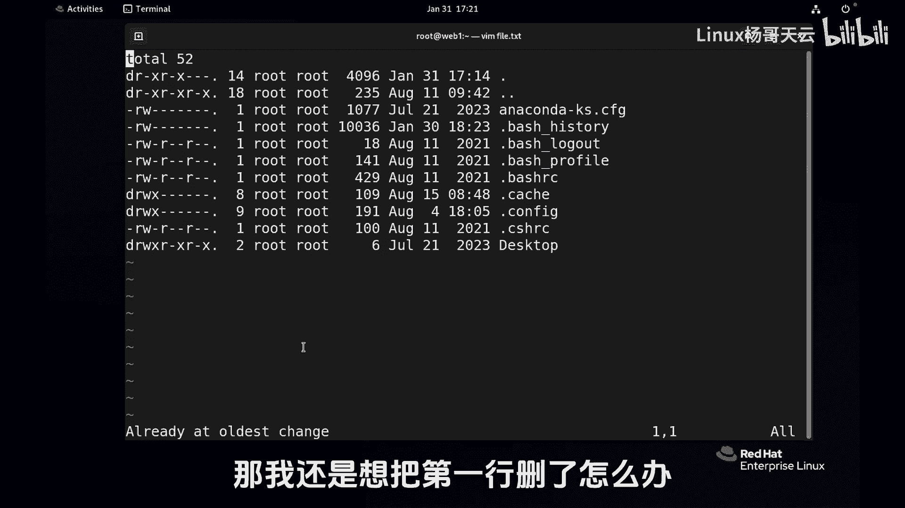

怎么办，给D好了，没问题，这是D是我们说的删除，其实呢杨哥刚才纠正了一下，应该叫做剪切，那另外一个叫YY就是复制，这是高频使用的东西，我现在先以行为单位啊，现在光标在这一行，我守了一直是在JKL分号啊。

还有H这个位置没有没有走过啊，现在我要复制同样的YY是一行，那SAYY的就是三行，这大家听清楚了吗，那个D是删除Y呢，是复制好了，那我们就YY吧，额喂我按了它没有什么效果，因为他可能会想又输了一行。

我给你显示个鬼呀，起码你得多多执行几行，我给你显示一下，提醒你一下，是这样的，AI就是真不要脸，那怎么办呢，那我们现在复制一下呢，可能为了粘贴，那是粘哪儿呢，你看我现在按PP就是粘贴那个单词。

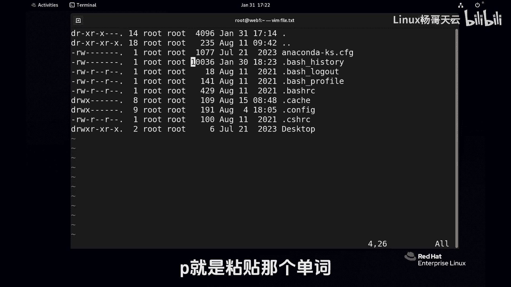

PPPPPP粘，这不好吧，到这行来注意它会粘到光标行所在行的下一行。

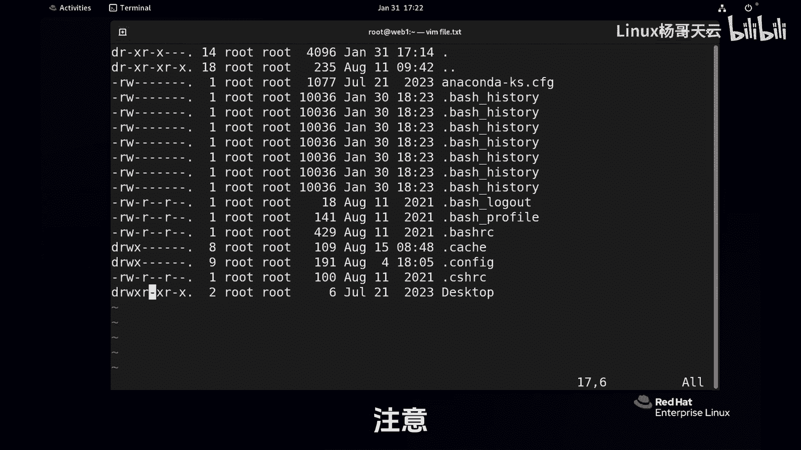

所以不管你光标到底是在行中还是行末。

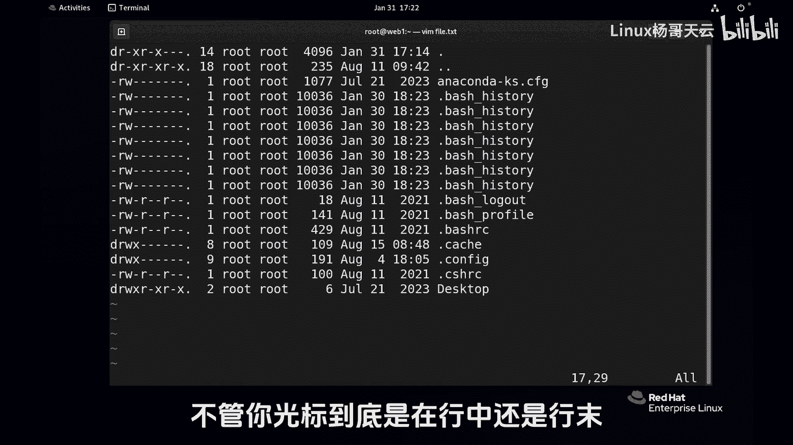

PPPPP没问题，删了啊，各位这就是我们的粘贴哦。

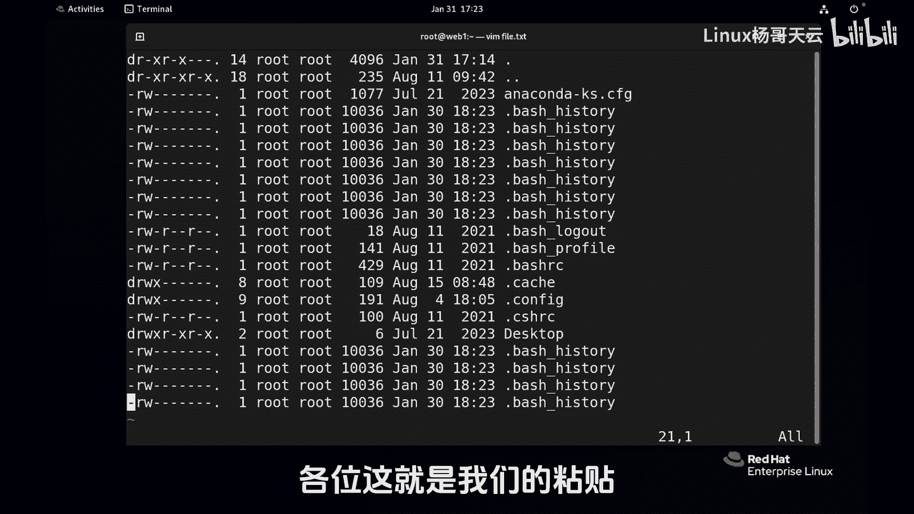

不想要了，撤销呦呦呦呦呦呦呦呦呦呦呦，到这了，我再删除这几个。

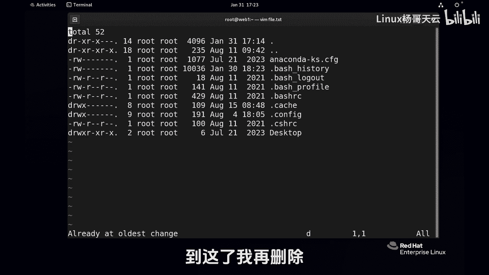

各位记住了吗，光标移动几个几个几个键哈，H j k l，你就尽量不要去使那个那个键盘上的，上上下左右键，我很不舒服的啊，所以你看我们在这按按这些键的时候，输这些命令的时候。

不管我输H还是J还是K还是L还是DD，它都是命令，因为现在你在哪，哪个模式在命令模式下面没有显示，就是命令模式，有人说很懵啊，你蒙什么呀，没有显示的模式就是mini模式，这大家记住了啊。

没有显示就是好事，对不对，当然我刚才说的DD也是一样啊，你看各位。

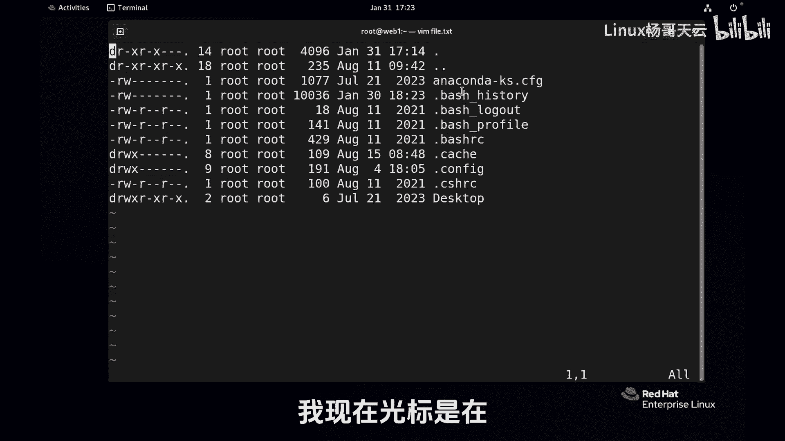

我现在光标是在比方说我想移到这一行，我想删除它一下，DDP其实就是相当于你看我刚刚做这个动作。

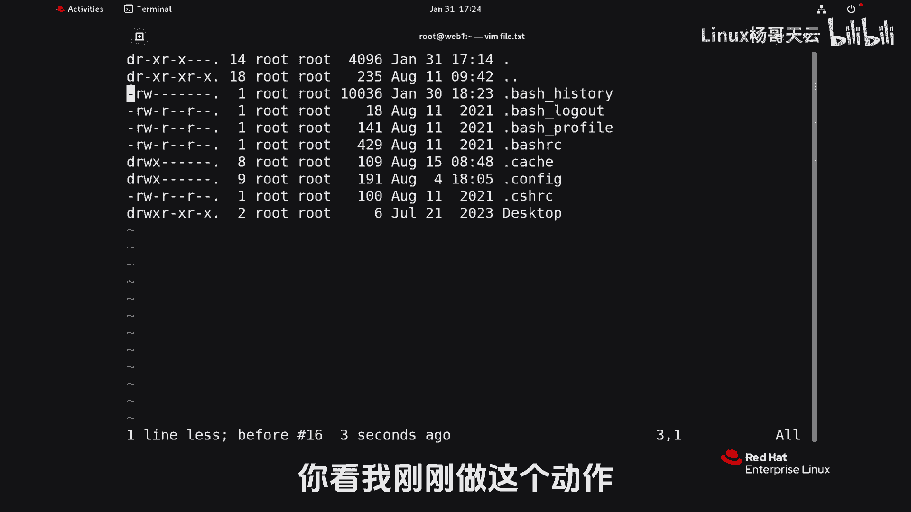

好好有意思，想把这两行雕雕个个，那我把它剪切一下，然后一粘是不是粘在下面呢，DDP好快啊，结果自己都都没没反应过来哈，撤销撤销撤销撤销撤销好了，这就是我们的在命令模式里面，文本的一个基本操作。

当然我个人用的比较多的呢，还有一些东西给大家说一下，除此以外呢，我们先等一等，当然你小笔记本记一下啊，我现在想把这个root这几个几字母删除，当然有快捷方法啊，我想如果删的是个单词。

那还真的给大家教一下快捷方法，我就删这个单词，删是D对不对，dw word看啊，DW上个单词有说没看见，再来一个DW单词，这个还是要记一下。

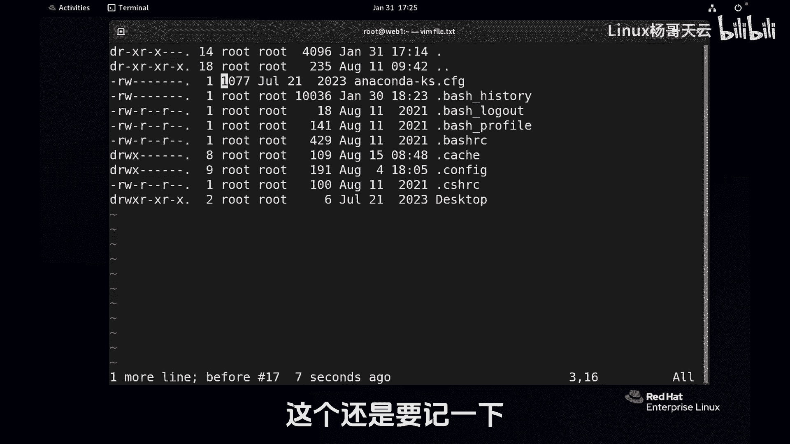

删一个单词，撤销一下啊，删个单词，这玩意呢还是有同学说这是个单词吗。

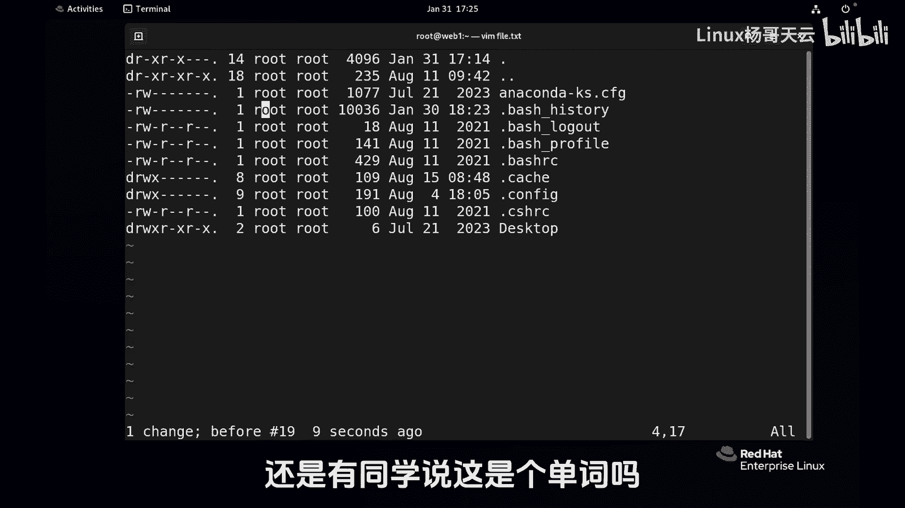

这算个单词吧，看删了吧，是不是总在他看来，这个小节的东西就是个单词DEWORD，这个还要记一下，那当然我们平时可能不会那么删，怎么删呢，按X键，他从光标开始啊，当当当当当当当当当当当当当当当。

按一下按一下。

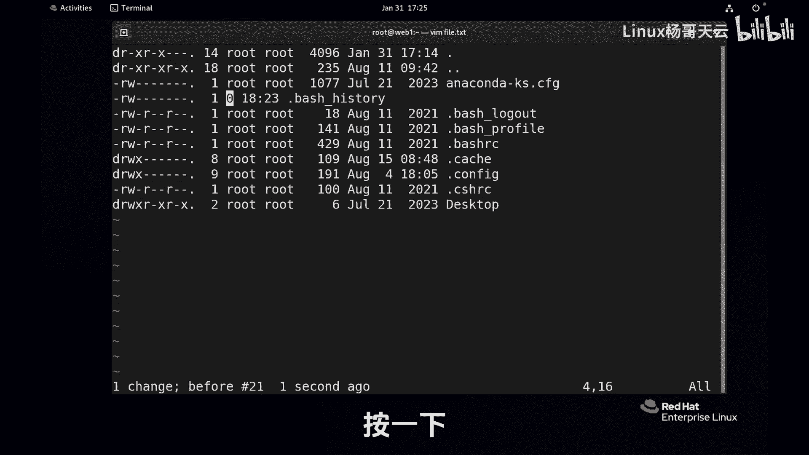

按住不撒手也行，我刚试了啊，给大家已经验证过了啊，我用撤销撤销撤销撤销撤销撤销撤销撤销。

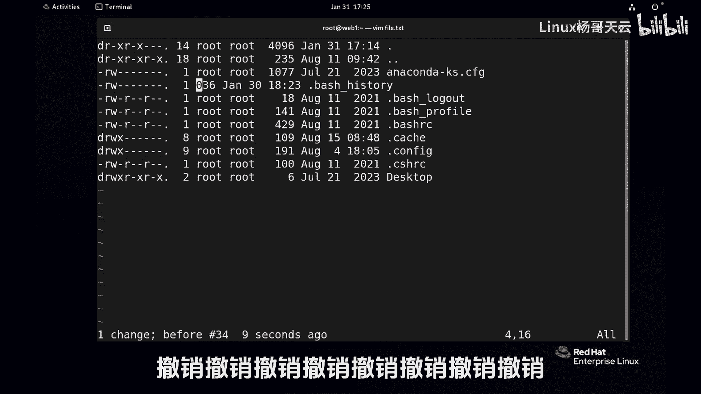

撤销撤销撤销撤销X是从关门开始，一个蹦豆一样的山，这个是我用的最多最多最多的。

听听懂了吗，各位表哥用最多得的还有一个，我先撤销一下啊，表示我想把这个ROT换成。

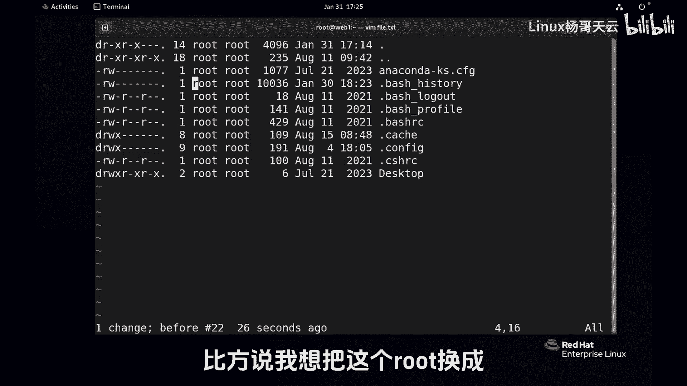

把这个R换成Y，这个时候也没必要去进什么编辑模式。

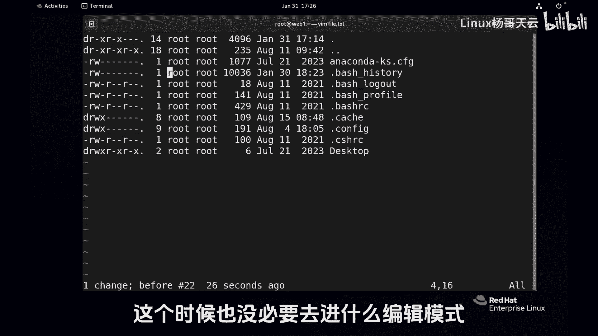

我就换一个字母，这个出一个什么命令呢，各位记住RT旁边那玩意儿RA很感谢啊，它都显示诶，太太感谢了啊，这玩意R跟这个R不是意思啊，你别误会了啊，这碰的碰巧了，我靠自相残杀啊，你这同门一相残，没办法。

我要说个Y除外就行了呀，看到了吗，当然了，注意你那个R已经失效了，你再改的话，它重新按，你想往下改，重新按，除非你按的是大R，我先撤销一下啊，你看shift加R，这个时候进入到另外一个替换模式。

这个就不再是命令模式了，然后你输入123，连续替换REC，注意如果说你现在不知道在什么模式怎么办，你就按ESC多按几次，保证你回到命令模式，听清楚了吗，各位好，所以刚才我们讲到了基本的一个一些操作。

在mini模式里面基本的操作你不要记太多，就记杨哥给你讲的这些就可以了，要不再送你一个，送大家一个啊，光标如果想移到最后一行，怎么怎么移，你说往下走就行，你这文件一共就十行，八行的，没问题，注意大忌。

大哥哥就shift加G，这个我还是用的比较多的啊，当然我讲这个是为下一个命令做铺垫啊，大哥一到开头呢啊，小哥哥小哥哥是开头啊，看到了吗，没有显示哥哥它显只显示一个字母，各位大哥记住啊。

小哥哥是二开头shim的，佳哥是到末尾记住了吗，哥哥前面去，大哥shift下，哥不准去按那个什么那个大写字母键啊。

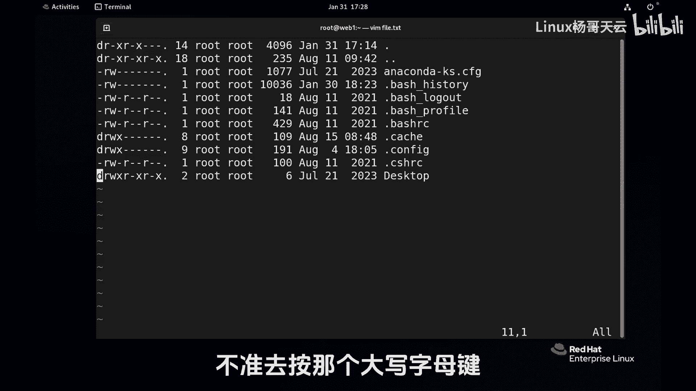

按shift就可以了。