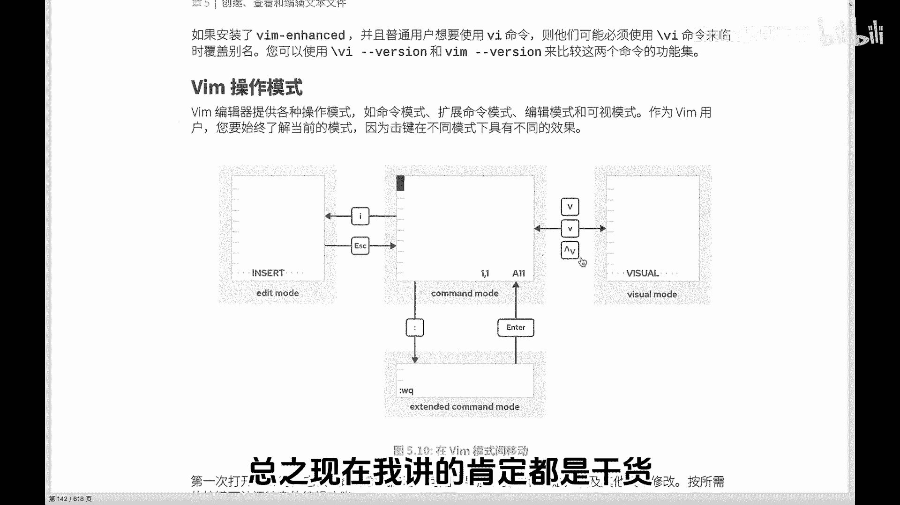
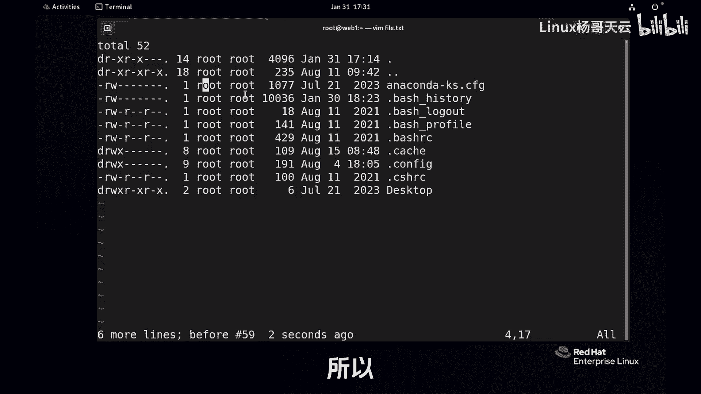
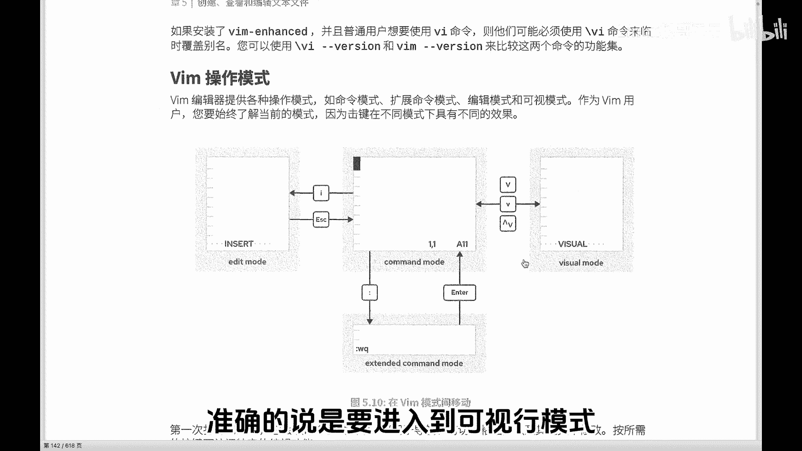
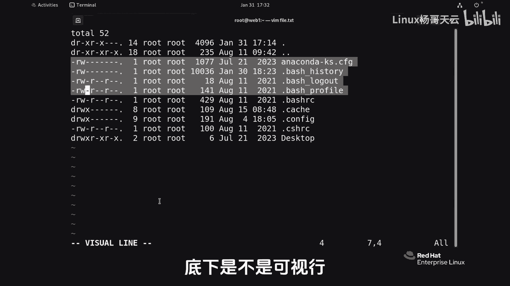
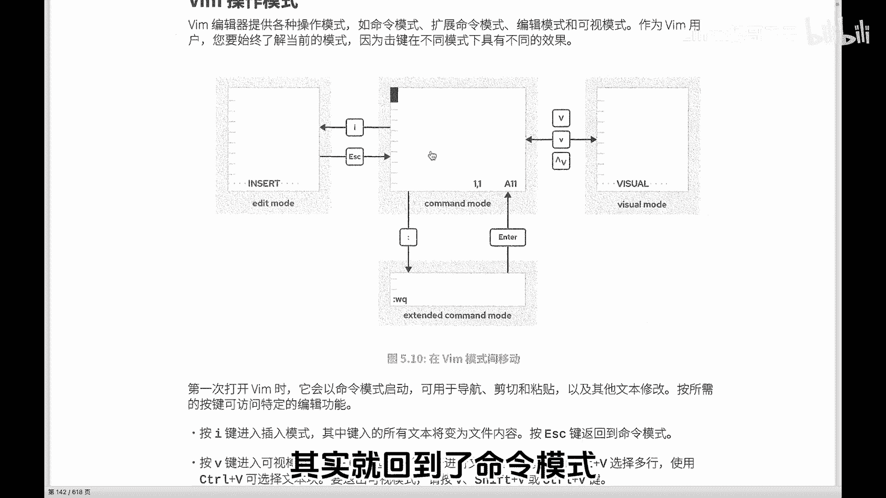
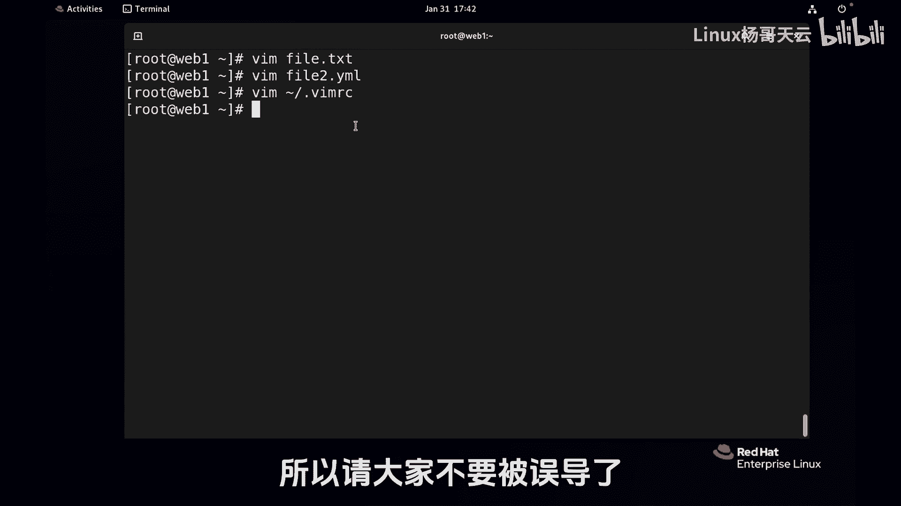

# 史上最强Linux入门教程，杨哥手把手教学，带你极速通关红帽认证RHCE（更新中） - P38：38.Vim的正确打开方式（下） - Linux杨哥天云 - BV1FH4y137sA

好了那兄弟们既然这样，那我就给你们讲一讲杨哥最常用的一个手段，比如说我想将这一行光标到这一行删到结尾，比如说数一下吧，这怎么数啊，单行五行的能看出来，那有30行，50行，300行怎么办。

所以组合一下就可以了，各位兄弟们，D后面应该跟小哥哥，还是跟大哥猜一下就知道了，评论区回复一下，弹幕区回复一下，D是删除，对不对，组合一下就可以了，d shift加哥来吧，看到最后一行撤销一下吧。

这个文件没关系，我们现在是在自己玩，我们自己造的啊，好现在从这开始，D小哥哥闪到最前面了，这还是比较比较有意思，看到了吗，那我再考个大家啊，现在光标所在行在这国标删在这个位置，有人说这个肯定不能输。

大哥小哥的，他缺什么了，那你要数1234567的妈呀，这数的话，这这容易犯错呀，万一少数了一行。

多数了一行怎么办，你眼睛不好使，所以呢我们现在的操作，其实呢是在秘密模式里面操作，基本上是看不见的，就是他不太给你显示你到底干了个啥，就相当于你自己知道他下面可能会提示一句，但是上面呢如果说本来是五行。

你输成了六数成了六行，什么6DD，那就麻烦了，对不对，好杨哥还带大家进入到进入到一个什么模式呢，叫做可视模式，这里呢可视呢我用的也不多，我用小V的，还有呢多行选择可视行，可视框，可视行呢是比较有意思的。

shift加V它就是进行行选择，所以这个也就是大V大V也好啊，大V比小V强嘛，对不对啊，至于可视化什么的那些我们后面再讲，那个也挺好，挺好玩的啊，呃总之现在我讲的肯定都是干货啊。

书上没有讲嗯，我我来讲啊，现在我要干嘛呢，我刚才讲了，我要删到这，但是我又没数好，所以此时此刻在命令模式。

我们要切换到哪个模式操作呢，切到可视模式，准确的说是要进入到可视行模式。

看好了，shift加V很牛就牛叉了，你可以使用上下键，也可以使用什么呢，传统的上下键JKL什么什么L走，你看下面显示是不是可善行，太棒了，走走走走，这是不是眼睛不好使的人也不会出错呀，删除是吗。

这个时候就不是DD了，D就可以搞定了，因为都选中了，还怎么DD啊，是不是撤销，当然已执行，我们再来玩一遍啊，shift加V走走走，底下是不是可视行。

按D这个时候他做完这个操作，其实就回到了命令模式。

清楚了吗，看什么还有可视块之类的，这个是属于装叉的那种的啊，比如说有人说，老师我想把这个Y这一行的R改了，这行的R改了这行R改了这行，改了这行改改了能一下干吗，行就是那个CTRLCTRL加V。

你看下面显示的是block好的，走走走走走，现在是不是选中的这一堆，现在想把它换成Y是吧，怎么换，就跟你在命令行模式里面操作一样，命令行模式是不是输个R，然后再输个新的，你看R啊。

说个新的why是不都挂了，各位推销一下，可是快不是说只选择一个可以这样选择呀，想删除这一堆行不行，D1下干掉了，可视的意思就很清楚，你能够明确的看到你是在干什么，对不对，不要记太多啊。

记太多的话就没意思了啊，来我们该走了，我们该去到那个保存绿珠了，这个时候我们要从命令模式里面开始，要开开溜了，那我们就输入shift加冒号，也不能直接就走啊，走显得多么的不好，是不是我们先来一个查找。

最起码得会吧，我们要查找什么呢，先查找这个吧，Catch，我不知道在哪个地方，因为文件文件太长了，斜线CACHE回车，看到了吗，高亮显示再重新干嘛呢，冒号斜线，我要输一下BH这个东西。

BASH回车这么多啊，那现在第一个在哪呢，第一个应该是在这个位置，我们按n next next next next next，看他又往回往回走了，他不断在循环next，有人还给我来一堆什么大N小N。

哪有那么多事啊，大爱无非就是往前走嘛，哎小A往后走，你你循环一下不就可以了吗，你吸那么多脑子不累嘛，对不对，千万不要那么学vi，学了你就死就废了，但还有查找替换，查找替换的话呢，我们在后面再说。

这个讲太多了，不是不好吗，我们就先保存退出吧，常规的保存就是W保存呢，Q呢又退出，你说什么时候用，你没有做过修改，那么就退出不就行了吗，你做过修改的话呢，那就是WQ走人，这就是vi的基本用法。

不要想的太多太多，费脑子小困难一下，比如说有同学说老师我搜了个，我搜了个哦，妈呀，你看这个时候就麻烦了，它全显示O你可能下次进来的话，他有可能还是这德行，这可是个小技巧，怎么办呢，跟杨哥学习。

这样重新搜一个不存在的，乱敲一个，搜不着，搜不着就没有了嘛，干净对不对，好了，就是这样的，最后还要说个什么点呢，这个点还是要说一下，在输了个冒号对吧，set l显示下行号，那个行号它不是文件内容。

这看起来不多高级吗，刚开始如果加个行号，我告诉你我要操作第几行，那不是很顺眼吗，我要把第六行删除dd，当然原来的第六行删除的话，新的第六行替代了吗，撤销一下好，然后这是行号，但是大家发现一个问题啊。

我再进来那个行号就没了，再怎number n u MB r或者NU都可以，所以它不是持久的，大家听明白了吗，他不是持久的，我们可以设置一下vi的一些环境，比方说近代以后它就是这样一个风格。

这个格式来符合我们操作习惯，所以这个时候就要干什么事呢，有一个文件在用户的家里面，每个用户都可以把vi设置为他自己喜欢的风格，喜欢的样子，比如说我根据需要，我们要考试，我们要用ANSIBLE。

我们就要需要修改，改什么呢，在家里面注意，在家里面，准确的说就是波浪线下的点VMRC，这个路径就是其实就是绝对路径，波浪线指的是用户的家，谁的家呢，当前用户的加下面有一个隐藏文件。

点开始的文件是隐藏文件，点VMRC这个文件可能一开始没有，每个用户是自己的，所以你的设置只影响自己，我们在这里加一个set number，看到了吗，这就是vi的环境文件配置文件。

你再对其他文件进行操作的时候的设置就有了，听明白了吗，对了有一个命令还忘了告诉大家，这个命令不告诉大家，我觉得我对不住大家，所以拿着那个小本子记一下，不要在这，我想在下面插入一行，按O不是按I。

你按I进入插入模式，我按I可以进入到这个插入模式，但是它是光标在光标这个位置插入，看到了吗，我ESC一下啊，我按O的话，它是另起一行，这个很常见啊，另起一行，因为很多操作呢是操作的时候知道。

你现在你要问我，我都我都记不得这个欧式另起一行，那比如说我现在做了什么事呢，我写了个羊哥，我想这样，但是我想敲个tab键，table键哥忒宝剑哥哥，一个tab键这么长，可能我们需要它短一点。

比方说这个tab键短一点，不不要这么长，因为我们在YM以后再讲到那个阿SIO的时候，这个就不合适对了，顺便给大家说一下Q叹号啊，Q是退出对吧，但是你都改了文件，你想走，你不开玩笑吗，那就让能让你走吗。

你都要别人那啥了，你还想走，不可能强制走，叹号是带有强制的意思，强制走，或者说我就放弃了我我就是走改的，我不，那我们现在呢再重新编辑一下，当前加下的BMRC这个文件，我们在这里面呢，比如说加了很多东西。

加了一些什么，这个到后面我们再来解释啊，给大家看一下凹凸啊，Cmd，然后file type，这当然其实大小写都没有说，必须必须区分啊，yo文件，Set local ts table2。

这就是设置的一个vi环境，那这里呢很显然它是针对文件类型是YM的，它才会是那个叫什么两行，那你要不不写的话，比方说你直接把这个ts s等于二写到上面，这那它所有文件里面tab键就是两个字符。

但是我们现在呢，我们针对的是文件类型是什么呢，是这个YAO的，后面我们在讲ASSAP的时候，会用到YML的这种格式，可我们试一下，我们在编辑刚才那个那个老文件呃，我在这呢按一个O新行tab键。

不是两个字符，看到了吗，不是两个字符，因为它不是那个格式的，它不符合，那如果我编辑一个file2点YML，这就是YM文件，你看这里面比方说羊tab键哥看到了吗，两个字按tab键哈，就两个两个位置。

它会根据你设置的这个情况，而这个设置呢会有很多很多种，比方说我们让vi有根水平线，有个垂直线，很多很多种，这个呢我们会随着使用的需要呢，来给大家不断的去设置，总之这个文件会影响到它里面的设置。

会影响到这个vi的工作的一个环境，所以我们会根据我们的需要呢去设置，就像这个一样，刚才那个YM一样，我们可能就需要，因为在里面呢我们按tab键，可能不需要有那么多的空格，而是两个字符好。

这就是VIP的进阶，后面同样的前面没有讲到的地方，我就会告诉大家，我按的是什么秘密，那到时候再来记，因为你没有这种实例操作，前面的这种没有意义，你根本就记不住，你只是照着文档照着要求搞了一遍。

你实际在做的时候，你还是不会，这东西只能熟来生巧，做到手中无剑，心中有剑，我现在呢就已经不知道哪个键是干嘛的，但是你让我敲没问题，就跟我敲无比一样好，这就是我们vi的正确打开模式。

