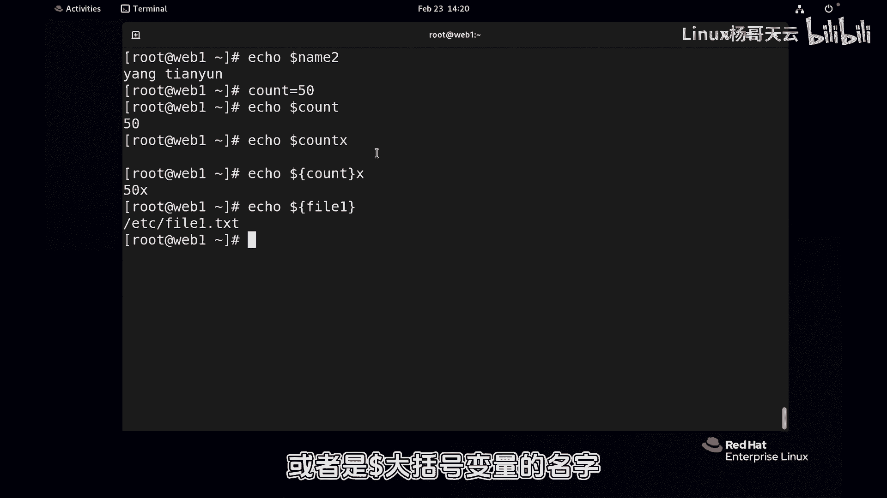

# 史上最强Linux入门教程，杨哥手把手教学，带你极速通关红帽认证RHCE（更新中） - P39：39.了解Shell变量 - Linux杨哥天云 - BV1FH4y137sA

同学们好，我是天韵老师啊，接下来我们继续带大家学习LINUX1些基础知识，首先要特别给大家强调的是啊，可能我在整个讲课过程当中，会用到一些相关的资料，但是这个是需要大家去做笔记的。

也就是说你要按照你的理解，按照我们讲课的这样一个流程去做笔记，做整理，否则的话呢就是拿到相应的资料也也没有用啊，一定要注意，因为书它是书更多的，我们讲的时候呢会按照一些呃理解。

或者说一些这个具体的生产需求，一些一些环境去讲，所以大家一定要在听课的时候做好笔记去整理，接下来呢我们给大家看一个现象啊，比方说我们输入ls os这个命令没问题，那如果我们输入杨哥这个就报了一个失败。

说明你找不到，那到底他在哪儿找的呢，他是去哪个地方找，最没找没找到呢，就像有的同学说，那我我写了一个脚本，明明这边就有，那为什么执行的时候就像这样敲就找不到，还有呢就是我们有一个我们这个历史秘密。

通过history可以看啊，现在是700多条，那到底他会记多少条呢，也就是说这个历史命令呢，它到底是写在哪个文件里面的呢，这些东西呢啊这些都和我们shell的环境有关系，这就是我们今天要给大家讲到的啊。

shell环境，再包括前面这个提示符，有人说为什么是这样的，那可不可以换一个样子啊，还有呢就是我们比如说在在这个叫什么，我们看一下啊，呃我们echo一个这样一个CHO好羊，现在很显然了，当然没有输完啊。

没有输完，但是呢我回撤一下，回撤一下啊，杨哥啊，再回车一下天云，最后再把这个引号表打上，最后他输出了一个阳歌天云，那这个提示符又是什么提示符呢，有很多同学可能在初学的时候，有时候出错了。

发现了出现了这个提示符，所以这个都跟我们整个shell，因为我们现在用到的这个shell是什么shell呢，当然它也是变量，也通过可以通过变量可以看到，比方说我们可以看到当前的这个shell呢。

是这个变量是定下的，bash这个程序，换句话讲，我们现在所在的这个界面，就是我们现在所在的这个界面啊，就是我们的shell这个程序，我们对LINUX系统的管理，包括我们在前面教的各种命令。

都是在这个shell下面执行的各种子程序啊，你可以认为是在shell上执行的shell呢，它会给我们系统去解释，最后给我们去呈现。

那有时候我们就需要去了解shell的一个一个环境，或者去更改它的环境啊，这个更改环境呢来达到对这个shell的一个环境的，一个叫什么，按照我们自己的这样一个需求，去更改的这样一个目的啊。

当然首先就要谈到的就是变量。

因为刚才表哥给大家看到的这就是一个变量啊，这个变量决决定它的这个值呢是并下的，根下的，并下的BH啊。

这就是一个变量，所以要想了解或者更改shell环境，包括我们在后面去写这个办事的这个脚本，一些脚本及呃，我们就需要去了解变量啊，它都是由变量来定义的，而且呢这个shell环境呢在呃提示一下啊。

我们我们是可能是我们会需要呢，去对一些相关的文件进行编辑，把这个一些修改呢进行这种，我们叫做希望它每次开机的时候，都能够每次运行的时候，都能够去那个达到这个环境，或者都能够应用这个环境。

所以我们还要了解这些影响shell环境的一些文件，首先来看一下这个shell的这个变量啊，这跟其他的这个呃。

其他的这个语言呢不太一样哈，但是今天我们没有讲shell，不是给大家讲shell脚本啊，还没到那个点，只是呢用到了这个shell的环境啊，所以会先提到这个shell变量啊。

呃这个变量首先定义的这个语法呢，跟其他的这个程序很相似，只不过不像C语言是需要声明之类的啊，就直接定义就可以了，他首先是变量的名字啊，变量名字后面呢是变量的值啊，这个这个等号呢其实不是等号的。

意思是赋值嗯，以后我们学到的这个在shell脚本里面学到的，等号匹配比较是双等号啊，好所以这个是赋值，大家可以认为现在这个name呢就是一个变量，它的这个值呢是book啊。

再或者说我们定义一个这个一个文件，比如叫file1啊，他的这个路径呢可能是etc下的，比方说叫L1点TST，这样的话我们定义的好这个变量，这个变量的话呢当然在定义的时候嗯，这是我们自定义变量啊。

稍后我们会谈到的更多的去影响shell环境的话呢，都是这种一些系统的这种变量或者叫环境变量，当然你在安装像java的这个，JDK的这个环境的时候啊，那像oracle呀或者是之类之类的。

他们需要JDK环境，这个时候java的JDK呢，它也需要定义它的这个需要的变量啊，所以我们在定义变量的时候，这个变量的名字呢也是有有这个强有限制的啊，首先包括这个大小写字母。

还有呢这个数字还有这个下划线啊，这个其他的呢不可以用，再或者说我们在整整长一点啊，表示叫book啊，比如叫book的也差不多差不多呃，是叫什么呢，叫name name2吧，这是diva第二个变量好。

这个变量呢我们想叫做杨哥天，杨歌天名，所以这个时候就有问题，因为这里有空格，所以我们对于这种呃内容，后期这个字符串呢有空格的，那就算上面这个也可以啊，上面这个AD c fl1也可以。

我们建议加上这个引号，加引号，双引号，单引号当然都没问题啊，呃当然我们在后面会看到，双引号和单引号是有区别的，但是在此时此刻没有没有关系，好这样的话我们就定义了好了，三个变量我们如果说想要去查看这个。

这是我们现在定义的变量啊，如果通过这个set命令有两个命令，一个set，一个是ENENV啊，这个set呢是查看嗯，所有的这个变量，当包括还有一些函数，其中呢但内容有点多，这个有点多。

我们有时候甚至可以通过less ts呢去看一下啊，定义好的一些这个变量，还有一些什么函数，这是系统，然后还有一些我们的这个系统变量之类的，这个很多啊，嗯包括一会我们看到的这些什么P0。

PS1PS2PS四啊之类的，还有这个什么PWT这些都是一些这个变量，我们的变量不知道设置到哪去呢，反正是哎在这在最后这个位置看到了吗，name是他的变量值是book name，二是啊杨杨杨天云啊。

嗯双引号不是双引号了，这是我们通过set命令去看到列出所有的变量，包括一些函数啊，当然我们如果说使用这个某一个变量的话呢，呃可以呢通过这个引用的方式，也就是加一个dollar，dollar的话呢。

然后后面加变量的名字，刚才我们上面几个变量呢，分别是name和name1和那个L1，所以我们想要引用的话，这个刚才讲过，我们后面可能会在脚本当中引用变量，那就直接dollar后面加上这个啊。

FIL1就可以了，这是变量的这样一个名字，那现在由于我们没有实质性的用途，我们没有实际用途，表示后面我们要拷文件，将某个文件EDC下的password文件，比方说PSWFD文件拷到哪个地方去。

后面可能这当中就用到这个变量也可以，这个是在后面脚本当中，我们会基本呢用的比较多的，那此时此刻呢，如果只是想要把变量的值给显示一下，那我们就可以通过echo艾克这个东西呢，是干嘛的呢，就是回显吗。

回险你可以理解为我现在朝着一座大山，我站在这边向他喊一声啊，那他又会回想回忆一下哦，就和你你说出的是一样的，可以回想一下好，那我们现在呢比如说呃这样写的话呢，那他回血呢就是就fail1。

你后面是啥就是啥啊，如果说我现在dollar dollar的话呢，这个为什么dollar不能作为变量的名字啊，就是这个原因有dollar的话呢，它是对变量的一个引用，变量的一个引用，看到了吗。

那他回写的就是这个，那我刚才讲过，我们可以根据需要，比如说将但这个文件其实是不存在的哈，我瞎写的，我们将dollar file1删除没问题啊，这样删除没问题，只要是那个这些，那这些操作呢。

是根据真实的情况来来来设计的啊，现在我们先现是这样一个一个动作，然后再或者说呢有file1file file1吧，这片段刚才定义的叫什么名字，往前导一下呗，刚才啊name2嗯，就没有name me。

一没有的话呢，就相当于这个变量没有值啊，它就没没有显示啊，好这是变量的这个相应的值，那在这里呢还要注意一下啊，注意一下，比方说呃我们想这样显示，按照按照教材上定义的这个变量啊，比如count现在是50。

它的值是50啊，只是现在相当于有个变量叫count，它的值是50，没问题，大家看到echo一下，然后count50，那如果说想在50后面我们显示的时候，在用的时候啊，我们在后面加个X呃，什么意思呢。

就是显示50X变量的值是根据什么来的呢，它是啥又是啥，但既然是变量，我们在脚本当中可能会有可能会变的，根据我们的这个运行，运行的这个过程会变啊，那但是我们想要的效果就是原来变量的值，它是50就50。

是30就30，然后再加上一个X，但结果呢大家看到却是不可以的，为什么呢，我们可能想象中是这样一个意思，有人说加个空格呗，嗯我不需要加空格，我就要显示50加Y50，后面这个数字后面加一个X。

所以这个时候我们就要把变量呢，用这个大括号给括起来，所以这两种方式也就是说两种方式，包括前面的，比方说这个dollar file1也是一样的，看到了吗，所以在一些这个我们可能可能这个叫什么呃。

需要去去连接一些东西的时候，我们加上这个大括号，当然有时候我不连接的时候呢，能不能用一样的，只不过显显得好像没必要这样的哈，都是可以的，因此这个变量的引用我们使用的是dollar，后面加变量名字。

或者是呢dollar大括号变量的名字。

这个就可以了，这是一个基本的，也就是说我们在更改更改这个shell环境之前呢。

我们首先呢是需要了解变量，因为一会我们可能我们刚才定义的这个变量，不管是file1还是name1还是name还是name2，这是我们自己呢根据我们的需要定义的，那实际上呢影响shell环境的那些变量呢。

就像刚才大家可能看到的诶，刚才看到这个呃，这个叫什么PWD，它也是个变量，很多东西都是变量，它的值是是是相应的是变化的，所以我们要了解的话呢，要可能更多的是这些系统级别的，这些环境的相应的变量。

而可能此时此刻我们关注的点，因为我们现在不是写脚本，我们关注点是什么，是环境变量，是那些系统的变量来，从而会影响到我们需要的环境，就比如刚才杨哥在前面跟大家强调的，我敲了个命令，为什么他没找，他没找到。

他到底是从哪找的呀，为什么我们历史记录历史记录啊，这个是多少条，还有呢，为什么我们的历史记录是保存在当前目录下的，办事by是这个history里面的，为什么在这里面，那都是有有这个有相应的原因的。

都是因为一些变量，环境变量的设置对吧，所以这些变量会影响到shell的环境，所以呢我们在更改社会环境之前，了解变量的一些定义和一些基本的用法啊，就是无非就是变量名后面一个等号，其实叫赋值号。

后面是变量的值好。

