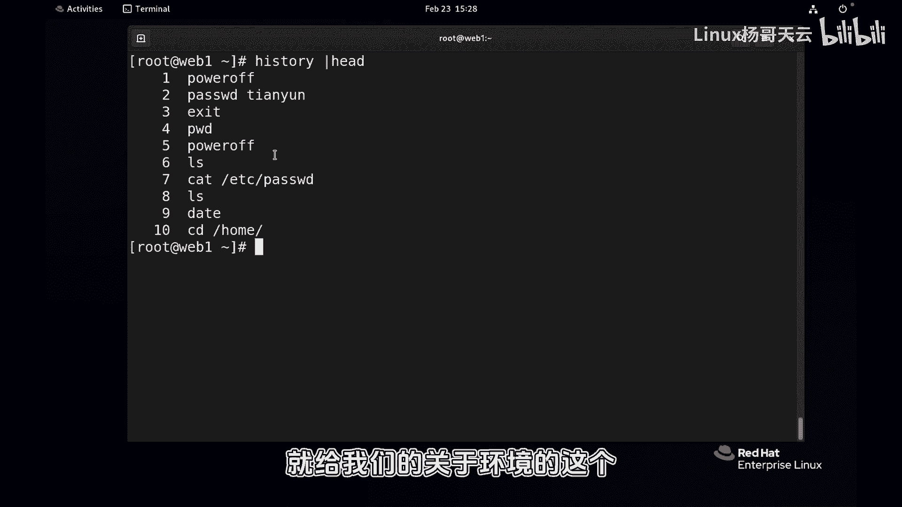
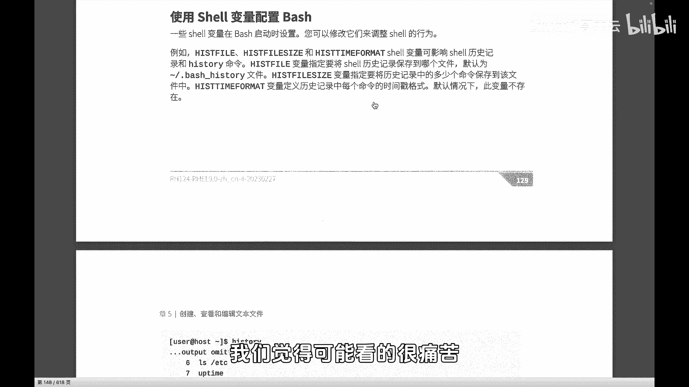
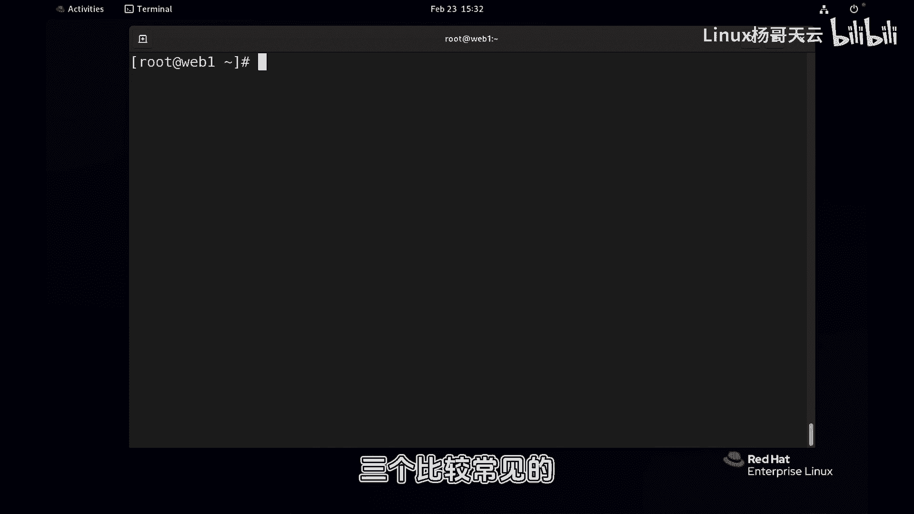
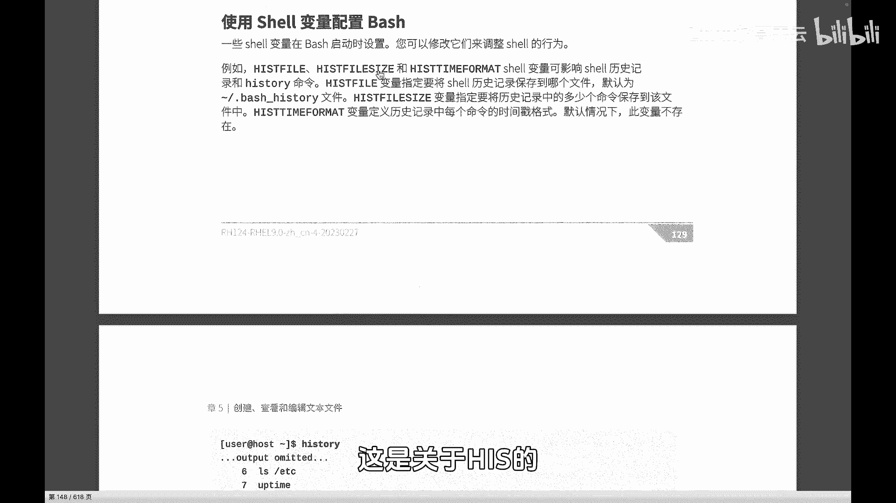
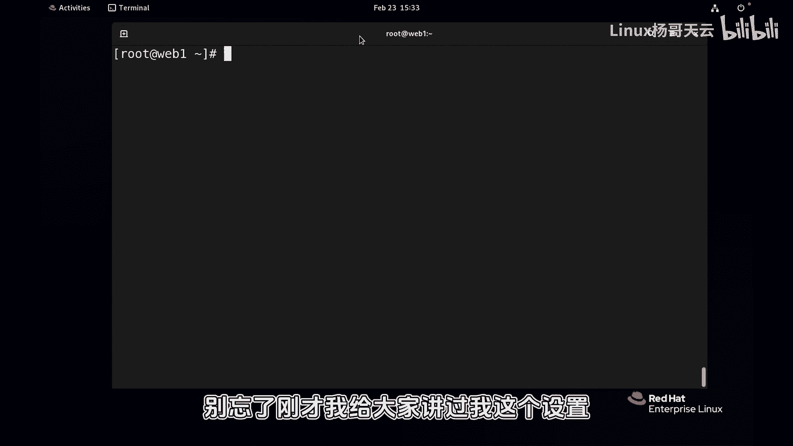
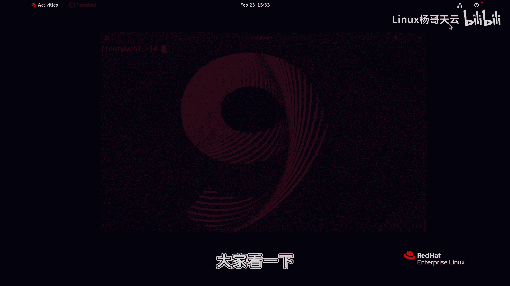
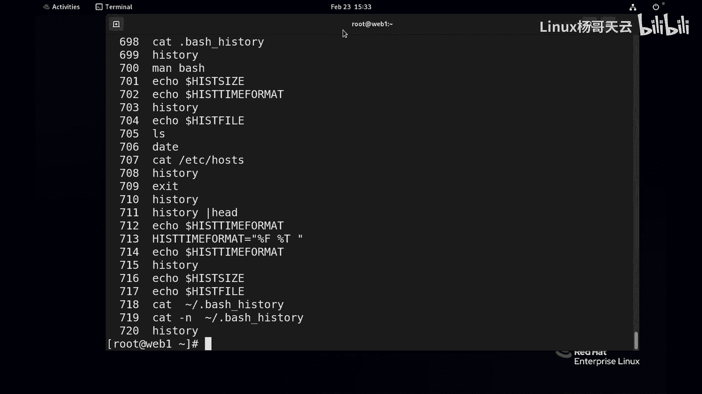

# 史上最强Linux入门教程，杨哥手把手教学，带你极速通关红帽认证RHCE（更新中） - P40：40.历史命令是可以显示时间戳的 - Linux杨哥天云 - BV1FH4y137sA

哈喽各位小伙伴，我是杨哥，那我们继续来看一下，有哪些环境变量会影响到shell，以及我们会根据我们的需求来更改shell的环境，首先我们来看的这个，就是关于历史命令相关的history。

这个是之前给大家讲过的啊，我们用来查看查看这个命令的历史记录，但是大家看到没有啊，比如我们现在就拿出前面的好，就等前面的这个十十行吧，它现在显示的呢是这种这个样子，前面是编号，后面的是这个具体的命令。

但如果我们想要做一些排错啊，或者说想要了解到底这个系统，这个出了问题是什么原因引起的，我们想要去追溯一下，再或者说呢，比如说有人这个入侵了我们的服务器，他走的时候呢也没有清除痕迹。

我们想要看一下到底干了什么，他这个实际上是不太可能的，专业人士肯定也是要擦除这个痕迹的，因此我们可能去调整相应的这个时间啊，甚至是呢这个去去设置呢，整个的这个显示的这个历史记录的条数，就跟没监控。

他到底是30天覆盖一次呢，还是100天覆盖一次呢，所以你可以设置的啊，这个时候呢就跟我们的关于环境的这个呃。

我们的黑死啊，开始那个相关的啊，包括hs spell，这个是记录什么呢，记录咱们的历史历史命令的一个文件，它是保存在哪个文件里面的，这个呢是条目条数，还有呢它的格式，这个有三个比较常见啊。

第一个我们先要说的就是它的格式，因为现在没有时间戳，我们觉得可能看看的很痛苦啊。

因此呢我们就来看看这个当前的这个变量，可能是没有设置，HISTTIMEFRMAT也是has time comment，这个变量可能没有设置，所以呢没关系，我们把这个变量呢，啊当然我现在设置的是临时的啊。

我们这几个小节下来以后，会教大家怎么让它写到文件里面去，所以大家这个看杨哥的这个课程的话，你得连续看，不能断章取义啊，我这边话说到这儿啊，好这个变量的格式呢是日期，再加上呢时间后面加个空格。

那其他就是命令这样一个效果啊，呃当然这个变量就已经设置好了，如果你echo的话呢，就是这样一个效果，紧接着呢我们就pastry，然后来看看这个效果好，各位看到了吗，这是除了编号以外，除了编号以外呢。

还有在哪年哪月，2024年2月23号，15：29：59执行的这个命令，我们就能够很清楚的看到这个整个的这样一个，时间的这样一个格式，以便于我们呢去做很多的一些追溯，特别是你到底干了什么。

导致这个系统怎么样了，去做这样一个追溯，那除此以外呢，跟这个害死相关的相关的，还有一些这个呃这个相关的像HASIZE，我们可以看一下它默认的那个条数啊，HISTCASISE好，默认是1000条。

也就是说它是记录在记录在这个记录的，条数是1000条，超过1000条的话，就像那个嗯刚才说的录像机一样，摄像头一样，这前面就覆盖了啊，呃这个可以改，我们可以改掉啊，改成更多的都可以。

然后呢还有呢HASFELL刚才给大家看过黑s spell，大家注意到他，实际上呢，他会把那个历史的这个我们的历史命令，在退出的时候会保存在一个文件里面去，这个文件呢呃是当前用户，我们一般这样写啊。

各位这样写，可能你看到的更多就是波浪线，是当前用户，它下面的呢用户的点BH不是echo sorry，是cat一下，点BH后面呢它会有几个文件，其中一个是bash history。

那就是history里面去好，这个是多少行啊，我们可以统计一下，我们可以统计一下，比方说呃杠N看一下行数的721条，最后一个是EXIT啊，但是实际上呢我们看到这个之后好像不是，这还不是。

那是因为呢他在退出的时候，才会做这个相应的这个保存啊，这个倒倒倒没没关系，所以现在总之我们是可以改的，如果你修改了his spell这样一个变量，那么它会把你的这个叫什么历史命令，换到另另外一个地方去。

其实我觉得这样是对的，这样的话的话我们就可以呢，防止防止这个有人恶意的去做历史的这个清除，就是把它见不得光的一些东西去清除，所以这是跟HS相关的三个比较常见的。

一个是刚才啊杨哥说的has spell，一个是呢file size，这个没没有定义，这个事就是文件的大小不能超过多大，嗯我觉得没有意义，这个是它的格式，还有呢就是它的一个high size。

不是his file size啊，his size呢是他的那个历史记录的条数啊，这是关于HS的。

也是历史命令相关的，几个比较比较有意思的东西，而且我个人觉得这个时间戳非常重要啊，以帮助我们去追溯啊，嗯这是第一个，别忘了刚才我给大家讲过。

我这个设置，如果把这个窗口关了，或者说我们再开一个新窗口，大家看一下。

再开一个新的，就相当于刚才那个变量其实就已经失效了，它没有了。

所以我们想要这种永久的变量的话呢，或者想要这个环境变量的话啊，这个我们是需要做相应的一些设置啊，我们要写到文件里面去，这个在最后给大家去讲到好。

