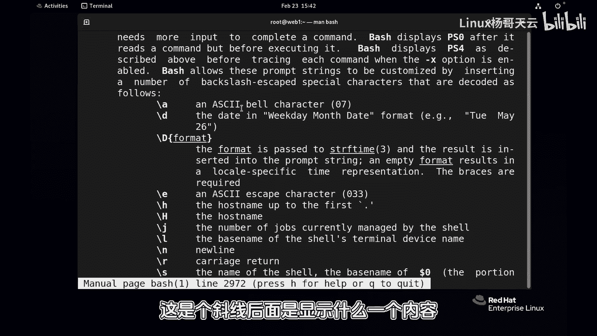

# 史上最强Linux入门教程，杨哥手把手教学，带你极速通关红帽认证RHCE（更新中） - P41：41.Shell提示符可以这样搞 - Linux杨哥天云 - BV1FH4y137sA

好各位小伙伴，我是杨哥，那我们在做生态环境管理的时候呢，我们比如说这台服务器，单从这个名字上看，不一定知道他是谁，所以我们如果说想要很清楚的，知道这个服务器是谁的话呢，有可能需要一个完整的名称。

比如说像这样一个主题名，我们就知道，因为这个主机名的命名的话呢，我们实际上是根据他的这个角色，还有了他的位置是哪个IDC机房，还有在哪个位置，这样类命名的可能画的更细，就像国家省市县这样的形式。

因此呢在这个看不清楚，另外一个呢就是这个目录，这个目录的话呢，各位看现在我切换到根，它显示根没问题，我切换到根的EDC，它显示EDC，我切换到到跟下的home目下的那天语音诶，只显示天语音。

那你不知道是哪的天语，你有可能希望显示这个长的完整的名称，这个时候呢就需要用到我们shell的一个KS1，这个变量，这个提示符是由它来显示的，由它来定义的，PS1这个变量它的提示符呢是这样一个格式。

整个是它的变量的这个设定啊，极限U斜线H还有呢当做一个at符号，U肯定就用户名嘛对吧，H呢就是主机名，还有呢他的工作目录word，这是个大W，还有了一个斜线dollar啊，那这是什么意思呢。

包括我们一会讲到的P2这样一些提示符，如果我们想要更改，换成我们自己的，我们可以去慢一下，慢一下BH，因为这都是由BH本身提供的。

包括刚才在前面讲到那个和历史命令相关的，HS相关的一些环境变量，慢以后呢，我们来找到这个高频提示符的一个显示的，这个这个位置，还是那样，大家做好笔记，这东西需要大家去自己的去练习和加做笔记。

好我们去搜索PROPROMPTING。

可能吓大家一跳哇，这么多PS啊，有PS01，Ps1，Ps2，Ps3，Ps4，就这么多提示符，有什么主提示符字，提示符，还有次次次提示符，好几个提示符。

那常见的话呢就是我们的P1和P2，其他的话呢可能相对来说少一点，往下走一点。

我们会看到这是它的一个什么时间格式，它的一个time的一个格式，还有他的一个其他的一些一些设置好。

我们往下再走一点，这是提示服，对没错，然后那就是P1。

那P1的话呢，这边告诉你的就有这样一些显示，这个斜线后面是显示什么内容。

比方说刚才我们看到我们此时此刻，我还可以显示时间，看到了吗，起天T如果这个地方需要显示时间，显示时间好像没有必要，然后主机迷这个小H呢只是显示点前面的first点，让大家看到web一点，杨哥点。

杨哥点com，那就是第一个点前面的post点，前面的大H呢是它的全名字，还有呢就是刚才我们看到的那个杠U是用户名。

当前用户名，然后还有呢就是显示他的一些版本，还有显示时间24小时的这种格式的。

还有12小时，这种格式的还是上午，下午的W呢是当前的工作目录，注意这里的工作目录呢有两个W，现在目前是大W，还有一个是小W。

大W是base name，什么叫base name呢，大家展示一下看还真有这个base name这个命令，etc下的password，那它就只提取了就是最终的那个文件，就是给他一个路径。

它会只是显示他的最基本的那个名字，这个命令也是杨哥赠送给大家的啊，有时候我们需要去提取就给到一个路径，我们需要提取到这个路径当中的，文件的具体名字是什么，使用这个BASTNAME。

所以我们下面呢就来设置一下P1，这个变量的一个显示效果，我们最好是先看一下，然后复制一下，你改一改就可以了，你要是重新来设再设计的，可能有时候还忘了注意，这里呢肯定不能这样敲上去。

你肯定是要使用一下这个双引号，双引号吧，引起来，这里有个小细节哦，还少了一个方块，好像没注上，这和原来一样，没有改啊，但是其实和原来不一样了，为什么不一样了，你这人家是有空格的，看到了吗。

你看执行命令有空格，你这没有空格，你没有空格，敲回车以后呢，就mini和弦挨一起的，够热呀，是不是这里得有空格，这里呢用户名没问题，主机名呢其实有可能会显示它的全名，工作目录呢。

有可能我们需要显示的是它这个有点长啊，这个随着进到深目录里面去有点长，所以根据大家的情况来进行选择，后面那个斜线dollar呢，我不建议大家改这个dollar是什么意思呢，你要是敢把这个斜线去了。

那它就显示纯粹是dollar，就是不管是普通用户还是管理员，他都是dollar，而斜线dollar呢是指的是，如果说ui id是零的话呢，那他就是管理员，那就是显示的井号，如果不是的话呢。

就显示一个真正的dollar哦，Sorry，设置是吧，设置我们不用ICCHO，Echo，不用设置这样式设置好了，各位看一下，区别一下上面的和下面的，现在显示的是整个全的名称，我们的这个服务器。

很多是根据地域来进行命名的，我们一眼就能看到我们操作的服务器，而不至于呢可能操作错了，然后再紧接着我们进到EADC里面去，大家看到显示的就是EDC，我们进到home下载天翼云里面去呢。

显示的就是home下天翼云，这样的话呢，也能够就是在一些特定的场景当中哈，我们也不至于套出错了入镜，因为这个天云目录可能在别的地方也有，但是坏处就是呢会显示很长啊，除非你回到家，回到家的话。

这个就短一点，好看到了吗，所以PS1这个变量呢就是我们的主的提示符，你可以认为是主提示符，现在只是临时的啊，我们并没有设置为环境变量，你关掉或者说开一个只需要的话呢，他就回去了啊。

我们还是改成H和大大对吧，但是前面这个空格你要要不要的话呢，就会挨挨起回来看，那另外一个体式服呢就是PS2，这个PS2的话呢，我一般建议大家不要改PS2，有有内容，现在的这个PS24体示符有就是个尖尖。

它就是个尖尖嘛是吧，所以你看如果我现在LOSEDCR的password，如果我我这个后面还想输etc亚的SYSTECONFIG，Light work，如果还想输EDCR的。

叫SLINUX或者什么什么什么的，我要显示很多，假如说要换个行，你现在回车肯定不是换行，你加个这个叫转义字符，斜线相当于把那个回车的功能给他转移了，就变成了一个普通字符，其实我现在要敲回车。

但是呢在斜线面前呢，这个回车就失去了回车的意义，你看这个时候就出现了我们的次提式服，PS2你喜欢吗，你要是喜欢的话呢，就将就着用，不喜欢的话就就算，所以不要感到害怕，这个次提示符你要改的话呢。

那就是直接PS2等于加000好加加加，这个时候如果说我们要换行的话，表示像这种情况，换行回车变成加一加哦，应该加个空格，你看挨得太近了，后来看是不是好，我现在所以还是习惯加个空格，像这样这样的话。

它就前面有一小段，我们再来试一下l o s e DC password，换行一下，看这个一般没没没有必要去去改，我感觉哈这个PS2呢什么情况也会出现呢，就是刚才在前面给大家给大家演示过。

比如现在呢我们要echo不一定是echo啊，明显是这个双引号，这个引号呢没有结束，那就太明显了嘛，那它自动也会出现我们的P2P运输，不过还没有出现引号，杨哥这个hello，除非你号，他认为这结束了。

这个自然的会出现到我们PS2上去，很多时候呢，就是你的命令相当于参数还没有输完，但是呢很明显的，那他就会给你出现PS2这个提示符，所以P1和P2呢，你可以认为是我们的主题是符和次提示符，特别是P1。

我们极有可能的根据需要了，把那个主机名显示全名，而不是base name啊，就是关于这个我们的PS提示符的这样一个，相关的定义，具体的话可以去卖一下BH，找一下那个PS1啊。

