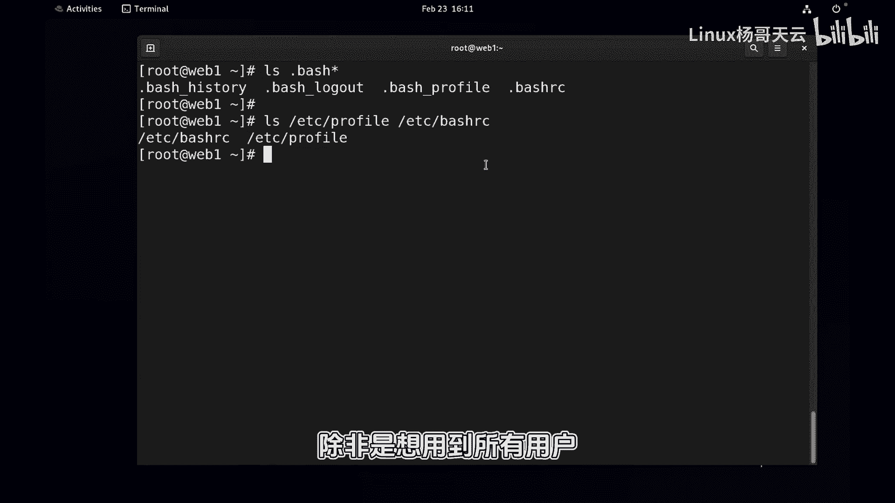
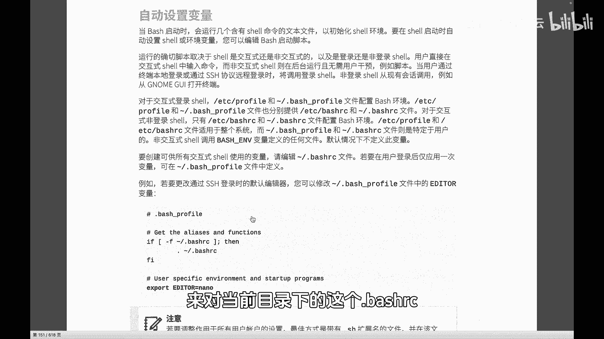
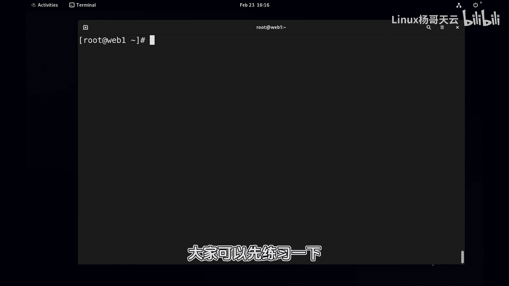

# 史上最强Linux入门教程，杨哥手把手教学，带你极速通关红帽认证RHCE（更新中） - P42：42.Shell会去哪儿找命令？ - Linux杨哥天云 - BV1FH4y137sA

好各位小伙伴，我是杨哥，欢迎各位回来，那么在上一小节当中，我们忽略了一个细节，就是在设置这个P1变量的时候啊，好像是这样设置的，给大家解释过啊，通过这个P1后面呢是等号，把那个整个双引号。

当时使用双引号这种方式复制全一点，后面有个空格，这有空格，这个时候就有一个问题，大家看到本来我们现在斜线dollar的，这样一个什么呢，一个原来本来是谐星dollar啊，如果说是UID是零的话。

那就是管理员他应该是井号，现在不是几号，所以这里就涉及到一个引号的问题，如果我们换成单引号的话呢，那这就可以，那双引号和单引号呢，这边我们还是必须要给大家介入，给解释一下，单引号和双引号呢。

在变量的这个引用的时候是有区别的，给大家看一个例子，name后面是杨哥，这是个变量对吧，如果说我们现在呢去艾克一下，显示一下这个这个变量哦，我们显示什么内容呢，我们要显示一段话，Dollar name。

hello吧，这样一段话就是引用变量嘛，用到了一个dollar，后面加上了这个变量的名字，双引号看到了吗，如果换成单引号的话呢，它就是dollar name，所以双引号是弱引用，单引号是强引用。

怎么解读呢，就是在双引号里面呢，你的这个变量呢，这个dollar它会给你解释为这是一个变量，去引用变量的一个前导符，如果说是在单引号里面，那就不可以了，就相当于这个单引号是见神杀神，见鬼杀鬼啊。

任何的人在这都会化成一滩血水，所以呢在这里面就没有什么dollar的符号，就如果说你就想用dollar本身，那你用单引号有问题，它会解释为这是一个变量，这实际上这后面dollar什么什么没有这个变量。

所以就有问题，相当于你的这个dollar你并没有用上啊，因为你本身就是要用dollar，最后呢变量的值里面就是要出现dollar，所以呢就得强引用，让dollar不是那个变量的那个意思。

所以呢这样才对这个大家去补充一下啊，就这里有个叫弱引用和强引用，如果说就是需要它把那个带刀刃显示出来，那就得讲引用用单引号的方式好，那下面呢我们就来看一下，再给大家提到的一个变量。

这个变量呢就是在一开始讲到的，我输入一条命令，它为什么找不到他去哪找了，那我为什么输入CD可以除LS可以，你看啊，我并没有告诉该去哪儿找，其实我们自己知道WHCD，which i s它会用的是这个。

比如说你当你输入CD的时候呢，他怎么知道用的就是这个CD呢，你看没毛病吧，后面加上了home，去到home下面好，有同学可能看着别扭哈，你别别扭啊，你用到的命令它也可能是存在于哪个目录下的。

就是一个程序，就是一个程序嘛，所以不要觉得这个很别扭，并不别扭啊，只不过我们在说命令的时候，我们并没有告诉他去哪找，那他怎么找到的呢，这就是要涉及到一个很重要的变量，叫做pass这个变量。

也就是说当你去输入一条命令的时候，LCD的时候它会从这个变量分割的目录里面，也是以冒号分割的目录里面去找，他会看哎你的root下面的点，local b下面有没有这个CD，你如果有的话呢，优先使用。

没有的话呢，在去机下面看有没有没有的话，在这下面看有没有，没有的话，在这上面看有没有，再没有的话看看这个是这下面有没有，那很显然了，我们的杨哥没有有同学说我写了一个脚本，就想杨哥在这个地方。

而且甚至是呢呃我们给他一个可执行权限，这个当然还没有讲到啊，如果现在用的话很突兀啊，我先用一下啊，现在你看啊这个文件是绿色的，就是一个脚本盖上了，你先别管，总之你看这个脚本本身是有的。

但是为什么它它就是没找到这个windows不太一样，好像啊本来就在这，为什么没找到，但是如果你指定路径，你说啊当前目录下的两个，那他肯定就当然没有什么意义，这个脚本里面可以写内容。

也就是我们在执行一个命令的时候，如果明确的像刚才这样指定的路径，那其实呢就跟这个pass变量没关系，咋听明白了，就是你根本就不走他那条线，你就自己呢就明确的就指的是这个程序，但如果说但凡是没有指定路径。

那这个时候就会涉及到去搜索这个程序在哪了，你找不到这个程序，那如何运行呢，当然搜索的时候呢，实际上是有顺序的，这个pass呢只不过是我们整个shell搜索当中的一条，它会有好几个途径去搜索。

pass只是其中一个，那如果大家想要了解更多的话呢，或者探讨的话，可以在评论区去回忆一下，就是shell搜索命令的时候，他会从哪个地方，12345，哪几个地方去搜索。

这当然可能会看到命令的属性是什么样的，一个命令，然后紧接着呢，如果说像我们这种常规的命令，它就是磁盘上的一个文件，就像刚才杨哥一样，或者说这个跟下的USR拼下的CD一样。

那他就会去pass变量的这个路径里面去，那pass变量大家看包不包含，现在当前目录可以下得住的，不包含，这样吧，我把杨哥里面稍微写点东西吧，免得这太假了，小说挨个一个哈喽，杨哥随便写一写一个吧。

执行一条命令，但好歹我执行的时候也是有点效果啊，所以这条命令我们还没有讲，很快很快就讲到啊，刚才为什么我我在执行杨哥的时候，为什么找不到，因为人家的这个pass路径当中并没有。

当前这个跟加鲁特有的说有啊，你看清楚这是吗，这真不是，这也不是好了，怎么办呢，我们就改一下，比如把现在pass这个变量重新赋一下值，有同学说怎么写啊，就原来的pass再加上一个跟以下的root。

你可以加多个冒号都可以看到了吗，谢谢新pass的变量，这看起来好别扭哈，好别扭啊，这个相当于把原来pass的这个变量的值，dollar pass是引用吗，把这个值再加上了一个冒号。

这个root并付给了其pass变量啊，就是拿你自己的再付给他，没问题，现在我们再次来看一下，在艾克一下pass变量的话呢，older pass新pass变量，那就有一个get压的root放到后面的。

那你想放在前面还是放后面，看你的顺序，如果你想放到前面，那就是先写你的根下root，然后冒号什么的，但这个可以写多个，最后呢你看现在执行杨哥，而且他可以补全看到吗，是不是输出来了。

因为他就会去这些目录里面去找啊，找我刚才讲过，他怎么知道去哪儿找，你看这个为什么失败了，他会从这里面去找，最后发现没有没有，那就告诉你失败，而你把这个目录给到它。

所以我们如果说想某个目录呢里面的一些程序，我们在用的时候呢，不用敲路径，也能够像系统一样去搜，甚至能够补全，那你就加上加到pass里面去，当然加了这还不行了，这个只会影响当前设。

我们是需要写到配置文件里面去的，特别是像我们还是那句话，我们再去做那个java的JDK环境的部署的时候，我们是需要调整很多的这样一些变量，然后来达到java的这个JDK环境的，开发环境的一个使用。

所以pass变量很重要，那么借着这个pass变动呢，我们就来最后说一下，说一下这个配置文件，你看在当前目录下面有点BH看到了啊，这其中几个文件，另外呢还有呢在系统级别的。

有e DC profile和EDC下的BHRC文件，这两个呢前两个是系统级别的，那么对所有用户都会有用，那么这两个是什么呢，这几个是用户级别的history在前面给大家讲过了，是退出的时候会保存。

把命令保存到这里面去，这个是当你退出的时候会干什么，这个呢是系统级别的profile配置，还有by鲨RC，我们可能比较多的呢就是点by鲨RC，而我们一般情况也不会去更改系统级别的啊。

除非是想应用到所有用户。

所以呢下面呢我们就来看一下，我们可以去呢设置，当然原则上讲，这里涉涉及到一个交互视角和非交互视角，个人觉得呢没必要去搞复杂化了，而我们就直接呢来对当前目录下的这个BS。

RC这个文件做这个相应的这样一个调整，比如说把那个pass路径加进去啊，或者把我们的那个时间格式给它加进去，好，这里呢打开表盖是你看现在由于我可能注销过，所以我的这个命令显示又没有时间戳了。

因此呢我可能需要打开bash rc文件在下面吧，我们一般不改前面的内容，前面呢是啥就是啥吧，好比方说其中test t i m e f o m a t，等于刚才还记得吗。

各位等于百分号F百分号T空格是这样的好吧，然后甚至呢还有一些HS表示has size，就是那个2000，然后还有你的pass，原来的脑的pass加上根下的root，或者加上什么什么JDK。

这个是给你自己来就可以了，那这样设置还是有问题的，什么问题呢，它只针对当前是用子效的话不生效，所以我们要通过这个叫export把它搞成环境变量，有两种方法，一种就是呢像这样。

在每一个前面加一个EXPORT，就每一个前面这样，这样EXPORT下面那个也是一样，但是我个人觉得这样写好像好累哈，EXPR型导致环境变量，那导致环境变量的目的呢，就是它会在子孝当中呢也会生效。

也可以使用好，下面呢我们把这几个谁又长了，T i m e o r m a t，这个地方就不要写dollar了啊，就是变量的名字了，不是引用变量的值，那他们几个别写错了，错的话，大家帮我检查一下。

那保存好以后，当然这个如果说啊你只是改了这个文件，它其实现在是没有生效的，有一种方法就是什么呢，执行一下这个文件，像这样source点bash rc执行一下，这个时候呢你再进到子效。

比方说我们看到test这个有了是吧，然后我们比如再开一个子项，我们再进到一个west里面去，有同学说是吗，是的是的，肯定是这样的好，你看history还是这样的，看到了吗，如果你再开一个BH进去。

还是history i，看一下这个这个变量的值有没有被应用过来，有的看K下的root哎，怎么好几个get下root哦，因为开了好几次，Sorry，他每进一个shell的话。

他都把那个执行一片加上了那个冰箱的root，好，我退一下，我再退一下，好，现在应该是差不多了，这就是我们要把相应的一些写进我们的B事，比如RC里面去，当然有一些系统级别的话呢。

我们是写到ADC下的BHRC，就比如说我们有一些什么东西想要执行，在开机的时候能够运行，我们就可以写到e DC by10RC里面去，这是我们shell的一个环境相关的一个配置，全是跟BT相关的。

ENV的话呢可以查环境变量，而set呢是查所有变量，环境变量就是说你经过export去做了一个导出，当他到子校的时候，依然是能会被继承啊，这是关于我们的这个shell环境，其实这边呢也常见的呢。

我们也不会去更改太多内容啊，这是关于shell环境的一个更改，接下来我们会讲到一个别名的概念啊。

