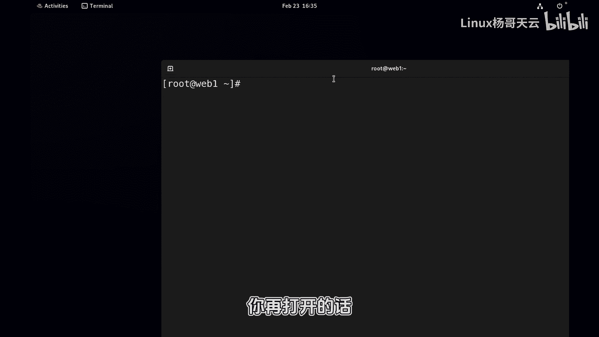

# 史上最强Linux入门教程，杨哥手把手教学，带你极速通关红帽认证RHCE（更新中） - P43：43.Shell别名是个什么东东？ - Linux杨哥天云 - BV1FH4y137sA

Hello，各位小伙伴，我是杨哥，那接下来我们看一下啊，在之前我们讲到，我们讲到这个命令的话，他会去搜索pass，比方说我们执行的CD或者执行的ls，它实际上呢会根据这个去搜索到相应的位置。

也就是根据pass这个变量的路径啊，然后实际上你输入也没问题，像这样输入，你直接用给路径，给绝对路径或相对路径，这个时候就不用输入嘛，那就不用那个搜索也没有问题啊，然后去进到某个地方去etc里面去。

没问题，同样呢你看我们执行并下的IOS去查看，对不对，各位他是不是也应该没问题啊，那查看什么呢，就查看当前目录吧，但大家发现好像有点不一样似的，它跟这样显示不太一样啊，看到了吗，它好像没有颜色。

这个大家应该看清楚了啊，还有呢就是如果后面加上我们如何人工加上color，这可以是一样的，所以可见我们执行的命令呢，好像还真不是不是直接是这个USR并下的IOS，所以呢这里在前面跟大家提过。

我们敲一条命令的时候，shell呢它会从很多地方，它有顺序的去找这个命令在哪个地方，不一定是先pass pass，只过是中间的一个站，大家看到这里呢就有别名，就设置的这个别名。

这是我们现在当前的所有别名，把所有这个系统啊，目前的这个这个账号的别名，比如我们用的CP别名是优先的，各位别名是优先的CP他使的是CP杠I哎，就是交互，然后我们用的LLLLS。

它实际上就是个LS杠color凹凸，我们用的MV也是杠i RM也是杠I交互嘛，怕误删除或或或那个就普通用户啊，这个管理员也是，然后LL呢更加是个别名，我们用到了LL实在是LS减L。

那在别的shell里面可能就没有LOL，所以不要把LL看成是个命令别名，当然也是命令的一种别名，可以怎么解解解释呢，就是你看像这个LS，我们平常不可能去输这么长一串，刚刚COLOR开了多麻烦呀。

所以我们现在的这个IOS呢，其实用的是先是用的别名，这个我忘了之前给大家介绍过没有，tab杠A会查到一个命令的所有的来源，你看它首先告诉你有两个ls ls s，第一个ls ls s呢，它是什么呢。

它是个别名，他谁的别名呢，他是ale点点color的别名，还有另外一个是我们的这个ALLS，大家看懂了吗，所以别名是优先的，或者说别名，它是在我们的搜索路径当中是优先的，你可以把一些很长的命令觉得很长。

很难打的命令，然后呢去定义一个别名，那怎么定义呢，呃比如说我经常可能要看伊利西亚的，整个很长的cs CCS，Come big bad work，我经常要敲这个命令，很是麻烦。

那我就把这个命令整个搞成一个别名，叫啥别名呢，就叫alice net，这是我自己起的啊，alice net后面的是这个命令的本身好，也就是我定义了一个l s net的一个别名。

那现在我敲l s net呢就可以啊，看他就有这个命令，为什么这么讲呢，type杠a l s net，你看他说是个别名啊，但是除了别名以外，它是它的一个别名，所以我们可以把一些较长的mini。

或者像刚才IOS杠杠color一样的这样1mini，定义成这种别名，而在整个搜索路径当中呢，别名肯定是优先的，我们通过ADELSEELLIOS这种方式定义命名，当然取消也很简单。

你把这个窗口关了就可以了，因为这是这本身就是在当前shell的啊，你也可以呢很无聊的使用on alice alice net，这我觉得我感觉没啥必要啊，这个现在看了就没了。

你再去敲这个alex net就不好使了，所以这是别名，当然还是那个我们可以把这个别名加到哪去呢，加到我们的呃，加到我们的，比如说这个就是点B事RC里面去啊，呃这里有一个是点拜事，点B是RC。

我说的点BS2SC指的是用户当前目录，所以一般书上描述是这样写的啊，我觉得这个写在规范，是不是你不能改人家家里的by12C，那都不要脸了，是不是啊，之前我们设置过一些一些变量哈。

当然这个变量实际上呢也可以设置到，设置到这个点BH这个点batch profile里面去，这里有个下划线，这也可以啊，但一般的变量可以在这里面设置，但别名的话呢，我们好像约定俗成是在这里面设置。

你看人家都有了，看到了吗，咳这个别名设置跟那个跟那个变量不不一样啊，行我们对齐吧，alice net等于后面是别名的内容，好弄多了弄多了啊，删一下嗯，这个对了吧，好多了个引号嗯，你关了当有两种方法。

一种是SOS一下，点by10RC，这样他就运行一遍。

一种就是呢没有一种，其实以后你刮了也行，你刮了再进来，像这样关了重新打开一下。

你重新打开的话，它就会直接B12C对不对，你再打开的话。

它就会执行办事RC现在你看能补全，那就可以，这就是别名，因为我们重新在执行shell的时候呢，它就会执行它的，刚才我们其实打你别看打开那个终端，打开这个终端。

他就是开了个shell去运行的shell程序，运行shell程序的话呢，它就会去运行它自己的BH相关的，比如说profile，或者是呢这个还有个白鲨RC，但是这个白鲨RC是有profile运行的啊。

你可以打开看一下by batch profile，这里面他说如果有BHRC就运行，它就执行它这样一个过程好，这是别名呃，当然别名呢如果不想用的话呢，也可以像这样，你看alex net这个可以用是吧。

你不想用的话，那就写信，但没有这个命令了，就已经啊，我解释呢应该不是不让他解释，多多跑，看这个本来LOS在这有两个l ls s，这是别名，这是真实的LOS，如果说你敲IOS，他用的就是这个别名。

如果说你呢敲路径，那不用讲读，就是那个路径的命令，如果IOS前面加个斜线呢，就相当于就跳过别名，他直接走下面那个那没有颜色就正常的嘛，对不对好，这就是跟BH相关的bach shell，那一直我们在讲哈。

我们现在用到的shell用到的效是半实效，我们就是我们现在无在操作，在红帽的这个LINUX或者snos stream或者stream上面，我们所操作的shell和大家习惯的shell呢。

是这个bs shell，shell呢就是一个显示器嘛，但是有很多很多种shell，还有什么keshell c shell，很多种shell，而我们大家比较熟悉，非常熟悉的就是这个bash shell。

BH是shell当中的一种啊，但是我们大家比较习惯使用它，那以后你到别的系统上面，你直接挨了挨了没有，不要奇怪，而且IOIL是个别名别名，有时候可能用不了，所以你就习惯IOS杠L就可以了。

是不是你把它加上就可以好，这就是关于我们的这个别名，大家可以念一下啊，不用的话呢，临时不用的话，斜线S啊，斜线那个后面加命令就可以，另外别忘了我们这几个type这个命令是干嘛的啊，可查看一个命令。

它的相当于出处，我们可以看一下一些常见的命令哈，你要这样写，它只看优先使用哪个，你要杠A的话呢，就是看他所有的出处给大家看一下CD哇，CD有俩CD，就平时我们用的CD还不是这个地方的CD啊。

用的是一个shell的building，内置的命令，也就是说他是shell娘胎里面就带来的运行shell，它就包含在里面的，我们再看一下if哇，这还是个key word关键字。

总之呢你看无论是shell的building，还是呢这个叫shell的key word，还有一个命令，这个大家有点恶心它，那又怎么样，你看有人说这不是个命令，凭什么就不是个mini。

你哪看出他不是个mini，这个方括号长得多么好看，他是一个内置命令，同时呢它在这儿也有一个真真实实的程序，看到了吗，各位所以我们这个type命令真的是很牛叉，我刚前面给大家出了个题。

我说当你去执行一个命令的时候，shell会从哪儿找，第一步找哪儿，第二步找哪儿，第三步找哪好，各位看到了吗，这里至少我们看到了有内置的，有关键字啊，还有可能有函数啊。

还有这个还有这个函数function啊，还有呢就是它的别名有很多呀，还有就是他的真实的这个路径，就这个路径呢你记住就是pass变量决定的，假如说我们pass变量毁了，看了啊，等于跟哇塞。

这就这就出出问题了，你看这IOS都找不到，找不到了，没有了啊，这这这这可能就pass变量了，就太好了，太完美了，因为就算找到了这个，他最后也找不到真实的那个那个那个位置啊。

所以呢这个pass变量肯定不能毁掉啊，所以pass变量你搞得不好的话，基本上就会影响我们执行命令的这个，查找一个一个位置，而有些CD的话，那肯定是CD到home下去，这没问题，因为CD是内置命令。

有些命令是可以用的好了，大家自己呢这个去做好笔记，那另外呢这个提醒各位一下，这个视频呢，这是一套视频，你从前面看，我们是一点点去讲啊，嗯适合初学者，如果说是你是高手的话，那你就不用看了啊，别忘了做笔记。

一定要做笔记，否则的话呢，你光看这个是没有没有什么这个对你帮助。

当时会。