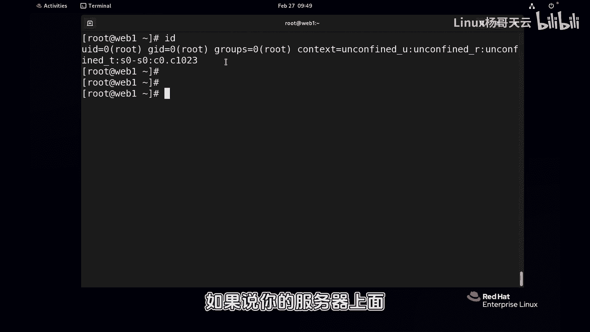
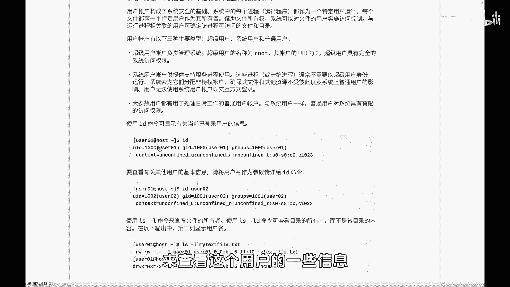
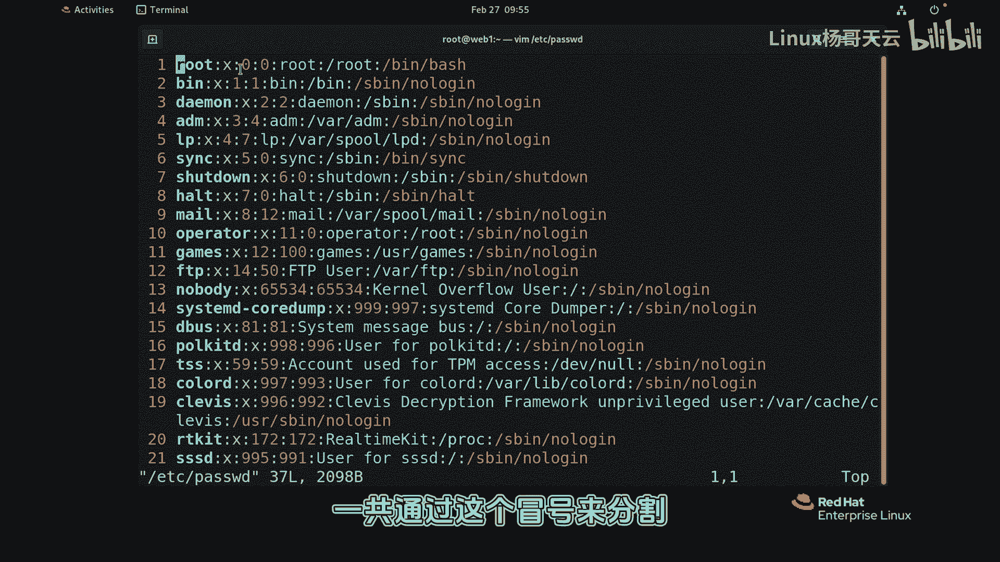
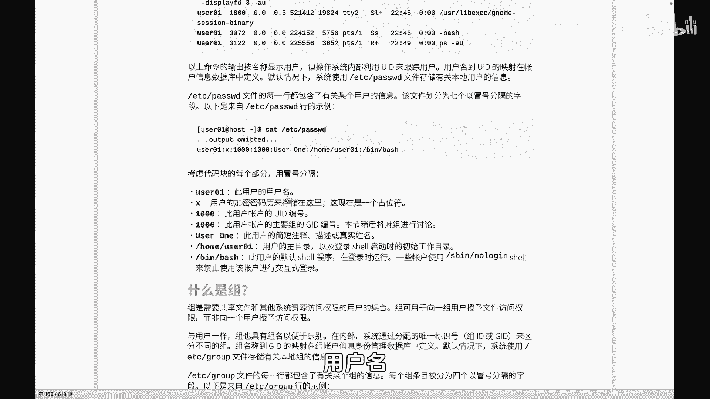
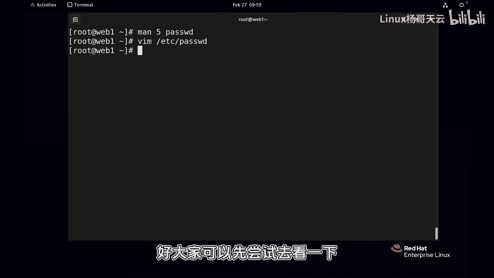

# 史上最强Linux入门教程，杨哥手把手教学，带你极速通关红帽认证RHCE（更新中） - P44：44.了解Linux中的用户 - Linux杨哥天云 - BV1FH4y137sA

哈喽各位小伙伴们，我是杨哥，那我们继续回来学习，不知道大家前面的内容呢，是不是已经练习过了啊，希望大家能够从前面第一小节开始呢，去认真学习，同时也希望大家能够把这套课程，推荐给身边的小伙伴。

特别是大学当中，我们很多专业都会学到LINUX这个课程呢，它不只是去带大家通过红帽考试，更重要的是呢是做好包括开发，还有运维相关的LINUX基础的一个铺垫，那在这一小节当中呢。

我们将开始了解用户和组的一些相关管理，方方式，首先大家知道这个用户和组啊，特别是用户，我们在装系统的时候已经创建过，默认创建过一个叫root用户，还有一个普通用户啊，那接下来呢。

我们会根据我们的一些需求来创建这个用户，同时呢我们也会给大家去在这一章，整个章当中会讲到用户如何去提权，就是将一个普通用户，然后提权为管理员的这样一个管理角色，以及呢怎样把用户加到相应的组里面去。

包括删除，首先我们来看一下啊，每一个进程可以说在LINUX当中，每一个进程它都会以一个用户的身份来运行啊，一般情况肯定不是管理员啊，我们先用一下，后面我们将讲到的命令来查看进程，PSAUX呃。

由于比较多，那我们就head一下前十个吧，嗯这里我们看到有很多的进程呢，它使用的是这边第一列就是用户，但有些进程呢他使的是入的用户运行的，而绝大多数肯定不是，我们就直接直接那个看整个吧。

啊这些这些系统级别的一些进程啊，还有一些其他的一些进程，这是现在目前我们这台服务器上面，没有跑任何的我们自己安装的一些服务，所以呢我们可以理解为，这都是系统当前的一些进程，每一个进程。

大家都会有以一个用户的身份去运行，那么这个进程呢，最后能够访问系统上的某个资源，包括文件都是由这个进程，它所使用的用户决定的，一般情况下呢，我们为了安全，在后面是不会我们的这个常规的一些服务。

包括我们的阿帕奇NGX，或者其他的一些服务呢，我们在启动运行的时候，通常不可能使用管理员，因为这样的危险性太大了，一旦这个进程被被这个啊不法的人所所获得，他的权限，那么将会直接拿到这个进程。

它运行用户的，就运行这个进程，用户的权限啊，这是进程，第二呢我们看一看通过l l l l mini，严格讲应该是LS杠L啊，这个一再强调LL是一个别名，好吧，大家看到在LINUX里面的每一个文件呢。

它都会有一个我们叫做所有者，就这个文件的所有者是谁，他的主人是谁，现在我们这些文件呢，由于我们使用的是root用户创建的，所以呢它的所有者默认就是root，那另外还有一个是呢。

这个后面呢可不是root用户了，而是一个叫root的组，所以每一个文件呢它会有一个所有者，同时还会属于一个组，那么相应的这个组中的用户就会有相应的权限，所以我们要了解用户。

根据我们的一些业务需求来对用户进行管理，包括我们距离启动这个安装软件，启动服务的时候呢，同样是需要这个某一个用户的通过id命令，大家看到这个用户的一些信息啊，首先这个用户啊。

这是我们当前的这个用户叫root用户啊，它有一些信息像UID啊，JID呢还有一个叫groups的一个id，另外呢后面这一段呢是跟S1LINUX相关的，如果说你的服务器上面没有开启SLINUX呢。

那将不会看到后面的信息，在LINUX当中默认情况下啊，应该说准确的说，在火爆雷这个系统中啊，有三种三种类型的用户，分别是呢超级用户，这个在一开始呢我们就给大家介绍过，装系统的时候也是默认创建的。

这个不需要我们自己创建，它的用户的名字叫root，他的UID，注意这里呢我们看到的是用户名啊，杨哥天云root，但是在系统层面呢，会为每一个用户匹配一个或者分配一个用户id，也叫user id。

用户id啊，超级管理员的UID呢是零，所以它对整个系统具有完全控制的权限，当然这个是双刃剑，也是危险的，所以我们在平时我们在后面会给大家强调，在平时系统的管理的时候，特别是在生产环境当中的时候。

我们是不能直接持入到用户登录的，因为这样的话带来的这种便捷性确实很方便，同时呢带来的这个风险也是巨大的，第二种呢是我们的系统用户，这种用户呢一般就是用来启动我们的服务进程，因为我们的进程呢。

一般是不能使用管理员身份来运行的，因为这样的话呢它这个对系统上的资源的读取，还有呢这个访问应该说是巨大的，同时呢刚才我也给大家讲过，如果被别有用心的人拿到你这个系统的漏洞啊，这个进程的漏洞。

从而获得你这个进程的权限，那么这个权限就跟你当初运行这个进程，用户相关，这种用户啊，大家看一下啊，通常他们使用的账户，是以无法使用交互的方式的登录，这个马上会给大家讲到。

就是他的shell它可以启动进程，但是它不能登录系统，所以这个账号呢是是这样的，它不能登录我们的系统，他的shell是一种叫做啊这个lol gain的笑low，没法这个登录的效。

第三种用户呢就是我们的一些常规用户，比如说我们为系统创建的管理账号啊，常规的管理账号，他们就是我们的普通用户，它默认情况下，它只具备一些少量的有限的访问权限，当然我们可以根据我们的需求了。

来对这些普通用户进行提权，包括我们后面会讲到，通过切换或者是速度的方式呢，来临时性的这种提权，以获得一些临时性的一些这个管理的一些权限，三种账号超级管理员0UID。

零这个UID其实并不能代表太太多的意思，但零这个毫无疑问肯定是管理员，第二类呢就是我们系统账号，大家也不用特别去记，这个账号的UID到底是从哪开始，这个是系统会分配后面有一个文件呢，它会默认定义呢。

这个用户的这个UID是从哪个地方开始啊，特别要说的是，这种账号是没有登录的shell的，所以我们在建这种账号的时候，比如说我们后面再讲到NGX或者阿帕奇，我们在安装它的时候，在启动它的时候，这种账号呢。

它会有一个启动的一个进程的账号用户，但是他不应该有shell，因为这样太危险了，因为在LINUX里面，如果一个用户有登录的登录的这样一个效，就是他那个远程登录那个交互啊，不管是远程还是本地啊。

那么极有可能是有这种漏洞的，有很多的一些之前的系统就有这种集权，就是将一个普通用户提权到管理员，这是可怕的，所以我们要防止这种情况，因此呢我们的系统上极有可能的少，有这样的登录的，是要用户存在第三类呢。

没办法，那我们日常管理肯定要要的，少量的也是管理用户好，首先刚才我们给大家看过，我们可以通过id的方式，来查看这个用户的一些信息。

那如果说id后面呢不加上这个用户的这个参数，那它默认查看的是当前用户，你看这个用户的用户名，我们刚才讲过，用户名只不过是我们人人类哈层面看的，那么作为系统层面呢，看的是这个0UID50的这个账号。

而不是root这个JID呢，我们后面会讲到他的一个叫主组的id，就他的一个组，他的家庭原生家庭啊，后面呢是他所熟的其他组，除此以外，我们可以通过通过这个是不是有个用户叫天名，我忘了啊。

有啊有的这个是之前创建过这个天翼云呢，它也有一个UID是1000，很显然的我们会看到1000开始呢，应该就是我们的普通用户的起点了啊，就从这个地方开始，还有GIT啊，以及我们的这个它的组组的情况。

那这些用户的信息是保存在哪的呢，这边跟用户相关的文件呢会有两个，一个是用户的文件，那当然还有一个是密码文件，首先我们来看一下，就是第一个就是咱们的password文件啊，当然这么看的话可以这么看的话呢。

它不显示颜色哈，呃通过vi看的话来显示颜色好看一点，你看这个比较直观一点，这里面呢就是一行就是一个用户的信息，这个用户呢一共呢通过这个冒号来分割。

有这么几个字段代表了我们的这个叫什么呃，每个块呢是用户的不同信息，首先第一个呢是用户的名字，UID用户的名称，用户名啊。

user的名字，第二个位置呢是密码的占位符，大家不要认为这个password就是密码啊，不是啊，早期的UNIX系统，当时呢安全性可能还没有考虑那么多，是不是当时人没有那么狡诈，所以呢当时的这个系统呢。

密码是保存在和用户名，保存在同一个文件里面的啊，但现在不是了，现在密码是保存在一个叫影子文件shadow里面的，所以这个地方呢呃由于历史的原因，就改成了一个X叫密码的占位符。

第三一个呢是用户的什么ui id，第四个呢是用户的主组id，什么叫主组呢，祖祖就是他原生家庭，他自己生下来的那个默认的那个家庭，后面呢这个你随着你在结婚，你还会增加一个家庭，就是你老婆的家庭啊。

也是你的祖，所以这个是他的，你可以认为是原生默认的那个家庭，然后再紧接着呢，这个地方是用户的一个简短的一个啊，简短的一个描述，可以可以没有很简短的描述，然后再往后呢是用户的加目录。

也就是个这个绿色部分用户的加目录，最后这个地方有同学可以看一下啊，这五花八门的看lol game，这都是一个程序哈，各位这不是乱写的一句话，这都是一个进程，但这sorry这都是一个一个程序，一个文件。

我们在上一集当中还给大家大讲特讲的拜师，也是拜师这个shell，因为我们对系统的管理，我们就通过的试试拜师这个show，很显然这个用户他的shell不是这个用户的shell，也不是这个用户的shell。

更加不适，因此呢他们并不能够登录系统，这就是我刚才在前面跟大家说的这种用户，它拥有的是非交互的时候，他不能够登录系统，但是不影响它就运行进程啊，这是我们的一共几个段，当然你也可以慢man。

然后password来来看一下啊，他应该是第五章，第五章里面你要记不得的话呢，就可以通过慢杠key，这是password这个命令，第五章是password文件，你可以通过慢直接你知道的话。

那就是man5password，来获得了这个password文件的解释啊，下面有相关的一个每个字段是干嘛的，看到了吗，它的每一个字段字段的信息如下啊，这个单词的字段啊，然后名字登录的名字啊。

然后还有password，这边已经换成了密码占位符XUID，然后还有GID它的主组，Primemory group，主组id，还有他的一个一个简单的一个描述，以及它的一个directory。

它的加目录是哪个，还有他的shell，什么叫shell呢，我跟你这样讲，就是这个用户登录以后，你可以认为运行的第一个程序，就是它的这个默认就失效啊，如果你把它改成shut down，很好玩的。

我们可以后面有机会试一下，就如果你把它改成这个叫什么，看好了啊，各位如果你把这个用户，比如把你自己创建了一个账号，你改成了SB下的sht down，他一登录就关机了哈，就它运行的第一个程序是什么。

就是这个OK这是关于我们用户的信息，大家先可以通过给大家提供的任何一种方式，来了解一下用户信息，那关于密码呢，它不在这个文件里面啊，因为我们现在还没有建密码好。

