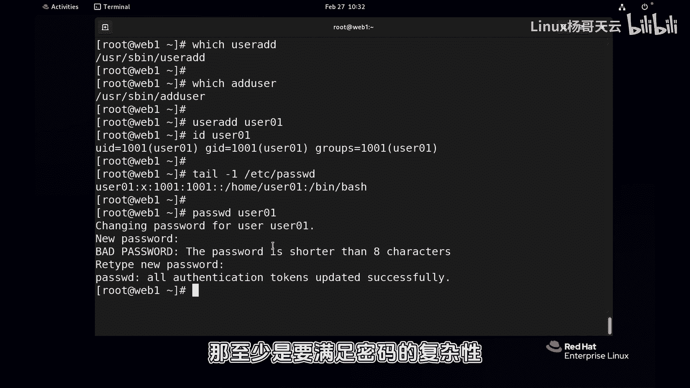
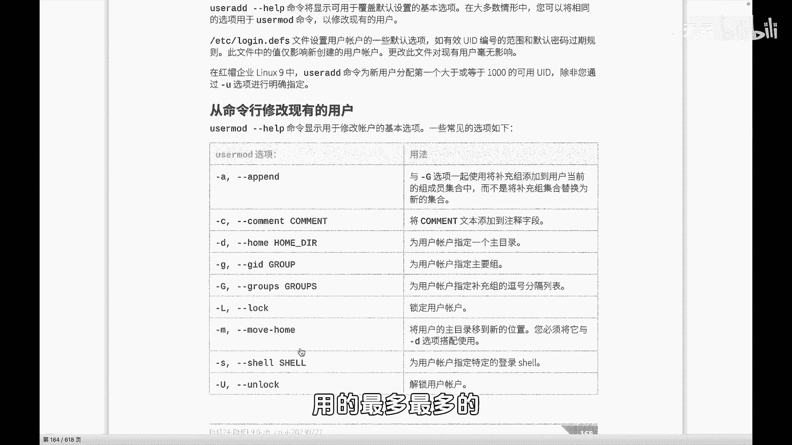
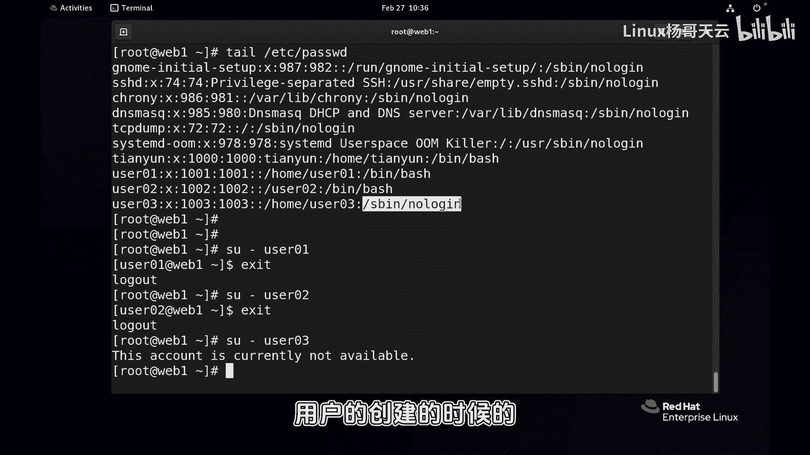
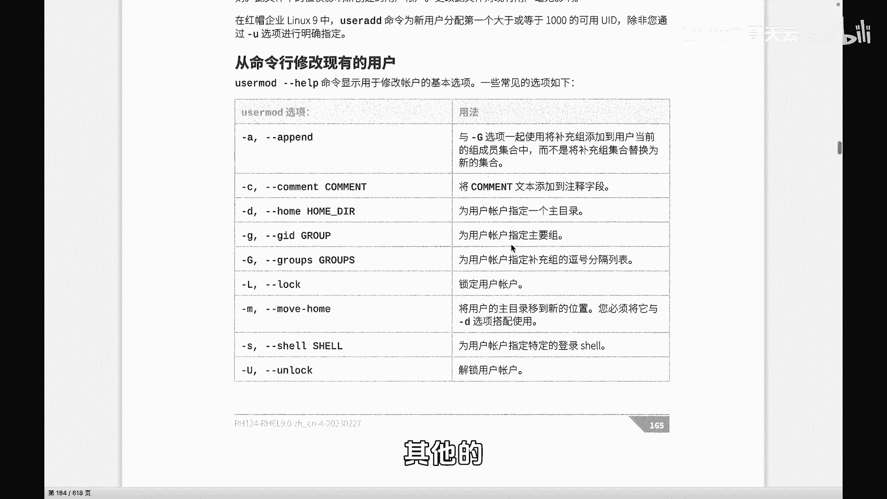
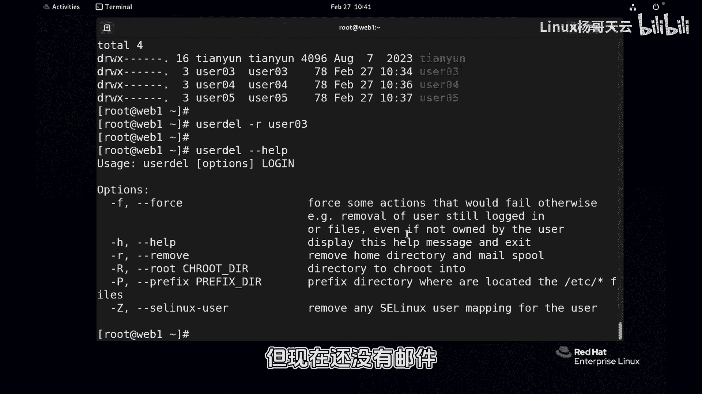
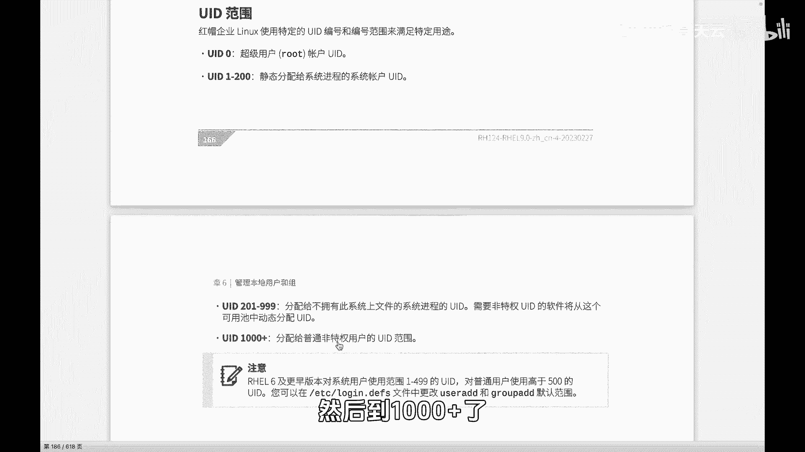
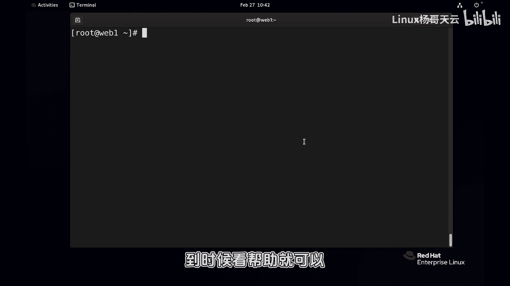

# 史上最强Linux入门教程，杨哥手把手教学，带你极速通关红帽认证RHCE（更新中） - P45：45.用户管理useradd还是adduser 开心就好 - Linux杨哥天云 - BV1FH4y137sA

好各位小伙伴，接下来我们就具体带大家来进行一些，用户的基本管理，这个其实比较简单，重点就是如何创建，还有删除，那么创建账号呢，我们用到的这个mini呢是user ADD。

它的位置呢实际上是在在这儿看到了吗，那另外还有一个命令叫做ADD user，这两个其实是一样的，所以你你是喜欢用哪个命令来创建账号呢，你开心就好啊，比如说你呃13135使用user and。

246使用and user都可以，user and创建一个账号，比如说user01，大家看到这个是没有加任何的参数的啊，回车以后基本上在LINUX当中，命令执行以后没有报错，那就是最好的效果。

创建完以后呢，我们可以看一下这个用户其实就有相关的信息，首先user id我们看到这个是用户的UID，因为之前有一个天翼用户呢，已经是占了1000的一个UID，普通用户的分屏默认是从1000开始嘛。

所以下面这个用户呢是1001用户名，还有它的一个主组，看到了吗，我们在前面给大家提过，每一个用户都会属于多个组，不一定多个组啊，至少属于一个组，也就是你生下来的话呢。

你最起码最起码要属于你自己的这个家庭，这个家庭来讲就是你的组组组，你这个家庭呢有钱，那么你也会分到钱，当你这个结婚以后，你还会呢属于第二个家庭，那那个家庭有钱呢，你也有钱啊，是不是这样的啊，不知道啊。

那如果说你再结婚的话呢，你还会属于第三个，第四个第五个主组，但有同学说，那如果用户没有结婚呢，那它就不属于任何的啊，子主组只有一个，说错了啊，附加组属于那个多个，那些都是附加组，不叫主组，差点说错了。

附加组可以有也可以呢，有多个，如果说一辈子那个光棍儿的话呢，他就只有一个竹祖啊，嗯我们在后面讲到主管理的时候呢，会给大家再具体的讲一下啊，实际上我们在创建账号的时候，不是简单的这么创建。

可能会根据需要呢来加相关的参数，当然创建完以后呢，可以看一下，在在etc password里面，在password后面，其实你看最后一行就可以了，太多也没有意义，就有这个用户的信息，用户的这个名字。

用户的密码占位符UID，还有了他的读组id，也就是这个位置，还有他的一个加目录，以及默认情况下给的一个shell，我们常规就是这个BH这个shell程序啊，然后当然你也可以使用这个账号登录了啊。

先别管它啊，密码呢密码也比较简单，密码直接password，然后后面跟上这个用户名user名义对吧，回车大家注意它是不回显的啊，不回显密码表示我们就输一个read head，如果你觉得输错的话。

那你可以删除，再往前输一下，它提示你错误的密码，这个密码他说太短，而且呢应该大于八个字符，我说管你那么多，因为我们是管理员，我说就这样吧，所以管理员的特权很大，你就告诉我规则，我也可以不遵守。

但是后面如果是普通用户给自己设置密码的话，这个是过不去的，那至少是要满足密码的复复杂性。

健壮性才可以，实际上我们在创建账号的时候呢，我刚刚只给大家提过，是根据需要呢会去加一些参数，比如说我们可能啊通过杠A的方式，顺便给他加到啊杠A后面，配合这个G的方式，顺便给他加到一个已经存在的附加组。

或者几个组当中去，这个是会会干这个事情的，也就是创建账号的同时，我们将用户呢加到一些其他组里面去，他这个组可能现在没有啊，没有的话呢，那我们也可以在后面呢，这个用户存在以后再给它加也可以。

然后还有杠C这个两个是等价的，杠C或者杠个comment，后面跟一个描述啊，加一个注释，还有杠D或者杠杠home，我们都可以指定一个加目录，杠G指定它的主组，杠大G指定它的附加组，附加组也是补充组。

可以多个附加组逗号分割，还有什么锁定账号，还有这个效什么的，用的最多，最多的话呢应该就是杠D和杠S。

也就指定它的效，比如说给大家演示一下啊，刚才user01的这个用户呢，它的加目录就是home下的user01这个位置对吧，然后如果我们再创建一个user02啊，你可以加参数加到后面。

比方说是那个根下的user0202，这样写也可以把杠D这个参数加到中间，这个位置都可以，那默认情况下，大家知道这个用户的加目录应该是在home下面，但现在改变了，现在是在根下的user02。

所以通过tile呢，tail我们看下最后十行也行吧，Password，这个user01的加目录是这user02加目录是这，这是这一个，另外还有一个是什么呢，就是我们在创建账号的时候可以通过啊。

你写的前面也可以啊，SB下的low l o l l o g i n，这个好像补不全啊，然后是user03好，那我们再看看最后的几行，user03这个账号呢，很显然他的shell是一个非登录sh。

这个之后我们给大家可以演示一下啊，这样吧我们就给个你先给个密码，先试一下password，先给一个user02，简单一点吧，我就搞个一，因为我是管理员，这就无所谓了，然后user03。

如果说你是在生产服务器上敢这么设密码，特别是在互联网上，你的服务器很快被扫描，很快被别人拿到拿到手，所以千万不能使用这种弱智的密码好，那么这个账号user01和零二呢，其实是可以登录的。

那user03是不可以登录，就包括我现在注销一下，然后再登的话呢是会报失败的，他可能看不到什么效果，所以我不妨先用一下这个mini给大家演示一下吧，啊大家先借用一下这个提前mini啊，呃user01。

你看啊，我回车以后先不要管这是到底怎么个语法好，可以的，对不对，前变user01，我退出一下，然后换成user02，也可以再换成user03，大家看到他不可以，它是无效的，但账号当前是无效的。

并不是说他账号无效，而是它没有效，他执行的是这个无效的程序，因为我刚才在前面给大家提过，当用户登录的时候，不管是怎么登录，是在这登录呢，还是远程登录，还是在图形化登录。

它先执行的第一个程序呢就是这个shell，这个效呢它就无法使用，所以是一个feed shell啊，这是关于我们的这个叫什么，用户的创建的时候的一个基本的一个一个动作。

那接下来我们就看一下用户的删除啊，其他的呢我不是说没有没有用。

现在了是用不上啊，你也可以使用杠大G也也是比较常见的，User add，比方说user204，顺便把它加到组，注意看啊，组h r i it，当然这个命令回车肯定会报错，因为这个组不存在的。

顺便给他指定这个组啊，当然它的主组不会改，因为主组是刚小剂啊，当然你前提是呢你需要有两个这个组才可以，你现在回车，那这个组不存在啊，我们非常的不好意思，这个命令他是经常性的要用到后面的命令。

那就先创建一下这个组和这个it组吧，然后再来创建呢，User04，看到了吗，如果现在在id user03，它的组比较简单，主组还有它的附加组啊，他的所有组包括他的主组，那user04呢那就多了。

看到了吗，user04的话，它的主组是这个1006，User04，注意这不是用户哦，这是组，还有它的附加组，所以这个也是比较常见啊，另外还有一个常见的啊，我我差点忘掉了，杠U指定他的UID。

这个好像这上面没有说是吧，没有说没关系，有一些需求呢是需要我们，比方说特别是在做集群的时候，我们需要多台服务器上的用户的UID是一致的，这个时候就不能由系统分配，你系统分配的话。

可能他是根据顺序排位的吗，你这个系统上可能分的是1003，那个系统可能分成1005，所以我们这个时候就要指定UID要2000，user05回车再看一下user05这个账号。

那它就是user2000的一个UID好，这几个比较常见，看一下杠优杠D杠G还有呢杠S，其他的话呢个人觉得可能不是很常见啊，也没也没有意义的，这是我们创建账号的时候，听好了，不代表这个用户创建好了以后。

我不能改，有同学说，这个账号我当初创建的时候没有想那么多，怎么办，后面可以改好，这是关于账号的创建，那么账号的基本创建呢，这个没有没有什么太多，如果说大家真的忘了怎么办。

那user ADD刚才help一下也可以，是不是很清楚啊，你看这个跟书上写的是一样的，杠B还有B是基本目录，它的那个主目录上面那一层，还有杠C杠D还有杠E什么的，杠杠小G杠大G啊，这里都都很多啊。

还有杠UUID，那我们下面呢再介绍一个命令叫user dl，这个是删除用户啊，那在此之前呢，我们先看一下，在home下面呢有一堆的用户，有一堆的目录，这个目录呢是相关用户的加没错对吧。

那现在我们通过这个DEL将user01删除，删除以后，大家看到在EDC下的password里面呢，这它就不存在了，UER01就不存在了啊，其实在这个EDC下的group这个文件我没有提过。

不过这个文件没什么太多要提的，它也不存在，USR01呢啊，USR02有，USL03有，但是没有user01，这里面不是用户，这里面是组，这是组名，这是组密码，这个组也有自己的JID。

还有呢它的组成员后面是组的成员，很显然呢你的主组也是组附加组也是组，像那个hr和IT来讲的话，是我们单独建的组，但是呢我们也知道user02和U403，U 404u4205，这个是在创建用户的时候。

同步创建了一个组作为该用户的主组，不管是什么组啊，都是组好高桌子，低板凳都是木头对吧，那这个已经删掉了，但是在home下呢，U301的家还在，你想知道它的加加在人不在是什么效果吗，L这个S啊杠L后。

或者是ls s杠L杠D，然后home下的user01啊，这个杠T是看目录本身，大家还记得吗，我说了，这个人已经死了，但是他的魂还在他的1001还在，他的UID还在，这个挺可怕的哦。

如果现在我们创建一个账号，默认也用到了这个1001这个UID的话，那他相当于把它的价格霸占了，鸠占鹊巢了啊，所以大家要注意这个点，因此呢如果这个用户家里没有什么值钱的。

那我们可以呢就把他的家像常规的手段呢，像这样删除，当然删除以后呢就不存在的吗，是不是除此以外，你在删除账号的时候可以加一个杠r user03，注意这是同时，我说的是同时你如果已经把这个账号删掉了。

你再不能把他弄起来鞭尸对吧，你这个肯定不能这样，所以回车R是干嘛呢，我们可以刚刚看一下杠杠have，我看一下杠R是删除它的主目录，还有他的邮件的一个列表，但现在还没有邮件，所以你就认为是主目录就可以了。

所以user dl删除的时候，同时呢将他的加目录删除，这个动作呢是比较的比较常见的啊，另外说到这个UID呢，我也给大家再强调一下，您是我们的管理员的账号，UID1到200，其实应该是一到一百九百九十九。

它分类比较细一点，还有分配给什么，不拥有此系统上文件进程的UID，总之这个999，这个从1~999，这个咱们用默认用不了啊，除非你强制指定，然后到1000加呢。

才是我们普通用户使用的这个，UID的一个一个范畴，好这就是基本的用户的创建，那么在接下来下一节呢，我们将为大家讲到密码的一些管理，那个还比较重要，因为涉及到用户的账号有效期之类的，然后再紧接着呢。

我们会给大家讲到用户的一些组的相关的，一些管理啊，就是如何把一个存在的用户做相关的一些组的，一些管理的工作好，大家仔细的去练一下，不常用的话呢，你就不要用了，没有意义啊。

