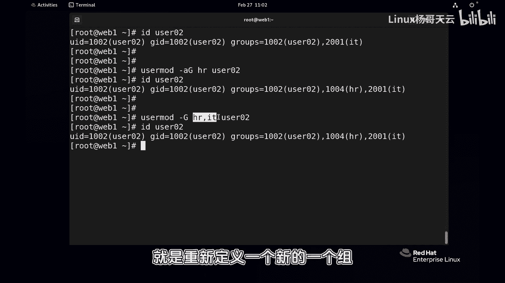
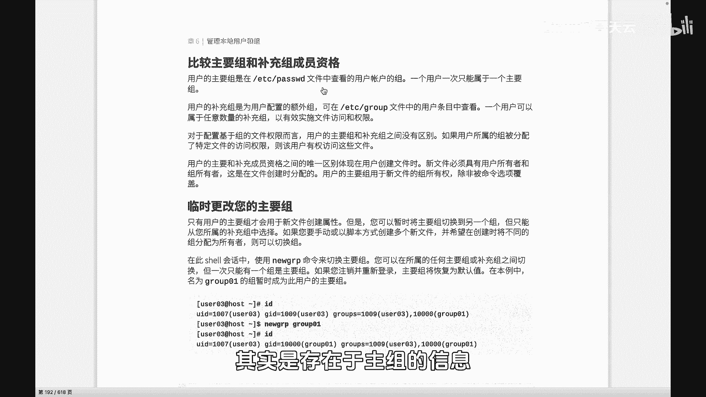
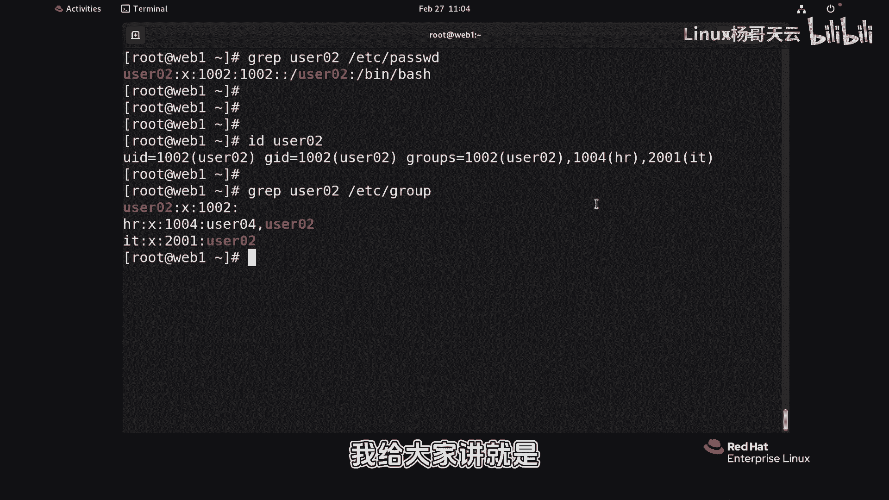
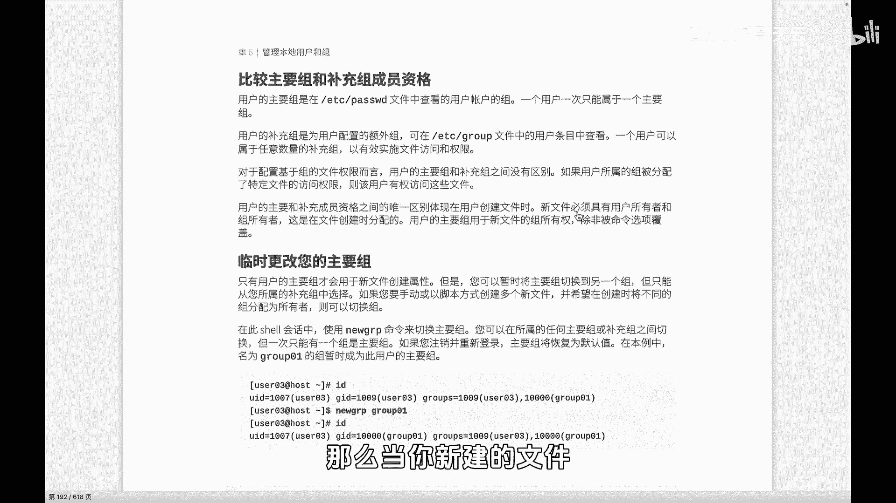
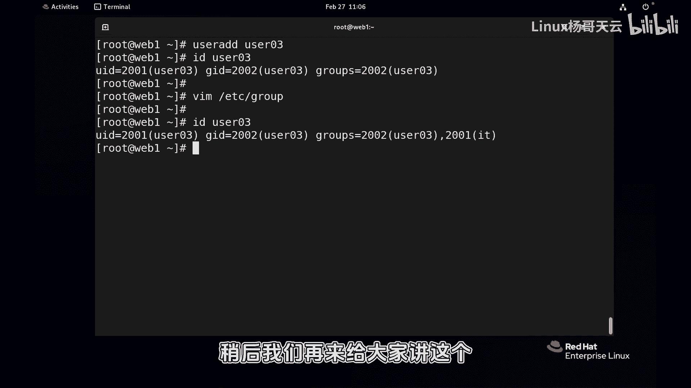

# 史上最强Linux入门教程，杨哥手把手教学，带你极速通关红帽认证RHCE（更新中） - P46：46. 用户组管理 我的家和我老婆的家 都是我家 - Linux杨哥天云 - BV1FH4y137sA

哈喽各位小伙伴，接下来我们来看看组管理这一块比较简单，但有一个点非常重要，就是主组和附加组的这样一个区别，首先组管理呢，创建组呢在前面已经给大家演示过，就是group ADD这个命令之前。

我们创建了hr这个组，还有我们IT这个组，比如还有一个什么其他组啊，创建的也是这样创建的，创建比较简单，那如果我们想要这个删除组啊，组当然也可以指定啊，也可以指定什么gt什么的。

我个人觉得呢就意义不大了啊，他也是刚G来指定，还可以指定你密码啊，这个其实没有意义，删除组的话呢，用到的是用到的是这个group d l，删除这个组的同时，那它的信息。

比方说etc下的group这个文件里面的主信息，同样的就被删除了啊，当然如果有一个用户啊属于这个组的话呢，这个也没关系，他自然就从这个组当中退出去了啊，没有这个组的资格，那么对于已经存在的用户。

我们现在再把这个IT组加起来吧，对于存在的用户，我们想要改变他的组的成员的一个资格，也就是想将它加到某个组里面去，比如说现在user02这个用户，他只属于他的主组，怎么看出来的呢。

前面呢UID1002没问题，它的主组是1002，User02，他所说的所有组，而当前的所有财产，所有的组只有1002，那就说明呢他现在只有属于他自己的家庭，还没有结婚，还没有获得其他组的这样一个资格。

对于这个存在的用户来讲，我们使用user mode来改变用户的这样一个组的，一个成员资格，这个不是创建，创建的时候呢，可以使用杠大G什么的啊，User mode，那么user mode呢可以改变主组。

也可以改变呢这个附加组就是高达G啊，我们来演演示一下啊，看看后面跟上了hr这个组，User02，也就是将它的附加组改编成user02，当然现在它还没有组啊，我们不妨来看一看现在的这个一个情况好。

大家看到他的主组不会变的，主组呢还是10012，因为我们没有使用个刚小小G啊，使用的是附加组，如果现在我们再来加上一个i it好，大家可以想一下，给大家这个几秒钟思考一下，他现在回车以后没有报错是吧。

此时此刻user02这个用户他属于哪个组呢，好可能跟你想的不一样，它并不没有属于hr，而是被覆盖了，所以杠大G后面跟的是一个主列表，因为你就相当于重新给用户指定的，只有什么情况了，现在是IT对吧。

我先清一下屏，那现在呢我们可以使用杠A给它附加，这样行吗，各位看看啊，可以，那如果说你不加杠A的话呢，也可以，那就始终每次呢把这个这两个组加上，就可以把你想要加的组，比如说还有其他的什么组。

其他什么组加上就可以，像这样，这也可也是可以的，肯定不会说会有问题啊，对不对，所以你看看用杠A吗，如果只是不想改变用户原来的组，你想给他额外加上其他的附加组，你就使用AG。

这样的话就不用写原来的组的名字，如果说你想要你不想加A的话，那就需要加这个，所以请大家一定要注意，比如说这样写的话，其实是覆盖性质的，这是关于这一点，我们怎样把用户加到加到这个组里面去啊。

如果你不加A的话，那就是重新定义一个新的一个组。

附加组列表给他，那说到这个组组和补充组的区别呢，这边给大家看一下主组的信息啊，主组的信息在password文件里面，其实是存在于主组的信息。

我们这样看吧，GRP这样看，这样看多少，User02，etc password虽然还没有用啊，但是这个命令呢很显然帅气，grab过滤一下USR尼尔从etc password好，它过滤的颜色呢是高亮的哈。

这个是用户的UID，这是它的主组，所以呢在password里面存放的是主组，其实我们知道user02它是属于好几个组的，对不对，但是呢这里面只有他原生的家庭的信息，那如果说我们现在要看这个gr啊。

gr e p啊，过滤一下user02，从呃etc group里过滤一下，好，我们看到user02这个是它的主组，这后面没有成员，主组成员是不是显示的，还有hr这个组它是作为附加组，这里面还不止他一个。

还有别人id，这个组也是作为附加组，所以附加组呢和主组所有的组信息都在这里面，但是呢主组的这个显示呢啊，在password里面只显示主组的这样一个信息啊，这是关于这一点，那附加组刚才给大家讲过。

可以有多个，也可以没有，就是你没有的话呢，但是至少有一个主组，我我跟大家讲。

就是如果说你没有结婚，一辈子没有结婚，那你就只有出租，那么到底这个主组代表了什么呢，你看啊，一个用户可以有多个附加组或者补充组啊，这个没问题，那么当你新建的文件。

当你创建文件的时候，其实呢默认呢是主组的权限怎么讲啊，大家看看呃，我临时的先切换一下用户啊，切换用户到user02，大家先别忘了这个空格就可以，这边空格空格就可以啊，你看现在这个user02。

实际上我们知道id回车它是属于好几个组的，它不仅属于他的user2002，这个组组还属于hr和id这个组，他现在新建的文件，默认创建的文件，大家观察一下，他的所有者肯定没问题。

谁创建的就是谁的这个user02就是他的主组，所以默认情况下，当这个用户创建的文件代表的就是他自己的，这个相当于原生的家庭这个组啊，而其他的呢默认不是，除非你可以改，但是可以改啊。

这是关于主组和附加组啊，当然我们这个从一个附加组当中，如果一个用户加到一个附加组里面去，这个附加组他所拥有的权限，这个组用户也就继承了啊，如果从这个组当中退出的话呢，相应的可能这些文件也访问不了。

没有这个权限啊，这个倒比较简单，所以大家呢啊不用去记太多，就是知道这个主组和附加组，以及知道怎么把用户加到组里面去就可以，当然实在了，有同学说老师我真忘了该怎么加，再搞一搞一个吧，User03。

我也想将它加到这个组里面去，那怎忘了怎么加，怎么办呢，你可以这样做啊，这都没问题，所以一切都是可以通过修改的，Group，你看到最后我想把它加到哪个组里面去呢，加到T组里面去，那就逗号user03。

多么的任性，看到了吗啊，然后再看一下user03，你忘了命令都没关系，反正最后的效果其实改呢就是改的这个结果，各位练习一下。

