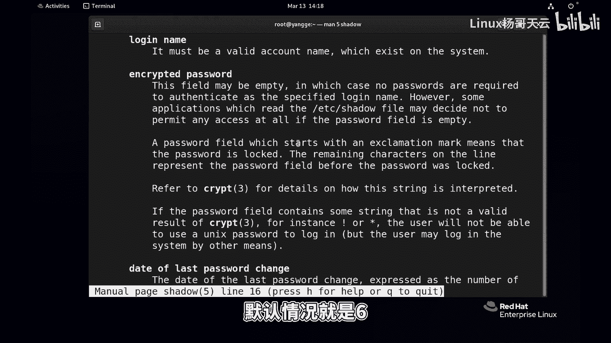
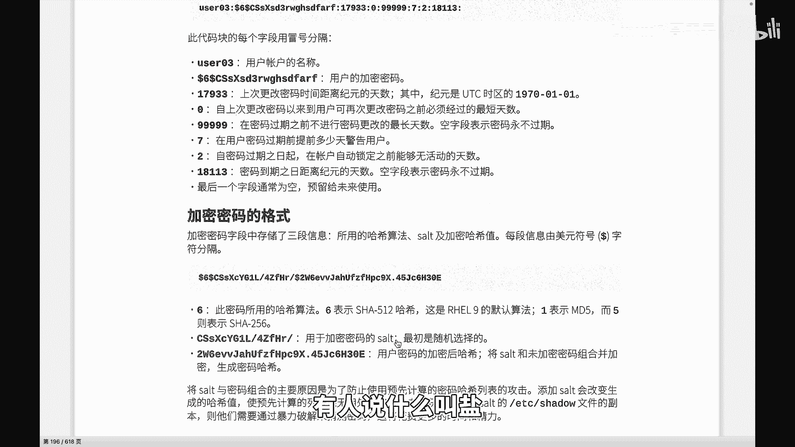
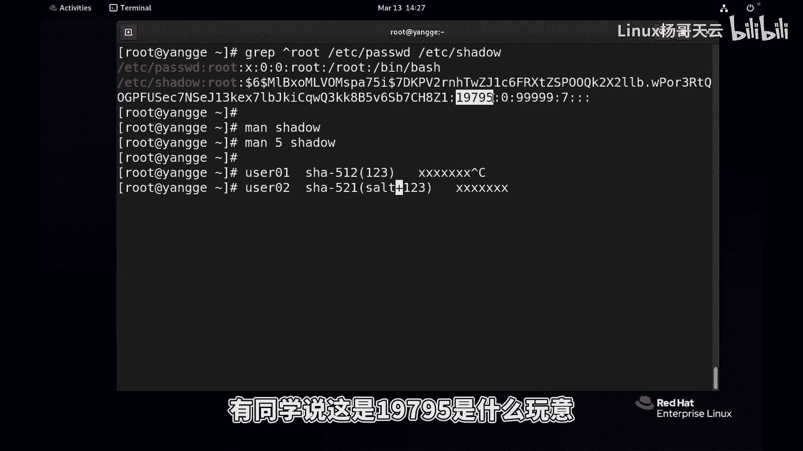
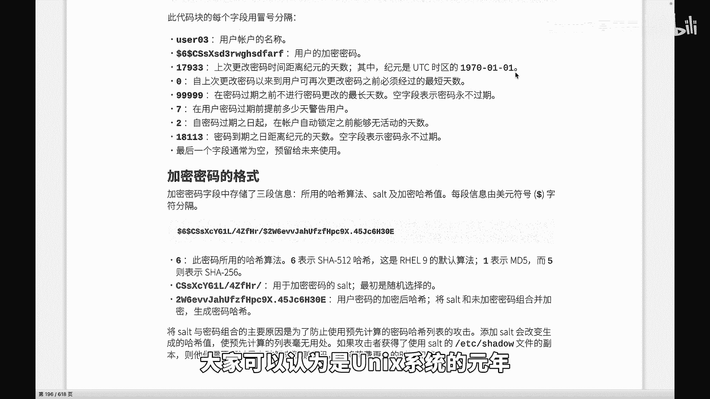
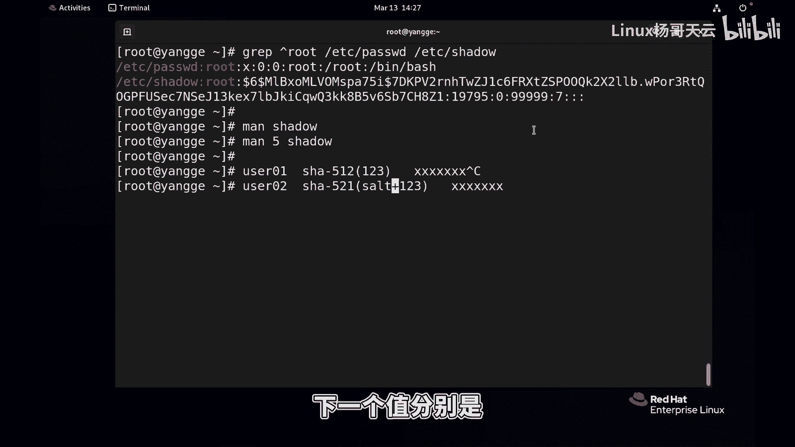
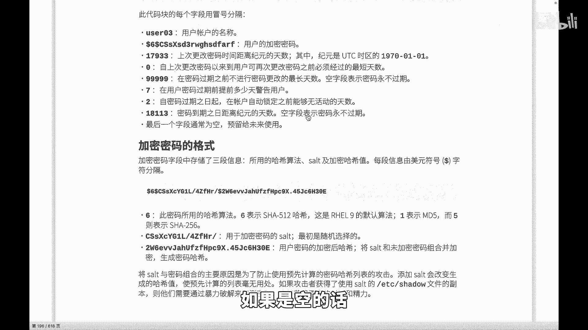
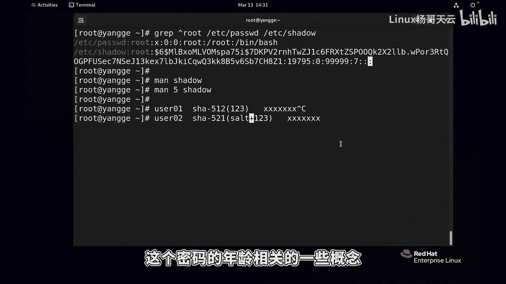

# 史上最强Linux入门教程，杨哥手把手教学，带你极速通关红帽认证RHCE（更新中） - P47：47.密码文件shadow深度解析 - Linux杨哥天云 - BV1FH4y137sA

哈喽各位小伙伴，我们继续来学习用户管理，这一节在前面讲到了用户管理，还有主管理，接下来我们看一下密码，那我们知道每个用户呢都需要设置密码了，才可以来登录系统密码了。

他这边有一个文件是etc下的shadow这个文件，当然这么看的话，它可能内容很多，所以我们就直接使用vi vi有颜色吗，vi打开etc shadow这个文件之前给大家也讲过。

在password文件里面存储的是用户账号，但是它有一个密码占位符X啊，真实的密码呢是存储在这个shadow文件里面的，而这个文件的这个权限呢也是非常的严格啊，呃这个文件呢我们同样可以看到。

它是由很多冒号分割了好多字段啊，这个字段呢就拿这个root用户来讲啊，第一个是用户名啊，这个跟password文件里面是对应的，所以我们可以这样来看啊，比方说root过滤一下。

这样我们先过滤一下root开头的吧，先用一下后面我们会讲到的正则表达式，这个表示什么开头啊，来过滤一下e DC password文件，和EDCR的shadow文件，找到这个，刚才我给大家讲过这个文件。

shadow里面的账号信息和password肯定是一一对应的，这个名字严格讲叫登录名字，Logan name，登录名字，然后它和这个对应在那个password文件里面呢，这个地方是密码占位符。

真实密码呢就是保存在这里面的，所以当一个用户来登录系统的时候呢，他首先会查询password文件里面有没有相应的账号，如果有账号的话呢，那么则会验证他的密码，大家看到的这一段很长的这一段，这就是密码啊。

这个密码呢又分了好几个部分，第一个呢是它的加密的一个算法，就是用什么方法加密的，这边有这个dollar66呢，表示它所使用的这个是SHA杠，512的这样一个算法呃，我们可以慢一下也可以啊，慢一下啊。

SHADER文件他这个是三三章节，是我们的库调用不对，那大家想到关于配置文件的话，我们一般是在五章节啊，这是我们的man的第五章，这就是我们的SHADER文件的一个内容啊，下面它告诉我们啊。

有冒号分割的相关的字段，这是它的整个的九个字段，以冒号来做了这样一个分割，第一个就是我刚刚讲过，登录名字必须是有效的名字嗯，和那个password文件对应，第二个就是它的一个加密的密码。

当然实际上我们也不用去关注它的加密的方式，因为默认呢我们待会会看到有一个文件里面是，定义呢相应的加密的一个默认的方式，这是加密的密码嗯，默认情况就是六啊。

六是使用的是SHA杠512的哈希啊，哈希算法啊，这边我们给大家看一下啊，这个密码三段啊，给大家看看是三段，第一段呢是加密的一个所使用的哈希算法，这个六表示SHA512哈希啊，这是九默认算法。

然后有可能之前的版本呢，有一采用的是MD5的这种方式，还有呢就是我们的五啊，五呢使用的是SHA杠256的这种加密算法，那第一个呢没问题，一般情况都是六，第二个你看这里有三个dollar哈。

第二个第二段呢也就是到到下一个dollar之前，这个叫什么，这个叫盐SALT岩，有人说什么叫盐。

这个东西是干什么的呢，你看他这边的盐好长啊，你看他这个盐呢有这么长一串，最后呢才是最后最终加密的密码，那他怎么加密呢，我们举个例子啊，就是比方说我现在我新建了一个用户，随便一个啊，New user01。

我们给一个密码叫什么叫123，最后呢，那肯定不能够以123这种明文的方式来存储，而是以这刚才我们看到的，比如说使用SHA杠，那个512的这样一个算法来进行加密，把123进行加密。

我们之前见表示各位应该能看懂，我们使用括号来把我们的密码123进行加密，加密完了以后呢，就会得到这样一串东西，这边得到了这一串呢，这是我们的密码啊，先没说盐的这个事啊，为什么要有盐，没有盐可不可以。

这个没有盐的话呢，有一个非常致命的问题，我们先CTRLC一下，那比如说我又创创建了一个user202的账号，这个密码呢也是采用SHA512的，这种加密算法，那不好意思，我也是123。

那如果说采用了相同算法，相同的加密算法，而加密的密码呢都是相同的，那么得到的结果肯定也是一样的，那这样的话就会给黑客带来一个个，这样一个可能性，他拿到了，比方说理论上讲也拿不到啊。

他如果拿到了你的这个密码，假如说这里面就直接是密码，没有盐这个概念，他拿到了你的密码以后，他一看呢，这个密码就是呢和它相同的，因为他的密码也它也是123，或者他有这种啊这种字典啊，看到的这个结果是一样。

那他就可以认为密码就是123，所以换言之，只要是密码相同，那么最后呢由于采用的算法也相同，所以最后的这个整个的一个加密的这个串哈，希的这个串也是一致的，这个是绝对不允许的，那怎么办呢。

我们这个时候就算加密的这个算法一样，我们在这加一个盐，这个盐呢上面我没法上去啊，这个盐是个什么东西呢，这个盐大家想象厨师在做菜的时候，就算都炒的是宫爆鸡丁，那两个厨师做出来的。

肯定的这个盐的数量是不一样的，我们捏一小撮盐可能是多少克，这个厨师做同样的菜，做两次三次十次，那这个盐一定不一样，最后呢严格讲，这个菜的口味呢肯定是稍微有偏差的，就是不同的菜的口味。

这个大家知道听明白没有，所以盐是用来保证什么呢，盐首先是随机的，上面这个也会加盐的啊，我永远没法没法回去了啊，那当这是我们去去那个设置一个密码，我们的加密算法会随机给你加个盐。

然后呢再加上你的密码来进行哈，希换言之，就算密码是一样的，最后得到的哈希串也不一样，就是防止这种哎我的密码跟你一样，或者我我知道这个串，你看这个串儿和我的一样，那一定是这个密码，但是有了盐以后就不会的。

所以这是盐的概念，没有盐的话，这个是可怕的，那两个用户的密码最后串就是一致的，这个是不允许发生的，那最后怎么登录的呢，给大家讲一下，当一个用户，不管是本地还是远程来登录这个系统。

那比方说使用的是这个账号，或者使用的是user202这个账号，首先从password文件里面来判断这个用户，账号的有效性好，OK有有的话呢，然后我们紧接着去干嘛呢，去这个匹配用户的密码。

那用户在登录的时候，他当然不会输颜这个盐这个东西啊，跟用户本身是没关系的，用户是不知道盐到底是多少，所以这个用户呢他在登录的时候，他只会提供123这个密码，没关系，系统会自动的把用户的这个提供的密码。

还有这边保存的这个盐，也是用户它对应的这个盐加起来做一个哈，希哈希，结果如果跟后面的这个串儿对上了，那说明就是这个账号，这个大家听明白没有啊，也就是说这个盐呢这个是干这个事的调味的啊。

但是这里呢是起到一个安全作用啊，当用户登录的时候，会获得用户的这个密码，输的密码，再加上盐，然后最后哈希的结果，按照这个前面的算法哈希得到的结果，如果用户这个提供的密码加上盐，哈希的这个结果。

和系统里面所保存这个字符串是一样的，那我们认为密码是正确的，所以至始至终这个盐呢跟用户没有关系，就用户本身是不需要知道的好，这就是关于盐的概念，所以整个这一段我们看到第一个段呢是用户名，登录名字。

第二个段呢是可以叫做这个叫加密的密码，但实际上分为三段，第一个是呢加密的哈希算法，第二哈希算法就是把一个很长的，变成一个很短的固定长度，根据这个算法的类类型呢，它的长度获得的串是不一样的。

那么对于密码破解的难度呢也是不一样的，第二个就是我们的盐盐是随机的，就跟你去抓盐一样，第三个呢就是加密以后的一个字符串哈希串，大家可以认为这是我们的盐和我们的密码，未加密的密码合起来以后。

最后通过前面的算法生成了一个串啊，这是防止刚才讲过防止这种攻击，用户拿到以后猜测都不用猜测，因为123的哈希串肯定是那个456的哈，希串是这个，但用户最后呢只要去对比。

你这个哈希串和他的字典里面的上万个密码，那就知道你是什么，但由于这个盐不一样，所以呢最后这个结果呢也就是不一样啊，这是关于这个密码这一块，当然还有呢就是后面这几个段看一下。

第一个呢是其实我们也可能不会关心所有的段，我们这这边还有好几个是空着的，看到了吗，一共刚才我们在那个慢帮助的时候，看到说是九个段啊，那应该是八个冒号，分割了九个段，第一这个呢是密码的，最后修改时间。

也就是密码是什么时候改过的，上一次改那个是什么时候改的，有同学说这是19795是什么玩意。

这个叫纪元的一个天数，纪元呢是从1970年1月1号，大家可以认为是UNIX系统的元年啊。

从都是从这边开始，第二个位置呢我往下看啊，第二个这个位置这两个我们一般会关注多一点，至于密码什么时候改过，一般情况不会人工关注他，但是呢如果说这个地方变了，那就说说明有人碰过这个密码。

所以呢我们可以通过一些比对工具，然后来获得这个比对的结果，呃，一般情况我们可能短时间用不上，这个最后一次修改密码的时间，但是下一个呢这两个值刚才讲过很重要啊，下一个值分别是书上呢说的比较复杂。

你看看他说的是自上次更改密码以来，用户可以再次经过什么密码，最短的天数还最大的天数，还有空空字段，表示永不过期，其实我觉得99999已经很长了，活的那么长吗，说人话啊，第一个叫做密码的最小修改时间。

什么叫最好修改时间呢，比如说我这边设的是五，就是你不可以随便改密码，你至少五天以后再改下一次这个他的密码的，他他的生命他最最少得活五天，你不能说今天就把他把他杀死，这是特别是当多个用户。

多个用户使用同一个账号的时候，那我们不能随便改密码，那你改的话，人家怎么用啊，那第二个呢下一个呢就是密码的最长，改密码的时间，最长时间是什么意思呢，就是你到了这个天数以后必须改，比如说我这边设的是30。

那30就是我们也叫最大最大的这样一个修改，修改时间啊，就是你可以认为是密码的最小年龄和最大年龄，这个密码不能够最少的活五五天，如果下面是30的话呢，就是他最多活30天，怎么讲，30天以后密码就要到期了。

就必须要改了，这是关于这两项，下面还有几个字段，特别是像那个七这个位置警告时间，也就是当过期了，密码30天到了，用户在密码过期前多少天提醒，也就是如果我上面设置是30天，那么应该在23天以后呢。

就会提醒用户密码要到了，你赶快改密码啊，这个是一个很委婉的一个时间，这倒数第三个段自密码过期时间以后，账户锁定前活动的天数，也就是说如果密码都过期了，那么我们可能两天设了两天。

这两天你是可以可以还活动的，过了以后呢，对不起，就锁定了，也不能用了，然后这是密码过期时间在哪呢，上面这个其实不叫过期时间啊，这个应该是说到那个地方你必须改啊，最后一个才是密码的过期时间。

等一码到期到期之日，据纪元的天数啊，如果是空的话了。

表示永不过期，那拿我们入的用户来讲，我们看看这个是上一次修改密码的时间，这个是密码的最小修改时间，零表示你想什么时候改，什么时候改，周二没有年龄，他连一天都活都不用活，他说没有没有这个年龄99999呢。

基本上呢就相当于最大最大修改时间，我刚才给大家举个例子是30天啊，你到了这个时间密码就要改了，就必须要改啊，不是过期设要求你改，就相当密码不安全，和我们很多这个公司呢，他这个密码呢长时间使用一个密码。

那这个这个肯定就会给存在这种风险，这个是警告时间啊，这这个地方呢是过期以后，还能够给你一个宽限期，像这宽限期你银行贷款到点了，你还有多少多少天可以宽限好，最后呢还有一个这个是是过期时间，这边我们也没有。

最后还有一个最后呢是保留的好，这是一共是这么几个段啊，这是关于我们的password文件，重点跟大家说一下这个密码的加密这一段啊，大家可以呢仔细看一下，然后我们稍后来给大家讲一下。

