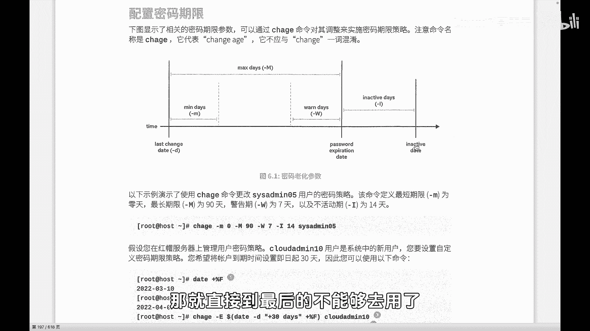
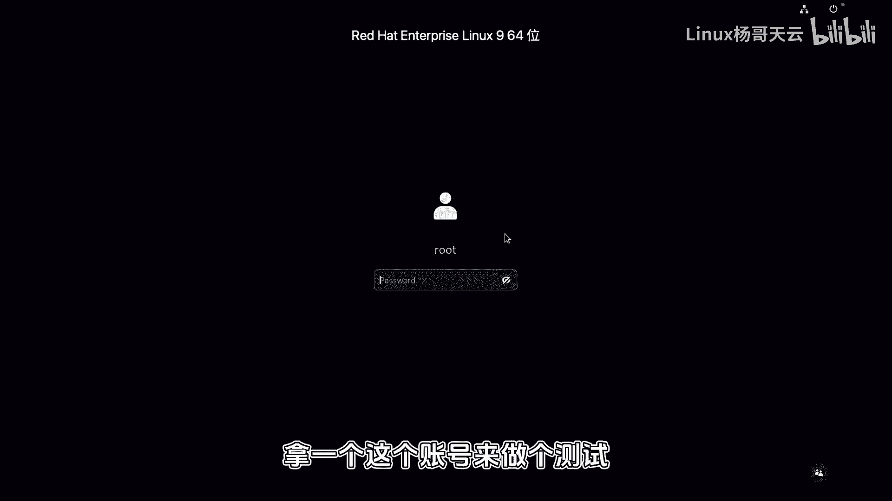
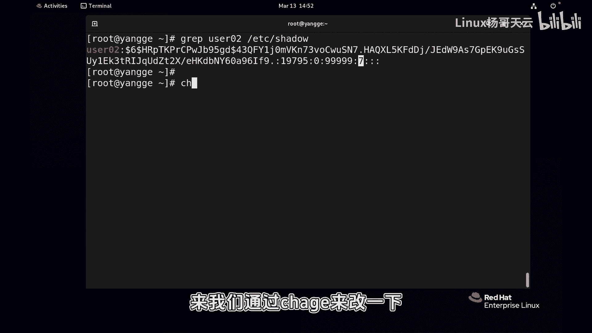
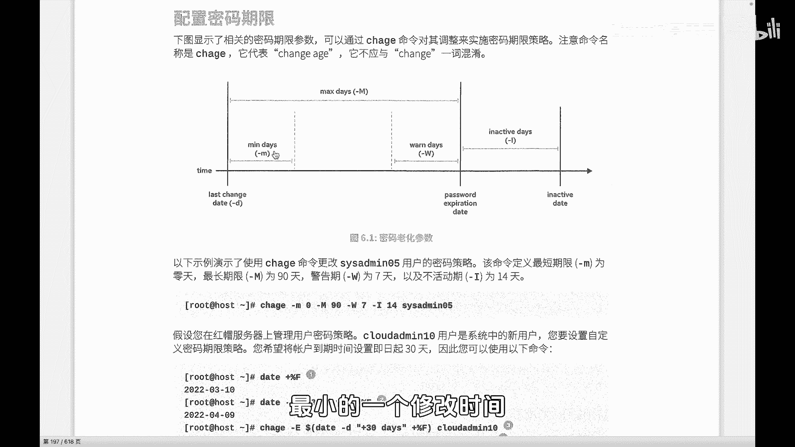
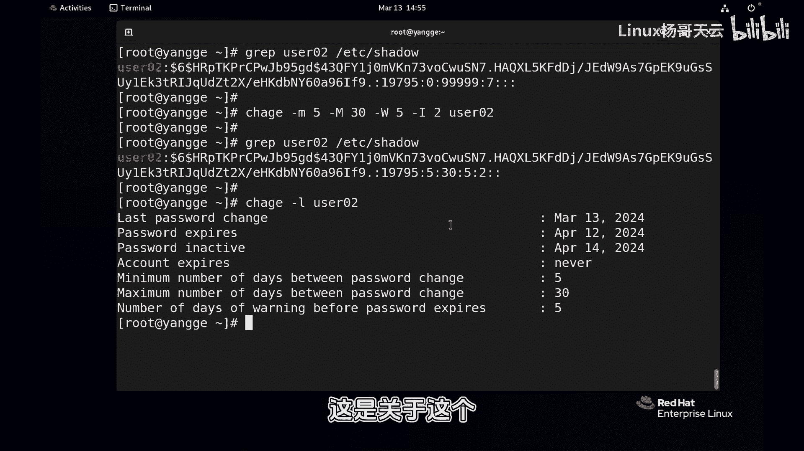
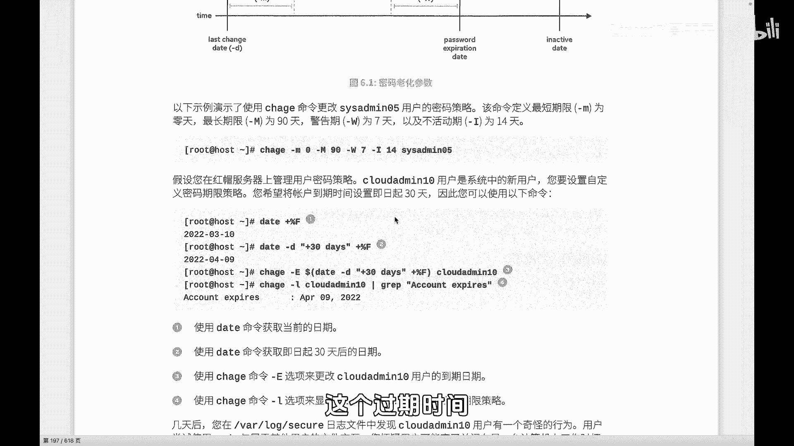
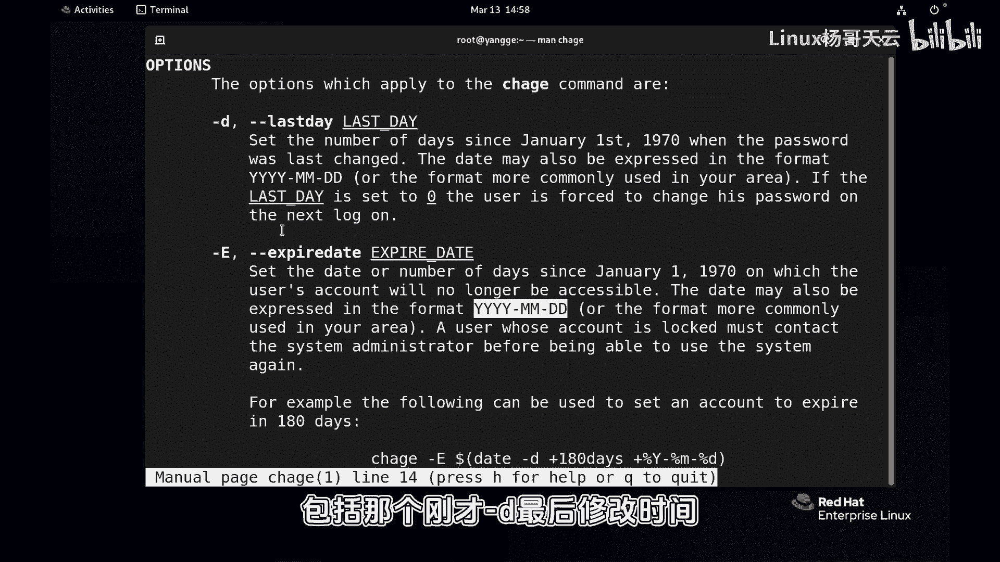
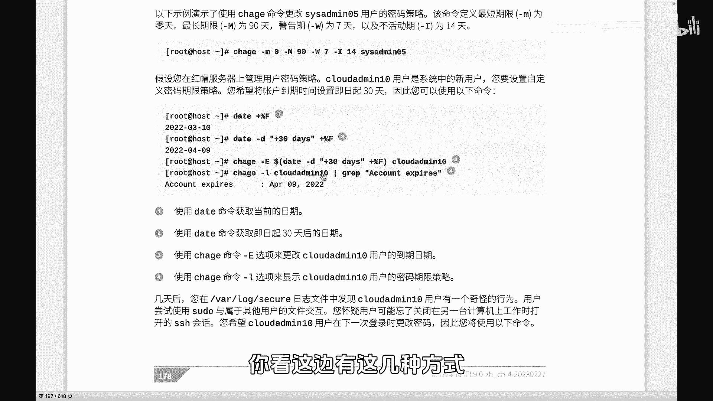
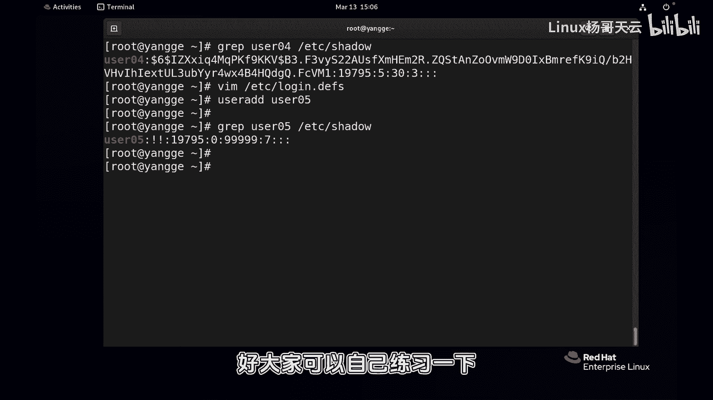

# 史上最强Linux入门教程，杨哥手把手教学，带你极速通关红帽认证RHCE（更新中） - P48：48.原来密码还有年龄 - Linux杨哥天云 - BV1FH4y137sA

哈喽各位小伙伴，我是梁哥，刚才给大家展示了SHADER文件的一些字段，其中提到了很多的一些像最小的生存时间啊，最大的这个生存时间，还有呢就是一些什么过期时间之类的，接下来我们详细给大家来看看。

这个密码的一些相关期限啊，这边呢我们将会讲到一个命令叫做CHAHE，注意这里它不是change的这个单词啊，它是change h改变年龄，其实所谓的账号过期并不是账号本身过期，是密码过期啊。

它的本质上是密码过期，比如说不能登录，一般我们账号那个层面，没办法设置相应的这个所谓的过期之类的啊，主要是智能密码，那这边呢就会有这么几个内容啊，第一个是杠D，最后的修改时间可以通过杠D来制定。

这个通常默认情况下不用我们去改，也就是说一个账号它本身什么时候改的，那它就自动呢就从纪元开始，1970年1月1号开始呢去算就行，我们一般不用改，当然一会杨哥会给大家讲到一种特殊情况啊，我们会强制用户改。

比方说啊会修改它的一个最后修改时间，还有了最小年龄，这个跟大家讲过，就是他最少得活多长时间，你不能说想什么时候改，今天改完以后，明天又改，或者一会又改，不可以，那我们设的是五的话呢。

那他就是五天之内不能改，最大的年龄呢也就到了这个时间点以后呢，是要改的，但是呢大家看到这个图哈，这个warning d w啊，每个都有一个参数，小M大M小D大W就是警告，在正式的密码修改之前。

密码的一个修改呃，也算是到到到期吧，基本上哈密码的一个修改之前，我们有个警告时间，比如七天七天前就会提示你要改了，准备改了好，然后到这边呢就是密码的一个过期时间，到这边就过期了。

过期实际上呢大家知道它并不会死，过期以后呢他还会给你一个宽限期，这边呢我们可以有一个啊inactive不活动的时间，当I来指定，一般我们比如两天好，最后到这边呢就是我们完全是不可以活动了。

这个就真正意义上呢这个账号就不可以登录，除非root用户或者其他的超级用户去干预啊，这就是一个啊每个字段呢它的一个内容，那下面呢我们可以看到啊，有一些事例，比方说按照我们书上的这个事例呢。

通过change h命令改变了一个账号，这个账号是谁呢，咱不管这是用来改密码策略的一个命令，他说了，设置了M0，最小修改时间也就是零天，就是你随便什么时候改，想什么时候改，就什么时候改。

最大时间呢是90天，90天到了，你必须改密码，不仅如此，在83天的时候，也就是八十四天的那一天呢，开始呢就会警告你了，因为我们设的warning是七天，然后最后呢到这个密码到这个也就到这个位置。

到密码过期，过期时间到了以后你没改，那没有改的话呢，那我们这边就会给你一个14天的一个宽限期，然后紧接着呢宽限期你都没有改，那对不起，那就直接到最后的不能够去用好。

下面我们也来试一下啊，拿一个这个账号来做个测试。

我们来还是过滤一下USR02吧，user02呃，其实不用再看password文件，就看SHADER文件就就行了啊，这是目前他的一个状态啊，他他这边没有密码啊，不好意思，我给他设个密码好吧。

那个password，然后user02呃，由于是管理员，所以我们给普通用户设密码，比方说我这边123就可以，尽管呢他提示密码比较短，而且没有满足八个字符的这样一个要求，并且呢没有间装性的这样一个规范。

但是也让设置了普通用户改密码，改自己密码，那是肯定是做不到的，必须要满足密码复杂性的这样的要求好，那现在改完以后呢，肯定就有一个密码，这边之前跟大家讲过这一段子啊，大家都明白，那后面就是这个内容。

当前的这个叫最小修改时间是零，而且几乎是不过期，你可以这么认为，宽限期是七天，后面没有来，我们通过change edge来改一下其中的杠小M呢。

刚才在图上我们也看到了，是最小的一个修改时间。

那我们假如说设置五天吧，一般情况是零，就是你随时可以改啊，然后后面呢最大的时间呢30天，我们就不使用现在的这个9999了，我为了看看效果，还有警告时间呢，警告时间前前五天吧，五天就警告。

然后并且呢宽限期我们设置两天，到两天就结结束了，user02好比说呃，实际上我们看看这个用户的这个密码信息呢，我们也可以通过另外一种方式哦，我们先来通过这种传统的方法看一下啊。

好看看对应上是不是对应上的啊，这个这个19795呢，这个不用不用动啊，这个是就是从上次改密码的，这个最近改密码的时间，为什么两个都一致，都是今天没什么变化，明天改话了，可能就变成九六了，19796了。

好这边最少改时间必须是五天，你想改呢你还改不了啊，然后这个最大的时间30天，并且呢五天的警告，就是26天的时候就开始警告，还有宽限期是两天啊，后面呢这个是其他的一些一些一些信息，这边我们就改掉了。

也可以通过杠L的方式来查看，这个用户的一个密码相关的信息，这个好像看起来比较直观一点，最后修改时间是2024年3月13号，然后密码的过期，然后这个跟他一样啊，密码的过期时间啊，当然可能不是一对应的。

过期时间应该是这个这个就是30天啊，密码的这个过期时间到12号啊，30天其实默认，因为我们后面有一个时间没有设置，还有一个时间是可以设置一个真正过期时间啊，然后这边由于没有设呢。

它默认就取得这个时间以后就过期了，还有密码的一个非活动时间啊，就是两天以后嘛，到12号以后的14号，我们说的是两天，也就是宽限期，你钱没还不了，那怎么办，延缓你两天账号过期，账号过期是NEO没有过期啊。

然后呃因为我们没有设置那个过期时间，看到没有设置账号的过期时间，好密码的最小的一个一个生存时间是五天，这个五天在这密码最大的生存时间呢是30天，然后在那个过期前的警告，也就是这个warning是五天。

所以这个五天是我们上面这个大W，这是关于这个。

那我们也可以采用一些方式，如果我们不知道是哪天过期的话啊，我们也可以通过一个叫字符串的方式，而不写具体多少天，而是呢写一个通过这种方式过期时间，我们加一个字符串的方式，呃，别的不行，别的只能是这样写。

这个是过期时间E改变它的一个过期时间，E呢其实就是我们真正意义上的一个过期时间，这个过期时间呢理论上讲是可以这样写的啊。

我们先把原来的时间打出来，这是现在的这个地方，是没有没有真正过期时间的，我们使用ZHAHE杠E，这个E呢才是真正的过期时间啊，那个只是说密码DOTA2这个要改，这个指的是就DOTA2就过期了啊。

后面呢加上一个字符串，一般我们建议字符串呢，使用双引号给它引起来啊，一般引引起来就好一点，当然不引也可以，然后是现在是今天是3月10103，2024年年月日，四位两位两位改革4月13，然后过期给谁呢。

给user02好，其实不用双引号也可以啊，这后面就是一个一个一个字符串好，那现在呢我们再看一下上面刚才的这个时间，你看也就是795啊，然后是8826到这个4月13号呢，这个密码就真正的就过期了。

这个账号就过期了，不是密码，这账号整个就过期了啊，那个到时候就不能用了啊，这是我们刚E通过钢E来指定啊，我们也可以通过line一下呃，或者是简单一点，CHAGE刚刚have。

我们可以看到它其中有几个选项啊，最后的修改时间如果记不住的话呢，杠E呢是一个账号的一个过期时间啊，还有呢杠I是叫做非活动时间啊，还有呢这个刚L呢我们刚刚看过，是查看的他那个账号的一个显示。

他账号的一个年龄相关的信息啊，还有呢就是杠小M大M最小最大，以及呢呃warning警告，这是可以看到的啊，我们刚才用到的是杠E，如果说你也可以通过Mac h a g e，然后最后来找到。

来找到他这里面的一些相关的事例，大家看到他基本上都是这种粘月志这种形式，这种形式来写它，你看过期时间也是一样，可以使用这种格式，包括那个刚才杠D最后修改时间啊。

也是可以直接使用这种形式，那么我们在看到书上给我们提供了，如果说你不知道是几号，比如说90天以后是几号呢，不知道或120天以后是几号，你也不知道不好算，那就可以通过通过我们的这种玩婉转的方式啊。

首先获得一下这个时间格式啊，怎么获得呢，你看这边有这几种方式。

我们首先知道贝塔加百分号F，是获得一个这样一个，我们想要的这个时间格式啊，那下面呢我们可以呢采用一些方式，比如说杠D来指定一个比就120天以后，就是加上现在时间加上120DAYS啊。

这边你看就增加了一个段，这个如果不写的话，是当前时间按年月日这种形式显示，而杠D呢我们表示呢，我们这边给定它一个一个这种模式，然后来让它把它生成一个这样一个字符串，那120天以后，那你这个好算。

那假如说有一个是百一十三，那你就算不出来了，所以我们可以呢直接直接呢使用这种方式，怎么讲啊，就是把刚才这个地方换一下，你看我记得刚才改时间是我是这么写的对吧，我们就把上面那段弄下来，上面这段弄下来。

就整个这一段拷贝粘到这，当然这个肯定不行啊，这是一条命令肯定不行，那怎么办呢，就整个我现在把它弄开一点啊，这两条命令单看大家能看懂哦不对，还有一个data，上面整个这个113天这条命令。

我们知道这条命令是可以获得这个，二零24月4号的，但如果你知道这个时间，那就不用费周折了，这边就打一个年月日就可以，但现在呢我们不知道，我不知道一百一三年的时候，什么时候啊。

我们就可以借助这种命令替换的方式，我们可以用这种dollar小括号，dollar小括号呢大家可以这么解读哈，就是先会把这个命令把这条命令执行完成以后，这个你可以认为是一条大命令，这里面是一个子命令。

那他在执行这个大命令之前呢，他会把里面的命令替换，这个执行的结果，其实早些呢早年间用的mini替换是反引号，也就是这边加一个反引号，前前后加一个反引号，其实也可以的，但现在已经不建议使用这种方式啊。

这种方法在很多其他地方会见到，那我们建议大家命令替换了，就采用这种这种形式，这个没有什么好高级的，你就单独来看这条命令没问题，获得的是这个值，但是呢我们不想敲两次，你可能会想我先敲一次，获得这个值。

然后再把这个二零247月4号放到这没问题，但实际上呢不需要这么做，一个命令替换就可以搞定啊，这两个命令我刚刚讲过，分开来看，你都明白，但如果说你采用这个枪一起，那你要先执行这条命令。

那就把这段命令弄过来，在外面套上一个DOTA小括号，这个会做一个相应的一个命令替换，他会先执行这个命令的内容就可以了，所以这是我们的CHAHE这个命令的一个，相关的一个用法啊。

另外呢还有一点给大家说一下，就是我们新创建的账号，如果我们希望的是新创建的账号，默认情况下就会按照我们的这个规则来，而不是弄完以后，比如说我现在再创建一个user user0405。

而我不希望他还是要去改一遍，怎么办呢，那这个肯定就跟规则有关系，所以呢我们在EDC下的有个叫login login，点defaults啊，默认应该是defaults，大家看到这个文件里面呢。

就会在差不多下面一点吧，这里面就定义了用户的一些，就是创建用户的时候的一些默认的一些信息，其中当然这个邮箱啊，这个器材就别管了，就每个用户有一个邮读箱的一个位置呃，我们下面呢重点来看一下。

就是这啊还有什么u mask，还有加目录的权限，也就是这个文件，将会决定很多用户的创建的时候的一些信息，一些默认的一些规则，比较关注的就是这几个看最大的时间，最大时间。

也就是我刚刚说的密码最长什么时候改，如果说是9999也应该叫做这个密码人吗，啊这边好像有上面有看到吗，这个密码的一个，这几个最大的指的是我们的密码，到了这个时间你就得改安全呀，你不能不改密码。

最小最早的生存时间呢就是你表示的五，那到五天就必须改好，那这样我copy一下，我copy一下三行三行YY，然后我复制一下，我我把那个圆的下面这几个注释一下啊，我临时用完上面这几个最大时间，我们改成30。

然后这个改成五密码的警告时间，比如搞个三天吧，那还有密码的长度，密码长度这个长度在哪呢，看看下面有没有还有UID的一个起点，最小最大啊，包括系统ui id的一个起点等等等等。

好这边好像好像这个没有别的了，没有别的话，但是也有限制，默认密码的长度应该是八个字符，那我刚才我们看过，那你也可以设置密码的一个最小强度，比方说20个字符或15个字符，那我们就要使用password。

main lse这样一个啊一个变量来设定，这边加上啊就可以了，好现在给大家先演示一个创建一个账号，user04password一下，我们password不password，现在倒无所谓啊。

一一啊就是root用户设置呢，所以呢这就他说其实很简单，简单就简单呗，好过滤一下user204，从etc i的shadow那个文件就没必要了，大家看到是不是五天33是这样来的吧。

所以我们可以它默认情况下呢密码的一些策略，它是通过我们的EDC下的logd force，这个文件来定义的好了，由于我们现在我不想改，我就把它返回到最基础状态，OK那么我们再创建个账号呢。

例如user05的话呢，那就应该是我们分别过滤一下USR04，好，再过去一下U405吧，这边看到的就是按照默认的值密码，现在因为因为没有通过password命令给他设密码，所以这个地方就两个叹号。

就没有密码了，两个叹号呢其实也是账号被锁定的意思啊，就是现在是不能登录，确实也登不了，没有密码怎么登录啊，好这就是密码这个相关的年龄，还有改改变的时候的一个方式啊。

