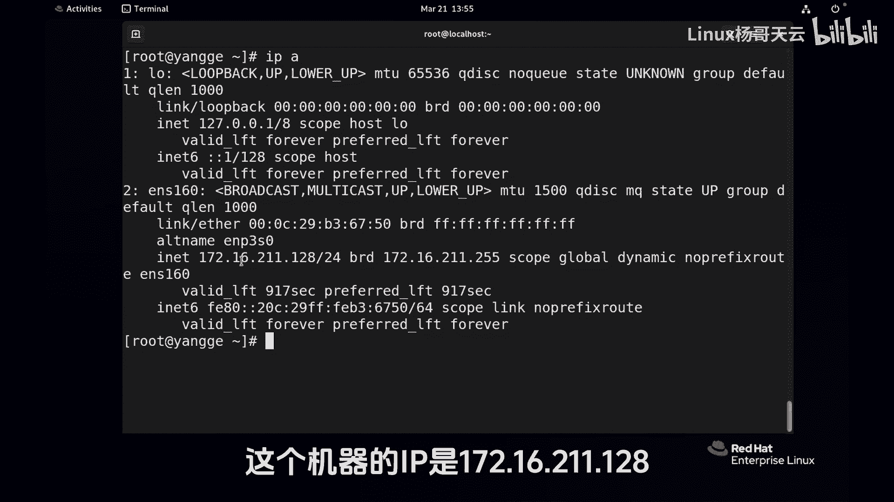
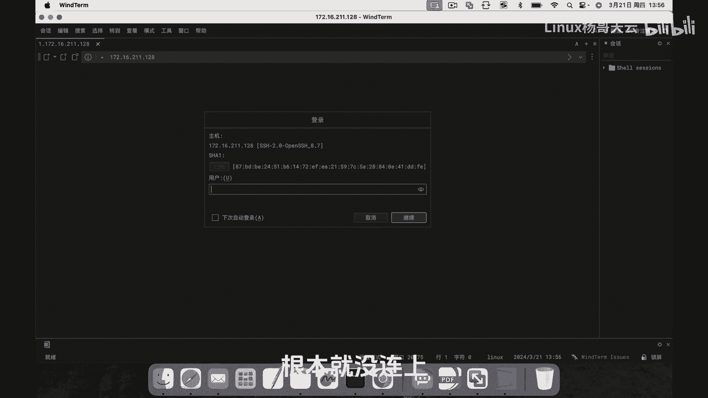
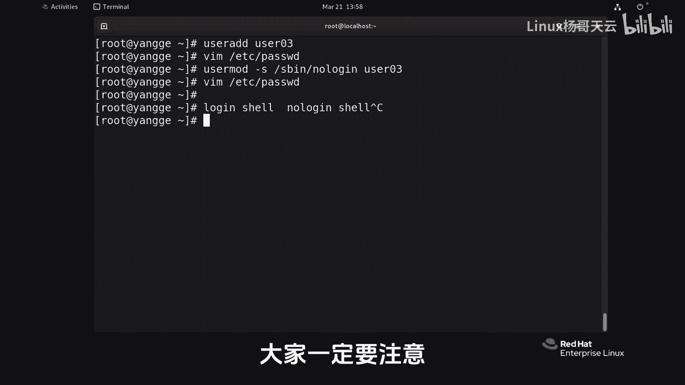

# 史上最强Linux入门教程，杨哥手把手教学，带你极速通关红帽认证RHCE（更新中） - P49：49.Linux中的no-login Shell - Linux杨哥天云 - BV1FH4y137sA

hi各位小伙伴们，我是杨哥，那我们继续来学习LINUX课程，在前面给大家讲到了用户和组相关的管理，今天我们特地呢会为大家讲到一个叫做loan，shell和low loken shell的区别。

那下面我们具体来看一下啊，在什么场景我们会使用LOL跟笑，首先我们打开LINUX系统，我们看一下当前在e DC password文件里面，每个用户呢在结尾的时候都有一个shell程序，shell呢。

实际上呢我们可以认为是当这个用户登录以后，也就是输入用户名密码登录以后，执行的第一个程序，那如果说你想让他能够去管理系统的话呢，肯定要运行bash，因为拜师呢是我们的啊。

这个shell程序它才能够执行命令啊，权利内核，但有一些用户，比如说像一些像这个B用户或者是其他的LP，这些用户，大家注意看一下，他们在这个shell这个位置呢。

使用的其实就是一个不可用的shno lov shell，当然这也是一个也是一个程序啊，也可以运行，只不过呢它不能够像我们的batch一样，去接收命令，然后以及呢去传给内核，最后执行这个他做不到。

那么在什么情况下我们会使用load new shell呢，首先各位看到的是，在我们系统上面，绝大多数用户都是这种喽啰根笑啊，不管是这个logo跟shell还是shut down啊，这都是啊。

其实都是严格讲，就是不可以不可以去和系统交互的啊，为了系统安全，我们在建立用户的时候，其实默认当然了，他是给他给他的这个shell的，是并下的BH这个程序也就是inside的BH有一些账号。

比如说邮件的账号，FTP的账号，或者说运行阿帕奇NGX的这个用户，因为我们在前面给大家讲到，所有进程运行都需要依靠某一个用户，或者用一个某个用户的身份运行，而这个用户当然肯定不是管理员。

因为一旦拿到管理员权限的话呢，就会通过这个进程的这个权限，去访问系统的一些资源啊，这个是可怕的，所以为了安全起见，我们应该尽量的控制系统上有这种可交互的，这种shell的用户。

换句话讲让他们只能够去访问，比方说邮件或者访问FTP，或者是呢去启动我们的某个进程，但是我们不希望它能够登录上来，像我们现在一样登到这个机器上面来，然后来管理系统，因为这个存在很大的风险。

尽管是一个普通用户，因为在这个一些早期的系统，早期的版本的系统呢，它会有我们的漏洞，这个有可能呢会将普通用户通过一些漏洞呢，提前到管理员，那这些系统也不好说，我将来如果报一个新的一个漏洞的话。

也有这种可能性，那我们怎么去创建呢，分为两种，一种是在创建用户的时候，我们可以指定通过杠S这个S这个选项就是shell，一般情况呢就是SB下的lol game，但这个好像补不全啊。

No l o g i n lol gain，这个程序后面加上用户名，比方说我们新建的用户user01啊，这个账号现在没有啊，这是新建账号的时候，现在给他一个密码表，User01，那我现在就简单1。

11呃，这边要强调一下啊，在生态环境里面，这种密码是绝对不可能出现的，一旦出现呢就会被扫描，因为这是弱弱口令，那我们也可以关注一下，在password文件里面呢，我们的user01这个账号呢。

它就是sp node win，那这个时候呢其实我们可以测试一下，测试的方法很多，比方说SU测试到user01切换用户，那他告诉你这个账号是不可用的，对不对，呃，然后或者是呢我们远程也可以。

那首先远程的话呢，你需要知道这个机器的IP地址，这个机器IP它是1721621。128好。

我们现在呃从远程的方式，可以通过任何一个SSH连接的这个这个程序，连过去，这这台主机回车车当用户名呢叫user01好，这边给大家看一下，我确实敲了这个怎么幺密码呢，是幺同样给大家看一下看啊，回车好。

这边呢其实是不可用的，根本就没连上。

大家看就断掉了啊，他就是一个不可用的事，不能说这个账号没用，这个账号呢他就说我们来运行某个进程没问题，因此呢大家看一下啊，在我们系统上面有这个BH，当然我们可以加个B事结尾的啊。

在etc password里面有办事结尾的用户，实际上呢你看就原来就一个root，这个用户是我们在装系统的时候建的，一个普通用户，他有batch，除此以外，因为我们平常管理的话嘛。

肯定是使用一个普通用户来管理，然后在需要的时候呢，通过SU或者速度的方式切换成管理员，那我们一定要尽量控制这个系统上面的，有BH有shell的这样一个有效的这样一些用户啊，当然有可能是别的shell。

因为我们其实shell很多啊，这都可能会影响我们系统的安全，所以大家要注意，这是对一个新建账号，如果已已经创建好了账号呢，我们怎么改呢，哦这个user02这个用户存在啊，然后我们来个user03。

那现在我们这个账号是存在的，存在的话，你改改的话呢，可以有N种方法，最纯朴的就是改文件，把这个文件呢user03这一行给他改掉，就可以看到了吗，给他改掉，没问题啊，但我们现在没改。

也可以输入user mode命令，然后杠SSB下的NO l o g i n，然后user03，这个结果呢其实也是改了这个文件，看到了吗，看到我这一行是不是好。

所以尽量控制我们的分别叫做locking shell，还有一种叫什么叫做low login sh，不让登录，你可以作为账号使用，你可以访问这个某一个，这个像FTP这样的一个服务，没问题。

你也可以呢去启动进程没问题，但是就是不可以登录上来，因为这个存在风险，所以我们一定要尽量的去控制好，这就是我们的非通用效的一个啊，一个一个点。

