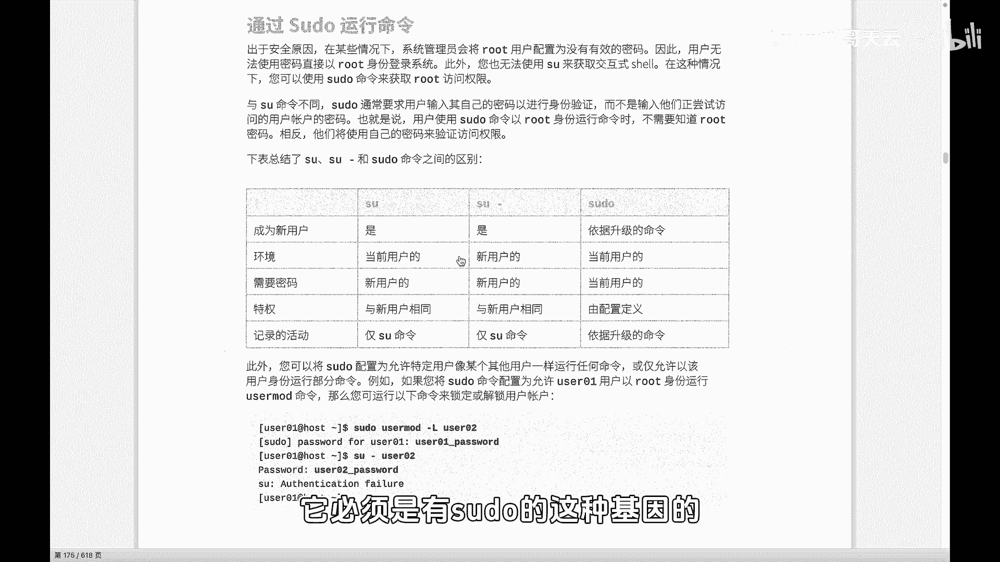
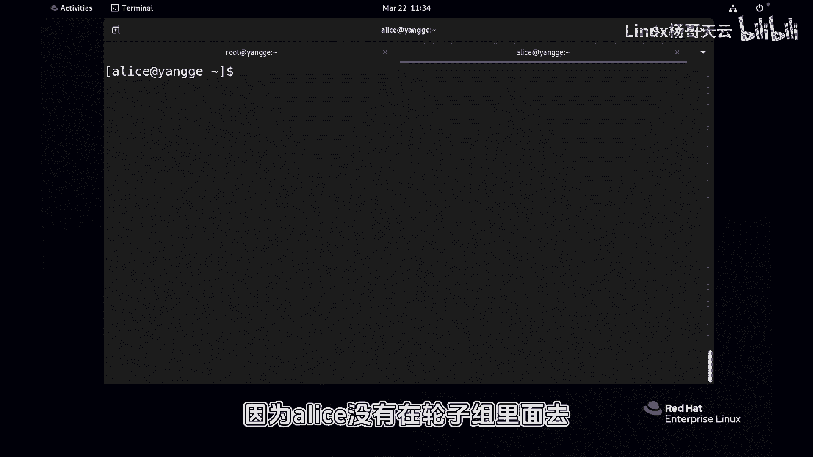
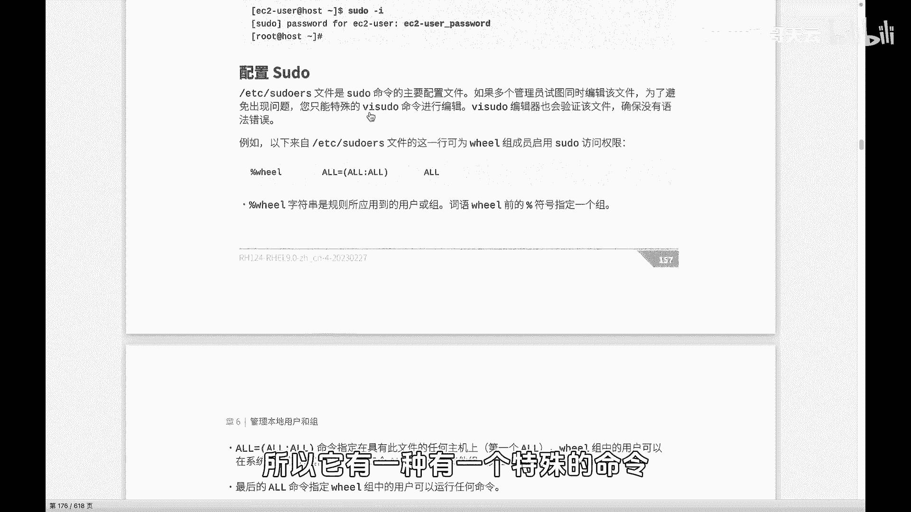
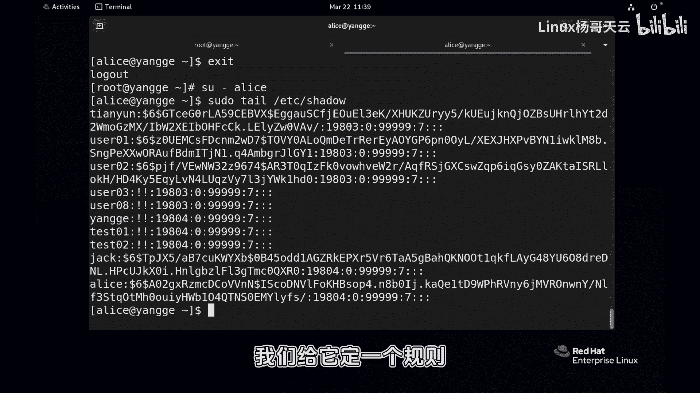
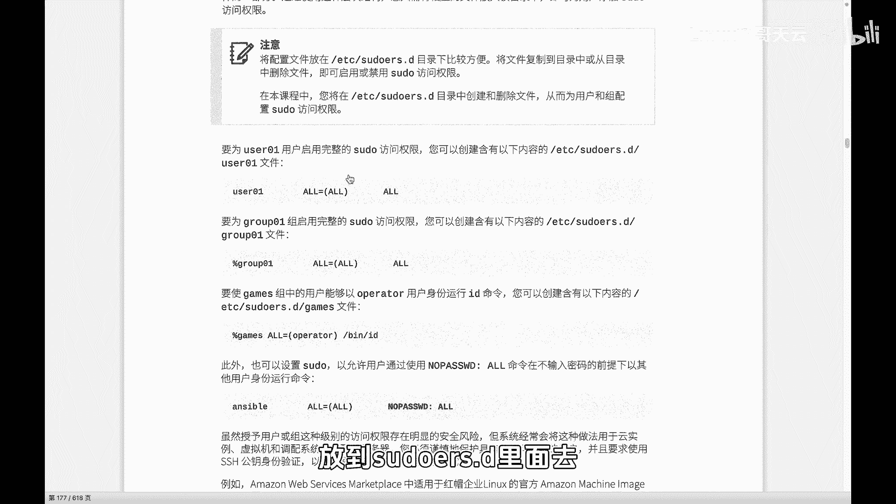
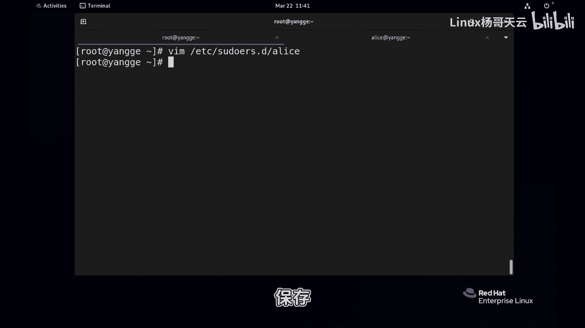
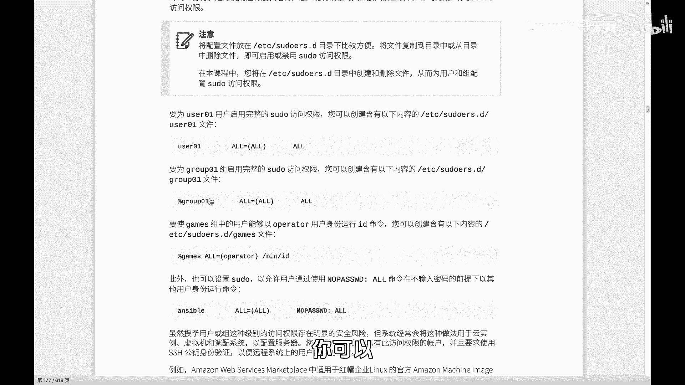
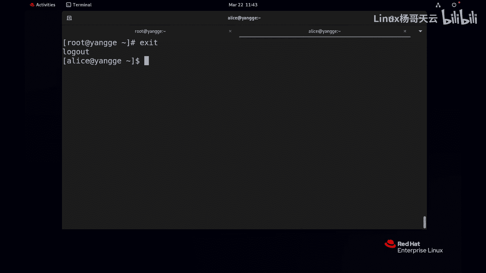

# 史上最强Linux入门教程，杨哥手把手教学，带你极速通关红帽认证RHCE（更新中） - P50：50.Linux提权方式之sudo - Linux杨哥天云 - BV1FH4y137sA

哈喽各位小伙伴们，我是杨哥，那我们继续来学习LINUX的用户提权，在前面我们给大家讲到了使用SU来提权，那这种方式呢其实是有它的这个好处，就是我们可以整个切过去，然后整个运行后面的命令呢。

都能够以root用户的身份，或者以某个用户的身份去运行，但有一个最大的缺点就是你得有root用户的密码，你如果不知道root用户密码的情况下呢，没办法SU切换成管理员去提权的。

那么这个就带来了潜在的风险啊，一方面是呢啊本身你要将密码告知，第二呢在这个安全日志记录的时候呢，那你不知道到底这是哪个用户干的这个事情，或者说做了这个系统的相关的一些操作，你不知道的啊。

因为大家都切换成了入门用户，所以呢我们有另外一种提权的方法，就是速度速度的这种方式呢，它是不需要知道管理员密码的，那就是他还是以他的身份啊，还是以他当前的用户，但是呢他会在执行某条命令的时候。

比如说管理员的身份执行，而且呢是不需要知道管理员密码的，那所以这是另外一种方式，这也是我们比较常见的方式，特别是在一些系统上，我们压根儿就不知道root用户密码，因为它有这个安全的一些一些原因啊。

那我们只能够使用这种用户，但这种用户呢他跟我们常规用户还不一样，也就是说我们如果想要去通过速度，一个普通用户想要通过速度去执行，比如说管理员的一些命令，比如说创建用户啊，管理存储，管理网络。

那么这个有一个前提，它必须呢是有速度的这种基因的。

这怎么讲啊，我们给大家看一下，先看一下这个示例好，那现在我们准备了一个环境，建立一个叫it的一个一个组，里面有两个账号分别叫做杰克和爱丽丝，这个大家自行可以准备一下，密码呢比较简单。

这两个账号密码分别是一和一，一个是一，还有一个也是一，这个用鲁迅鲁迅先生的话讲，一棵是枣树，还有一棵也是枣树啊，然后我们下面来先来看一下，比如说我先切换到JK用户的这个身份。

首先看看EDC下的shadow文件，发现看不了，这很正常啊，因为没有权限，普通用户，同样呢你去看，比如说嗯VLOGO下的security，这种安全级别很高的日志，你也看不了，因为你是一个普通用户。

就算在前面加上速度也不行啊，当然他这边会提示输入密码，这里呢我刚才跟大家提过速度，输入密码，他不是输管理密码，输的是用户自己的密码好，当前用户jack好，一就算输了以后也不可以，为什么呢，他爆了一句话。

他说jack他没有在速度的规则文件里面，这个怎么讲呢，那我们知道以前看过那个绿巨人，知道那个浩克，他平时呢在没有生气发怒之前呢，是一个普通人，和我们一样，但是一旦发怒，他就立刻拥有超级强大的能力。

变成超人，那我们可以吗，那比方说我现在发怒一下，或者我站在窗口跳下去，能不能飞起来呢，肯定不可以，因为我没有这个基因，因此呢并不是说你用户，你上来就可以具备速度的权限，所以需要管理员去设置。

你能够以你这个普通用户，你能够去做什么事情，你能够以管理员，比如说管理员的身份，以注册用户的身份去做什么事情才可以，所以我们先要去让用户有这个基因，那先说一下啊，那么我们有两种。

其实有一种最快的方法让你变成超人，什么方法呢，就是在这个，大家知道在windows里面有一个用户叫做管理员，这个用户相当于我们的这个root啊，我CTRLC一下没没法执行啊。

那在windows里面还有一个组叫做TMINIS，T r a t o r s，注意在LINUX里面也有一个组，我们叫轮子组啊，这个从我们的七啊七开始呢，其实已经相当于就是一个管理组。

有点像我们的AUDIMISTRATUS这个组，换句话说在windows里面呢，这个是管理员没问题，如果说你把一个普通用户加到管理员组里面去，OK那他就立马是管理员这个级别，同样呢你在LINUX里面。

比方说把一个用户加到轮子组里面去，那他也提升了好，我们稍后来解解答，为什么是这样啊，来先做一下，刚才不是JK这个用户没有这个权限吗，来现在加一下怎么加user mode啊，杠AG大写大写的G。

我们把它加到加到这个轮子组里面去，然后是这个用户，Ok id，看一下这个用户，他现在呢除了在这个自己的主组JK，还有呢就是ID组，还有轮子组里面，那现在呢他是不是变成管理员呢，我刚刚讲过啊。

这个这个组有点像管理员组，那我们来试一下，现在再次回车，密码是一，大家发现这个好像不行是吧，那我们先退出一下，再重新以这个用户登一下啊，先登一下哈，登一下以后呢，我们重新来看一下密码是一，可以了。

没问题，看到了吗，那说明这个用户立马就变成了这种，有点像管理员级别的，同样我们再来用它看一下别的文件，比方说看看tile一下etc i的shadow，这个文件也没问题啊，这这个没有密码。

因为他有个时间戳，这个戳过期以后才会重新输入密码，他总之肯定要输的，那这是可以说是我们最快的方式，把一个用户变成所谓的管理员，就是加到这个所谓的轮子组里面去，那然后一旦加进去。

其实呢他只要使用速度在前面，在执行命令的前面加上一个速度，注意它不能常规执行，它不能像这样，这不可以，它需要加速度才可以加一个速度，那这个时候他相当于就快速的，变成了一种管理员，那爱丽丝可不可以呢。

不可以，我们试一下爱丽丝好，那现在我们就算使用速度，然后也看了一下EDC下的shadow呃，当然会提示输爱丽丝自己密码，OK那就输一下一好，可以不可以，因为爱丽丝没有在轮子组里面去。

这大家明白了吗，这是第一个，那为什么是这个效果呢，因为速度的话呢，它是有自己的规则文件的，大家看它有自己的规则文件，它的规则文件呢是在EDC下有个叫苏DOS，就是你只要把这个用户或者是组。

在这个规则文件里面定义了，那他就会有相应的权限，那今天我们只是先速度先简单入个门啊，就是让用户能够有这样一个权限，好这里呢怎么定义的啊，各位看看我们先打开这个文件，打开这个文件有两种方式。

一种是通过vi打开，这个vi打开的话呢，实际上是不合适的，因为官方不建议这样打开，而且呢它是以只读的方式啊，这边他说为了避免多个人同时编辑，所以它有一种有一个特殊的命令叫VI。

速度其实就是相当于VI，但是不一点不同啊，那没关系，那我们就使用vi速度打开这个文件，回车就可以好，这就是刚才我们的那个苏DOOS这个文件，当然它是临时的，你保存以后就可以了。

在这里面呢我们可以看到它有很多的一些帮助，这个我们后面再随着学习呢不断的去提升，比方说主机别名，还有呢命令的别名嗯，还有呢就是你看这边定义了好多别名，那咱现在先不管这个别名的概念。

接我们就使用这个下面的，我们就直接搜轮子组吧，WHEEL看到了吗，我找到了，在默认情况下，它有这样一句话啊，而且呢上面还有这这样一句话，这个怎么解读啊，你看语法是分为这几块的，一用户。

哪个用户当然可以换成组啊，第二机器就是你从哪登的，是从本机登录的呢，还是从哪个网站登过来的话呢，我都可以限制，就是我可以限制你这条命令是从哪个网段，从哪个地方登过来的，比如说我只允许内网的机器。

因为从外网呢可能有攻击，从内网登过来的去，能够能够去实现速度，后面的是命令啊，其实延伸一下是这样的啊，第一个是用户，就是我们要对哪个用户进行速度的授权，包括root用户也是一样，这边有一个速度的授权。

而root允许root用户从任何机器，这边是机器啊，从任何地方，然后呢执行任何命令当中多了一个括号，这个括号其实可以没有，这个括号是什么呢，就是他能够以什么身份，那比如说我我这这边应该怎么写啊。

好我们看这个下面呢咱先等一下怎么写啊，咱先看下面现有的示例，这个就是允许一个组默认情况下，大家看到百分号开始的就是组名，没有百分号的就是用户名，那这这条命令呢指的是这条规则啊。

指的是允许这个轮子组中的成员，这个组从任何主机来执行任何命令，而且以任何用户的身份，这当然可以换成一个某一个用户啊，一般情况就是这么写的啊，这是这一条啊，下面这一条呢是同学们可能注意到。

有一个叫low password啊，然后还有前面有个井号，那当前这个井号是注释，也是没有起作用啊，这两条其实我们开一条就可以，那到底开哪一条呢，大家应该还记得，现在我们JK用户是属于轮子组。

他有相当于有已经有速度的这样一个基因呢，它在执行命令的时候是需要输入密码的，输给谁的密码呢，自己的，如果说我们不想用户输，连自己的密码也不用输入，那我们加一个low password。

换句话讲就是使用下面这条就可以了，这大家听明白了吗，这两条你可以换一条好，一般情况呢我们不建议来改这个文件，改这个文件的话，那很显然的话，这是主配置文件啊，你可以可以改，比如现在我们加一条。

加一个爱丽丝用户，用户和用户加一起吧，好看一点，这个爱丽丝用户他能够呢从任何机器，以任何人的身份呢执行任何命令，好这个这样的话呢保存以后，那爱丽丝其实他没有加到轮轮子组里面去。

但是呢他已经具备了这个速度的权限，而且是所有的这个相当于管理员权限好，我们可以试一下，依照刚才的教训，我们最好是先退出来一下，重新登录，然后刚才我们记得我们还是常规的来看一下，这个文件，看不了。

那加上速度的话呢，我们就不想要密码了，怎么办，CTRLCTRLC一下啊，我把这个规则改一改，我把这个规则改成下面那个，low p a s s w d冒号好。

这跟下面这个呃low p a s s w d冒号好，跟那个一样啊啊大家看帮我看语法写对了吗，low p a s s w d冒号or保存一下好啊，当然还是要登出一下啊，我们想要看一下区别。

然后再次来使用速度回车，看到了吗，不需要连自己密码也不需要输入，那这两种用户一种呢就是把它加到轮子组，这个其实相当于windows audimistrators组，一个是呢我们给它定一个规则。

但是按照官方建议呢，我们不建不建议去改这个速DOOS文件，你可以把用户加轮子组里面去，那么我们建议是怎么做呢，它有一个在etc速DOOS点D目录下面，建议你新建，因为你改这个文件的话其实很混乱。

特别是不利于我们的多台主机的统一配置，那他这建议怎么做呢，他建议把它放到这这里面去，放到SODOOS里面去。

以相应的用户和用户和组件，这个文件啊怎么讲啊，我们看看额，也就是说刚才我们把那个爱丽丝这条取消掉啊，现在取消掉，通过vs do把这个呃上面这条取消掉，那取消掉以后呢，他如果在最初的话呢，他再登。

他就不具备这个权限了，就算输密码也没有用，对不对，好，那现在我们通过VIAMETCI的呃速速度，大家看到有个速度是ERS点D，这下面是空的，我们就建一个叫ALICE，这个不是说一定的用户名相同啊。

这个可以你可以没关系，这个规则，但我们最好是一看知道是干什么的，这个毫无疑问，那现在呢呃规则就是还记得吗，ALICE用户能够以从任何主机，然后以任何用户的身份，这个没有颜色，看起来很痛苦啊。

然后并且low pass wd执行任何命令，保存好。

我们尝试一下，在这边啊，嗯再次退出一下，再登可以了，同样的方式，你可以呢去见其他的文件。

那么这样的话如果是以这种方式创建的话呢，好处就在于呢，我们不需要修改主配置文件，让它变得混乱，而是在这里面根据我们的要求，新建规则或者删除都可以，新建一个，就是把这个文件拷过来，删除的话。

就把这个文件干掉就可以了，这大家听明白了吗，所以比较的简单，当然这边呢还要跟大家说一下这个速度，还有一种用法，就是如果你看现在是每条命令，我们都需要加那个速度，不然的话没有权限啊。

你你看每条命令都需要加，可以吧，就算不输密码，他也要加加速度，其实这个本身是没有问题的啊，啊这本身是一种叫做保险，就像那个枪位保险一样，不然他走火怎么办，那当然我们也还有一种方法叫什么呢。

速度杠I获得一个交互的shell，获得我们root用户的shell，你看回车以后，因为我们现在不要密码吗，他出就过去了，现在大家观察他到达的是一个什么，到达的是一个root用户的shell好。

但是没关系，他还是有安全日志的记录，所以这样的话呢，我们在执行相应的命令的时候就不用了，你相当于你可以连续的执行很多命令，因为你你要做很多事情，您觉得老敲速度的话很困难或者很麻烦，那你就使用速度杠I。

获得一个我们的一个root用户的sh，这样的话呢至少在这个期间，我们就不用再去在每条命令前面加上速度，当然速度的一些高级用法呢，我们最随着后面的一些深入呢，我们会不断去讲解啊，大家可以自行的去理解一下。

或者比较一下啊，这个速度和SU的区别是什么，可以在那个聊天区里面回应，这两者是有本质的区别的，两者都是提权的工具，但是有本质的区别。

