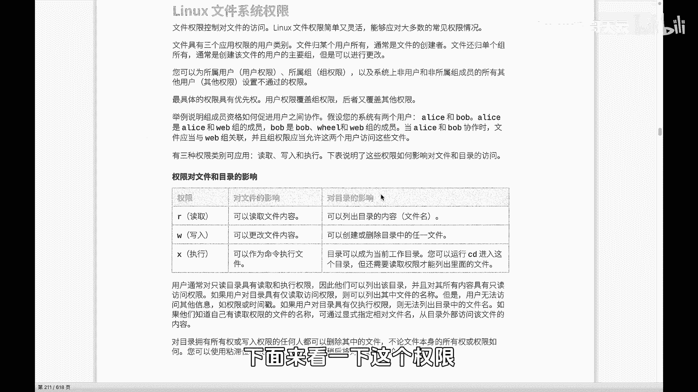
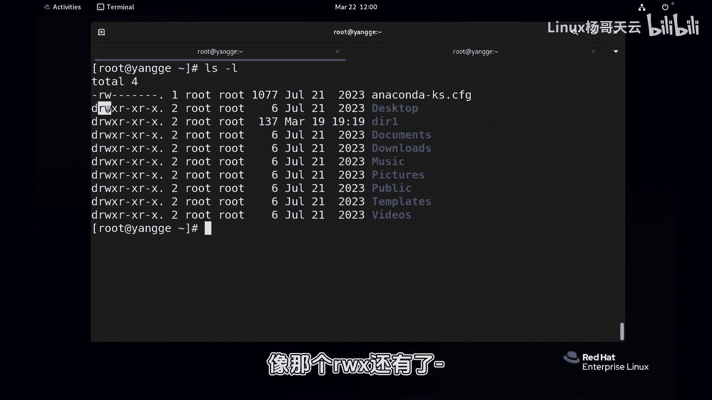
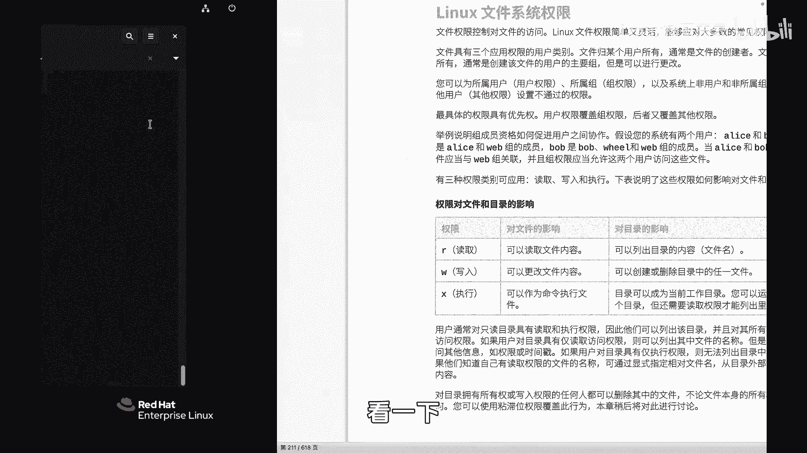
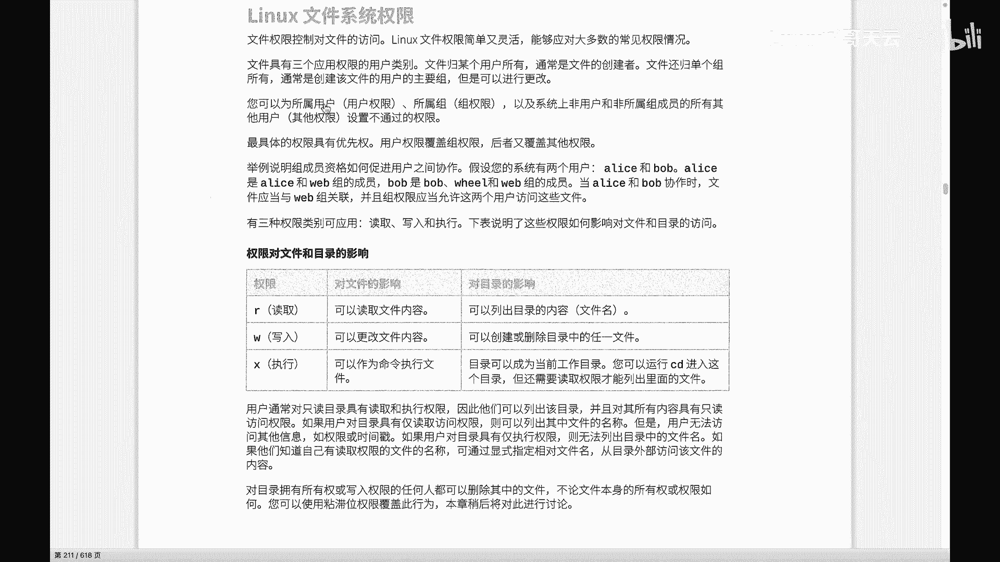
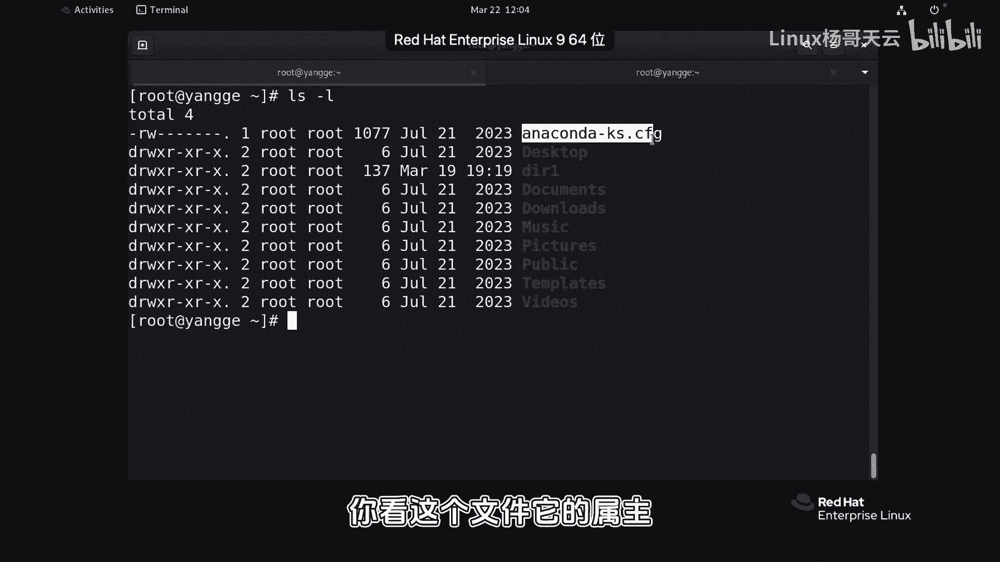
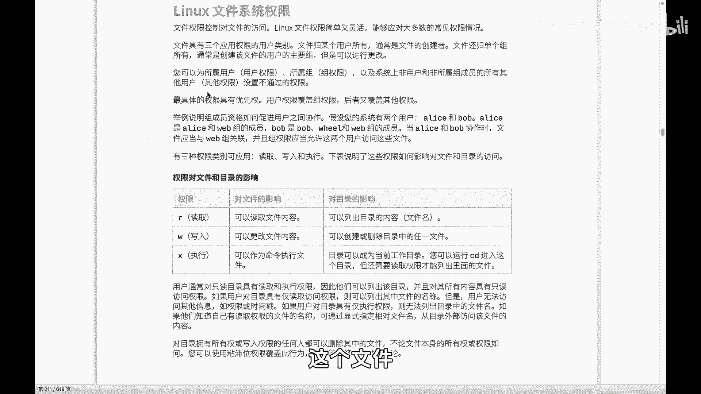
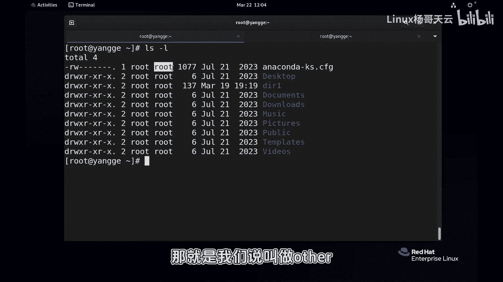
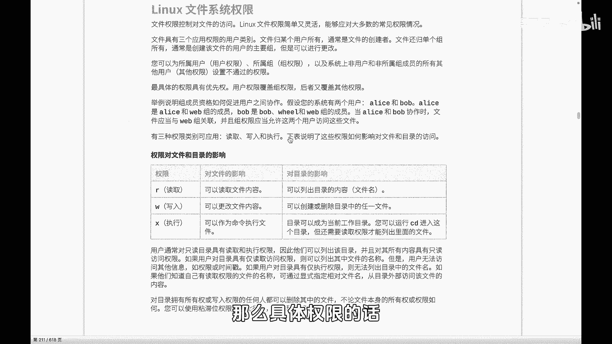
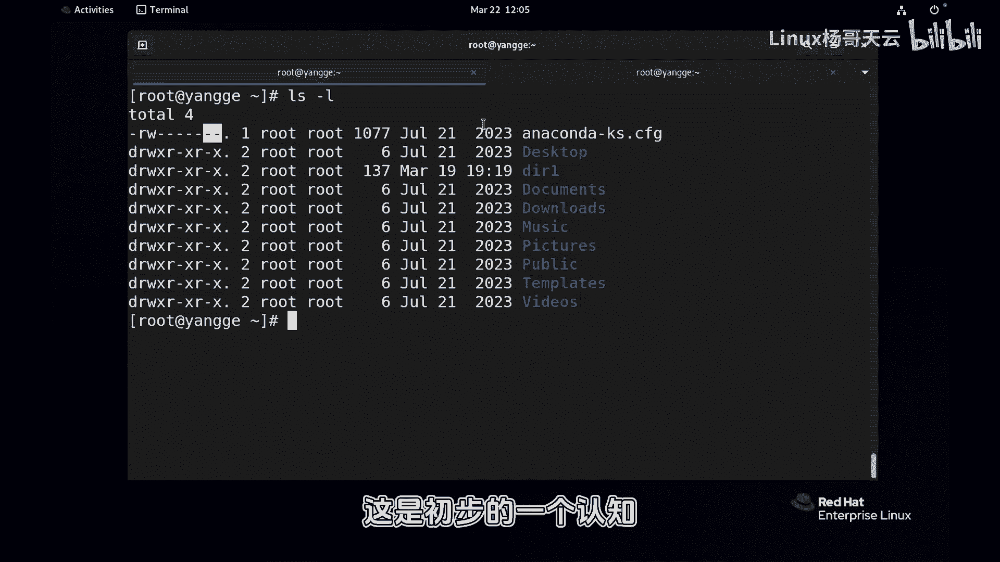
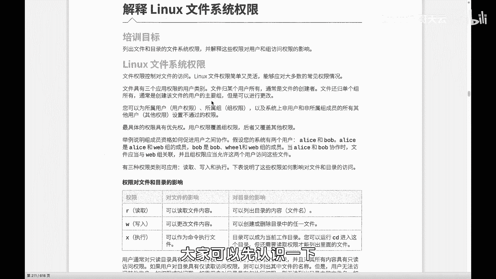

# 史上最强Linux入门教程，杨哥手把手教学，带你极速通关红帽认证RHCE（更新中） - P51：51.初识Linux文件权限 - Linux杨哥天云 - BV1FH4y137sA

哈喽小伙伴们，我是杨哥，那终于到了第七章，文件权限权限可以说非常重要，我们的用户能访问哪个文件，以什么方式访问，以及我们的进程在之前给大家讲过，进程会以某个用户的身份去运行，那这个进程能访问哪个文件。

以什么方式访问，这都跟我们对文件权限的设置有关系，所以我们首先要了解文件权限的类型，还有呢就是有哪些对象，它可以呢来获得文件的权限，以及我们该如何去根据需要呢，来进行相应的设置。

下面来看一下这个权限权限的话呢。

首先在哪看呢，好这边我就先拿入的用户啊来做这个操作，通过ls s杠L回车以后，我们看到或者直接LL都可以，我们看到了，这是一个文件的详细的一个显示呃，其中呢有些地方我们在之前也是见过的啊。

第一个字符呢其实跟权限没有关系，它是文件的类型，那最常见的就是小杠和D，这个大家应该很清晰的看到，小杠呢指的就是一个普通文件啊，D呢一般指的是目录，当然我一会儿会讲到这个同一种权限，对于文件和目录啊。

原则上讲目录也是文件啊，但是对于文件和目录呢，这是有一些区别的，这是第一个，紧接着呢这一段大家看到这一段，就是我们说的权限，这段的话一共呢是看得到的，这个地方是三个三个六个九个，后面还有一个点。

这都是权限啊，然后再往后走呢，这个大家也知道是文件被链接的次数，我们特别是做了一年级以后呢，这个数字会发生变化，那以及这个地方了，和这个地方呢，都跟我们今天要提到的权限有关系，这个是什么呢，先说一下。

这个是文件的所有者，就是这个文件当前是谁，就是你这个房子的这个主人是谁啊，他的主人是谁，这个是什么呢，是一个组啊，专业叫法叫做所属的属主，这个叫属祖，大家听明白了，属主主人啊，这个是属祖。

那么换言之我们可以，当然大家现在看到都是root啊，这个没关系，后面我们会根据需要来来来进行修改，那我们会根据需要来改成了相应的组或的用户，后面呢再是我们文件的大小，还有呢最后修改的时间以及文件名字。

那重点可能今天今天给大家说的就是这一块，还有呢就是这一块，那么因为这个位置决定了，该文件能够被哪个人或哪个组的用户访问，以及如何访问，我们现在看到的呢，这里有一些像那个RWX还有了小杠。

还有呢就是常见的就这三种嘛，看一下啊啊就这三种。

这是我们首先来要知道的，就是咱先不要着急去设置这个权限，你这个有点早啊，哦我们先要知道的是呢，这个权限它有三种常见的类型，最基本的类型三种权限，一种是读r read，一种是写，还有一种是执行。

先大致的呢来观察一下这个权限的，三种权限大概是什么意思，其实有一个权限呢我们应该很清楚，就X特别是我们以后写的脚本，我们那些程序要想运行，你必须要有执行权限，如果说该用户对该文件没有执行权限。

那肯定没办法执行啊，读的话呢言外之意就是读里面内容，比方说像我们cat命令，或者我们用摩尔命令去读内容，写的话呢，就是通过像vi啊或者重定向啊，去往里面写内容这个主要文件来讲的话呢。

它主要针对内容的一个读取或写入，像只读文件啊，或者说可以写的文件执行的话呢，它是可以把这个文件当成命令来执行，当然前提是你这个文件必须是一个脚本，或者是一个二进制的文件，就像我们现在执行的LS一样。

它必须是这种东西，你不能随便写一个文件，给他一个执行权限，它也无法执行，这是文件来讲的话是比较痛快的读写执行，但是目录来讲的话呢稍微有点变化，因为目录大家想一下这个目录实际上是什么。

这个目录在之前杨哥给大家讲过，它就像一本书前面的那个前面那个索引，那个是目录，所以目录的内容其实这个目录的内容啊，它不是具体的内容，它是书前面的那个索引，就是那个第第几章在哪一页。

所以如果说我们对一个目录有读权限，那么相当于你可以理解为，你可以看一本书的最前面的那几页，那个目录那个位置，它的内容就是那个那它的内容是什么东西呢，就是文件名，简而言之，如果说你对一个文件夹有读权限。

你可以看到这个文件夹下面的文件名，你至于你对下面的文件有没有权限，那是另外一回事，那是需要你对这个文件本身有相应的选择可以，那同样呢如果说你对一个目录有写权限，那你可以在这个目录当中创建文件。

其实你就可以理解为，你可以呢在这个书的前面那个目录里面去修改，如果说执行的话呢，这个执行它指的是可以进入这个目录，比方说如果说你对一个文件夹，连执行权限都没有，那你连CD都CD不了，但是CD不了。

不影响读啊，就是我可以不进去，但是我可以INS去读，这个可能没问题，所以这两者区别在于呢，我认为是一样的，就是你要知道文件的内容和，文件夹的内容是什么，文件夹的内容呢就是里面的文件名。

还有呢你要读的话就是可以看到吗，看到文件名你要写的话，就是你可以改里面的那个他的那个这个目录，里面的文件名也可以呢，去在里面创建一个新文件，那么进入所谓的进入执行，那就是我们进入这个目录所需要的一个。

基本的一个权限，那另外刚才杨哥也给大家提到了啊，这个权限它对应的三种人，一种是我们叫做用户的用户的，这个所属的用户也叫属主主人。

他是一个用户，就像刚才杨哥杨哥给大家看到的啊，就这个文件，你看这个文件他的属主就是所有者是这个。

然后另外呢这个文件呢它也有一个组。

这个组呢是这个组，除此以外，那就是我们说叫做other。

叫其他人，所以我们无非就是对这三种对象，哪三种对象呢啊对那个所有者，对这个组以及对其他人设置权限，那么具体权限的话呢。

就是刚才我提到的，各位看一下啊，这个是所有者，这个是所属的组，然后除此以外其他人，而前面这个权限呢也分为三段，这三个除了第一个字符以外，这三个位置的权限是所有者的权限，就是这个是对应的。

这三个位置的权限呢是组的组成员的权限，最后三个位置的权限呢是其他人的权限，有同学说为什么看他是个小杠呢，那就表示没有权限好。

这是初步的一个一个认知，我们再往下看一下啊，他讲的第一列是什么东西，我们已经不关注了啊，第一列我们讲的是文件的类型，然后下面呢才是文件的具体的一个权限啊，所以这是对全县的一个基本的一个了解啊。

接下来具体来看一下这个权限的一些设置方式，那这是一个基本的了解。

