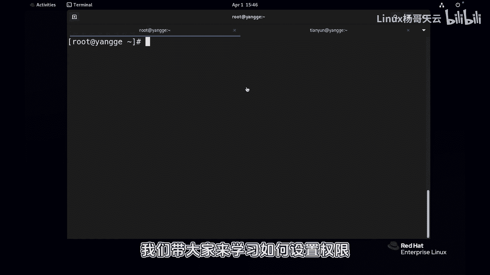
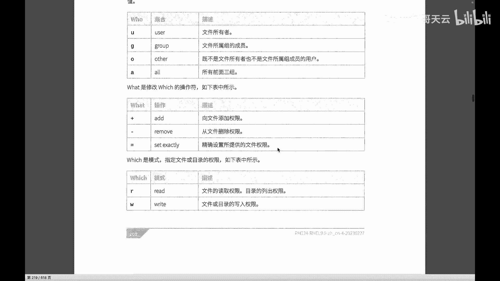
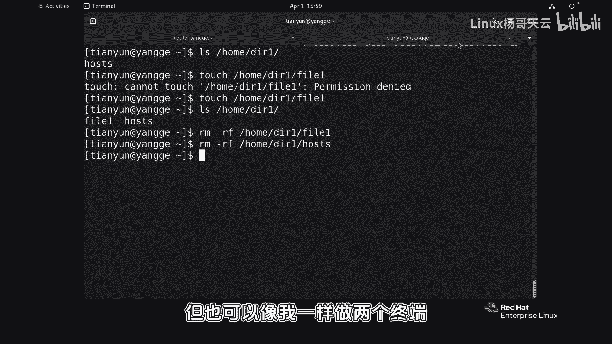

# 史上最强Linux入门教程，杨哥手把手教学，带你极速通关红帽认证RHCE（更新中） - P52：52.通过符号法更改权限 - Linux杨哥天云 - BV1FH4y137sA

哈喽各位小伙伴们，我是梁哥，那我们继续来带大家学习如何设置文件权限，在上一集当中，我们讲到了权益链一些基本概念，比如说我们的进程，会以某一个用户的身份来运行，而这个进程它能访问系统中哪些资源。

将会由运行这个进程的用户来决定，而权限呢又分为读写执行，这个读写执行呢，对于文件和文件夹的意义呢是有一些区别的啊，那在这一小节当中，我们带大家来学习如何设置权限。

根据我们的需求来设置权限，设置权限呢用到的主要命令是search mode啊，这个命令呢有两种方法来设置权限，这是我们比较常用的两种方式，一种是符号，一种是数字，这个数字当然是八进制啊。

啊到底哪一种好哪种不好呢，我们在后面也会给大家去剖析一下，首先来看呢就是通过符号的这种方式设置权限，它的整个的这个语法，我们可以看到CHMOD后面跟上这个who，What which。

也就是说你要对谁来设置权限，这个谁呢主要是UU就是所有者G呢是group组other，还有还有一个就是AA，就是所有的前面三个对象，这个权限的这样一个位置呢，也就是一个操作的话呢，主要是加减等好。

那么which呢，主要就是我们要设置什么样的权限，是读呢还是写的还是执行，当然还有一些这个特殊的权限，像大X和这样一些权限好。

接下来我们首先来设置一个场景给大家看一下，带大家了解一下权益的基本设置，那第一个呢啊我们先那个准备一下场景，这边是root用户，目前大家看一下天云用户呢，他是没有在任何其他组里面的，他就是一个普通用户。

以便于我们今天权限的这样一个测试，不要在root面前开什么权限，那都是瞎扯的啊，那为了演示，我们首先拷贝一个文件，比方说tat一下吧，EDC下的password文件，我们把它重新上到home下面去。

叫做password点TST好，这个无所谓，就是准备一个文件，你想怎么准备怎么准备，我我是想不要准备的太内容太多，home下的password d s t好，没问题，有同学说为什么要放在这儿呢。

那如果放到我家里面行不行呢，肯定不行的，这个我们先简单的给大家解释一下，让大家理解一下啊，比如说我现在我家里面呢有1万块钱想给你，我说没问题给你，但是不好意思，我没有给你给你，我家的钥匙。

甚至没有我院子的钥匙，那你要想去拿到这1万块钱，第一步你先要把我院子打开，然后紧接着把那个门打开，就是要层层的从根开始一定有权限访问，那这个地方肯定没有权限，这是用户的私有的领地。

因此我们谈权限肯定不是孤立的，不能说就这个文件本身，这个文件本身的话呢，还要依靠我们从根开始的，每一层有没有相关的权限，所以为了这个明天的实验呢，我们刻意把雪在一个。

把这个比利50场地选在一个公共的位置home下，这个地方相信大家都能够访问好，这个不用做多多解释啊，好这边是普通用户天语音啊，没有在任何组，他也没有，也不是那个啊我们的这个收入的用户啊，普通用户。

然后紧接着呢啊这边是我们管理员，当前我们看一下home下的password d t AC文件，那我们想知想，知道天云用户对这个文件有什么权限，好，这怎么看呢，灵魂三问哈，大家学会我这个灵魂三问就可以了。

其实是两问哈，第一我们的天元用户是该文件的所有者吗，如果是所有者，他得到的是这个读写权限好，不是因为所有者不是天云，OK好，那不是，那算了吧，那天云用户是这个组的成员吗，刚才我们已经看过了。

天翼用户是不在这个组里面的啊，他是在自己的组里面啊，所以那它也获取不了这个组的权限，也就是说这个权我现在勾的这个权限呢，跟他没关系，那自然呢这个灵魂三问其实没必要发出来了啊，那他既然不是所有者。

也不是组成员，那他就是其他人other，因此呢他的权限就是只能读好，我们可以测试一下来，现在我们看看一下cat，有任何不改变文件的这个命令都可以，vi也可以啊，打开这个home下载password。

很贴S系，没问题，通过vi打开呢也没问题，但是下面显示一个video only，看到了吗，肯定是不可以改啊，尝试改一下看看尝试改一下111，给它重定向到这个文件里面去，我们强制想改一下啊。

他答案答案是permission deny，那我就需要天音户有这个写权限，那我是对谁谁来设置呢，对所有者呢，对组呢还是对other呢，那肯定是other，因为刚才我们说的灵魂三问已经发出过了啊。

好这个时候就可以使用CCHODO，就是刚才说的who里面的other加还是减还是等，这个大家也很清楚，加就是原来你原来多少钱，我再给你多少钱，会影响你原来的钱，你原来一块钱还是两块钱。

总之我给你再给你一块钱，你就是多多一块钱，减呢就是减掉等呢是什么意思呢，我不管你原来是多少钱，现在我就一共你只能保留五块钱啊，那我们使用加加了WW，就是我刚说的那个具体的一个模式，到底要读呢。

是写呢还是执行呢，后面再跟上这个文件，看到了吗，这个是字符的方式，非常简单，这就是所谓的字符很明确的指定呢，谁干嘛，以及呢什么样的权限好，一般没有报错，就是正确的结果，我们不妨来看一下这个文件。

好看到了现在其他人的地方是有一个写权限，同样呢呃问那个天云用户，他有什么权限，他是所有者吗，不是他是组组成员吗，不是那他是其他人，那他这个权限就是给其他人的好了，现在我们再来试一下看啊，回车可以了。

说明是可以对这个文件进行写入的，读呢肯定也是没问题，当然现在现在那个如果还想给他一个其他权限，比方说给他一个执行权限，那就CHCHMOD啊，为什么是欧，因为现在根据我们文件当前的这样一个特点。

不是所有者，不是组成员，是其他人，那我们O也可以直接是等号等读写，执行好等号相当于覆盖了啊，这个时候我们看看再看看这个文件，那这个文件呢是绿色的，绿色通常表示可执行啊。

这边是其他人持有执行权限和读写执行权限，当然现在这个文件的内容呢不可以执行啊，我们如果说像这样home下的password，你看他都可以补全，当然肯定执行不了啊，因为那里面的不是命令，无所谓。

这里面不是命令，如果说是一个脚本的话呢，它就可以执行，它就需要执行权限，那么这就是一个我们去设置的方式，当然如果抛开我们具体的需求来讲的话呢，比如说我们随便去设置一下这个权限。

那我们就可以像这样CHOMOD啊，可以像这样写U加上执行G呢，组呢等于呃读读写呃，然后OO呢等于读好，看，看这些都是没问题的，总之当中这个字符这块是不能断的，就不能空格的，明白了吗，这是一个整体。

你可以同时对多个对象，你看看这个结果是不是这样子，原先的权限是罗者是读读和写，现在加了一个X对不对，然后G呢原来不管是什么权限，G的话呢变成了读写，其他人呢是只读这个，大家听明白了吗，好或者更简单一点。

A等于读啊，后面下的这个好，你看到了吗，这个很简单啊，或者减掉也可以好，总之就是加减等，你可以同时来进行设置，或者说还有一种方式，C h mo，CHMOD加X，这种写法是你可以认为是用简写。

这个加他没有说对谁，但如果没有对谁的话呢，默认就是A，就这这条命令和写上A加X是一个意思，大家听明白了吗，就是我们在设置权限的时候，肯定是要根据需要来进行设置啊，而不是说那个我们想怎么设置，怎么设置。

这是不可以的，对还忘了说目录，我们将目录说一下啊，比方说我们在天下的这个home下面建一个目录，叫做呃DRE的目录，这个目录本身现在注意看目录权限啊，是要加杠D的，否则你只看到目录下面的这个文件好。

这个目录的话呢它没有那么可怕，一般情况给到的其他人也是一个读和执行，也就是说你可以进到这个目录里面去，你可以看目录里面的文件名啊，但你要写的话，你看这个这样一个权限，我们的天元运户是写不了的。

天云户刚刚讲过天元用户是谁啊，天音用户是文，是这个目录的所有者吗，不是所以这个不是他的权限，是这个组成员吗，不是他其他人是其他人，是这个权限好了，我们可以先尝试一下。

天翼用户能不能看到home下的DRE的内容，可以的，只不过没有内容啊，那比如拷一个过去呢，拷贝一个etc加的后四四到home下DR1里面，而不是这是home下的DR1，有，那天元用户。

能不能自己在这里面创建一个文件呢，答案是不可以的，因为他对这个目录是没有写权限的，看到吗，他没有写权限，因为他是其他人，如果想给一个写权限，我们就这样say chmod，然后O加上这个叫什么WW。

然后给到home下的DR1好，我们再来看这个目录本身好，其他用户我们看到是可以呢有写权限的啊，这个我们再次来创建这个文件，没问题，home下的div这个写啊，对目录的这个写表示可以创建文件。

也可以删除啊，同样想删的话，那也是没问题的，home下的d r e file1没问题删除，这里面host的丝呢也可以删除，这个不管是谁的，当然有有同学说这个山单是root用户的，嗯是的。

如果你不想它删除的话呢，我们还要讲特殊权限好，这是对于目录这样一个设置方式好，大家可以练习一下，练习的时候可以呢先随意的设置，那也可以像我一样做两个终端。

三个终端，然后来通过普通用户来进行这种啊。